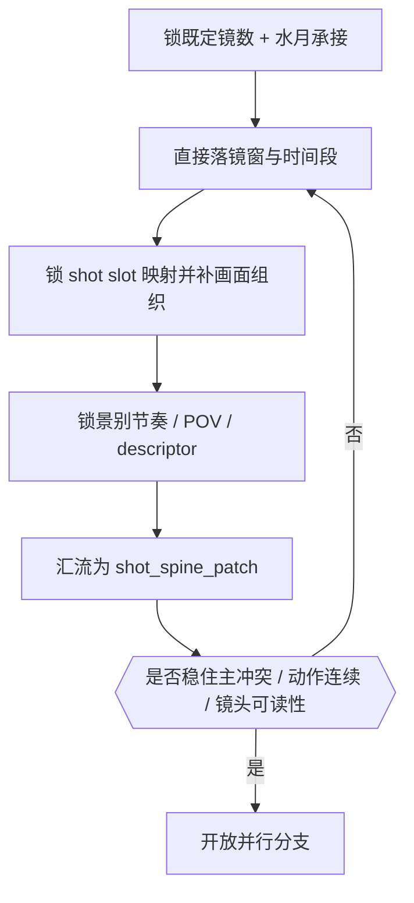

# 分镜构图 模块说明

## 定位

- 本模块负责先形成稳定的 `shot_spine_patch`，直接承接 shared root 已给出的固定 `分镜切换`，一体锁真实切镜、slot 映射和构图骨架。
- 它是 `镜花` 的第一阶段，拥有分镜骨架判断权，不拥有摄影、运镜和转场主导权。
- former `1-切换` 不再作为当前目录的独立叶子；fixed-shot-count 的接受逻辑已内化到 `2-Global`，本模块只负责把上游真值落成可执行 shot spine。
- 它要回答的不是“这一组写得美不美”，而是“这一组先怎样切、怎样落、怎样看，后三个并行分支才接得稳”。
- 它的最小真相不是单镜头灵感，而是组级 shot spine。只有先把组内镜头脊柱锁住，后续模块的光色、运动和转场才不会漂。

## 思维·执行主链

这条主链的关键不是“按顺序把叶子跑完”，而是每一步都要为下一步留下稳定抓手：

- 先把 inherited `分镜切换` 直接落成固定镜窗和秒位窗口，让 slot 不至于乱落。
- 再把镜头落回固定 `剧本正文` 的锚点窗口，并补成可看、可读、可继续叠加摄影、运镜和转场的画面骨架。

## 分镜表现维度总则

这一级现在不再只回答“切几镜、落在哪儿、怎么构图”，还必须同时回答三类组级问题：

- 结构化密度预算
  先形成 `candidate beat -> pace_tier -> recommended baseline -> headroom -> preferred/budget range`，而不是凭感觉估一个镜数。
- 景别与视点节奏
  先预判这组更适合哪种 `景别节奏模板`、哪种 `POV 策略`，以及它们如何服务 `叙事内核 / Current Mission / 情绪引导`。
- 镜头描述子槽锁定
  至少锁 `景别 / 镜头属性 / 镜头框架 / 镜头类型 / 镜头视角` 五个槽位，避免后续模块重新猜镜头任务。

## 具体创作方法

### 1. 先锁一条可执行的 `水月承接`

在碰镜头数量之前，先从 shared root 与 `水月` 回收四件事：

- 这组的主动作是什么
- 这组的主情绪波动在哪里
- 这组的主空间关系怎样变化
- 这组的主视线或主冲突由谁承担

若这四件事说不清，就还不能切镜。`分镜构图` 不是把正文打碎，而是把事实层压成“观众应该先看到什么、再看到什么、最后停在哪里”的观看顺序。

### 2. 直接落实 inherited 镜头预算，不再另开 `1-切换`

切镜的第一原则不是“从零开始猜镜数”，而是“承接 `2-Global` 已给出的固定分镜数，用这些镜头把这组最关键的动作、情绪和视线变化显出来”。

### 3. 同时锁 slot 与画面组织

当前模块的职责有两层：

- 为每镜补 `slot_id / prose_window / anchor_type / anchor_summary`
- 为每镜补 `主陪背景 / 观看路径 / descriptor / 空间锚点`

硬规则：

- 允许补锚点说明，不允许改写固定 `剧本正文`
- slot 与构图必须共用同一条镜头任务判断
- 若 slot 一落下去就破坏动作连续性，说明应回到 shared root `分镜切换` 与 `水月` evidence 重做解释，而不是正文要改

### 4. 最后收束成一个组级 `shot_spine_patch`

汇流时不要把叶子原话机械拼接，而要检查四件事：

- 镜头数是否仍服务主冲突节拍
- shot slot 映射是否稳定可 merge
- 每镜构图是否真能支撑后续摄影与运镜
- 全组是否保住了固定 `剧本正文` 与 `水月` 的动作连续、情绪连续和空间连续

## 思行节点

| node_id | objective | 要回答的问题 | actions | 输出给下游的抓手 | gate |
| --- | --- | --- | --- | --- | --- |
| `SHOT-N1-ANCHOR` | 锁定 `水月承接` | 这组究竟承接了哪条动作、情绪、空间、关系信息 | 回看 `剧本正文` 与 `水月`，提炼一句组级锚点，标出主动作和主视线 | `watermoon_inheritance` | 若不能用一句话概括本组承接内容，不得继续 |
| `SHOT-N2-WINDOW` | 形成切镜窗口 | 既定镜数下，这些镜该怎样切开才不伤主动作和主视线 | 以固定镜数直接切开窗口并落实秒位 | `shot_count_plan` | 若切开后主冲突断裂，需回退 |
| `SHOT-N3-COMPOSE` | 形成 slot 与画面骨架 | 每镜在固定 `剧本正文` 的哪个窗口进入最自然，观众先看什么、再看什么 | 为每镜补 `slot_id / prose_window / anchor_type / anchor_summary`，并写主陪背景、构图方式、观看路径、descriptor 和空间锚点 | `shot_slot_map` / `composition_skeleton` | 若映射一落就破坏动作连续性，或构图开始发明新空间，回退 |
| `SHOT-N4-RHYTHM-POV` | 锁定组级节奏与视点 | 这组镜头窗口更适合哪种景别曲线与 POV 立场 | 汇总 `shot_size_rhythm_preview + pov_strategy_preview + shot_descriptor_lock` | `focus_spatial_logic` | 若景别曲线、POV 或 descriptor 仍说不清，不得汇流 |
| `SHOT-N5-CONVERGE` | 收束组级 shot spine | 当前组是否已形成统一脊柱 | 检查主冲突、动作连续、镜头可读性、心理距离与 descriptor 一致性，并压成单一 patch | `shot_spine_patch` | 未形成统一脊柱前不得开放并行分支 |

## 汇流检查

- 读完整组后，能否一眼看出镜头顺序，而不需要额外列表解释。
- 每个 shot slot 是否都承担独立的观看任务，而不是机械切句。
- 构图骨架是否能自然承接后续 `光影 / 色彩 / 质感 / 运镜 / 转场`，而不是需要后续模块反向救场。
- 这组的固定 `分镜切换` 是否已经被切成稳定、可执行的镜窗。
- 命中镜头窗口的景别曲线、POV 立场和五个 descriptor 槽位是否已经锁住，而不是留给后续模块临场重判。
- 是否仍能明确回指 `水月` 的原始动作、情绪、空间与关系信息。

## 失真与修正

- 若还没形成 `watermoon_inheritance` 就开始写摄影词，说明越序了。
- 若把对白句数、动作个数直接折成镜数，说明把“候选节拍”误用成了机械计数器。
- 若 shot slot 一多结构就散，先回退到 shared root `分镜切换` 与 `水月` evidence 重估切法，而不是继续补锚点。
- 若构图开始发明新关系或新空间，说明脱离了 `水月` 的事实层。
- 若一镜承担两个以上互相打架的观看任务，说明镜头职责没有切开，应回到 shared root `分镜切换` 与 `水月` evidence 重分。
- 若 shot spine 一形成就几乎写满摄影、运镜和转场术语，说明 branch guide 越权了；`分镜构图` 只负责让后续模块“有骨可附”。
