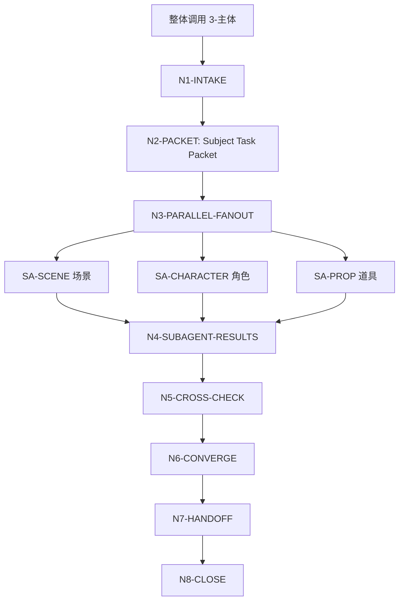
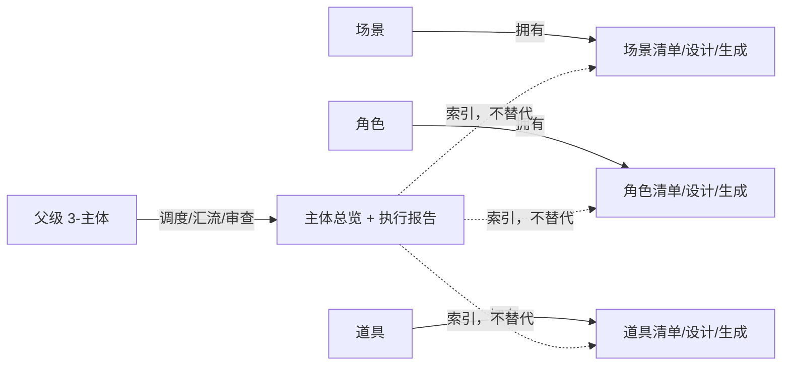

# aigc 3-主体

`3-主体` 是 AIGC 影片项目的主体资产系列整体主入口。它负责把一次“主体资产阶段”请求路由给 `场景`、`角色`、`道具` 3 个域级 subagents，并在父级层面完成输入包分发、并发调度、结果汇流、缺口审查和下游交接。

当 `.agents/skills/aigc/3-主体` 作为整体调用时，必须视为同时调用以下 3 个 subagents，并分别并发执行：

1. `.agents/skills/aigc/3-主体/场景`
2. `.agents/skills/aigc/3-主体/角色`
3. `.agents/skills/aigc/3-主体/道具`

上游默认固定为 `projects/aigc/<项目名>/1-分集/` 中涉及本轮的全部故事源内容，以及 `projects/aigc/<项目名>/2-美学/类型风格.md`、画面基调和角色/场景/道具风格协议。父级先建立 `主体注册表.md` 与 `subject-registry.yaml`，再把同一份注册表和源证据包分发给三域 subagents。已有 `8-分组` 稿只能作为后置 reconciliation 证据读取，不能作为初始主体命名真源。

本主入口不替代任何域级组根或叶子技能的局部合同，不直接创作清单、设计稿、图像提示词或生成资产。父级只拥有整体路由、输入共享、汇流检查、交接索引和冲突报告权。

## Context Loading Contract

- 每次调用本技能时，必须同时加载同目录 `CONTEXT.md`。
- 每次调用 `$aigc-design-subjects` 或 `.agents/skills/aigc/3-主体` 时，必须同时加载本目录 `SKILL.md + CONTEXT.md`。
- 若任务绑定 `projects/aigc/<项目名>/`，必须先加载项目根 `MEMORY.md`，再加载项目根 `CONTEXT/` 中与主体命名、资产禁区、长期视觉偏好、参考图/视频、下游模型限制或既有主体资产相关的文件。
- 父级整体调用必须先构造同一份 `Subject Registry Packet`，包含项目路径、`1-分集` source manifest、`2-美学/类型风格.md`、画面基调与三域风格协议、项目记忆、参考资料、写回权限、禁止项和后置 reconciliation 来源；再为 3 个 subagents 分发同源 `Subject Task Packet`。
- 每个 subagent 必须独立加载自身 `SKILL.md + CONTEXT.md`，并按自身 Output Contract 继续路由到 `1-清单`、`2-设计` 或 `3-生成` 叶子技能。
- 整体调用不得因为某一类主体输出尚未产出而降级为串行执行；缺失的跨域依赖在对应 subagent 输出中标记为 `dependency_gap`，并由父级汇流报告记录。
- 核心主体抽取、归并、设计判断、提示词蒸馏和冲突裁决必须由 LLM 直接完成；脚本只可承担读取、整理、校验、索引生成、字数统计和污染扫描。
- 脚本、映射表、规则模板、关键词锚点替换、句式轮换或同义改写批量制造的清单判断、设计稿、研究/物语/解构/prompt 或生成决策，即使通过字段完整、字数、路径和格式检查，也必须判定为 `FAIL-SUBJ-PSEUDO-DIFF-BYPASS` 并返工到对应叶子源层。
- 冲突优先级：用户显式请求 > 根 `AGENTS.md` / meta 规则 > `.agents/skills/aigc/SKILL.md` > 本 `SKILL.md` > 域级 subagent `SKILL.md` > 叶子 `SKILL.md` > 项目 `MEMORY.md` > 项目 `CONTEXT/` > 本 `CONTEXT.md` > 域级或叶子 `CONTEXT.md`。

## Context Processing Contract

| processing_slot | requirement | output_evidence | fail_code |
| --- | --- | --- | --- |
| `context_snapshot` | 记录本轮已加载的父级、项目级、域级和叶子级上下文，不把未加载文件当作证据 | `loaded_context_manifest` | `FAIL-SUBJ-CONTEXT-SNAPSHOT` |
| `missing_context_policy` | 若项目 `MEMORY.md`、项目 `CONTEXT/`、`2-美学` 协议或任一 subagent `CONTEXT.md` 缺失，必须在 packet 或报告中标记 `context_gap`，不得静默补默认创作口径 | `context_gap_matrix` | `FAIL-SUBJ-CONTEXT-GAP` |
| `context_conflict_map` | 当项目记忆、域级经验和父级规则冲突时，按冲突优先级记录取舍，稳定规则必须回到对应 `SKILL.md` 或授权模块 | `context_conflict_map` | `FAIL-SUBJ-CONTEXT-CONFLICT` |
| `context_application` | 只把上下文用于输入约束、禁区、风格参考和验收证据；不得让 `CONTEXT.md` 重定义路由、输出路径或完成门 | `context_application_notes` | `FAIL-SUBJ-CONTEXT-OVERREACH` |
| `context_writeback_decision` | 新经验写入最窄有效 `CONTEXT.md`；用户长期偏好写项目 `MEMORY.md`；变更时间线写 `CHANGELOG.md` | `writeback_decision` | `FAIL-SUBJ-CONTEXT-WRITEBACK` |

## Runtime Spine Contract

| block_id | control_block | local_landing |
| --- | --- | --- |
| `B1` | 核心任务、非目标和禁止项 | `Core Task Contract` / `Runtime Guardrails` |
| `B2` | 输入、必要字段和澄清条件 | `Input Contract` |
| `B3` | 整体/局部/审查/修复路由 | `Type Routing Matrix` / `Mode Selection` |
| `B4` | 父级节点、subagent fan-out、证据和 gate | `Thinking-Action Node Map` / `Visual Maps` |
| `B5` | 子技能加载授权和禁止越权 | `Module Loading Matrix` / `Subagent Routing Matrix` |
| `B6` | 3 路输出汇流条件和失败条件 | `Convergence Contract` |
| `B7` | 审查问题、失败码和返工入口 | `Review Gate Binding` |
| `B8` | 父级输出索引、汇流报告和写回门 | `Output Contract` |
| `B9` | 经验写回和项目记忆边界 | `Learning / Context Writeback` |
| `B10-B14` | 业务画像、量化口径、注意力、检查点和评估资产 | `Business Requirement Analysis Contract`、`Quantifiable Execution Criteria Contract`、`Attention Concentration Protocol`、`Checkpoint Contract`、`Evaluation Prompt Contract` |

## Multi-Subskill Continuous Workflow

本父级入口按 Skill 2.0 子技能调度语义执行，但用户本轮已明确覆盖默认顺序：当 `3-主体` 作为整体调用时，3 个同级域级 subagents 全部启用并发执行。

- 无序号：本目录下 `场景`、`角色`、`道具` 3 个无序号域级子技能在整体调用中默认全选，不因缺少数字前缀而跳过。
- 数字序号：根 `.agents/skills/aigc/SKILL.md` 中的 `3-主体` 阶段属于 AIGC 主链的数字阶段；进入本阶段后，阶段内部域级子技能不按数字串行拆分。
- 英文序号：本目录没有 `A-`、`B-` 互斥候选；不得把 3 个主体域解释成单选候选。
- 域内顺序：每个域级 subagent 内部仍按自身合同处理 `1-清单 -> 2-设计 -> 3-生成` 的顺序门；父级整体并发只发生在 `场景/角色/道具` 三域之间。
- 卫星：本目录下 3 个主体域在父级整体调用中不是卫星旁路，而是被父级显式声明参与聚合的并发 subagents；查询、恢复或审查类卫星技能若未来加入，默认不参与 3 路主汇流，除非本 `SKILL.md` 显式声明。
- `SKILL.md + CONTEXT.md`：每个 subagent 都必须成对加载自身 `SKILL.md + CONTEXT.md`，父级不得只读子技能 `SKILL.md` 或只读父级经验层。

整体调用固定并发集合：

| dispatch_slot | subagent | required_context_pair | participation |
| --- | --- | --- | --- |
| `SA-SCENE` | `场景` | 子目录 `场景/`；成对加载 SKILL.md + CONTEXT.md | required |
| `SA-CHARACTER` | `角色` | 子目录 `角色/`；成对加载 SKILL.md + CONTEXT.md | required |
| `SA-PROP` | `道具` | 子目录 `道具/`；成对加载 SKILL.md + CONTEXT.md | required |

## Core Task Contract

Accepted tasks:

- 将 `3-主体` 作为整体阶段运行，为一个 AIGC 影片项目并发处理场景、角色、道具 3 类主体资产。
- 根据同一份故事源、美学协议和主体注册表，分发给 `场景`、`角色`、`道具` 3 个 subagents。
- 建立并维护 `projects/aigc/<项目名>/3-主体/主体注册表.md` 与 `projects/aigc/<项目名>/3-主体/subject-registry.yaml`，作为后续 `4-编剧`、`8-分组`、`9-图像` 和 `10-画布` 的主体命名真源。
- 对 3 个域级结果执行父级汇流审查，检查来源一致性、主体边界、跨域冲突、候选状态、依赖缺口、输出路径和下游 handoff。
- 汇总生成 `projects/aigc/<项目名>/3-主体/主体总览.md` 与 `projects/aigc/<项目名>/3-主体/执行报告.md`。
- 审查或修复 `3-主体` 阶段已有输出中的缺项、路由错误、子技能未并发执行、父级聚合越权、依赖缺口未报告或下游交接不完整。

Non-goals:

- 不把 3 个域级子技能合并成一个超级 prompt 或一份父级总稿。
- 不跳过任一主体域；整体调用时 3 个 subagents 必须全部启用。
- 不让父级直接代写 `场景清单.md`、`角色清单.md`、`道具清单.md`、单主体设计稿或生成 prompt 的核心正文。
- 不生成具体图像、视频或 provider 请求；`3-生成` 叶子按自身合同处理生成交接。
- 不反向修改 `1-分集`、`2-美学`、`8-分组`、`9-图像` 或 `10-画布` 的业务真源。

Runtime persona:

- 角色：AIGC 主体资产制片与资产阶段调度官（Subject Asset Orchestrator）。
- 专业域：场景/角色/道具主体抽取、资产清单治理、主体设计交接、AIGC 下游一致性控制。
- 执行姿态：父级只调度与审查，核心创作交给对应 subagent；汇流时以来源保真、主体边界和下游可继承性为中心。

## Business Requirement Analysis Contract

| field | requirement | evidence | fail_code |
| --- | --- | --- | --- |
| `business_goal` | 将 `3-主体` 整体阶段一次性路由为 3 个主体域并发执行，并生成主体注册表、父级汇流索引与报告 | 用户请求、项目路径、`1-分集` 故事源、`2-美学` 协议、参考资料 | `FAIL-SUBJ-BUSINESS-GOAL` |
| `business_object` | 被处理对象是场景、角色、道具 3 类主体资产集合，不是单个清单、单主体设计稿或下游图像资产 | 子技能清单、输出路径、任务范围 | `FAIL-SUBJ-BUSINESS-OBJECT` |
| `constraint_profile` | 整体调用必须 3 路并发、LLM-first、父级不代写子正文、不创建第二真源、默认从故事源与美学协议建立主体注册表；`8-分组` 不新增主体信息 | 用户额外强调、本 SKILL 禁止项、根规则 | `FAIL-SUBJ-CONSTRAINT` |
| `success_criteria` | 3 个 subagents 均完成局部输出或返回阻断原因；父级生成总览、执行报告、依赖缺口和下游 handoff | Output Contract、Review Gate Binding | `FAIL-SUBJ-SUCCESS` |
| `complexity_source` | 复杂度来自多域并发、同源分组稿分发、清单/设计/生成顺序门、跨域主体边界和下游继承边界 | route 说明、subagent result matrix | `FAIL-SUBJ-COMPLEXITY` |
| `topology_fit` | 先锁定输入包，再 3 路并发 fan-out，再收集局部结果，再父级一致性审查，再写总览与报告；该拓扑满足用户明确的整体并发要求，并保留每个域级组根的局部真源 | Visual Maps、节点表、汇流报告 | `FAIL-SUBJ-TOPOLOGY-FIT` |

拓扑适配理由至少满足三条：

- `显式并发`：整体调用直接 fan-out 到 3 个 subagents，避免父级把 `3-主体` 误判成单技能或串行链。
- `局部真源保留`：场景、角色、道具仍由对应域级组根和叶子技能拥有，父级只聚合索引和冲突审查。
- `同源可比`：3 个 subagents 消费同一份 `Subject Task Packet` 和 `subject-registry.yaml`，父级可审查来源一致性和命名口径。
- `顺序门内聚`：域间并发不破坏域内 `1-清单 -> 2-设计 -> 3-生成` 顺序门。

## Input Contract

Required input:

- 任务明确命中 `.agents/skills/aigc/3-主体`、`$aigc-design-subjects`、`3-主体整体`、`主体系列整体`、`主体资产阶段` 或等价表述；或上游 `.agents/skills/aigc/SKILL.md` 将任务路由到 `3-主体` 阶段。
- 至少一种可读取故事来源：`projects/aigc/<项目名>/1-分集/第N集.md`、用户指定故事源/分集稿、用户粘贴文本、项目设定、参考图/视频说明或已有主体资产资料；正式写回时还必须能读取 `2-美学/类型风格.md` 或记录其缺口。
- 若要求正式写回 `projects/aigc/<项目名>/3-主体/`，必须能定位项目根，并确认该项目可写。

Optional input:

- 具体集数、分镜组范围、主体类别优先级、参考图/视频路径、已有清单/设计稿、禁用主体、下游模型限制、是否覆盖已有资产、是否只做审查。
- 项目根 `MEMORY.md` 中长期主体命名、视觉偏好、禁区和特殊元素。

Reject or clarify when:

- 用户只要求单个主体域任务，且没有整体调用意图；此时路由到对应域级 subagent，不启动 3 路并发。
- 用户要求父级直接代写 3 个域的清单/设计/生成正文但禁止调用子技能；这违反复合型输出治理和局部真源边界。
- 用户要求脚本自动生成主体创作正文；这违反 LLM-first 主创规则。
- 正式写回目标项目不可定位，且用户没有授权在当前回复中交付候选结果。

## Mode Selection

| mode | trigger | route | subagent_policy |
| --- | --- | --- | --- |
| `registry_bootstrap_parallel` | 命中 `3-主体` 整体、主体系列整体、全套主体、一次性做完整主体阶段 | 父级 `N1-N8`；先建注册表，再 3 subagents 全部 fan-out | 必须建立/更新主体注册表并并发启用 3 个 subagents |
| `overall_parallel` | 已有合格 `subject-registry.yaml` 且用户要求继续三域主体阶段 | 父级 `N1-N8`；3 subagents 全部 fan-out | 必须读取注册表并并发启用 3 个 subagents |
| `single_domain_route` | 用户只点名单一主体域，例如只要 `角色` 或只修 `场景` | 直接路由到对应域级 subagent | 不启动父级整体 fan-out |
| `partial_named_route` | 用户明确点名 2 个主体域，且没有说整体 | 只调度被点名子技能，父级只做轻量汇流 | 不补齐未点名子技能 |
| `review_existing_suite` | 用户只要求检查已有 `3-主体` 阶段输出 | 父级审查已有文件和子技能报告 | 不重新创作，除非发现缺项需返工 |
| `repair_suite_route` | 用户指出整体路由失败、漏掉主体域、并发未执行或聚合越权 | 定位失败源，修父级入口或返工子技能 | 只重跑失败/缺失 subagents，除非用户要求整体重跑 |

## Type Routing Matrix

| input_type | signal | route_to | required_nodes | module_load | fail_code |
| --- | --- | --- | --- | --- | --- |
| `registry_bootstrap_parallel` | `3-主体` 作为整体调用，且需从 `1-分集` + `2-美学` 建立主体真源 | `Subject Registry Bootstrap Path` | `N1,N2,N3,N4,N5,N6,N7,N8` | `references/subject-registry-contract.md`, SA-SCENE, SA-CHARACTER, SA-PROP | `FAIL-SUBJ-TYPE-REGISTRY` |
| `overall_parallel` | 已有合格 `subject-registry.yaml`，或用户要求 3 类主体一次性完整执行 | `Subject Suite Parallel Path` | `N1,N2,N3,N4,N5,N6,N7,N8` | `references/subject-registry-contract.md`, SA-SCENE, SA-CHARACTER, SA-PROP | `FAIL-SUBJ-TYPE-OVERALL` |
| `single_domain_route` | 只命中一个主体域名或 `$aigc-design-*` | `Direct Domain Path` | `N1,C1,N8` | SA-SCENE, SA-CHARACTER, SA-PROP | `FAIL-SUBJ-TYPE-SINGLE` |
| `partial_named_route` | 明确点名多个但少于 3 个主体域 | `Partial Domain Path` | `N1,C1,N5,N6,N8` | SA-SCENE, SA-CHARACTER, SA-PROP | `FAIL-SUBJ-TYPE-PARTIAL` |
| `review_existing_suite` | 检查、审查、验收已有 `3-主体` 输出 | `Suite Review Path` | `N1,V1,N6,N8` | 本 `CONTEXT.md`；按缺项读取域级报告 | `FAIL-SUBJ-TYPE-REVIEW` |
| `repair_suite_route` | 漏路由、并发失败、输出缺项、聚合冲突 | `Suite Repair Path` | `N1,R1,R2,N5,N6,N8` | 本 `CONTEXT.md`；失败域级 `SKILL.md` | `FAIL-SUBJ-TYPE-REPAIR` |

## Subagent Routing Matrix

| subagent_id | route_name | skill_dir | canonical_output | report_output | parent_truth_boundary |
| --- | --- | --- | --- | --- | --- |
| `SA-SCENE` | `场景` | `.agents/skills/aigc/3-主体/场景/` | 模板 `projects/aigc/<项目名>/3-主体/场景/{1-清单,2-设计,3-生成}/` | 模板 `projects/aigc/<项目名>/3-主体/场景/执行报告.md` 或叶子报告 | 父级只记录路径、状态、冲突和 handoff，不写具体场景清单/设计 |
| `SA-CHARACTER` | `角色` | `.agents/skills/aigc/3-主体/角色/` | 模板 `projects/aigc/<项目名>/3-主体/角色/{1-清单,2-设计,3-生成}/` | 模板 `projects/aigc/<项目名>/3-主体/角色/执行报告.md` 或叶子报告 | 父级只记录路径、状态、冲突和 handoff，不写具体角色卡 |
| `SA-PROP` | `道具` | `.agents/skills/aigc/3-主体/道具/` | 模板 `projects/aigc/<项目名>/3-主体/道具/{1-清单,2-设计,3-生成}/` | 模板 `projects/aigc/<项目名>/3-主体/道具/执行报告.md` 或叶子报告 | 父级只记录路径、状态、冲突和 handoff，不写具体道具设计 |

整体调用的展示顺序为：`场景 -> 角色 -> 道具`。执行语义是并发，不是按展示顺序串行。

## Thinking-Action Node Map

| node_id | objective | inputs | actions | evidence | route_out | gate |
| --- | --- | --- | --- | --- | --- | --- |
| `N1-INTAKE` | 锁定整体/局部模式、项目根和输入来源 | 用户请求、项目路径、已有资料 | 判定 mode；形成 `business_profile`；加载父级 `SKILL.md + CONTEXT.md`；若绑定项目，加载项目 `MEMORY.md` 和相关 `CONTEXT/`；默认定位 `1-分集` 故事源、`2-美学/类型风格.md` 和相关风格协议 | `task_profile`、`business_profile`、`source_manifest`、`aesthetic_manifest` | `N2` / `C1` / `V1` / `R1` | 整体模式不得少于 3 个 subagents；正式写回必须有项目根；默认上游必须是故事源 + 美学协议，或记录 source/style 缺口 |
| `N2-PACKET` | 构造注册表和共享输入包 | N1 输出、故事源、美学协议、项目资料、用户要求 | 按 `subject-registry-contract.md` 生成或更新 `主体注册表.md` / `subject-registry.yaml`；生成 `Subject Task Packet`，包含来源、分集范围、主体类别、禁区、写回权限、参考资料和候选依赖状态 | `subject_registry`, `subject_task_packet` | `N3` | 注册表必须含 id、canonical_name、source_anchors；packet 必须可供 3 个 subagents 消费；不得包含父级代写正文 |
| `N3-PARALLEL-FANOUT` | 并发启用 3 个 subagents | `subject_task_packet`、Subagent Routing Matrix | 同时启动 `SA-SCENE`、`SA-CHARACTER`、`SA-PROP`；每个 subagent 独立加载自身 `SKILL.md + CONTEXT.md` | `subagent_dispatch_matrix`，必须 3 行 | `N4` | dispatch 缺任一 subagent 即失败；不得改为父级串行代写 |
| `N4-SUBAGENT-RESULTS` | 收集局部结果 | 3 个 subagent 输出 | 收集每个 subagent 的 `status`、canonical path、report path、mode、dependency gaps、fail codes | `subagent_result_matrix`，必须 3 行 | `N5` | 每个 subagent 必须返回 `pass/candidate/blocked` 之一和证据路径 |
| `N5-CROSS-CHECK` | 父级一致性与边界审查 | `subject_registry`、`subagent_result_matrix`、3 个域级摘要 | 检查来源一致性、注册表覆盖、主体重叠、场景/道具/角色边界、候选状态、下游 handoff、父级越权风险 | `cross_subject_consistency_report`、`dependency_gap_matrix`、`registry_alignment_report` | `N6` / `R1` | 冲突必须定位到具体 subagent、registry entry 和字段；父级不得直接改子协议正文 |
| `N6-CONVERGE` | 生成父级总览和执行报告 | N4-N5 输出 | 写 `主体注册表.md`、`subject-registry.yaml`、`主体总览.md`、`执行报告.md`；列出 3 路状态、路径、清单/设计/生成进度、依赖缺口和下游继承建议 | `subject_registry`, `suite_overview`、`suite_execution_report` | `N7` | 总览只做索引和摘要，不成为 3 个域级输出的第二真源；注册表是命名真源，不承载设计正文 |
| `N7-HANDOFF` | 建立下游交接 | 注册表、父级总览、3 个域级输出 | 明确交给 `4-编剧`、`8-分组`、`9-图像`、`10-画布` 的继承字段和禁区；强调 `8-分组` 只读引用注册表且不新增主体 | `downstream_handoff_map` | `N8` | 每个下游至少说明继承什么、不继承什么；`8-分组` 必须接收 registry read-only 约束 |
| `N8-CLOSE` | 完成交付 | 汇流证据 | 输出最终状态、验证结果、残余风险和需要返工的 subagents | `final_report` | done | 只有一个父级 final output；阻断项不得标记为 pass |
| `C1-DOMAIN-ROUTE` | 单域或部分域路由 | 用户点名主体域 | 只调度被点名主体域；若用户未说整体，不自动补齐 3 个 | `domain_route_manifest` | `N5` / `N8` | 路由必须与用户点名一致 |
| `V1-REVIEW` | 审查已有 `3-主体` 输出 | 已有输出路径、报告 | 检查 3 个域级输出、叶子报告、父级总览、依赖缺口和下游 handoff | `review_findings` | `N6` / `R1` | findings 必须有文件路径或明确缺失项 |
| `R1-ROOT-CAUSE` | 定位路由/汇流失败源 | 失败报告、缺失文件、用户反馈 | 判断失败来自父级路由、subagent 缺失、域内叶子阻断、并发执行未发生、输出路径漂移或父级越权 | `root_cause_trace` | `R2` | 不得只修表面总览 |
| `R2-REPAIR` | 修复路由或返工缺失单元 | `root_cause_trace` | 修父级合同、重跑失败 subagent、补报告证据或更新 handoff；只改源层和受影响输出 | `repair_log` | `N5` | 修复后必须回到父级 cross-check |

## Visual Maps

## Module Loading Matrix

| module | load_when | authority | forbidden_use | rework_target |
| --- | --- | --- | --- | --- |
| `CONTEXT.md` | 每次调用父级入口 | 经验层、整体路由失败模式、并发汇流 heuristics | 重定义父级节点、输出路径、3 路并发规则 | `Learning / Context Writeback` |
| `references/subject-registry-contract.md` | 建立、审查、修复主体注册表，或任何正式 `3-主体` 写回 | 定义 registry shape、ID、命名对齐、下游只读合同 | 替代域级清单/设计/生成正文，或允许分组新增主体 | `N2-PACKET` / `N5-CROSS-CHECK` |
| `SA-SCENE` | `overall_parallel` 或命中 `场景` | 执行场景域路由、清单/设计/生成交接；运行时加载 `场景/` 的 SKILL.md + CONTEXT.md | 被父级压缩、改写或跳过 | `SA-SCENE` |
| `SA-CHARACTER` | `overall_parallel` 或命中 `角色` | 执行角色域路由、清单/设计/生成交接；运行时加载 `角色/` 的 SKILL.md + CONTEXT.md | 被父级压缩、改写或跳过 | `SA-CHARACTER` |
| `SA-PROP` | `overall_parallel` 或命中 `道具` | 执行道具域路由、清单/设计/生成交接；运行时加载 `道具/` 的 SKILL.md + CONTEXT.md | 被父级压缩、改写或跳过 | `SA-PROP` |

## Module Trigger Matrix

| trigger_signal | required_modules | load_phase | return_gate | rework_target | mechanical_check |
| --- | --- | --- | --- | --- | --- |
| `registry_bootstrap_parallel / FAIL-SUBJ-TYPE-REGISTRY / FAIL-SUBJ-REGISTRY` | `references/subject-registry-contract.md`, SA-SCENE, SA-CHARACTER, SA-PROP | `N2-PACKET` / `N3-PARALLEL-FANOUT` | `N4-SUBAGENT-RESULTS` | `N2-PACKET` | `subject-registry.yaml` 必须存在且含三域 ID/name/source anchors |
| `overall_parallel / FAIL-SUBJ-TYPE-OVERALL / FAIL-SUBJ-DISPATCH-MISSING / FAIL-SUBJ-CONTEXT-LOAD` | `references/subject-registry-contract.md`, SA-SCENE, SA-CHARACTER, SA-PROP | `N3-PARALLEL-FANOUT` | `N4-SUBAGENT-RESULTS` | `N3-PARALLEL-FANOUT` | `subagent_dispatch_matrix` 必须 3 行 |
| `single_domain_route / FAIL-SUBJ-TYPE-SINGLE` | SA-SCENE, SA-CHARACTER, SA-PROP | `C1-DOMAIN-ROUTE` | 子技能自身 Output Contract | `C1-DOMAIN-ROUTE` | `domain_route_manifest` 只包含用户点名主体域 |
| `partial_named_route / FAIL-SUBJ-TYPE-PARTIAL` | SA-SCENE, SA-CHARACTER, SA-PROP | `C1-DOMAIN-ROUTE` | `N5-CROSS-CHECK` | `C1-DOMAIN-ROUTE` | 不补齐未点名主体域 |
| `review_existing_suite / FAIL-SUBJ-TYPE-REVIEW / FAIL-SUBJ-REPORT-EVIDENCE / FAIL-SUBJ-HANDOFF` | `CONTEXT.md` | `V1-REVIEW` | `N6-CONVERGE` | `V1-REVIEW` | findings 必须有路径或缺失项 |
| `repair_suite_route / FAIL-SUBJ-TYPE-REPAIR / FAIL-SUBJ-CROSS-CONFLICT / FAIL-SUBJ-DEPENDENCY-HIDDEN / FAIL-SUBJ-PARENT-OVERREACH / FAIL-SUBJ-ROUTE` | CONTEXT.md, SA-SCENE, SA-CHARACTER, SA-PROP | `R2-REPAIR` | `N5-CROSS-CHECK` | `R2-REPAIR` | `repair_log` 必须定位失败 subagent 或父级节点 |
| `FAIL-SUBJ-SOURCE / FAIL-SUBJ-VERDICT / FAIL-SUBJ-PSEUDO-DIFF-BYPASS` | `CONTEXT.md`, SA-SCENE, SA-CHARACTER, SA-PROP | `V1-REVIEW` / `R2-REPAIR` | `N6-CONVERGE` / `N8-CLOSE` | `R2-REPAIR` | source、verdict 或 anti-script finding 必须映射到父级节点或具体 subagent 返工入口 |

## Convergence Contract

| convergence_point | pass_condition | fail_condition | evidence | rework_target |
| --- | --- | --- | --- | --- |
| `N4-SUBAGENT-RESULTS` | 整体调用收齐 3 行 `subagent_result_matrix` | 任一 subagent 无状态、无路径或无阻断原因 | `subagent_result_matrix` | `N3-PARALLEL-FANOUT` |
| `N2-SUBJECT-REGISTRY` | `subject-registry.yaml` 与 `主体注册表.md` 包含三域主体 ID、canonical name、source anchors 和风格引用 | 注册表缺失、ID 不稳定、canonical name 无来源、以 `8-分组` 作为初始命名真源 | `subject_registry`, `registry_source_trace` | `N2-PACKET` |
| `N5-CROSS-CHECK` | 冲突、候选状态和依赖缺口均有定位 | 存在未说明冲突、隐藏依赖缺口或主体边界混淆 | `cross_subject_consistency_report`、`dependency_gap_matrix` | `N5-CROSS-CHECK` |
| `N6-CONVERGE` | 父级总览只做索引、摘要和 handoff | 父级总览替代域级清单/设计/生成正文 | `suite_overview`、canonical path list | `N6-CONVERGE` |
| `N8-CLOSE` | pass/candidate/blocked 结论与 3 路状态一致 | 有 blocked subagent 但父级标记 pass | `final_report` | `R2-REPAIR` |

Pass conditions:

- `overall_parallel` 模式下，`subagent_dispatch_matrix` 必须包含 3 个 subagents，且全部进入并发执行。
- 正式写回 `3-主体` 时，必须存在 `主体注册表.md` 和 `subject-registry.yaml`，且注册表能回指 `1-分集` 故事源与 `2-美学` 协议。
- `subagent_result_matrix` 必须包含 3 行，每行有 `status`、`canonical_output`、`report_output`、`dependency_gap`、`fail_code`。
- 3 个域级输出不得被父级总览替代；父级总览只包含摘要、路径、状态和 handoff。

## Review Gate Binding

| review_question | review_gate | fail_code | rework_target | report_evidence |
| --- | --- | --- | --- | --- |
| 整体调用是否并发调度了 `场景/角色/道具` 3 个 subagents？ | `GATE-SUBJ-DISPATCH` | `FAIL-SUBJ-DISPATCH-MISSING` | `N3-PARALLEL-FANOUT` | `subagent_dispatch_matrix` 3 行 |
| 默认上游是否来自 `1-分集` 故事源与 `2-美学` 协议，或已记录 source/style 缺口？ | `GATE-SUBJ-SOURCE` | `FAIL-SUBJ-SOURCE` | `N1-INTAKE` | `source_manifest`、`aesthetic_manifest`、`source_override` |
| 是否生成/更新了 `主体注册表.md` 与 `subject-registry.yaml`，并包含稳定 ID、canonical name、aliases、source anchors？ | `GATE-SUBJ-REGISTRY` | `FAIL-SUBJ-REGISTRY` | `N2-PACKET` | `registry_source_trace`、`subject_registry` |
| 每个 subagent 是否加载自身 `SKILL.md + CONTEXT.md`？ | `GATE-SUBJ-CONTEXT-LOAD` | `FAIL-SUBJ-CONTEXT-LOAD` | `N3-PARALLEL-FANOUT` | `context_load_matrix` |
| 父级是否只做索引、汇流和 handoff，没有代写清单/设计/生成正文？ | `GATE-SUBJ-PARENT-BOUNDARY` | `FAIL-SUBJ-PARENT-OVERREACH` | `N6-CONVERGE` | 父级总览摘要与子输出路径 |
| blocked 或 candidate 状态是否没有被父级伪装为 pass？ | `GATE-SUBJ-VERDICT` | `FAIL-SUBJ-VERDICT` | `N8-CLOSE` | `final_report` 与 `subagent_result_matrix` |
| 下游交接是否指向 `4-编剧`、`8-分组`、`9-图像`、`10-画布`，并说明 `8-分组` 只读引用注册表、不新增主体？ | `GATE-SUBJ-HANDOFF` | `FAIL-SUBJ-HANDOFF` | `N7-HANDOFF` | `downstream_handoff_map` |
| 子技能是否独立阻断脚本化生成、批量插入、正则套句、映射投影、句式复用和锚点替换伪差异，而不是只看字段完整或数量指标？ | `GATE-SUBJ-ANTI-PSEUDO-DIFF` | `FAIL-SUBJ-PSEUDO-DIFF-BYPASS` | 对应域级组根或叶子 `LLM-first` gate | `subagent_result_matrix.fail_code`、叶子 review verdict |

## Quantifiable Execution Criteria Contract

| criteria_slot | required_content | landing_place | fail_code |
| --- | --- | --- | --- |
| `action_scope` | 整体模式必须调度 3 个 subagents；局部模式只调度用户点名主体域 | `N3-PARALLEL-FANOUT` / `C1-DOMAIN-ROUTE` | `FAIL-SUBJ-ACTION-SCOPE` |
| `evidence_count` | `subagent_dispatch_matrix` 和 `subagent_result_matrix` 各至少 3 行；每行至少包含状态、路径、报告、缺口、fail code | `N3` / `N4` evidence | `FAIL-SUBJ-EVIDENCE` |
| `pass_threshold` | 无 blocked subagent；candidate 必须附依赖缺口和返工入口；父级不得声明纯 pass；任一叶子出现脚本化生成、批量插入、正则套句、映射投影、句式复用、锚点替换或同义改写批量伪差异时不得 pass | `Convergence Contract` | `FAIL-SUBJ-THRESHOLD` |
| `retry_limit` | 同一 subagent 连续 2 次 blocked 后停止父级 pass，转 `repair_suite_route` 并报告阻断原因 | `R1-ROOT-CAUSE` / `R2-REPAIR` | `FAIL-SUBJ-RETRY` |
| `fallback_evidence` | 无法正式写回时，必须输出候选路由、源路径、不可写原因和建议落点 | `Review Gate Binding.report_evidence` | `FAIL-SUBJ-FALLBACK` |

## Attention Concentration Protocol

| protocol_id | protocol | requirement | rework_entry |
| --- | --- | --- | --- |
| `ATTE-SUBJ-01` | 注意力锚点声明 | 锚点固定为 `3-主体父级路由与三域并发汇流`；不是单个主体设计稿 | `N1-INTAKE` |
| `ATTE-SUBJ-02` | 注意力转移规则 | mode 完成后转 packet；packet 完成后转 fan-out；fan-out 完成后转 result matrix；冲突转 cross-check；输出前转 handoff | `Thinking-Action Node Map` |
| `ATTE-SUBJ-03` | 注意力漂移检测 | 只跑单域却声明整体、父级代写正文、输出路径回到旧编号、默认上游绕开 `1-分集` / `2-美学`、把 `8-分组` 当初始命名真源、下游仍指旧阶段 | `Review Gate Binding` |
| `ATTE-SUBJ-04` | 注意力再集中机制 | 发现漂移时回到最近有效锚点，不继续扩写当前局部文本；最终报告说明漂移信号和收束依据 | `R1-ROOT-CAUSE` / `R2-REPAIR` |

## Checkpoint Contract

| checkpoint_id | checkpoint_trigger | required_action | pass_evidence | fail_code |
| --- | --- | --- | --- | --- |
| `CHK-SUBJ-SCOPE` | 新增、删除、重命名或改写主体阶段路径、registry 或脚本常量 | 形成影响面清单并同步引用 | `reference_sync_report` | `FAIL-SUBJ-CHECKPOINT-SCOPE` |
| `CHK-SUBJ-SEMANTIC` | 定稿整体并发、默认上游或下游 handoff | 确认 `1-分集 + 2-美学 -> 3-主体注册表 -> 4-编剧 / 8-分组 -> 9-图像 -> 10-画布` 口径一致 | `route_chain_evidence` | `FAIL-SUBJ-CHECKPOINT-SEMANTIC` |
| `CHK-SUBJ-VALIDATION` | 引用扫描或结构校验失败 | 停止 pass，按失败路径修源层 | `rg` / audit 输出 | `FAIL-SUBJ-CHECKPOINT-VALIDATION` |
| `CHK-SUBJ-EVALUATION` | 修改父级路由、subagent 汇流标准、anti-scripted gate 或测试 prompts | 用 `test-prompts.json` 做 dry-run 或真实回归，并记录 prompt ids 与 eval_mode | `prompt_eval_report` | `FAIL-SUBJ-CHECKPOINT-EVALUATION` |

## Evaluation Prompt Contract

`test-prompts.json` 是本父级技能的最小回归资产，用于验证整体并发、单域路由和修复审查三类路径。每次修改父级路由、汇流 gate、上下文处理规则、anti-scripted gate 或下游 handoff 时，必须同步检查这些 prompts 是否仍覆盖当前行为。

最低要求：

- 至少 3 条 prompts，覆盖 `registry_bootstrap_parallel`、`single_domain_route`、`repair_suite_route` 或 `review_existing_suite`。
- 每条必须包含 `id`、`prompt`、`expected`，且不得保留 TODO。
- 若无法真实运行完整 AIGC 项目回归，最终报告必须标注 `eval_mode=dry_run`，并给出 prompt id、预期路线和未实测原因。

## Root-Cause Execution Contract (Mandatory)

主体阶段出现缺口或跨域冲突时必须沿链路上溯：

`Symptom -> Direct Subject Cause -> 3-主体/场景|角色|道具 owner -> 清单 / 设计 / 生成 leaf contract -> 父级汇流 gate -> AGENTS.md LLM-first / Skill 2.0 Rule`

优先判断：

1. 输入或上游缺口：回到 `1-分集` source manifest、`2-美学` 协议、项目 `MEMORY.md` 或相关 `CONTEXT/` 补证，不由父级代写主体正文；已有 `8-分组` 只用于后置 reconciliation。
2. 清单缺漏：回到对应 `1-清单` 叶子补全 inventory，不跳到设计或生成。
3. 设计证据不足：回到对应 `2-设计` 叶子补设计稿、证据链和 prompt 边界。
4. 生成参照缺失或错绑：回到对应 `3-生成` 叶子修 image/panel/manifest，不改写父级路由真源。
5. 跨域冲突：父级只汇总冲突和返工 owner；不得吞并场景、角色、道具叶子的 canonical truth。
6. 形式指标通过但内容呈现批量模板、句式轮换、关键词锚点替换或同义改写伪差异：废弃候选稿，回到拥有真源的叶子 `LLM-first` 节点重做，不在父级总览表层润色。

## Field Mapping

| field_id | owner | must_contain |
| --- | --- | --- |
| `SUBJ-FIELD-01` | 父级 `3-主体` | mode、source_manifest、aesthetic_manifest、subject_registry、3 路 subagent dispatch、汇流总览 |
| `SUBJ-FIELD-02` | `场景` | 场景清单、场景设计、场景生成或阻断原因 |
| `SUBJ-FIELD-03` | `角色` | 角色清单、角色设计、角色生成或阻断原因 |
| `SUBJ-FIELD-04` | `道具` | 道具清单、道具设计、道具生成或阻断原因 |
| `SUBJ-FIELD-05` | 项目根 | 主体长期偏好、禁区和特殊元素 |
| `SUBJ-FIELD-06` | 父级执行报告 | 3 路状态、依赖缺口、跨域冲突、下游 handoff |

## Output Contract

- Required output: 父级路由结论、主体注册表、3 路 subagent 状态、canonical output 路径、依赖缺口、跨域冲突、下游 handoff 和最终 verdict。
- Output format: Markdown `主体总览.md` 与结构化 `执行报告.md`；局部业务文件由域级 subagent 和叶子技能写入。
- Output path:
  - `projects/aigc/<项目名>/3-主体/主体总览.md`
  - `projects/aigc/<项目名>/3-主体/主体注册表.md`
  - `projects/aigc/<项目名>/3-主体/subject-registry.yaml`
  - `projects/aigc/<项目名>/3-主体/执行报告.md`
  - 域级/叶子输出固定在 `projects/aigc/<项目名>/3-主体/{场景,角色,道具}/{1-清单,2-设计,3-生成}/`
- Naming convention: 父级文件使用 `主体总览.md`、`执行报告.md`；域级和叶子产物按各自 Output Contract 命名。
- Completion gate: 已加载父级与 3 个 subagents 的 `SKILL.md + CONTEXT.md`；已定位 `1-分集` 故事源、`2-美学/类型风格.md` 与相关风格协议，或记录 source/style 缺口；已写出 `主体注册表.md` 与 `subject-registry.yaml`；整体模式下 3 路并发调度完成；父级未越权主创；blocked/candidate 状态未伪装为 pass；下游 handoff 指向当前编号阶段，且 `8-分组` 明确只读引用注册表、不新增主体；已确认子技能没有以脚本化生成、批量插入、正则套句、映射投影、句式复用、锚点替换或同义改写伪差异绕过 LLM-first。

## Learning / Context Writeback

- 父级路由、并发汇流、路径漂移、旧编号引用和 handoff 经验写入本目录 `CONTEXT.md`。
- 单一主体域的局部经验写入对应 `场景/CONTEXT.md`、`角色/CONTEXT.md` 或 `道具/CONTEXT.md`。
- 叶子技能的清单、设计、生成经验写入对应叶子 `CONTEXT.md`。
- 项目长期主体偏好、禁区或用户明确要求“以后都按这个来”的口径写入项目根 `MEMORY.md`，不写进本技能经验层。
