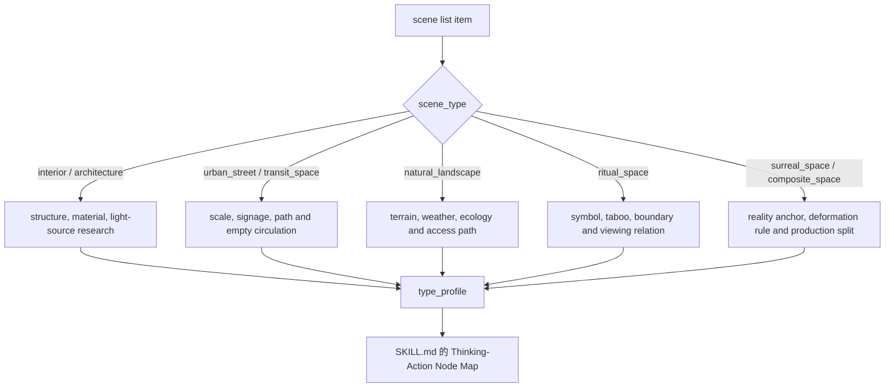

# Scene Design Type Map

## 类型包加载边界

- 每次调用本技能时，必须依据本文件识别并加载同目录 `types/` 中选中的类型包（单选或多选）。
- `types/` 中命中的类型包作为固定上下文加载；`knowledge-base/` 只作为按需检索、切片或向量召回的知识库，不替代类型包。


本文件承载 `$aigc-scene-design` 的类型变量和分型策略。执行时先生成 `type_profile`，再进入 `SKILL.md 的 Thinking-Action Node Map`。

## Type Variables

| variable | values |
| --- | --- |
| `scene_type` | `interior`、`architecture`、`urban_street`、`natural_landscape`、`transit_space`、`ritual_space`、`surreal_space`、`composite_space` |
| `reality_level` | `realist`、`stylized_realist`、`symbolic`、`surreal` |
| `asset_granularity` | `single_set`、`multi_zone`、`establishing_environment`、`detail_corner` |
| `research_need` | `low`、`medium`、`high` |
| `space_style_source` | `north_star`、`team_yaml`、`user_input`、`scene_inference`、`web_research_allowed`；建筑场景可兼容记录 `architecture_style_source` |
| `source_posture_need` | `project_only`、`project_plus_inference`、`external_reference_needed`、`unresolved_allowed_with_caution` |
| `uncertainty_level` | `low`、`medium`、`high` |
| `visual_translation_mode` | `structure_first`、`material_first`、`light_first`、`symbol_first`、`ecology_first`、`deformation_rule_first` |
| `prompt_evidence_density` | `compact`、`standard`、`strict` |

## Strategy Matrix

| scene_type | research_focus | research brief minimum | scene design emphasis | cinematography emphasis | prompt risk |
| --- | --- | --- | --- | --- | --- |
| `interior` | 平面布局、家具、生活痕迹、光源 | 说明布局/光源/陈设来源姿态，标注生活痕迹如何保持无人入画 | 材质、陈设密度、空间动线与缺席痕迹 | 景深、遮挡、窗光/人工光 | 容易变成泛室内图或误引入人物 |
| `architecture` | 建筑类型、年代、结构、材料 | 区分真实建筑制式、风格推断和非特指化处理 | 立面、比例、入口、空间边界 | 机位高度、透视线、体量感 | 建筑风格标签空泛或无依据具体化 |
| `urban_street` | 街道尺度、招牌、交通、公共生活痕迹 | 将公共生活转译为空街标识、磨损、设施和光源，不使用人群证明尺度 | 街景层次、铺面、路面、杂物 | 纵深、灯光变化、雨雾/车灯/招牌动势 | 过度赛博、过度复古或误引入人群 |
| `natural_landscape` | 地形、植被、水体、气候 | 记录地理/生态依据和季节不确定性，转译为地形、水汽、植被和路径；不得强行建筑风格 | 可达路径、自然纹理、尺度 | 广角/长焦、天气、地平线 | 缺少故事专属锚点或误写建筑流派 |
| `transit_space` | 过渡路径、方向、节点 | 说明方向性和节点功能来源，避免把人物流线写成人流画面 | 门、桥、楼梯、走廊、站台 | 运动镜头、引导线、压迫感 | 只剩功能描述 |
| `ritual_space` | 符号、禁忌、仪式动线 | 高风险符号必须有来源或非特指化，记录禁忌和不确定性 | 对称、供物、材质、神圣边界 | 静态凝视、低速运动、光束 | 误用文化符号 |
| `surreal_space` | 现实锚点和变形逻辑 | 明确现实锚点、变形规则和不可确认处的创作性边界 | 规则化异化、尺度破坏、材质反常 | 不稳定构图、非自然光 | 抽象到不可生成 |
| `composite_space` | 子空间边界和制作粒度 | 分别记录子空间证据、共用视觉锚点和 prompt 取舍 | 拆分区域、共用元素、转场点 | 空间关系、连续性镜头 | 多空间塞入一个 prompt |

## Type Profile Template

```yaml
type_profile:
  scene_type:
  reality_level:
  asset_granularity:
  research_need:
  space_style_source:
  architecture_style_source:  # optional; architecture/interior/urban only
  source_posture_need:
  uncertainty_level:
  visual_translation_mode:
  prompt_evidence_density:
  space_style_entry:
  architecture_style_entry:  # optional; architecture/interior/urban only
  research_focus:
  research_questions:
  scene_design_emphasis:
  cinematography_emphasis:
  prompt_risk:
```

## Type Route Map



## Network Search Permission

`research_need: high` 且本地资料不足时，允许网络搜索冷门建筑、地域、历史、材质、仪式或自然地理信息。搜索只为 LLM 判断提供证据；输出必须避免长篇引用，且标注来源策略或不确定性。

## Research Route Rules

- `source_posture_need: project_only`：只使用项目资料和上游清单，不引入外部事实；适合低风险幻想/抽象空间。
- `source_posture_need: project_plus_inference`：项目资料不足以生成形制时，允许 LLM 推断，但必须写入 `scene_inference`。
- `source_posture_need: external_reference_needed`：涉及真实地域、建筑制式、民俗/宗教、历史年代或自然地理时，必须优先检查项目资料；资料不足且用户未禁联网时可搜索，否则标为 `unresolved`。
- `source_posture_need: unresolved_allowed_with_caution`：允许保留不确定项，但必须在 `visual_translation` 中采用非特指、可替换或低风险可见设计。
- `space_style_entry` 按 `scene_type` 选择：architecture/interior/urban_street 可记录建筑、室内或街区风格；natural_landscape 记录地理/生态/季节/材质系统；surreal_space 记录变形规则；transit_space 记录路径、节点和材料逻辑。非建筑场景不得强行写建筑流派。
- `prompt_evidence_density: strict`：ritual、architecture、urban_street 中涉及具体文化/年代/地域时使用；prompt 关键名词必须逐项可回指。
