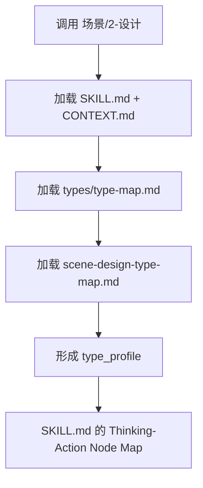

# Type Map

## Package Index

| package | role |
| --- | --- |
| `scene-design-type-map.md` | 判断场景主体粒度、建筑/自然/室内/超现实类型、研究需求和 prompt 处理策略 |

## Default Package Rule

- 默认加载 `scene-design-type-map.md`。
- 单场景与批量场景都先形成 `type_profile`，再进入 `SKILL.md 的 Thinking-Action Node Map`。
- 本索引只负责类型包发现，不替代 `SKILL.md` 的输入、输出、init team synthesis consumption 或 review 合同。

## Loading Flow

