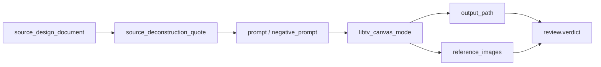

# Scene Generation Contract

## Scope

This reference owns the detailed business contract for `$aigc-scene-generation`.

The skill consumes completed upstream scene design markdown files and produces project-bound bitmap assets plus JSON prompt records. It does not own scene research, scene design, cinematography design, prompt distillation, registry updates, or parent skill governance.

## Source Inputs

Required source document:

```text
projects/aigc/<项目名>/3-主体/场景/2-设计/S###-<场景名>.md
```

Required fields or recoverable sections:

- Scene name from the document title or `名称`.
- Subject ID from `## 4. 解构` line `主体ID号：<主体ID>`; if absent, recover it from the source filename prefix such as `S###`.
- Source design document path.
- `## 4. 解构`.
- Global style and architecture style references when present.

If the source document lacks a usable `4. 解构` section, stop and report `FAIL-SCENE-GEN-01`; do not invent a new scene prompt in this stage or fall back to the old English integrated prompt.

## Step1 Main Image Contract

Step1 creates one primary scene image per source design document.

Prompt source:

- Load `templates/scene-main-image-prompt.json`.
- Use the upstream `4. 解构` content as the main prompt body.
- Preserve upstream scene identity, era, architecture, material, lighting, and no-human constraints.
- Add only operational delivery details required by `$libTV`, such as canvas UUID, image node name, model key, Midjourney suffix and project persistence.

Output:

```text
projects/aigc/<项目名>/3-主体/场景/3-生成/<主体ID>-<主体名称>-主图.<ext>
projects/aigc/<项目名>/3-主体/场景/3-生成/<主体ID>-<主体名称>-主图.json
```

## Step2 Multi-View Contract

Step2 is cancelled by the current `Multiview Cancellation Contract`.

Prompt source:

- Do not load `templates/scene-multiview-prompt.json` in the default workflow.
- Do not create `<主体ID>-<主体名称>-多视图.<ext>` or `<主体ID>-<主体名称>-多视图.json`.
- Historical multi-view files may remain as sidecars, but missing multi-view files are not generation gaps.

## Existing Asset And State Variant Rules

- 每次生成前必须扫描 `projects/aigc/<项目名>/3-主体` 下既有场景主体图、同名 JSON 和 manifest。
- 同主体同状态已有图时不重复生成；若只在本地，上传到当前 libTV 画布并保持节点名等于资产 stem。
- 同主体新状态（昼夜、季节、雨雪雾、战后废墟、修复后等）必须使用 `Lib Image` 和既有同主体参考图，命名加 `<状态后缀>`；不得用 `Midjourney V8.1` 重生状态变体。
- 第 N 集画布上生成或复用的场景主图节点必须用 `libtv download` 同步到 `projects/aigc/<项目名>/3-主体/场景/3-生成/`，或证明本地 canonical 文件已存在；多视图已取消，不再作为本合同的同步对象。

The multi-view sheet rule is historical only and does not participate in default review.

Output: no default Step2 output.

## JSON Prompt Record Contract

Each prompt JSON should include:

- `schema`
- `skill_id`
- `stage`
- `source_design_document`
- `subject_id`
- `subject_id_source`
- `subject_name`
- `image_role`
- `libtv_canvas_mode`
- `asset_reuse_decision`
- `local_sync_status`
- `local_asset_path`
- `download_command`
- `generation_model_policy`
- `prompt`
- `negative_prompt`
- `reference_images`
- `reference_context_status`
- `output_path`
- `review`
- `created_at`

For versioned outputs, include `variant_of` or `supersedes`.

## Evidence Chain



The evidence chain is blocking for completion: every generated bitmap must be recoverable from a same-name JSON record that names the upstream source, prompt lineage, libTV mode, output path and review state.

## Boundary Rules

- Do not modify upstream design documents.
- Do not generate design text by script or template.
- Do not alter registry, route files, parent directories, sibling role/prop skills, or other workers' files.
- Do not silently overwrite existing generated assets.
- Do not use other provider/API unless the user explicitly opted in or confirmed it after being asked.

## Review Gate Mapping

| Review Question | Review Gate | Fail Code | Rework Target | Report Evidence |
| --- | --- | --- | --- | --- |
| Can every requested output trace to one readable upstream `2-设计/S###-<场景名>.md` source document with scene name, source path, and a recoverable subject ID? | `REV-SCENE-GEN-01` | `FAIL-SCENE-GEN-01` | `N2-SOURCE` | `source_design_document`, `subject_id`, `subject_id_source`, source path list, unresolved source errors |
| Is the upstream `## 4. 解构` section present and used as the blocking prompt truth instead of inventing a scene prompt or falling back to the old English integrated prompt? | `REV-SCENE-GEN-01` | `FAIL-SCENE-GEN-01` | `N2-SOURCE` | `source_deconstruction_quote`, missing-section finding, prompt lineage note excluding old `提示词设计` source |
| Does Step1 use `templates/scene-main-image-prompt.json` plus upstream `4. 解构` while preserving scene identity, era, architecture, material, lighting, and no-human constraints without redesigning the scene? | `REV-SCENE-GEN-02` | `FAIL-SCENE-GEN-02` | `N4-MAIN` | main prompt JSON, copied source deconstruction, no-redesign checklist, boundary finding if new design facts appear |
| Does each Step1 deliver a project-bound `<主体ID>-<主体名称>-主图.<ext>` asset under `projects/aigc/<项目名>/3-主体/场景/3-生成`? | `REV-SCENE-GEN-03` | `FAIL-SCENE-GEN-03` | `N4-MAIN` | main image output path, filesystem existence check, generation mode, persistence action |
| Does each Step1 main image have a same-name JSON prompt record that records source, subject ID, prompt, negative prompt, libTV mode, output path, and review state? | `REV-SCENE-GEN-05` | `FAIL-SCENE-GEN-05` | `N5-MAIN-JSON` | `<主体ID>-<主体名称>-主图.json`, required field checklist, JSON parse result |
| Is Step2 multi-view generation cancelled in this run, with no new `-多视图` asset or JSON required? | `REV-SCENE-GEN-09` | `FAIL-SCENE-GEN-09` | `Multiview Cancellation Contract` | cancellation evidence |
| Did the workflow avoid loading the multi-view template or treating multi-view absence as a generation gap? | `REV-SCENE-GEN-04` | `FAIL-SCENE-GEN-04` | `Multiview Cancellation Contract` | module loading evidence |
| Is every bitmap recoverable through the evidence chain `source_design_document -> source_deconstruction_quote -> prompt -> libtv_canvas_mode -> asset_reuse_decision -> local_sync_status -> output_path -> review.verdict`? | `REV-SCENE-GEN-05` | `FAIL-SCENE-GEN-05` | `N9-REPAIR` | same-name JSON records, evidence chain trace, missing link list, repair actions |
| Are all final assets persisted in the project `3-生成` directory and named consistently with the libTV node? | `REV-SCENE-GEN-08` | `FAIL-SCENE-GEN-08` | `N9-REPAIR` | final workspace paths, transient source path if migrated, persistence verification |
| Was libTV canvas `image` node used by default, with other provider/API/model used only after explicit user opt-in or confirmation? | `REV-SCENE-GEN-06` | `FAIL-SCENE-GEN-06` | `N1-CONTEXT` / `N3-PROFILE` | libTV canvas mode, opt-in evidence, fallback reason, loaded `$libTV` contract |
| Was `projects/aigc/<项目名>/3-主体` scanned before generation, with same-subject same-state assets reused or uploaded instead of regenerated? | `REV-SCENE-GEN-11` | `FAIL-SCENE-GEN-ASSET-REUSE` | `N2-SOURCE` | `asset_reuse_decision`, `existing_asset_path`, `generation_skipped`, `canvas_action` |
| Was every generated, reused, uploaded, or already-local scene main image confirmed in `projects/aigc/<项目名>/3-主体/场景/3-生成/`, with download required only when the local canonical file is missing? | `REV-SCENE-GEN-13` | `FAIL-SCENE-GEN-LOCAL-SYNC` | `N4-MAIN` | `local_sync_required`, `local_sync_action`, `local_sync_status`, `local_asset_path`, download-only `download_command` / `download_stdout_path`, stem-to-node-name check |
| For same-subject new states, was `Lib Image` used with a same-subject reference and a state suffix in the asset name? | `REV-SCENE-GEN-12` | `FAIL-SCENE-GEN-STATE-VARIANT` | `N2-SOURCE` / `N4-MAIN` | `generation_model_policy`, `variant_model_key`, `state_variant_suffix`, `base_reference_node_name` |
| Were existing generated assets skipped, versioned with `-v2`/`-v3`, or overwritten only with explicit user permission? | `REV-SCENE-GEN-10` | `FAIL-SCENE-GEN-10` | `N3-PROFILE` / `N9-REPAIR` | asset conflict scan, overwrite permission note, `variant_of` or `supersedes` field |
| Did this stage avoid modifying upstream design documents, registry, route files, parent directories, sibling role/prop skills, and other workers' files? | `REV-SCENE-GEN-02` | `FAIL-SCENE-GEN-02` | `N8-REVIEW` / owner partition rollback request | changed-file list, out-of-scope diff finding, declared owner boundary |
