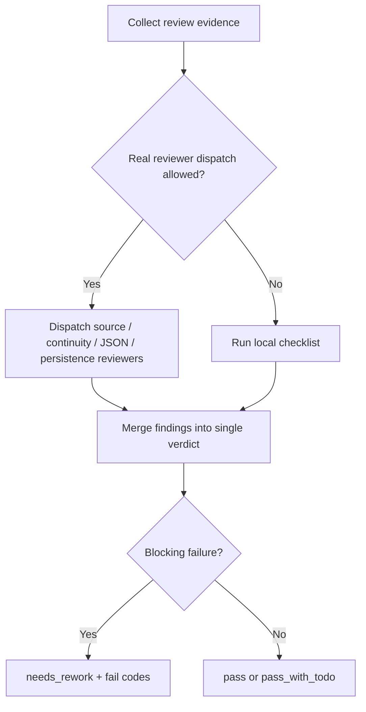

# Review Contract

## Default Review Path

This skill may use reviewer/provider paths for:

- Source contract review.
- Image continuity review.
- Prompt JSON completeness review.
- Project persistence review.

If external 顾问与复核流程 provider dispatch is unavailable, use the local checklist below.



## Reviewer Matrix

| reviewer_role | focus | blocking failures | fallback owner |
| --- | --- | --- | --- |
| `source-contract-reviewer` | Upstream design doc traceability and no-redesign boundary | missing source doc, invented prompt, upstream rewrite | local `REV-SCENE-GEN-01/02` |
| `continuity-reviewer` | Main image to multi-view identity continuity | missing main reference, nine unrelated spaces, people/silhouette drift | local `REV-SCENE-GEN-04/07` |
| `json-record-reviewer` | Same-name JSON completeness, libTV canvas fields and reproducibility fields | missing JSON, missing source/prompt/canvas/model/node/suffix/path/review | local `REV-SCENE-GEN-05` |
| `persistence-reviewer` | Workspace project-bound final paths, libTV node-name consistency and local canonical asset confirmation | asset remains only in a temporary directory, output path mismatch, node name mismatch, missing local canonical asset, missing `libtv download` evidence when download is required | local `REV-SCENE-GEN-03/08/13` |

## Local Checklist

| check_id | gate | pass criteria | fail code |
| --- | --- | --- | --- |
| `REV-SCENE-GEN-01` | Source | Each output traces to one upstream `2-设计` document | `FAIL-SCENE-GEN-01` |
| `REV-SCENE-GEN-02` | Boundary | No scene redesign, no upstream rewrite, no out-of-bound files | `FAIL-SCENE-GEN-02` |
| `REV-SCENE-GEN-03` | Main image | `主体ID-主体名称-主图` exists under project `3-生成` | `FAIL-SCENE-GEN-03` |
| `REV-SCENE-GEN-04` | Multi-view image | `主体ID-主体名称-多视图` exists, uses same-canvas main image node as reference, and records `reference_context_status: linked_in_libtv_canvas` | `FAIL-SCENE-GEN-04` |
| `REV-SCENE-GEN-05` | JSON records | Each image has same-name JSON with `subject_id`, source, prompt, libTV canvas UUID, node name, Midjourney modelKey, suffix, path and review | `FAIL-SCENE-GEN-05` |
| `REV-SCENE-GEN-06` | libTV route | `.agents/skills/cli/libTV` canvas `image` node used by default; external provider/API/model has explicit opt-in | `FAIL-SCENE-GEN-06` |
| `REV-SCENE-GEN-07` | Visual continuity | Multi-view sheet presents one coherent scene identity | `FAIL-SCENE-GEN-07` |
| `REV-SCENE-GEN-08` | Persistence | No project-bound final remains only in a temporary directory; libTV node name matches canonical asset stem | `FAIL-SCENE-GEN-08` |
| `REV-SCENE-GEN-09` | Reference context | Multi-view JSON / report records `reference_context_status: linked_in_libtv_canvas` in real generation mode | `FAIL-SCENE-GEN-09` |
| `REV-SCENE-GEN-10` | Asset conflict | Existing generated assets are skipped, versioned, or overwritten only with explicit user permission | `FAIL-SCENE-GEN-10` |
| `REV-SCENE-GEN-11` | Existing asset reuse | Same-subject same-state assets are reused or uploaded to the current canvas instead of regenerated | `FAIL-SCENE-GEN-ASSET-REUSE` |
| `REV-SCENE-GEN-12` | State variant | Same-subject new states use `Lib Image`, an existing reference image node, and a state suffix | `FAIL-SCENE-GEN-STATE-VARIANT` |
| `REV-SCENE-GEN-13` | Local canonical ensure | Scene subject images generated, reused, or uploaded on any episode canvas are confirmed in `projects/aigc/<项目名>/3-主体/场景/3-生成/`; existing local canonical assets may skip download with `already_present`, and missing local assets must be downloaded or copied | `FAIL-SCENE-GEN-LOCAL-SYNC` |

## Verdict Schema

```yaml
verdict: pass | pass_with_todo | needs_rework
reviewer: scene-generation-review
review_status: external_provider | local_checklist
source_documents: []
outputs: []
findings: []
subject_id_required: true
reference_context_status_required_for_multiview: true
libtv_canvas_uuid_required: true
model_display_name: Midjourney V8.1
asset_reuse_decision_required: true
generation_model_policy: new_subject_midjourney_default | lib_image_state_variant
variant_model_display_name: Lib Image
state_variant_suffix_required_when_variant: true
base_reference_node_required_when_variant: true
midjourney_suffix_required: "--ar 16:9 --hd --style raw"
local_sync_required: true
local_sync_action_required: true
local_sync_status_required: true
local_asset_path_required: true
download_command_required_when_downloading: true
notes: ""
```

## Local Checklist Fields

When using the local review path, record:

```yaml
local_checklist:
  findings: []
  repair_actions: []
```

`pass_with_todo` is allowed only for non-blocking visual polish issues. Missing source, missing JSON, missing project persistence, missing local canonical asset confirmation/fill, out-of-bound writes, or silent overwrite of existing assets require `needs_rework`.
