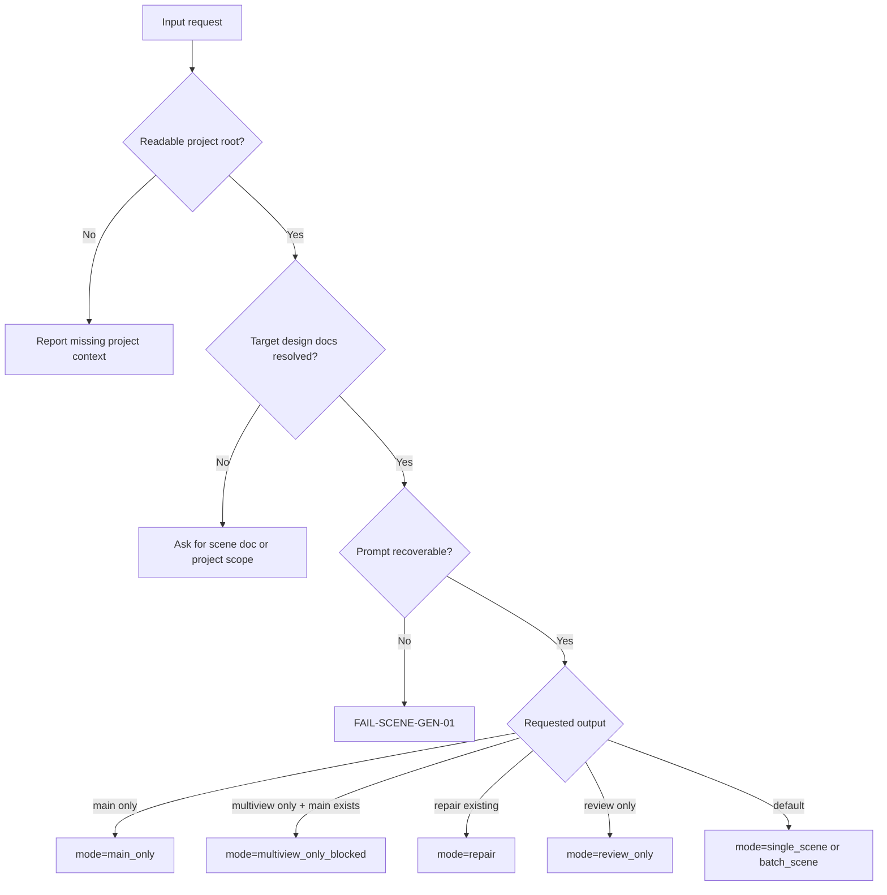

# Scene Generation Type Map

## 类型包加载边界

- 每次调用本技能时，必须依据本文件识别并加载同目录 `types/` 中选中的类型包（单选或多选）。
- `types/` 中命中的类型包作为固定上下文加载；`knowledge-base/` 只作为按需检索、切片或向量召回的知识库，不替代类型包。


## Type Profile Fields

```yaml
generation_profile:
  project_root: ""
  source_design_documents: []
  target_subjects: []
  mode: single_scene | batch_scene | main_only | multiview_only_blocked | reuse_existing_asset | state_variant_generation | repair | review_only
  libtv_canvas_mode: canvas_image_node | external_provider_explicit
  canvas_name_hint: "<项目名>-第<集数>集"
  canvas_uuid: ""
  model_display_name: Midjourney V8.1
  model_key: ""
  generation_model_policy: new_subject_midjourney_default
  variant_model_display_name: Lib Image
  variant_model_key: ""
  asset_reuse_decision: generate_new_subject
  generation_skipped: false
  canvas_action: create_new_node
  local_sync_required: true
  local_sync_status: pending
  local_asset_path: ""
  download_command: ""
  state_variant_suffix: ""
  base_reference_node_name: ""
  midjourney_suffix: "--ar 16:9 --hd --style raw"
  output_conflict_policy: version | overwrite_with_permission | skip
  needs_main_image: true
  needs_multiview: false
  existing_main_image: ""
  reference_images: []
  reference_context_status: disabled_multiview | no_reference_image
```

## Mode Matrix

| type_id | trigger | required source | route | output |
| --- | --- | --- | --- | --- |
| `TYPE-SCENE-GEN-01` | Single scene design doc | One upstream design document | Step1 main only | Main image/JSON |
| `TYPE-SCENE-GEN-02` | Multiple scene design docs | List of upstream design documents | Repeat Step1 main only per doc | Batch main asset set |
| `TYPE-SCENE-GEN-03` | Main image only | Upstream design document | Step1 only | Main image/JSON |
| `TYPE-SCENE-GEN-04` | Multi-view only | Upstream design document and existing main image | blocked by cancellation contract | cancellation evidence |
| `TYPE-SCENE-GEN-07` | Same subject same state already exists | Existing local or canvas subject image | Reuse or upload; skip generation | Canvas node + JSON evidence |
| `TYPE-SCENE-GEN-08` | Same subject new state | Existing same-subject reference image | Lib Image state variant | State-suffix image/JSON |
| `TYPE-SCENE-GEN-05` | Repair missing JSON or misplaced image | Existing asset plus source doc | Mechanical repair, optional regeneration | Completed pair or versioned replacement |
| `TYPE-SCENE-GEN-06` | Review only | Existing outputs | Review contract only | Verdict/report |

## Routing Matrix

| profile signal | steps impact | references impact | review impact |
| --- | --- | --- | --- |
| `needs_main_image=true` | Must execute `N4-MAIN` and `N5-MAIN-JSON` | Enforce Step1 Main Image Contract | Check main image path and same-name JSON |
| `needs_multiview=true` | Block and return to Multiview Cancellation Contract | Enforce multi-view cancellation | Check no multi-view gap or output is required |
| `existing_main_image` present | May skip Step1 only if path is readable, role is clear, and the corresponding libTV node can be resolved or recreated by name | Treat as user-provided continuity anchor | Verify source pairing and node name in JSON |
| `asset_reuse_decision=reuse_existing_asset` | Skip image generation and reuse same-canvas node | Enforce shared existing asset rule | Check `generation_skipped`, `canvas_action`, node name and `local_sync_status` |
| `asset_reuse_decision=upload_existing_asset` | Upload local existing image to target canvas under the canonical node name | Enforce libTV upload contract | Check uploaded node name equals asset stem and local canonical copy exists |
| `asset_reuse_decision=generate_state_variant` | Use Lib Image with same-subject reference and state suffix | Enforce shared state variant rule | Check `variant_model_key`, `base_reference_node_name`, `state_variant_suffix` and `local_sync_status` |
| `local_sync_status=pending/failed` | Pause completion until the project `场景/3-生成` directory has the same-stem local asset | Read shared reuse rule and libTV download contract | Record `FAIL-SCENE-GEN-LOCAL-SYNC`; repair by confirming existing local canonical asset, copying a non-canonical local file, or running `libtv download` only when local is missing |
| `output_conflict_policy=version` | Add `-v2`, `-v3` or stable equivalent | Apply naming convention without overwriting | Check `variant_of` or `supersedes` |
| `canvas_uuid` or `model_key` missing | Pause real generation and enter prompt_only / blocked | Read libTV project/model contract | Record resolution gap in verdict |
| `mode=review_only` | No write nodes may run | Boundary rules remain active | Verdict is the only output |

## Decision Gates



## Filename Sanitization

Replace these characters in `<主体名称>` with `-`:

```text
/\:*?"<>|
```

Also replace newlines and trim leading/trailing whitespace. Do not change the display name inside JSON unless the upstream canonical name itself changed.

## Local Sync Rule

- 任一集 libTV 画布上的场景主体图生成、复用或上传成功后，都必须确保 `projects/aigc/<项目名>/3-主体/场景/3-生成/` 已有同 stem 本地资产。
- 本地 canonical 已有时跳过下载/复制并记录 `local_sync_status: already_present`；本地缺失时才下载或复制补齐。
- 真实生成分支必须记录 `local_sync_status`、`local_asset_path` 和必要时的 `download_command`；缺失时不能判定完成。
