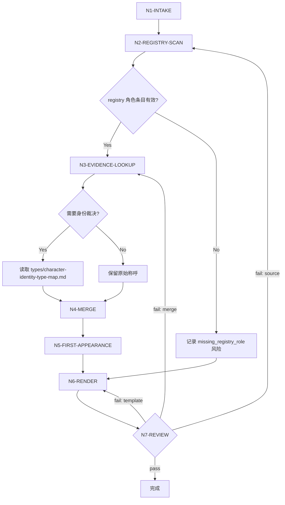

# Character List Workflow

No independent gate: this file is a legacy workflow expansion preserved for audit and migration continuity. The canonical runtime spine, node map, gates, routes, and completion criteria now live in `SKILL.md`.

## Business Requirement Analysis

| slot | answer |
| --- | --- |
| `business_goal` | 从 `3-主体/subject-registry.yaml` 的 `subjects.characters` 形成后续角色设计可消费的 canonical 清单。 |
| `business_object` | `projects/aigc/<项目名>/3-主体/subject-registry.yaml`、角色 ID、canonical name、source anchors、故事源证据。 |
| `constraint_profile` | 上游真源约束、LLM-first 归并约束、三列表格输出约束、首次登场可回指约束。 |
| `success_criteria` | 每个角色条目都有 registry 来源、首次登场锚点准确、别名/代称归并可解释、表头固定。 |
| `non_goals` | 不生成角色设计稿、外貌设定、服装方案、提示词或跨域道具/场景清单。 |
| `complexity_source` | 复杂度来自别名、代称、称谓变化、群体角色、多状态/多服装/年龄阶段变体和 registry/source anchor 缺口。 |
| `topology_fit` | 串行主干 + 风险分支 + review 失败回路。 |

## Thinking-Action Topology

## Node Map

| node_id | input | judgment | action | evidence | output | route_out | gate |
| --- | --- | --- | --- | --- | --- | --- | --- |
| `N1-INTAKE` | 项目路径、集号范围、上游文件 | 是否可定位 `3-主体/subject-registry.yaml` | 锁定输入 manifest | 文件路径、集号范围、项目上下文加载记录 | `input_manifest` | `N2-REGISTRY-SCAN` | 上游文件可读 |
| `N2-REGISTRY-SCAN` | `subject-registry.yaml` | 是否存在角色 ID、canonical name 与 source anchors | 抽取候选角色原值 | `registry_id + canonical_name + source_anchors` | `candidate_evidence_table` | `N3-EVIDENCE-LOOKUP` 或 `missing_registry_role` | 候选均来自 registry |
| `N3-EVIDENCE-LOOKUP` | 候选角色、source anchors | 是否需要解释别名或代称 | 回查 source anchor 指向的故事源 | source anchor 关键词、项目已确认命名规则 | `identity_evidence` | `N4-MERGE` 或风险分支 | 不跨源臆测 |
| `N4-MERGE` | 候选与证据 | 是否同一叙事主体 | LLM 裁决 canonical 名称与别名 | `observed_names -> canonical_name` 理由 | `merged_character_rows` | `N5-FIRST-APPEARANCE` | 合并理由可解释 |
| `N5-FIRST-APPEARANCE` | 归并后角色与所有出现位置 | 哪个分镜组最早 | 计算首次登场锚点 | 最早 `episode_file / group_id` | `first_appearance_map` | `N6-RENDER` | 使用分镜组 ID |
| `N6-RENDER` | rows、模板、输出路径 | 是否满足三列表格 | 渲染 `角色清单.md` | `templates/output-template.md` 对齐记录 | `character_list_md` | `N7-REVIEW` | 表头固定 |
| `N7-REVIEW` | 清单与证据表 | 是否有漏项、误并、脚本越界 | 执行 review gate | review finding、风险列表、必要修复入口 | `review_result` | `done` 或返工到对应节点 | 风险已记录 |

## Branches

| branch | condition | route |
| --- | --- | --- |
| `missing_registry_role` | registry 无角色条目、字段缺失或 source anchors 为空 | 不补角色；执行报告记录上游缺口并回到父级 registry repair |
| `ambiguous_pronoun` | 候选为代称且 source anchor 无法唯一回指 | 不强归并；报告待确认 |
| `possible_alias` | 不同称呼疑似同一人 | 读取 `types/character-identity-type-map.md` 后由 LLM 裁决 |
| `group_character` | 候选是群体称呼 | 判断是否为下游设计主体；否则报告不纳入理由 |
| `state_variant` | 候选是同一角色的服装、战斗、战损、受伤、少年、老年或时间跳跃状态 | 归入 base character，记录 `variant_state_map`；必要时传给 design manifest |

## Failure Recovery Routes

| failure | symptom | rework_node | evidence_to_collect |
| --- | --- | --- | --- |
| `source_gap` | 条目无法回指 registry `subjects.characters` | `N2-REGISTRY-SCAN` | 缺失的 `registry_id / canonical_name / source_anchor` |
| `merge_gap` | 别名、代称或称谓归并理由不足 | `N3-EVIDENCE-LOOKUP` | source anchor 关键词、项目记忆、人工确认记录 |
| `first_appearance_gap` | 首次登场晚于候选证据 | `N5-FIRST-APPEARANCE` | 全部出现位置排序表 |
| `template_drift` | 表头或字段超出三列 | `N6-RENDER` | 当前表头、模板对齐记录 |
| `variant_split` | 同一角色的状态被拆成多个主体 | `N4-MERGE` | base character 证据、状态标签、source anchor |
| `script_overreach` | 脚本替代 LLM 生成归并或描述 | `N4-MERGE` | 脚本输出证据、人工/LLM 裁决记录 |

## Evidence Gate

- 每个最终角色行必须能回到至少一个 `registry_id + canonical_name + source_anchor`。
- 每个合并必须能说明 `observed_names -> canonical_name` 的证据。
- 每个状态变体必须能说明 `variant_label -> base_character` 的证据，或标记为待确认风险。
- 每个首次登场必须早于或等于该角色其他出现位置。
