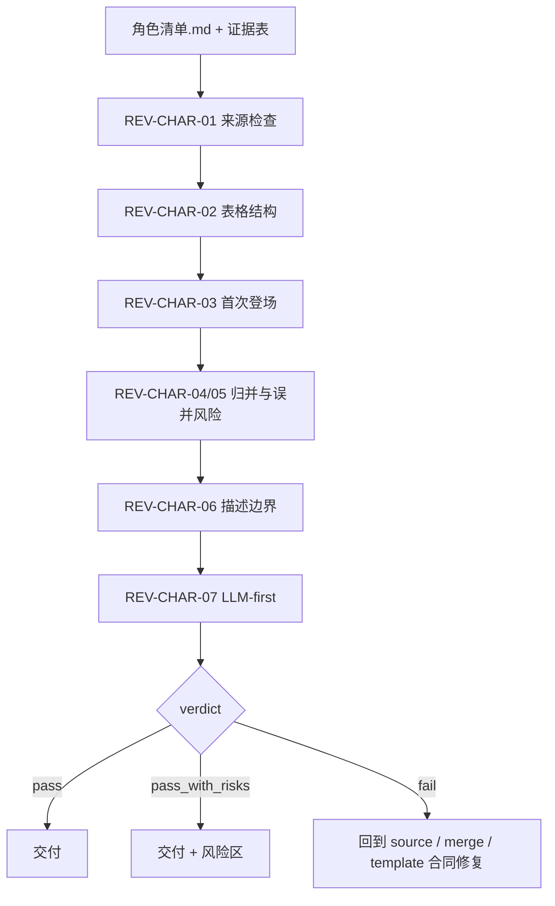

# Review Contract

## Default Provider

- 默认辅助 provider：`code-reviewer` 或等价人工 review。
- 用途：检查角色清单的来源、三列表格、首次登场、归并质量、描述边界和 LLM-first 边界。
- 若当前环境不使用外部 reviewer/provider，则直接执行本地 review checklist；交付说明只记录 verdict、finding 和必要修复项。

## Review Scope

审查对象是 `projects/aigc/<项目名>/3-主体/角色/1-清单/角色清单.md` 与可选 `执行报告.md`。审查不改写上游 `subject-registry.yaml`、`1-分集` 或后置 `8-分组` 文件。

## Review Flow



## Review Gates

| gate_id | gate | blocking_condition | rework_target |
| --- | --- | --- | --- |
| `GATE-CHAR-LIST-01` | Source lock | 最终角色主体不能回指 `subject-registry.yaml` 的 `subjects.characters` 条目，或来自分组稿、摄影稿、剧情梗概、场景/道具清单、外部设定等非 canonical 来源 | `N2-REGISTRY-SCAN` |
| `GATE-CHAR-LIST-02` | Evidence boundary | source anchor、项目 `MEMORY.md` 或项目 `CONTEXT/` 被当作新增角色来源，而不是身份解释、别名消歧或已确认命名约束 | `N3-EVIDENCE-LOOKUP` |
| `GATE-CHAR-LIST-03` | Identity classification | 姓名、别名、职务称呼、关系称呼、代称、群体或含糊称呼未按类型识别，导致归并依据不清 | `types/character-identity-type-map.md` / `N4-MERGE` |
| `GATE-CHAR-LIST-04` | Merge decision | 同一角色不同称呼未归并，或不同角色因同职业、同泛称、同场景、代词性别等被误并 | `N3-EVIDENCE-LOOKUP` / `N4-MERGE` |
| `GATE-CHAR-LIST-05` | Group and low-confidence landing | 群体角色、普通背景人群或低置信度归并没有形成纳入/不纳入理由，也未进入执行报告风险区 | `N7-REVIEW` |
| `GATE-CHAR-LIST-06` | First appearance | `首次登场` 不是归并后所有候选里最早的可回指分镜组 ID | `N5-FIRST-APPEARANCE` |
| `GATE-CHAR-LIST-07` | Render and description boundary | 表格字段漂移，`别名` 被拆成独立主体列，或 `原文描述（关键词式）` 扩写成外貌、服装、性格、剧情推断、提示词或设计正文 | `N6-RENDER` |
| `GATE-CHAR-LIST-08` | LLM-first merge | 脚本、模板或字符串相似度替代 LLM 完成 canonical 命名、别名归并、代称识别或关键词写作 | `N4-MERGE` |

## Fail Codes

| fail_code | meaning | route |
| --- | --- | --- |
| `FAIL-CHAR-LIST-01` | 输入来源不可定位、不可读，或最终角色无法回指 registry `subjects.characters` | `N2-REGISTRY-SCAN` |
| `FAIL-CHAR-LIST-02` | 候选角色来自 registry 之外，或正文/项目上下文越界成为新增候选来源 | `N2-REGISTRY-SCAN` / `N3-EVIDENCE-LOOKUP` |
| `FAIL-CHAR-LIST-03` | 别名、代称、称谓变化或同一角色不同称呼缺少 LLM 裁决理由，或发生误拆/误并 | `N3-EVIDENCE-LOOKUP` / `N4-MERGE` |
| `FAIL-CHAR-LIST-04` | 首次登场不是最早分镜组，或无法回指集文件 / 分镜组 ID | `N5-FIRST-APPEARANCE` |
| `FAIL-CHAR-LIST-05` | 固定三列表格漂移，或别名、风险、说明被拆成额外主体列 | `N6-RENDER` |
| `FAIL-CHAR-LIST-06` | 脚本、模板、字符串相似度或启发式规则替代 LLM 做身份归并或描述关键词写作 | `N4-MERGE` |
| `FAIL-CHAR-LIST-07` | 增量 merge 静默覆盖既有清单、破坏已有设计锚点，或未保留旧角色稳定性 | `N4-MERGE` / `N7-REVIEW` |
| `FAIL-CHAR-LIST-08` | `原文描述（关键词式）` 扩写成角色设计、外貌/服装方案、性格分析、剧情推断或提示词 | `N6-RENDER` |
| `FAIL-CHAR-LIST-09` | 群体角色、普通背景人群、含糊称呼或低置信度归并未落入待核风险或纳入/不纳入说明 | `N7-REVIEW` |

## Required Checks

| check_id | check | pass_condition | severity |
| --- | --- | --- | --- |
| `REV-CHAR-01` | 上游来源 | 每个条目来自 `subject-registry.yaml` 的 `subjects.characters` | blocker |
| `REV-CHAR-02` | 表格结构 | 表头精确为 `名称`、`首次登场`、`原文描述（关键词式）` | blocker |
| `REV-CHAR-03` | 首次登场 | 每行首次登场是可回指分镜组 ID，必要时带集文件名 | major |
| `REV-CHAR-04` | 归并质量 | 别名、代称和同一角色不同称呼已归并，低置信度项有风险记录 | major |
| `REV-CHAR-05` | 误并风险 | 不同角色没有因同职业、同泛称或同群体身份被硬合并 | major |
| `REV-CHAR-06` | 描述边界 | `原文描述（关键词式）` 不含外貌设计、性格扩写或剧情推断 | major |
| `REV-CHAR-07` | LLM-first | 没有脚本生成归并判断或 canonical 清单正文 | blocker |

## Verdict

| verdict | meaning |
| --- | --- |
| `pass` | 无 blocker，major 风险已解决或可接受 |
| `pass_with_risks` | 无 blocker，但仍有待人工确认的别名或 registry/source anchor 缺口 |
| `fail` | 存在 blocker，必须回到对应 source/merge/template 合同修复 |

## Finding Shape

```yaml
finding:
  check_id: REV-CHAR-00
  severity: blocker | major | minor
  symptom: ""
  evidence: ""
  rework_target: references/source-and-merge-contract.md | references/legacy-character-list-workflow.md | types/character-identity-type-map.md | templates/output-template.md
```

## Provider Note

可使用机械脚本辅助检查表头、路径、重复名称和分镜组 ID 形态；归并质量必须由 LLM 或人工 review 裁决。
