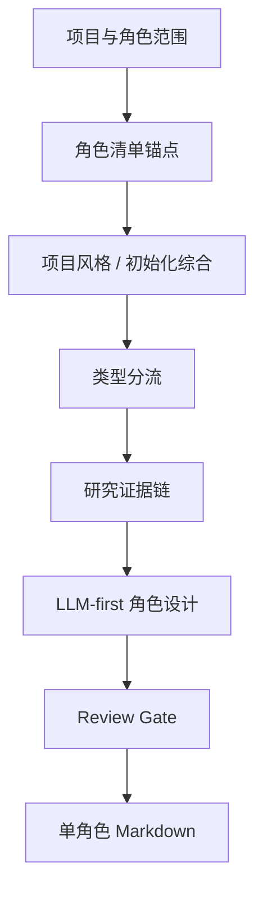

# aigc 3-主体/角色/2-设计

角色细目设计 Skill 2.0 包，用于从 `projects/aigc/<项目名>/3-主体/角色/1-清单/角色清单.md` 读取角色清单，并结合 `2-美学` 输出与项目 `MEMORY.md` 输出单角色设计稿。

## Directory Tree

```text
2-设计/
├── references/
│   ├── character-design-contract.md
│   ├── design-output-contract.md
│   ├── design-slot-review-contract.md
│   ├── workflow-supervision-contract.md
│   └── legacy-character-design-workflow.md
├── scripts/
│   └── README.md
├── templates/
│   └── output-template.md
├── review/
│   └── review-contract.md
├── knowledge-base/
│   ├── character-design-heuristics.md
│   └── character-design-corpus.md
├── types/
│   └── character-design-type-map.md
├── agents/
│   └── openai.yaml
├── CHANGELOG.md
├── SKILL.md
├── CONTEXT.md
├── test-prompts.json
└── README.md
```

## Quick Entry

- 调用名：`$aigc-design-character-detail`
- 上游真源：`projects/aigc/<项目名>/3-主体/角色/1-清单/角色清单.md`
- 项目上下文：`projects/aigc/<项目名>/MEMORY.md`、`projects/aigc/<项目名>/CONTEXT/`、`projects/aigc/<项目名>/2-美学/类型风格.md`、`projects/aigc/<项目名>/2-美学/画面基调/全局风格协议.md`、当前集优先/项目级回退的 `2-美学/角色风格/角色风格协议.md`
- Canonical 输出：`projects/aigc/<项目名>/3-主体/角色/2-设计/C###-<角色名>.md`
- 变体输出：同一角色的多服装、战斗、战损、受伤、少年、老年、伪装等使用 `C###-V##-<角色名>-<变体名>.md`，并回指同一 `base_subject_id`。
- 研究层要求：身份、职业、阶层、地域年代、服饰工艺、身体姿态、审美吸引力、禁区、不确定性和 prompt evidence chain 必须转化为可见设计决策。
- 语料库触发：审美强化、妆容化、角色类型词库、服装时代语境或 prompt 审美短语命中时，必须加载 `knowledge-base/character-design-corpus.md` 并留下 `corpus_usage_trace`。

## Workflow Snapshot



## Guardrails

- 研究考据、物语、解构、服装、摄影和英文提示词由 LLM 直接创作。
- 研究考据必须形成 `evidence -> design decision -> prompt phrase`，不能只保留资料摘录。
- 脚本只能读取、校验、统计和汇总，不能生成角色设计正文。
- 默认只读消费初始化综合；本地执行只记录 verdict、finding、采纳建议和必要修复项，不调用 team 身份或旧 stage profile。
- `design-output-contract.md`、`design-slot-review-contract.md` 和 `workflow-supervision-contract.md` 必须进入入口加载、执行节点和 review gate，不得作为旁路文档漂移。
- 本技能不修改 registry、父级目录、上游清单、场景/道具技能或最终生成阶段。
- 同一角色多状态不新增 base character；默认稿使用 `base_subject_id`，变体稿使用 `variant_id` 作为文件名前缀、解构 ID、提示词 ID 和英文 prompt 前缀。
- 固定为纯色背景全身定妆照，不置身剧情场景、建筑空间、街景、室内陈设或复杂环境。
- 角色设计必须强化来源匹配的容貌、妆发、骨相、身形、服装审美和整体气质；审美路线按清单证据、年龄、性别/性别表达、身份、物种/族群、项目调性和角色权重判断。主角、核心情感线角色和长期复用角色必须具备 `lead_beauty_handsomeness_floor=required` 的帅哥/美女/主角级好看证据，并具备 `lead_presence_temperament_floor=required` 的整体气质、主角感、精神状态和镜头存在感证据；主角、核心情感线角色、长期复用角色、大反派、主要对抗者、长线威胁和终局 Boss 必须具备 `charisma_floor=high` 的可见镜头魅力证据；普通正反派和功能角色都有个性化魅力或可识别度。真实人物灵感默认不用或泛化处理，只有用户/项目允许且有必要时才可原创转译，不得精确复刻现实人物。
- 角色设计必须显式裁决身高档位/安全范围、身形结构、比例重心、发型长度/体量/轮廓/时代职业适配、服装主色/辅色/点缀色和配色逻辑；不得只写“高挑、修长、黑发、深色衣服”等泛词。
- 角色摄影和英文 prompt 必须保证面部可读：清晰眉眼、鼻梁、嘴部、骨相、肤色层次和表情意图；阴郁、危险或压迫感可用受控侧光、轮廓光和局部眼尾压暗，不得用重阴影、半脸阴影或低调剪影遮脸。
- 服装可以风格化，但不得脱离项目时代、地域、阶层和职业母体；语料库词条必须原创转译，不得逐字套用成模板脸或模板服装。
- `## 4. 解构` 下方必须先写 `主体ID号：<asset_id>`，并与文件名前缀、`## 5. 提示词设计` 主体 ID、英文 prompt 开头保持一致；默认稿 `asset_id=base_subject_id`，变体稿 `asset_id=variant_id`。
- 输出文档文件名必须带同一 asset ID 前缀，例如 `C001-<角色名>.md` 或 `C001-V02-<角色名>-战损态.md`。
- 最终英文整合 prompt 的整合对象是 `## 4. 解构` 的全部有效 Identity & Story Pressure、Visual Drivers、Detailed Character Design、Detailed Costume Design 与 Cinematography 信息；只拼主体 ID、风格、服装、定妆照词或负向词等前缀/后缀不算完成。
- 英文 prompt 必须控制在 1300 characters 内，并使用自然语言负向约束，不得使用 Midjourney `--no` 参数。
- 英文 prompt 必须以 asset ID 号开头，并包含 `full-body costume fitting photo, solid color background, no scene environment` 等等价约束。
