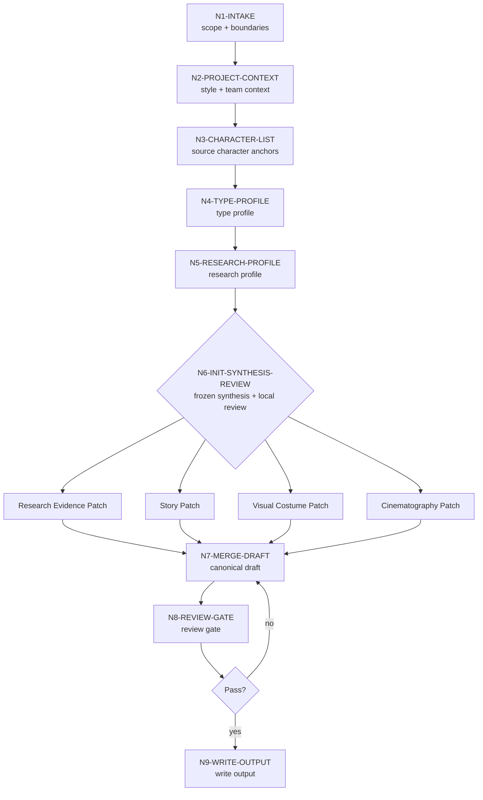

# Character Design Workflow

No independent gate: this file is a legacy workflow expansion preserved for audit and migration continuity. The canonical runtime spine, node map, gates, routes, and completion criteria now live in `SKILL.md`.

本文件定义 `角色/2-设计` 的思行一体化流程。执行时先判断、再行动、再留证据。

## Topology

混合拓扑：项目上下文串行锁定，初始化综合只作为冻结上下文消费，角色主体由主 agent 汇流并进入本地 review。

## Thinking-Action Nodes

| node_id | objective | inputs | actions | evidence | route_out | gate |
| --- | --- | --- | --- | --- | --- | --- |
| `N1-INTAKE` | 锁定项目、角色范围和不动范围 | 用户请求、项目路径 | 解析项目名、角色名、批量范围和只读边界 | `execution_scope` | `N2-PROJECT-CONTEXT` | 项目路径明确 |
| `N2-PROJECT-CONTEXT` | 加载项目风格和初始化综合上下文 | `MEMORY.md`、`CONTEXT/`、`2-美学/类型风格.md`、`2-美学/画面基调/全局风格协议.md`、当前集优先/项目级回退的 `2-美学/角色风格/角色风格协议.md` | 抽取 `画面基调.Global Style Prompt + 角色风格.Character Style Prompt`，并记录 episode override / fallback；设计相关初始化约束、启发、风险和禁区来自项目记忆 | `project_design_context` | `N3-CHARACTER-LIST` | 缺失项已记录 |
| `N3-CHARACTER-LIST` | 锁定清单角色锚点 | `角色清单.md`、`design-manifest.yaml` | 读取待设计角色的名称、首次登场、原文描述关键词；识别同一 base character 的状态变体 | `character_intake_table`、`variant_intake_table` | `N4-TYPE-PROFILE` | 每个角色来自清单；每个变体回指 base character |
| `N4-TYPE-PROFILE` | 判定角色类型、变体类型和设计深度 | 清单行、项目上下文、variant state | 应用 `types/character-design-type-map.md`，决定研究深度、考据许可、不确定性口径、`variant_type`、`identity_invariant_policy`、`state_delta_scope`、`aesthetic_priority`、`lead_beauty_handsomeness_floor`、`lead_presence_temperament_floor`、`charisma_floor`、`celebrity_inspiration_policy` 和 `face_readability_policy` | `type_profile`、`variant_profile` | `N5-RESEARCH-PROFILE` | 类型、变体、深度、审美优先级、主角帅/美下限、主角整体气质下限、魅力下限、面部可读性和风险明确 |
| `N5-RESEARCH-PROFILE` | 把研究转化为设计证据链 | `character_intake_table`、`variant_profile`、`project_design_context`、`type_profile`、必要外部来源、`knowledge-base/character-design-corpus.md` | LLM 生成身份、变体状态、职业、阶层、地域年代、服饰工艺、身体姿态、身体造型/发型/配色、面部可读性光线、审美吸引力、禁区、不确定性和 prompt evidence chain；变体稿必须生成 `identity_invariants` 与 `variant_state_delta`；命中审美强化、妆容化或服装时代语境时加载语料库并形成 `corpus_usage_trace`；搜索只作辅助证据 | `research_profile`、`variant_state_delta`、`identity_invariants`、`corpus_usage_trace` | `N6-INIT-SYNTHESIS-REVIEW` | 每个研究镜头、变体状态、身体造型、面部可读性和审美吸引力都有设计转化；语料已原创转译且不脱离时代语境 |
| `N6-INIT-SYNTHESIS-REVIEW` | 消费项目记忆初始化上下文并准备本地 review | `MEMORY.md`、`project_memory_init_context`、`type_profile`、`research_profile`、`references/workflow-supervision-contract.md` | 只读提取与当前角色设计有关的设计约束、启发和风险，压缩为 `project_memory_init_context`；本地 review 仅记录研究证据、物语、视觉服装、摄影 patch 和风险，不从 team 派生成员人格或问答 | `workflow_supervision_record`、`init_synthesis_node_coverage`、`project_memory_init_context` | `N7-MERGE-DRAFT` | 不静默跳过可用初始化上下文；supervision 记录非空；无 team 身份调用、旧 stage profile 或伪顾问问答 |
| `N7-MERGE-DRAFT` | 生成单一 canonical 设计稿 | 各 patch、模板、`references/design-output-contract.md`、`corpus_usage_trace` | LLM 汇流并写完整设计稿，不保留互相竞争的并列稿；`## 4. 解构` 下方必须写 `主体ID号：<asset_id>`，默认稿 `asset_id=base_subject_id`，变体稿 `asset_id=variant_id`，英文 prompt 必须以同一 asset ID 号开头，整合 `## 4. 解构` 全部有效信息，覆盖身份不变量、变体状态 delta、审美吸引力、`Lead Beauty / Handsomeness Floor`、`Lead Presence / Temperament Floor`、`Charisma Floor`、脸部/骨相策略、身体造型、服装配色、整体气质/姿态能量、面部可读性光线、妆容化和服装吸引力，使用自然语言负向约束且不含 `--no`，prompt 短语必须可回指 evidence chain 与 `deconstruction_coverage` | `character_design_draft` | `N8-REVIEW-GATE` | 字段齐全，变体归属、审美吸引力、主角帅/美下限、主角整体气质下限、主角/大反派高魅力下限、身体造型、面部可读性、语料库原创转译和输出合同硬规则已逐条满足 |
| `N8-REVIEW-GATE` | 审查字段、风格、研究证据链、身体造型、面部可读性、审美吸引力、语料库触发、prompt 和 LLM-first | draft、review 合同、`references/design-slot-review-contract.md`、`references/workflow-supervision-contract.md` | 检查清单锚点、项目风格、研究镜头、身高/身形/发型/配色、面部可读性光线、审美吸引力、变体归属、语料库触发与服装时代语境、解构 asset ID、解构字段、prompt 长度、脚本边界；解析 `ROLE-BUNDLE-01` 并记录缺槽或通过结论 | `review_result`、`slot_bundle_review` | `N9-WRITE-OUTPUT` 或 `N7-MERGE-DRAFT` | 无阻断 finding，slot bundle 无缺槽 |
| `N9-WRITE-OUTPUT` | 落盘 canonical markdown | 通过审查的设计稿 | 默认稿写入 `3-主体/角色/2-设计/<base_subject_id>-<角色名>.md`；变体稿写入 `<base_subject_id>-V##-<角色名>-<变体名>.md`，且文件名前缀即 `variant_id`，必要时写报告 | output files | done | 文件路径、base ID、variant ID 和 asset ID 前缀正确 |

## Research Profile Evidence Gate

`N5-RESEARCH-PROFILE` 必须产出以下最小证据表，供后续 `N7-MERGE-DRAFT` 消费：

| evidence_slot | minimum content | must feed |
| --- | --- | --- |
| `identity` | 身份标签、身份冲突、与清单锚点的关系 | `Identity & Story Pressure`、prompt 主体 |
| `variant_state` | base_subject_id、variant_id、variant_label、variant_type、identity_invariants、variant_state_delta | `Base Subject ID`、`Variant ID`、`Identity Invariants`、`Variant State Delta`、prompt 变体短语 |
| `occupation_class` | 职业/劳动/权力位置、阶层痕迹、资源边界 | 身体姿态、服装材质、配饰克制 |
| `region_era` | 地域、年代、气候、制度或审美限制 | 发型、廓形、色彩、禁用元素 |
| `costume_craft` | 剪裁、面料、闭合方式、层次、服装状态/维护状态与使用逻辑；磨损只在有依据时写入 | `Detailed Costume Design`、prompt 服装短语 |
| `body_posture` | 身高比例、重心、手部位置、职业肌肉记忆 | `Detailed Character Design / Body`、`Cinematography` |
| `physical_styling` | 身高档位/安全范围、身形结构、发型轮廓、服装主色/辅色/点缀色和配色逻辑 | `Visual Drivers`、`Detailed Character Design / Hair`、`Detailed Character Design / Body`、`Detailed Costume Design / Color Palette`、prompt |
| `face_readability_lighting` | 面部骨相、眉眼、鼻梁、嘴部、肤色层次和表情意图如何在光线中保持可读；阴影如何受控 | `Visual Drivers / Face Readability Signature`、`Cinematography / Face Readability Lighting`、prompt |
| `aesthetic_appeal` | 来源匹配审美目标、脸部骨相、妆发、身形、服装吸引力、主角帅/美下限、主角整体气质下限、主角/大反派高魅力下限、普通正反派个性魅力、真实人物灵感许可与原创转译边界 | `Visual Drivers`、`Detailed Character Design / Face`、`Detailed Character Design / Body`、`Detailed Costume Design`、prompt 审美短语 |
| `lead_beauty_handsomeness_floor` | 主角、核心情感线角色和长期复用角色是否具备 `lead_beauty_handsomeness_floor=required` 的帅哥/美女/主角级好看证据；非主角写 `not_applicable` | `Aesthetic Appeal Evidence`、`Visual Drivers`、`Prompt Evidence Chain`、`Review Gate` |
| `lead_presence_temperament_floor` | 主角、核心情感线角色和长期复用角色是否具备 `lead_presence_temperament_floor=required` 的整体气质、主角感、精神状态、姿态能量和镜头存在感证据；非主角写 `not_applicable` | `Aesthetic Appeal Evidence`、`Visual Drivers`、`Prompt Evidence Chain`、`Review Gate` |
| `charisma_floor` | 主角、核心情感线角色、长期复用角色、大反派、主要对抗者、长线威胁和终局 Boss 是否具备 `charisma_floor=high` 的可见镜头魅力证据；普通配角/功能角色是否至少可识别 | `Aesthetic Appeal Evidence`、`Visual Drivers`、`Prompt Evidence Chain`、`Review Gate` |
| `corpus_usage_trace` | 语料库触发原因、使用的角色类型/妆容/服装时代语境模块、原创转译说明、禁用逐字套用说明 | `Aesthetic Appeal Evidence`、`Visual Drivers`、`Detailed Costume Design`、`Review Gate` |
| `taboo_constraints` | 项目禁区、文化误读、安全风险、固定画面禁区 | guardrails、negative prompt 判断 |
| `uncertainty` | 清单事实、LLM 推演、待确认项和置信度 | `Uncertainty Notes`、执行报告风险 |
| `prompt_evidence_chain` | `asset ID prefix -> evidence -> design decision -> prompt phrase` | `## 4. 解构` 下的 asset ID、英文 prompt 的 asset ID 开头和关键短语 |
| `workflow_supervision_record` | 执行模式、阻断层级、初始化综合来源、本地 reviewer/checklist 路径、`init_synthesis_node_coverage` | `N8-REVIEW-GATE` 的 reviewer 汇流和最终报告 |
| `slot_bundle_review` | `ROLE-BUNDLE-01` 的 required slots 是否存在、来源和缺槽 finding | `review_result` 和返工入口 |

## Failure Routes

| fail_code | symptom | rework_entry |
| --- | --- | --- |
| `FAIL-NO-LIST` | 找不到上游 `角色清单.md` | 回到 `N3-CHARACTER-LIST`，请求或生成上游清单 |
| `FAIL-NO-STYLE` | 未读取 `2-美学/画面基调/全局风格协议.md`、当前集优先/项目级回退的 `2-美学/角色风格/角色风格协议.md` 或无法提炼 `Global Style Prompt + Character Style Prompt` | 回到 `N2-PROJECT-CONTEXT` |
| `FAIL-CHAR-DESIGN-VARIANT-INVARIANT` | 状态变体没有回指 base_subject_id、未使用 variant_id、缺少身份不变量或状态 delta，或被写成新角色 | 回到 `N3-CHARACTER-LIST` / `N5-RESEARCH-PROFILE` / `N7-MERGE-DRAFT` |
| `FAIL-RESEARCH-FLAT` | 研究层只有资料摘录，没有转化为设计决策 | 回到 `N5-RESEARCH-PROFILE` 补 evidence chain |
| `FAIL-CHAR-DESIGN-AESTHETIC-APPEAL` | 角色设计只还原清单关键词，缺少来源匹配审美路线、主角帅/美下限、主角整体气质下限、主角/大反派高魅力下限、普通角色个性魅力、服装审美完成度，或真实人物灵感写成现实人物复刻 | 回到 `N7-MERGE-DRAFT` 补 `Aesthetic Appeal Evidence`、`Source-Fit Aesthetic Target`、`Lead Beauty / Handsomeness Floor`、`Lead Presence / Temperament Floor`、`Charisma Floor`、脸部骨相策略、服装吸引力策略和原创转译说明 |
| `FAIL-CHAR-DESIGN-PHYSICAL-STYLING` | 缺少身高档位/安全范围、身形结构、发型轮廓或服装配色系统，或只用泛词占位 | 回到 `N5-RESEARCH-PROFILE` 补 `physical_styling`，再到 `N7-MERGE-DRAFT` 写入解构和 prompt |
| `FAIL-CHAR-DESIGN-FACE-READABILITY` | 重阴影、遮眼阴影、半脸阴影或低调剪影导致脸部五官、骨相和表情不可读 | 回到 `N5-RESEARCH-PROFILE` 补 `face_readability_lighting`，再到 `N7-MERGE-DRAFT` 改为受控侧光、轮廓光和柔补光 |
| `FAIL-CHAR-DESIGN-CORPUS-MISSING` | 命中审美强化、妆容化、角色类型语料或服装时代语境时，未加载语料库、未留 `corpus_usage_trace`，或语料逐字套用/服装脱离时代 | 回到 `N5-RESEARCH-PROFILE` 加载 `knowledge-base/character-design-corpus.md`，再到 `N7-MERGE-DRAFT` 原创转译 |
| `FAIL-UNCERTAINTY-HIDDEN` | 低证据推演被写成事实 | 回到 `N5-RESEARCH-PROFILE` 标注来源、置信度和待确认项 |
| `FAIL-INIT-SYNTHESIS-SKIPPED` | 项目记忆初始化上下文存在但被静默跳过，或误触发 team 身份 / 旧 stage profile / 伪顾问问答 | 回到 `N6-INIT-SYNTHESIS-REVIEW` 并补 `project_memory_init_context` 或缺失记录 |
| `FAIL-SLOT-BUNDLE-MISSING` | 未解析 `ROLE-BUNDLE-01` 或 slot bundle findings 为空白 | 回到 `N8-REVIEW-GATE`，按 `design-slot-review-contract.md` 补齐槽位验收 |
| `FAIL-PROMPT-LONG` | 英文提示词超过 1300 characters | 回到 `N7-MERGE-DRAFT` 压缩 prompt |
| `FAIL-PROMPT-SHALLOW-INTEGRATION` | 英文提示词只拼接前缀后缀，未整合解构全部有效信息，或使用 `--no` | 回到 `N7-MERGE-DRAFT` 重写 prompt 并补 `deconstruction_coverage` |
| `FAIL-SCRIPT-AUTHORSHIP` | 脚本生成创作正文 | 停用脚本输出，回到 LLM 汇流 |
