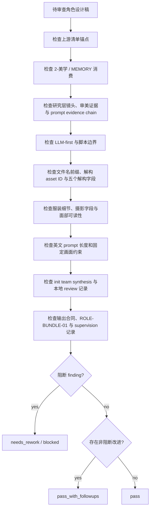

# Review Contract

本文件定义 `角色/2-设计` 的质量门禁、初始化综合消费、本地 review 汇流审查和验收输出。

## Default Reviewer Path

- 默认使用项目记忆初始化上下文消费 + 本地 reviewers。
- 初始化上下文消费按 `../../../_shared/team-advisor-consultation-contract.md` 执行：只读消费项目 `MEMORY.md` 中的 `project_memory_init_context`、团队配置与协作偏好、资料吸收摘要和阶段上下文读取指南，再进入设计稿汇流；不得在本阶段解析监制 roster、请教顾问、调用 team 身份或补造顾问问答。
- 默认 review 必须同时读取 `references/design-output-contract.md`、`references/design-slot-review-contract.md` 与 `references/workflow-supervision-contract.md`；`ROLE-BUNDLE-01` 必须被解析为非空 slot bundle 记录。
- 推荐 reviewer：`character-research-reviewer`、`visual-costume-reviewer`、`cinematography-reviewer`、`prompt-length-reviewer`。
- 若当前环境无外部 reviewer provider，主 agent 直接采用本地顺序 checklist；不得把本地 checklist 说成外部并行执行，也不得用本地 checklist 冒充 team 顾问问答。

## Review Dimensions

| dimension | checks |
| --- | --- |
| upstream_anchor | 角色名称、首次登场、原文描述复述是否来自 `角色清单.md` |
| variant_integrity | 多服装、战斗、战损、受伤、少年、老年等是否作为同一 base character 的变体处理；是否记录 `base_subject_id / variant_id / identity_invariants / variant_state_delta`；变体是否没有被写成新角色 |
| project_context | 是否读取并体现 `2-美学` 输出、项目 `MEMORY.md` 和 `project_memory_init_context` 的相关设计上下文 |
| research_layer | 研究是否转化为身份、职业、阶层、地域年代、服饰工艺、身体姿态、审美吸引力、禁区、不确定性和 prompt evidence chain |
| llm_first | 研究、物语、解构和提示词是否由 LLM 直接完成，脚本未替代主创 |
| required_sections | 是否包含研究考据、物语、解构、提示词设计 |
| decomposition | `## 4. 解构` 下方是否先写 `主体ID号：<asset_id>`；默认稿 `asset_id=base_subject_id`、变体稿 `asset_id=variant_id`；五个解构字段是否齐全且内容不互相串位 |
| output_naming | 默认稿文件名是否为 `<base_subject_id>-<角色名>.md`；变体稿是否为 `<base_subject_id>-V##-<角色名>-<变体名>.md`；文件名前缀与解构 asset ID、提示词设计主体 ID、英文 prompt 前缀一致 |
| costume | 服装是否含廓形、材质、色彩、配件、服装状态/维护状态或功能逻辑；磨损/做旧是否有依据 |
| physical_styling | 是否明确 `height_scale`、`body_build`、`hair_design`、`costume_color_palette`：身高档位/安全范围、身形结构、比例重心、发型长度/体量/轮廓/时代职业适配、服装主色/辅色/点缀色与明度/饱和度/冷暖/反差关系；是否说明这些选择如何服务角色身份、阶层、文化母体、肤色、脸部骨相、身形比例、气质和镜头构图 |
| face_readability | `Cinematography` 和英文 prompt 是否确保脸部骨相、眉眼、鼻梁、嘴部、肤色层次和表情意图清楚可读；是否只把阴影用于受控侧光、轮廓光或局部眼尾压暗，而不是用重阴影、遮眼阴影、半脸阴影或低调剪影吞掉面部特征 |
| aesthetic_appeal | 容貌、妆发、骨相、身形、服装廓形、材质和色彩是否具备来源匹配的审美吸引力；审美路线是否符合清单证据、年龄、性别/性别表达、身份、物种/族群、项目调性和角色权重；主角、核心情感线角色和长期复用角色是否具备 `lead_beauty_handsomeness_floor=required` 的帅哥/美女/主角级好看证据，并具备 `lead_presence_temperament_floor=required` 的整体气质、主角感、精神状态和镜头存在感证据；主角、核心情感线角色、长期复用角色、大反派、主要对抗者、长线威胁和终局 Boss 是否具备 `charisma_floor=high` 的可见镜头魅力证据；普通正反派和功能角色是否有个性化魅力或可识别度；真实人物灵感是否获允许并原创转译 |
| corpus_usage | 命中审美强化、妆容化、角色类型词库、服装时代语境或 prompt 审美短语时，是否加载 `knowledge-base/character-design-corpus.md`，并原创转译为当前角色，而非逐字套用或覆盖项目时代语境 |
| cinematography | 是否固定为纯色背景全身定妆照，而非剧情场景或环境肖像 |
| prompt | 英文、以 asset ID 号开头、融合 `画面基调.Global Style Prompt + 角色风格.Character Style Prompt`、不超过 1300 characters，且该前缀与解构 asset ID、提示词设计主体 ID 完全一致；默认稿前缀为 `base_subject_id`，变体稿前缀为 `variant_id`；整合对象是 `## 4. 解构` 全部有效信息，不是前后缀拼接；关键短语可回指 prompt evidence chain 与 `deconstruction_coverage` |
| design_output_contract | 是否逐条检查 `references/design-output-contract.md` 的结构硬规则、prompt 整合硬规则、字符数、自然语言负向约束和 `--no` 禁用 |
| slot_bundle_review | 是否按 `references/design-slot-review-contract.md` 解析 `ROLE-BUNDLE-01`，并对 `required_slots` 逐项给出证据位置或缺槽 finding |
| fixed_visual | 是否包含 full-body costume fitting photo、solid color background、no scene environment |
| project_memory_init_context | 是否按项目 `MEMORY.md` 形成 `project_memory_init_context`；采纳内容是否绑定当前思维·执行节点；是否禁止 team 身份调用、旧 stage profile 和伪顾问问答 |
| 本地 review | 本地 reviewer / checklist 记录是否完整；是否按 `references/workflow-supervision-contract.md` 留下 supervision 记录 |
| scope | 是否未修改父级、registry、上游清单或其他 worker 范围 |

## Review Gates

| gate_id | dimension | fail_code | blocking_when | rework_target | report_evidence |
| --- | --- | --- | --- | --- | --- |
| `GATE-CHAR-DESIGN-01` | upstream_anchor | `FAIL-NO-LIST` | 找不到 `角色清单.md`，或待设计主体无法回指 `名称 / 首次登场 / 原文描述（关键词式）` | `N3-CHARACTER-LIST` | `character_intake_table`、清单行号或缺失说明 |
| `GATE-CHAR-DESIGN-02` | scope | `FAIL-CHAR-DESIGN-UPSTREAM-SCOPE` | 设计阶段新增清单外主体、直接修改上游清单，或把同名冲突/漏项静默裁决为 canonical 设计稿 | `N1-INTAKE` / `N3-CHARACTER-LIST` | `execution_scope`、上游修复建议、未改动上游声明 |
| `GATE-CHAR-DESIGN-03` | project_context | `FAIL-NO-STYLE` | 未读取 `2-美学/类型风格.md`、`2-美学/画面基调/全局风格协议.md` 或当前集优先/项目级回退的 `2-美学/角色风格/角色风格协议.md`，虚构画面基调/角色风格，或未记录字段命名漂移、fallback 与缺失字段 | `N2-PROJECT-CONTEXT` | `project_design_context`、已消费字段清单、缺失字段说明 |
| `GATE-CHAR-DESIGN-04` | project_context | `FAIL-CHAR-DESIGN-ADVISOR-CONTEXT` | `project_memory_init_context` 相关设计种子未选择性消费，或把初始化综合写成人名堆砌/文风模仿 | `N2-PROJECT-CONTEXT` / `N6-INIT-SYNTHESIS-REVIEW` | 设计相关 project memory source、冲突裁决依据、被剔除无关内容说明 |
| `GATE-CHAR-DESIGN-05` | llm_first | `FAIL-SCRIPT-AUTHORSHIP` | 脚本生成研究、物语、解构、服装、摄影或英文 prompt 正文 | `N7-MERGE-DRAFT` | 脚本职责清单、LLM 汇流声明、正文生成来源说明 |
| `GATE-CHAR-DESIGN-06` | research_layer | `FAIL-RESEARCH-FLAT` | 研究层缺少任一必需 lens，或资料未转化为外观、服装、姿态、摄影和 prompt 决策 | `N5-RESEARCH-PROFILE` | `research_profile`、`design implication`、研究镜头与审美证据覆盖表 |
| `GATE-CHAR-DESIGN-07` | research_layer | `FAIL-UNCERTAINTY-HIDDEN` | 低证据推演、外部搜索线索或待确认信息被写成清单事实 | `N5-RESEARCH-PROFILE` | `Uncertainty Notes`、来源/置信度标注、待确认项 |
| `GATE-CHAR-DESIGN-08` | prompt | `FAIL-CHAR-DESIGN-PROMPT-EVIDENCE` | prompt 关键主体、服装、姿态、光线、风格或固定画面短语无法回指 `evidence -> design decision -> prompt phrase` | `N5-RESEARCH-PROFILE` / `N7-MERGE-DRAFT` | `Prompt Evidence Chain`、`deconstruction_coverage` |
| `GATE-CHAR-DESIGN-09` | research_layer | `FAIL-CHAR-DESIGN-WEB-EVIDENCE` | 未经许可或无必要地使用网络搜索，长段复制外部资料，或让外部资料覆盖清单、`2-美学`、项目记忆或用户禁区 | `N5-RESEARCH-PROFILE` | 搜索许可/必要性说明、来源摘要、使用边界 |
| `GATE-CHAR-DESIGN-10` | required_sections | `FAIL-CHAR-DESIGN-SECTIONS` | 设计稿缺少清单锚点、研究考据、物语、解构或提示词设计任一必填块 | `N7-MERGE-DRAFT` | 模板块覆盖检查、缺块 finding |
| `GATE-CHAR-DESIGN-11` | decomposition | `FAIL-CHAR-DESIGN-ID-CONSISTENCY` | `## 4. 解构` 下缺 `主体ID号`，或文件名、解构 asset ID、提示词主体 ID、英文 prompt 前缀不一致；变体稿未用 `variant_id` 作为 asset ID | `N7-MERGE-DRAFT` / `N9-WRITE-OUTPUT` | 四处 asset ID 对照表 |
| `GATE-CHAR-DESIGN-12` | prompt | `FAIL-PROMPT-SHALLOW-INTEGRATION` | 英文 prompt 未整合 `## 4. 解构` 全部有效信息，超过 1300 characters，包含中文解释/多版本堆叠或使用 `--no` | `N7-MERGE-DRAFT` | prompt 字符数、`deconstruction_coverage`、自然语言负向约束检查 |
| `GATE-CHAR-DESIGN-13` | fixed_visual | `FAIL-CHAR-DESIGN-FIXED-VISUAL` | 摄影字段或 prompt 把角色放进剧情场景、建筑、街景、室内陈设、自然环境、复杂背景、半身头像或环境肖像 | `N7-MERGE-DRAFT` | fixed visual phrase 检查、禁用环境元素清单 |
| `GATE-CHAR-DESIGN-14` | design_output_contract | `FAIL-CHAR-DESIGN-TEMPLATE-REGISTRY` | 未使用 canonical structured template，或脚本/组根模板替代 leaf LLM 正文创作 | `N7-MERGE-DRAFT` | 模板路径、渲染来源、脚本机械边界说明 |
| `GATE-CHAR-DESIGN-15` | slot_bundle_review | `FAIL-SLOT-BUNDLE-MISSING` | 未解析 `ROLE-BUNDLE-01`，`slot_bundles` 为空，或 required slots 没有证据位置/缺槽 finding | `N8-REVIEW-GATE` | `slot_bundle_review`、required slot evidence map、blocking findings |
| `GATE-CHAR-DESIGN-16` | 本地 review | `FAIL-CHAR-DESIGN-SUPERVISION-PACKET` | `workflow_supervision` 缺 subject、blocking layer、init synthesis source、本地 reviewer/checklist 或 merge decision | `N6-INIT-SYNTHESIS-REVIEW` | `workflow_supervision_record` 完整字段 |
| `GATE-CHAR-DESIGN-17` | project_memory_init_context | `FAIL-INIT-SYNTHESIS-SKIPPED` | 项目记忆初始化上下文存在但被静默跳过，或 `project_memory_init_context` / `init_synthesis_node_coverage` 未绑定当前 `node_id / pass_id / gate_id`，或误触发 team 身份 / 旧 stage profile / 伪顾问问答 | `N6-INIT-SYNTHESIS-REVIEW` | `init_synthesis_node_coverage`、缺失原因、本地 checklist 结果 |
| `GATE-CHAR-DESIGN-18` | 本地 review | `FAIL-CHAR-DESIGN-MERGE-DECISION` | reviewer / checklist / slot bundle findings 未被主 agent 汇流裁决，或保留互相竞争的并列稿 | `N8-REVIEW-GATE` / `N7-MERGE-DRAFT` | `merge_decision`、采纳/拒绝 patch 记录、最终单稿声明 |
| `GATE-CHAR-DESIGN-19` | aesthetic_appeal | `FAIL-CHAR-DESIGN-AESTHETIC-APPEAL` | 角色设计只做清单关键词还原，容貌/妆发/骨相/身形/服装缺少来源匹配审美完成度；主角、核心情感线角色或长期复用角色缺少 `lead_beauty_handsomeness_floor=required` 的帅哥/美女/主角级好看证据，或缺少 `lead_presence_temperament_floor=required` 的整体气质、主角感、精神状态、姿态能量和镜头存在感证据；主角、核心情感线角色、长期复用角色、大反派、主要对抗者、长线威胁或终局 Boss 缺少 `charisma_floor=high` 的镜头魅力、气质、压迫性、危险魅力、服装 signature 或脸部/眼神/姿态钩子；普通反派、配角或功能角色没有个性魅力或清晰可识别度；审美路线与年龄、性别/性别表达、身份或项目调性冲突；真实人物灵感被写成现实人物精确复刻、换脸或同款肖像 | `N7-MERGE-DRAFT` | `aesthetic_appeal_evidence`、`Source-Fit Aesthetic Target`、`Lead Beauty / Handsomeness Floor`、`Lead Presence / Temperament Floor`、`Charisma Floor`、`Face / Bone Aesthetic`、`Costume Appeal Strategy`、真实人物灵感许可与原创转译说明 |
| `GATE-CHAR-DESIGN-20` | corpus_usage | `FAIL-CHAR-DESIGN-CORPUS-MISSING` | 命中审美强化、妆容化、角色类型语料、服装时代语境或 prompt 审美短语，却未加载 `knowledge-base/character-design-corpus.md`；或逐字套用语料形成模板脸/模板服装；或服装风格化脱离项目时代、地域、阶层、职业母体 | `N5-RESEARCH-PROFILE` / `N7-MERGE-DRAFT` | `corpus_usage_trace`、语料触发原因、原创转译说明、服装时代语境校验 |
| `GATE-CHAR-DESIGN-21` | physical_styling | `FAIL-CHAR-DESIGN-PHYSICAL-STYLING` | 缺少身高档位/安全范围、身形结构、比例重心、发型长度/体量/轮廓/时代职业适配、服装主色/辅色/点缀色、明度/饱和度/冷暖/反差关系，或只写“高挑、修长、黑发、深色衣服、华丽配色”等泛词；低证据设计未标 `inferred` / `not_applicable` | `N5-RESEARCH-PROFILE` / `N7-MERGE-DRAFT` | `physical_styling_evidence`、`Height / Scale Signature`、`Hair Signature`、`Costume Color Signature`、`Detailed Character Design / Body`、`Detailed Character Design / Hair`、`Detailed Costume Design / Color Palette` |
| `GATE-CHAR-DESIGN-22` | face_readability | `FAIL-CHAR-DESIGN-FACE-READABILITY` | 摄影字段或英文 prompt 使用重面部阴影、遮眼阴影、半脸阴影、低调剪影、`shadowed face`、`deep facial shadow`、`low-key silhouette`、`dark face` 等作为主效果，导致眉眼、鼻梁、嘴部、骨相、肤色层次或表情意图不可读；或缺少补光/可读性说明 | `N5-RESEARCH-PROFILE` / `N7-MERGE-DRAFT` | `face_readability_lighting`、`Cinematography / Face Readability Lighting`、prompt 光线短语、`deconstruction_coverage` |
| `GATE-CHAR-DESIGN-23` | variant_integrity | `FAIL-CHAR-DESIGN-VARIANT-INVARIANT` | 多服装、战斗、战损、受伤、少年、老年、伪装或时间跳跃没有回指 `base_subject_id`；变体稿未使用 `variant_id` 作为 asset ID；缺少 `identity_invariants` 或 `variant_state_delta`；或变体失去可识别脸部骨相、眼神、身形比例、核心气质、signature 和身份压力，变成新角色 | `N3-CHARACTER-LIST` / `N5-RESEARCH-PROFILE` / `N7-MERGE-DRAFT` | `variant_profile`、`base/variant/asset ID map`、`identity_invariants`、`variant_state_delta`、prompt 前缀 |

## Verdict Model

| verdict | meaning |
| --- | --- |
| `pass` | 可作为角色细目设计稿交付 |
| `pass_with_followups` | 可交付，但存在非阻断改进项 |
| `needs_rework` | 字段、风格、prompt 或锚点存在阻断问题 |
| `blocked` | 缺少上游清单、项目初始化上下文或被上层策略阻断 |

## Finding Shape

```yaml
finding:
  severity: critical | high | medium | low
  dimension: upstream_anchor | variant_integrity | project_context | research_layer | llm_first | required_sections | decomposition | output_naming | costume | physical_styling | face_readability | aesthetic_appeal | corpus_usage | cinematography | prompt | design_output_contract | slot_bundle_review | fixed_visual | project_memory_init_context | local_review | scope
  symptom: ""
  direct_cause: ""
  source_contract: ""
  rework_target: ""
```

## Research Layer Gate

研究层需逐项通过以下审查：

| gate_id | blocking_when_missing | reviewer_question |
| --- | --- | --- |
| `RESEARCH-IDENTITY` | high | 身份和故事压力是否来自清单/项目上下文，并转化为外观或姿态？ |
| `RESEARCH-VARIANT-STATE` | high | 若存在多服装、战斗、战损、受伤、少年、老年等变体，是否写明 base_subject_id、variant_id、身份不变量和状态 delta，而不是新角色？ |
| `RESEARCH-OCCUPATION-CLASS` | high | 职业、阶层和资源痕迹是否转化为身体、面料、服装状态/维护状态、配饰或行动功能？磨损是否有依据？ |
| `RESEARCH-REGION-ERA` | medium/high | 地域年代是否明确，特定文化/制度信息是否避免误写？ |
| `RESEARCH-COSTUME-CRAFT` | high | 服装是否写到剪裁、面料、层次、闭合方式、工艺或服装状态/维护状态？使用痕迹是否只是条件子类？ |
| `RESEARCH-BODY-POSTURE` | high | 身高档位/安全范围、身形结构、比例重心和身体姿态是否可用于纯色背景全身定妆照，而非剧情场景动作？ |
| `RESEARCH-PHYSICAL-STYLING` | high | 身高、身形、发型和服装配色是否成为可见设计决策，并能说明与身份、阶层、文化母体、肤色、脸部骨相、身形比例、气质和镜头构图的关系？ |
| `RESEARCH-FACE-READABILITY` | high | 光线是否保留清晰眉眼、鼻梁、嘴部、骨相、肤色层次和表情意图；阴郁、危险或压迫感是否通过受控侧光、轮廓光、局部眼尾压暗、姿态和服装材质表达，而不是重阴影遮脸？ |
| `RESEARCH-AESTHETIC-APPEAL` | high | 容貌、妆发、骨相、身形和服装是否从“还原关键词”提升为来源匹配、有辨识度、有角色魅力的设计？主角是否明确 `lead_beauty_handsomeness_floor=required` 且帅/美证据可见，并明确 `lead_presence_temperament_floor=required` 且整体气质、主角感、精神状态和镜头存在感证据可见？主角/大反派是否明确 `charisma_floor=high` 且证据可见？真实人物灵感如有，是否已获允许并只作为原创转译参考？ |
| `RESEARCH-TABOO` | critical | 项目禁区、安全风险、文化误读和固定画面禁区是否已写入 guardrails？ |
| `RESEARCH-UNCERTAINTY` | high | 低证据推演是否标明置信度和待确认项？ |
| `RESEARCH-PROMPT-CHAIN` | high | prompt 中的关键短语是否能回指 `evidence -> design decision -> prompt phrase`？ |

## Review Flow Map



## Gate Rule

不得宣布完成：

- 任一设计稿缺少模板必填块。
- 英文提示词超过 1300 characters。
- 英文提示词没有以 asset ID 号开头；默认稿应以 `base_subject_id` 开头，变体稿应以 `variant_id` 开头。
- 英文提示词只拼接 asset ID、风格、服装或负向词等前缀后缀，未整合 `## 4. 解构` 的全部有效身份、外观、服装、姿态和摄影信息。
- 英文提示词使用 Midjourney `--no` 参数，而不是自然语言负向约束。
- `## 4. 解构` 下方缺少 `主体ID号：<asset_id>`，或该 ID 与 `## 5. 提示词设计` 主体 ID / 英文 prompt 前缀不一致；变体稿未用 `variant_id`。
- 输出文件名缺少 asset ID 前缀，或文件名前缀与 `## 4. 解构` asset ID、`## 5. 提示词设计` 主体 ID、英文 prompt 前缀不一致。
- 摄影字段或英文提示词把角色放进具体场景、建筑空间、街景、室内陈设或复杂环境。
- 缺少全身定妆照、纯色背景或 no scene environment 约束。
- 摄影字段或英文提示词用重阴影、遮眼阴影、半脸阴影、低调剪影或暗脸效果遮住五官，导致角色脸部骨相、眉眼、鼻梁、嘴部、肤色层次或表情意图不可读。
- 角色容貌、妆发、骨相、身形或服装只做手术式关键词还原，缺少来源匹配审美路线、个性魅力和服装审美完成度。
- 缺少身高档位/安全范围、身形结构、比例重心、发型长度/体量/轮廓/时代职业适配或服装主色/辅色/点缀色与明度/饱和度/冷暖/反差关系，或只写泛词而无法指导画师/图像模型执行。
- 主角、核心情感线角色或长期复用角色没有 `lead_beauty_handsomeness_floor=required` 的帅哥/美女/主角级好看证据。
- 主角、核心情感线角色或长期复用角色没有 `lead_presence_temperament_floor=required` 的整体气质、主角感、精神状态、姿态能量和镜头存在感证据。
- 主角、核心情感线角色、长期复用角色、大反派、主要对抗者、长线威胁或终局 Boss 没有 `charisma_floor=high` 的可见镜头魅力证据；普通反派、配角或功能角色没有鲜明魅力或可识别度。
- 把非主角女性角色默认写美、非主角男性角色默认写帅，或把未成年人、老人、非人类、群像、功能角色强行成人化、性化、美化或帅化。
- 真实人物灵感被写成精确复刻、换脸、同款肖像或可识别现实本人，而不是在获允许后原创转译。
- 命中审美强化、妆容化、角色类型语料、服装时代语境或 prompt 审美短语时，缺少 `knowledge-base/character-design-corpus.md` 的加载和原创转译证据。
- 服装风格化脱离项目时代、地域、阶层或职业母体，例如把现代高定、潮牌、战术服、哥特或奇幻盔甲硬套进不匹配语境。
- 研究层缺少身份、职业、阶层、地域年代、服饰工艺、身体姿态、审美吸引力、禁区、不确定性或 prompt evidence chain 任一关键镜头。
- 研究内容无法说明如何转化为角色外观、服装、姿态、摄影或 prompt。
- prompt 关键短语无法回指研究证据、项目风格、`deconstruction_coverage` 或固定画面合同。
- 未逐条消费 `references/design-output-contract.md`，或输出结构/prompt 整合硬规则只停留在旁路文档。
- 未解析 `ROLE-BUNDLE-01`，或 required slot 缺少证据位置且未形成 blocking finding。
- `references/workflow-supervision-contract.md` 要求的 provider/local checklist/merge 记录为空。
- 项目记忆初始化上下文存在时，缺少 `project_memory_init_context`，或采纳内容没有绑定当前 `node_id / pass_id / gate_id`，或误触发 team 身份、旧 stage profile、伪顾问问答。
- 未消费 `2-美学` 输出与项目 `MEMORY.md` 却声称项目风格对齐。
- 脚本生成了创作正文。
- 初始化综合存在却被跳过。
- 任务改动越过 `.agents/skills/aigc/3-主体/角色/2-设计/**` 或项目输出路径。
