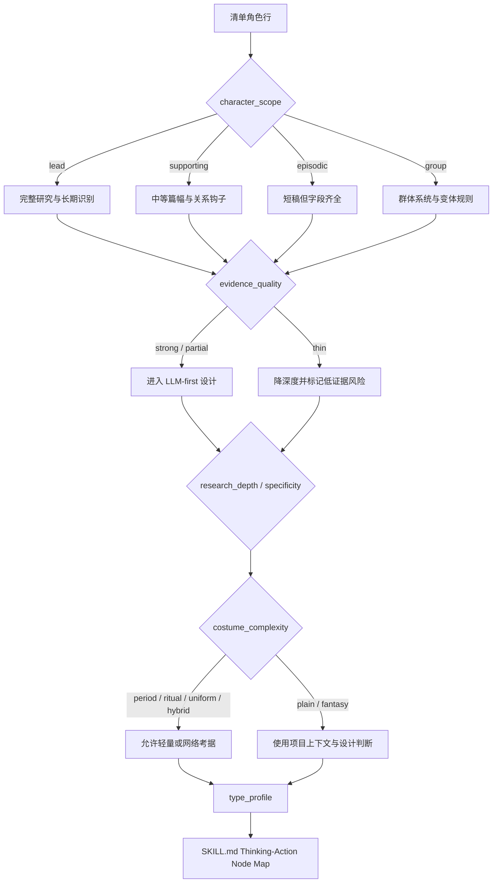

# Character Design Type Map

## 类型包加载边界

- 每次调用本技能时，必须依据本文件识别并加载同目录 `types/` 中选中的类型包（单选或多选）。
- `types/` 中命中的类型包作为固定上下文加载；`knowledge-base/` 只作为按需检索、切片或向量召回的知识库，不替代类型包。

本文件定义 `角色/2-设计` 的类型变量和分型策略。它不替代 `SKILL.md` 的执行流程；历史 workflow 展开仅保存在 `references/legacy-character-design-workflow.md`。

## Type Variables

| variable | values | use |
| --- | --- | --- |
| `character_scope` | `lead` / `supporting` / `episodic` / `group` | 决定研究、物语和细节密度 |
| `variant_design_mode` | `default_base` / `single_variant` / `multi_variant_batch` | 决定使用 base_subject_id 还是 variant_id 作为 asset ID，并决定是否生成多份变体稿 |
| `variant_type` | `default` / `costume_variant` / `combat_state` / `battle_damage_state` / `injury_state` / `age_stage` / `disguise_state` / `time_jump_state` | 决定当前稿是默认态、多服装、战斗、战损、受伤、年龄阶段、伪装或时间跳跃变体 |
| `identity_invariant_policy` | `strict_same_identity` / `age_adjusted_identity` / `disguise_preserve_core` / `nonhuman_consistent_signature` | 决定跨变体必须保留哪些脸部骨相、眼神、身形比例、核心气质、服装 signature 或身份压力 |
| `state_delta_scope` | `costume_only` / `combat_condition` / `damage_injury` / `age_proportion` / `disguise_surface` / `time_jump_full` | 决定变体允许改变的范围；不得改变 base character 身份 |
| `evidence_quality` | `strong` / `partial` / `thin` | 决定是否需要风险提示或上游修复建议 |
| `research_need` | `none` / `light` / `web_allowed` | 决定是否允许网络搜索 |
| `research_depth` | `anchor_only` / `profile` / `craft_deep` / `cross_checked` | 决定研究层从清单锚点到工艺考据的深度 |
| `uncertainty_level` | `low` / `medium` / `high` | 决定是否必须写待确认项、风险提示或上游修复建议 |
| `costume_complexity` | `plain` / `period` / `ritual` / `uniform` / `fantasy` / `hybrid` | 决定服装字段重点 |
| `aesthetic_priority` | `lead_heightened` / `supporting_distinctive` / `villain_charismatic` / `functional_readable` / `group_varied` | 决定来源匹配审美路线、容貌、妆发、身形、服装吸引力和个性魅力的强化强度 |
| `physical_scale_resolution` | `exact_if_known` / `range_or_scale` / `inferred_safe` / `nonhuman_ratio` | 决定身高使用具体数值、范围、档位还是非人类比例；不得缺身高/尺度判断 |
| `hair_design_specificity` | `period_bound` / `occupation_bound` / `character_signature` / `low_evidence_generic` | 决定发型如何绑定时代、职业、阶层、角色 signature 或低证据保守方案 |
| `costume_color_strategy` | `identity_symbolic` / `class_coded` / `period_palette` / `contrast_to_face` / `group_differentiation` | 决定主色、辅色、点缀色、明度/饱和度/冷暖/反差和文化/身份含义 |
| `face_readability_policy` | `clear_front_fill` / `controlled_side_light` / `rim_with_fill` / `low_key_but_readable` | 决定光线如何保留清晰眉眼、鼻梁、嘴部、骨相、肤色层次和表情意图；不得用重阴影遮脸 |
| `lead_beauty_handsomeness_floor` | `required` / `not_applicable` | 决定主角、核心情感线角色和长期复用角色是否必须具备来源匹配的帅哥/美女/主角级好看吸引力；非主角为 `not_applicable` |
| `lead_presence_temperament_floor` | `required` / `not_applicable` | 决定主角、核心情感线角色和长期复用角色是否必须具备整体气质、主角感、精神状态、姿态能量和镜头存在感；非主角为 `not_applicable` |
| `charisma_floor` | `high_lead` / `high_major_antagonist` / `standard_distinctive` / `readable` | 决定角色是否必须具备高镜头魅力证据；主角和大反派不得只满足“可识别” |
| `celebrity_inspiration_policy` | `generic_only` / `allowed_originalized` / `blocked` | 默认 `generic_only`；决定是否可用明星/演员/模特作为脸型、骨相、眼神、妆发或镜头魅力灵感；任何路线都不得精确复刻现实人物 |
| `cultural_specificity` | `generic` / `regional` / `historical` / `ethnic_or_religious` / `institutional` | 决定地域年代、礼制、职业制服和禁区审查强度 |
| `body_posture_risk` | `low` / `medium` / `high` | 决定姿态是否需要避免性化、伤病误写、刻板化或场景动作 |
| `cinematic_role` | `heroic` / `intimate` / `threat` / `comic` / `background_anchor` / `mystery` | 决定摄影字段语言 |

## Strategy Matrix

| type_profile | route | design emphasis | review risk |
| --- | --- | --- | --- |
| `lead + strong` | 完整研究、物语、视觉服装、摄影，`aesthetic_priority=lead_heightened`，`lead_beauty_handsomeness_floor=required`，`lead_presence_temperament_floor=required`，`charisma_floor=high_lead` | 角色矛盾、长期视觉识别、跨场景一致性、最高级别镜头完成度和服装系统；审美路线必须来源匹配，帅/美主角级吸引力、整体气质、魅力证据和面部可读性都必须可见 | 避免过度百科化，避免把主角帅/美写成模板脸、网红脸、性化脸或脱离年龄/身份的硬套；避免只有外貌没有主角感；避免暗脸导致主角脸部魅力不可读 |
| `supporting + strong/partial` | 中等篇幅设计，`aesthetic_priority=supporting_distinctive` | 与主线关系、单一强视觉钩子、服装功能、好看但不抢主角层级 | 避免主角化，避免平庸功能脸 |
| `episodic + partial/thin` | 短稿但字段齐全，`aesthetic_priority=functional_readable` | 首次登场辨识度、动作功能、镜头记忆点、干净可执行的面部/服装魅力 | 避免凭空补复杂背景，避免只靠职业标签区分 |
| `group` | 群像主体设计，`aesthetic_priority=group_varied` | 群体轮廓、统一服装系统、个体差异规则、群像中可辨认的美感变化 | 避免假装每个个体都有姓名，避免全员同脸同服装 |
| `villain / antagonist` | 按角色权重选择完整或中等篇幅，`aesthetic_priority=villain_charismatic`；大反派/主要对抗者使用 `charisma_floor=high_major_antagonist` | 危险、锋利、阴郁、病态或怪诞魅力；大反派必须有压迫性镜头魅力，普通反派至少有清晰辨识度；阴影只作局部气质修饰，脸部特征仍需清楚 | 避免把反派写丑、脏、乱作为唯一视觉逻辑；避免把大反派降格为“可识别即可”；避免用重阴影遮脸替代危险魅力 |
| `period/ritual/uniform` costume | 允许轻量或网络考据 | 廓形、材质、礼制、服装状态/维护状态和职业功能 | 避免历史/文化误写；避免无依据磨损做旧 |
| `thin evidence` | 先降深度 | 明确哪些来自清单，哪些是设计推演 | 必须标记低证据风险 |
| `regional/historical/institutional` specificity | 研究层升级为 `craft_deep` 或 `cross_checked` | 地域年代、制度身份、职业服制、禁区和不确定性 | 避免把现代泛化审美套进特定文化 |
| `high uncertainty + high specificity` | 降低断言强度，必要时请求确认 | 写清清单事实、推演和待确认项 | 不得把低证据考据写成事实 |
| `single_variant / multi_variant_batch` | 同一 base character 下逐变体成稿，`identity_invariant_policy` 必填 | 先写身份不变量，再写状态 delta；文件名前缀和 prompt 前缀使用 `variant_id` | 避免变体变成新角色、默认战损/受伤、年龄阶段成人化/性化或服装套系互相污染 |

## Routing Map

## Web Search Routing

| condition | allowed_action | required_record |
| --- | --- | --- |
| 冷门服饰、职业或地域 | 搜索 1 到 3 个可信来源 | 来源名称、链接或摘要、使用边界 |
| 真实历史人物或事件影射 | 搜索并交叉核对 | 不把单一来源写成事实 |
| 普通现代日常角色 | 默认不搜索 | 直接用项目上下文设计 |

## Research Depth Rules

| profile signal | research_depth | required output |
| --- | --- | --- |
| 配角、普通现代、证据强、服装简单 | `profile` | 完成研究镜头与审美吸引力证据，但每镜头可短写；必须有 prompt evidence chain |
| 主角、阶层压力强、职业身份强 | `profile` 或 `craft_deep` | 职业、阶层、身体姿态和服装工艺必须转化为可见设计 |
| 年代、地域、制服、礼仪、宗教、民族或真实制度相关 | `craft_deep` 或 `cross_checked` | 地域年代、工艺、禁区和不确定性必须详写；必要时允许搜索 |
| 清单证据薄但用户要求输出 | `anchor_only` | 只做低断言推演，明确待确认项；不得虚构复杂背景 |

## Aesthetic Priority Rules

| profile signal | aesthetic_priority / lead_beauty_handsomeness_floor / lead_presence_temperament_floor / charisma_floor | required output |
| --- | --- | --- |
| 主角、核心情感线、长期复用角色 | `lead_heightened` + `lead_beauty_handsomeness_floor=required` + `lead_presence_temperament_floor=required` + `charisma_floor=high_lead` | `Source-Fit Aesthetic Target`、`Lead Beauty / Handsomeness Floor`、`Lead Presence / Temperament Floor` 与 `Charisma Floor` 必须明确来源匹配的高吸引力目标；脸型、骨相、五官、眼神、妆发、身形、姿态和服装完成度都要可见，且必须体现帅哥/美女/主角级好看与整体气质、主角感、精神状态和镜头存在感 |
| 重要配角、关系轴角色 | `supporting_distinctive` | 至少一个强面部/妆发钩子和一个服装钩子；好看但不压过主角 |
| 大反派、主要对抗者、长线威胁、终局 Boss | `villain_charismatic` + `charisma_floor=high_major_antagonist` | 必须有压迫性镜头魅力或危险吸引力，证据落在脸部骨相、眼神、姿态、妆发、服装 signature、材质秩序或权力气场；不得只写丑、脏、乱、恐怖或“可识别” |
| 普通反派、对立角色、危险人物 | `villain_charismatic` + `charisma_floor=standard_distinctive` | 允许锋利、阴郁、危险、病态或怪诞魅力；不得把反派简化为丑化或脏乱 |
| 功能角色、短登场角色 | `functional_readable` | 短写但要有清楚脸部辨识点、身形轮廓和服装吸引力 |
| 群像主体 | `group_varied` | 群体美感统一，个体通过脸部、发型、廓形或色彩做差异，不同成员避免同脸同服装 |

## Variant Design Rules

| variant_type | identity_invariant_policy | allowed_delta | required_output |
| --- | --- | --- | --- |
| `costume_variant` | `strict_same_identity` | 服装套系、廓形、材质、配色、配饰、必要妆发配套 | `Base Subject ID`、`Variant ID`、`Identity Invariants`、`Variant State Delta`、服装配色与文化/功能差异 |
| `combat_state` | `strict_same_identity` | 战斗准备、装备佩戴、姿态张力、服装维护状态；不默认破损 | 战斗态姿态、行动功能和可读面部光线 |
| `battle_damage_state` | `strict_same_identity` | 有依据的破损、污渍、血迹、烧灼、断裂、疲惫姿态 | 战损范围、位置、程度和不遮脸原则；不得把战损变成默认服装风格 |
| `injury_state` | `strict_same_identity` | 伤口、包扎、行动受限、疼痛姿态、医疗/恢复状态 | 伤势证据、安全边界、面部仍可读；避免无证据医学化 |
| `age_stage` | `age_adjusted_identity` | 少年/青年/成年/老年比例、肤质、发型、姿态、服装年龄适配 | 年龄安全吸引力、同一角色骨相/眼神延续、禁止成人化/性化未成年人 |
| `disguise_state` | `disguise_preserve_core` | 表层服装、发型、妆容和身份伪装 | 保留至少一个核心识别点；说明哪些特征被遮蔽，哪些必须保留 |
| `time_jump_state` | `age_adjusted_identity` | 年龄、阶层、资源、服装系统、姿态和精神状态的长期变化 | 说明从 base 到未来/过去状态的连续性，而不是新人物 |

## Celebrity Inspiration Rules

| policy | allowed_action | prohibited_action |
| --- | --- | --- |
| `generic_only` | 默认路线；使用“明星级镜头脸 / editorial model face / cinematic leading-face quality”等泛化描述 | 写入真实人物姓名或高度可识别特征组合 |
| `allowed_originalized` | 仅在用户/项目明确允许且有必要时，使用 1 到 2 个明星、演员或模特作为脸型、骨相、眼神、妆发、镜头魅力灵感，并转译为原创组合 | 精确复刻、换脸、同款肖像、让角色被识别为现实本人 |
| `blocked` | 不使用真实人物参考，只写原创审美策略 | 任何真实人物姓名、肖像模拟或现实身份暗示 |

## Prompt Evidence Chain Rules

- 英文 prompt 中的身份、服装、姿态、光线、风格与固定画面短语，都应能回指到 `research_profile` 或项目上下文。
- 变体 prompt 必须以 `variant_id` 开头，并可回指 `base_subject_id`、`identity_invariants` 和 `variant_state_delta`；默认稿才使用 `base_subject_id` 开头。
- 英文 prompt 中的来源匹配审美路线、脸部骨相、眼神、妆发、身形、服装吸引力短语，都应能回指到 `Aesthetic Appeal Evidence`、`Visual Drivers` 或项目上下文。
- 英文 prompt 中的阴影、侧光、轮廓光、低调反差和补光短语，都应能回指到 `face_readability_lighting`；不得出现导致脸部不可读的暗脸、半脸阴影或低调剪影主效果。
- 如果使用真实人物灵感，英文 prompt 应写原创化审美短语，不应写成精确复刻某现实人物。
- 不允许出现研究层没有支持的特定文化符号、真实制服、宗教标识、医学特征或阶层标签。
- `full-body costume fitting photo`、`solid color background`、`no scene environment` 是固定证据，来自本技能合同，不需要外部来源。

## Depth Rules

- 所有类型都必须保留模板必填字段。
- 低证据角色可以短，但不能缺字段。
- 主角与高复杂服装角色必须在 `Detailed Costume Design` 中写到材质、层次、配件和服装状态/维护状态；使用痕迹只在有依据时写入。
- 多服装、多状态和年龄阶段必须先写 `identity_invariants`，再写 `state_delta_scope`；每个变体可以短，但不能缺 base/variant/asset ID。
- 所有角色必须写 `physical_scale_resolution`、`hair_design_specificity` 和 `costume_color_strategy` 的实际落点：身高档位/安全范围、身形结构、发型轮廓与时代职业适配、服装主色/辅色/点缀色和配色逻辑都不能省略；证据薄时使用 `inferred_safe` 或 `low_evidence_generic`，但仍需可执行。
- 所有角色必须写 `face_readability_policy` 的实际落点：可以是正面柔补光、受控侧光、带补光的轮廓光或低调但可读，但都必须保留眉眼、鼻梁、嘴部、骨相、肤色层次和表情意图。
- 主角必须在审美层明确更高的镜头完成度、服装系统、来源匹配的帅/美主角级吸引力，以及整体气质、主角感、精神状态、姿态能量和镜头存在感；大反派/主要对抗者必须明确压迫性镜头魅力、危险吸引力或权力气场；两者都不得只写“可识别”。主角帅/美和气质必须年龄安全、身份匹配，不得变成模板脸、成人化、性化或空泛“有气质”。
- 所有正派、反派、配角和功能角色都必须至少有一个可见的面部/妆发/身形魅力点和一个服装吸引力点。
- 群像角色的提示词应强调群体系统和可重复变体，不虚构具体姓名。
- 任何类型都必须输出研究层八个镜头；差异只在深度，不在字段是否存在。
