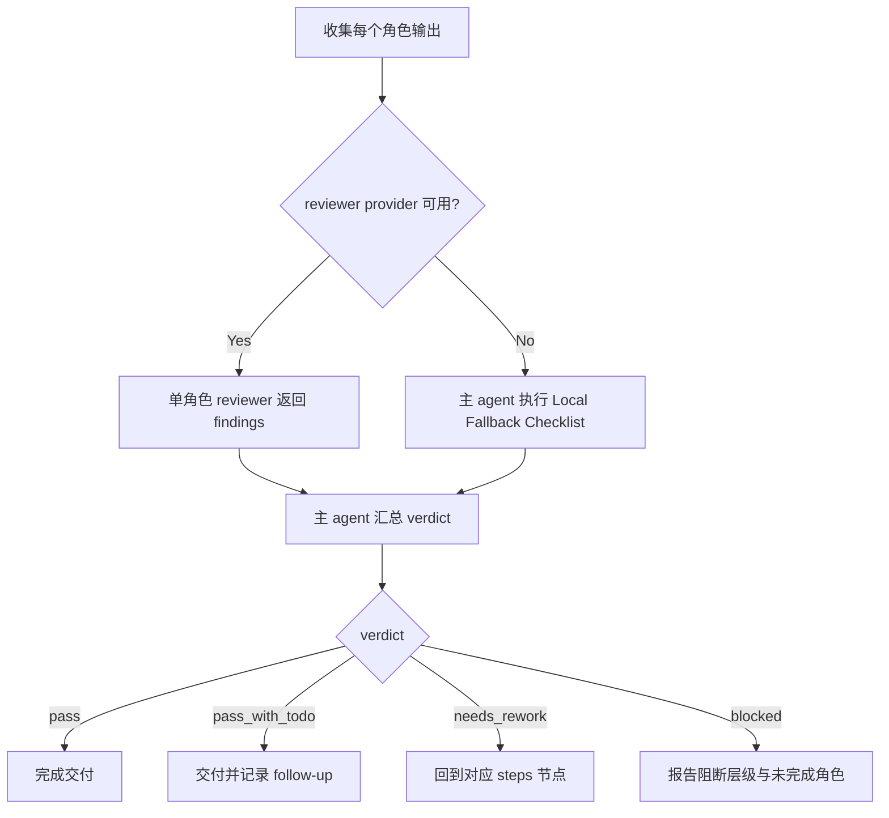

# Review Contract

本文件定义 `角色/3-生成` 的质量门禁、审查口径和 verdict 结构。

## Review Scope

检查对象：

- 主图图片与主图 JSON。
- 多视图已取消；历史 `-多视图` 文件不纳入必检对象。
- 上游设计文档回链。
- libTV 画布 UUID、节点名、Midjourney V8.1 modelKey、Midjourney 后缀、既有主体图复用/上传、状态变体 `Lib Image` 证据、画布节点下载回项目目录证据与项目持久化证据。

不检查对象：

- 不重新评判角色设计是否“够好”；该职责属于 `角色/2-设计`。
- 不审查场景、道具、视频或分镜产物。

## Review Gates

| review_gate | requirement | fail code | rework target |
| --- | --- | --- | --- |
| `GATE-CHAR-GEN-01` | 每个目标主体都有可读取的上游 `2-设计` 文档、`4. 解构` 和可追溯 `subject_id` | `FAIL-SOURCE-LINK` | `N2-DESIGN` |
| `GATE-CHAR-GEN-02` | 主图 prompt 来自源设计文档 `4. 解构`，未新增主体设定，未回退引用旧英文整合 prompt | `FAIL-PROMPT-DRIFT` | `N3-MAIN-JSON` |
| `GATE-CHAR-GEN-03` | 真实生成模式下主图图片存在于 canonical 输出目录，并可作为 continuity anchor | `FAIL-MAIN-IMAGE` | `N4-MAIN-IMAGE` |
| `GATE-CHAR-GEN-04` | 多视图未被创建、补齐、下载或验收；历史 `-多视图` 缺失不计失败 | `FAIL-REFERENCE` | `Multiview Cancellation Contract` |
| `GATE-CHAR-GEN-05` | 真实生成模式下主图图片存在于 canonical 输出目录；多视图图片不再必填 | `FAIL-MULTIVIEW-IMAGE` | `N4-MAIN-IMAGE` |
| `GATE-CHAR-GEN-06` | 图片与 JSON 命名符合 `<主体ID>-<主体名称>-主图`，且 subject ID 一致 | `FAIL-NAMING` | `N7-REVIEW` |
| `GATE-CHAR-GEN-07` | prompt-only 模式没有伪造图片路径，阻断原因清楚 | `FAIL-PROMPT-ONLY-CLAIM` | `N7-REVIEW` |
| `GATE-CHAR-GEN-08` | 本阶段未修改上游设计稿、父级 registry、场景/道具/视频/分镜目录或其他 worker 范围 | `FAIL-WRITE-BOUNDARY` | `N7-REVIEW` |
| `GATE-CHAR-GEN-09` | 多视图 reference gate 已取消；不得把 reference 缺失作为失败 | `FAIL-REFERENCE-CONTEXT` | `Multiview Cancellation Contract` |
| `GATE-CHAR-GEN-10` | 未获用户显式授权时只使用 `.agents/skills/cli/libTV` 画布 `image` 节点，并遵守画布 UUID、Midjourney V8.1 modelKey、`--ar 9:16 --hd --style raw` 后缀和项目持久化规则 | `FAIL-EXECUTOR-DRIFT` | `N1-INTAKE` |
| `GATE-CHAR-GEN-11` | 脚本只做复制、校验或汇总，不生成、改写、批量插入、正则套句或映射投影 `prompt_text` 创作正文 | `FAIL-SCRIPT-AUTHORSHIP` | `N3-MAIN-JSON` |
| `GATE-CHAR-GEN-12` | 已扫描 `projects/aigc/<项目名>/3-主体`；同主体同状态已有图时跳过生成，并复用或上传同名画布节点 | `FAIL-ASSET-REUSE` | `N9-RECONCILE` |
| `GATE-CHAR-GEN-13` | 同主体新状态使用 `Lib Image`、既有参考图和状态后缀命名，未用 Midjourney V8.1 重生变体 | `FAIL-STATE-VARIANT` | `N9-RECONCILE` / `N4-MAIN-IMAGE` |
| `GATE-CHAR-GEN-14` | 角色主图已确保存在于 `projects/aigc/<项目名>/3-主体/角色/3-生成/`；本地 canonical 已有时可跳过下载并记录 `already_present`，本地缺失时需下载或复制补齐 | `FAIL-CHAR-GEN-LOCAL-SYNC` | `N4-MAIN-IMAGE` |

## Checklist

| check_id | requirement | fail code |
| --- | --- | --- |
| `REV-CHAR-GEN-01` | 每个 JSON 都有 `subject_id`、`source_design_path`，且源文件存在 | `FAIL-SOURCE-LINK` |
| `REV-CHAR-GEN-02` | 主图 prompt 来自源设计文档 `4. 解构`，未重写主体设定，未回退引用旧英文整合 prompt | `FAIL-PROMPT-DRIFT` |
| `REV-CHAR-GEN-03` | 真实生成模式下 `<主体ID>-<主体名称>-主图.<ext>` 存在于输出目录 | `FAIL-MAIN-IMAGE` |
| `REV-CHAR-GEN-04` | 多视图未被创建、补齐、下载或验收 | `FAIL-REFERENCE` |
| `REV-CHAR-GEN-05` | 真实生成模式下 `<主体ID>-<主体名称>-主图.<ext>` 存在于输出目录；多视图不再必填 | `FAIL-MULTIVIEW-IMAGE` |
| `REV-CHAR-GEN-06` | 图片与 JSON 命名符合 `<主体ID>-<主体名称>-主图`，且 `<主体ID>` 与 JSON 的 `subject_id` 一致 | `FAIL-NAMING` |
| `REV-CHAR-GEN-07` | prompt-only 模式没有伪造图片路径，阻断原因清楚 | `FAIL-PROMPT-ONLY-CLAIM` |
| `REV-CHAR-GEN-08` | 未修改上游 `2-设计` 文档或其他技能目录 | `FAIL-WRITE-BOUNDARY` |
| `REV-CHAR-GEN-09` | 多视图 reference gate 已取消；reference 缺失不构成失败 | `FAIL-REFERENCE-CONTEXT` |
| `REV-CHAR-GEN-10` | 生成前已完成既有主体图扫描；同主体同状态未重复生成；当前画布缺同名节点且只有本地图时已上传到当前画布同名节点 | `FAIL-ASSET-REUSE` |
| `REV-CHAR-GEN-11` | 状态变体记录 `generation_model_policy: lib_image_state_variant`、`variant_model_key`、`state_variant_suffix` 和 `base_reference_node_name` | `FAIL-STATE-VARIANT` |
| `REV-CHAR-GEN-12` | 生成、复用或上传后项目 `角色/3-生成` 目录已有同 stem 本地资产，且 JSON / 报告记录 `local_asset_path`、`local_sync_action` 与 `local_sync_status`；只有下载分支才要求 `download_command` | `FAIL-CHAR-GEN-LOCAL-SYNC` |

## Verdict Schema

```yaml
subject_name: ""
subject_id: ""
mode: "real_generation | prompt_only | review_only"
verdict: "pass | pass_with_todo | blocked | needs_rework"
source_design_path: ""
main_image_path: ""
main_prompt_json_path: ""
multiview_image_path: "disabled"
multiview_prompt_json_path: "disabled"
reference_image_path: ""
reference_node_name: ""
libtv_canvas_uuid: ""
libtv_node_name: ""
asset_reuse_decision: "generate_new_subject | reuse_existing_asset | upload_existing_asset | generate_state_variant"
generation_skipped: false
canvas_action: "create_new_node | node_already_present | uploaded_existing_image_to_canvas"
local_sync_required: true
local_sync_action: "confirm_local_canonical_present | download_generated_canvas_node | download_existing_canvas_node | copy_existing_local_to_canonical | prompt_only_pending"
local_sync_status: "already_present | synced | copied | pending | failed"
local_asset_path: ""
download_command: ""
download_stdout_path: ""
model_display_name: "Midjourney V8.1"
model_key: ""
generation_model_policy: "new_subject_midjourney_default | lib_image_state_variant"
variant_model_display_name: "Lib Image"
variant_model_key: ""
state_variant_label: ""
state_variant_suffix: ""
base_reference_node_name: ""
base_reference_asset_path: ""
midjourney_suffix: "--ar 9:16 --hd --style raw"
reference_context_status: "disabled_multiview | no_reference_image"
libtv_canvas_mode: ""
findings: []
notes: ""
```

## Provider Guidance

- 默认由执行 agent 做本地 gate 审查。
- 仓库层默认使用本地 reviewer checklist 返回 findings；最终 verdict 仍由主 agent 汇总，reviewer 不拥有业务主真源改写权。
- 若不使用外部 reviewer provider，按 `SKILL.md` 的顾问与复核流程口径直接执行本地 review checklist。

## Local Fallback Checklist

当外部 reviewer provider 不可用时，主 agent 必须至少完成以下本地复核：

1. 核对每个 JSON 的 `subject_id` 与 `source_design_path` 指向存在的 `2-设计` 文档，且文件名 stem 以同一主体 ID 开头。
2. 核对主图 prompt 与设计文档 `4. 解构` 有明确回链，没有新增身份、服装、时代或叙事事实，也没有把 `提示词设计` 的英文整合 prompt 当作主源。
3. 核对多视图未被创建、补齐、下载或验收；历史多视图缺失不构成失败。
4. 核对真实生成模式下主图文件存在，并位于 `projects/aigc/<项目名>/3-主体/角色/3-生成/`。
5. 核对真实生成、复用或上传后项目 `角色/3-生成` 目录已有同 stem 本地资产；若本地 canonical 已有，记录 `already_present` 且不要求下载命令；若本地缺失，则必须执行 `libtv download -p <canvas_uuid> -n <node> -o projects/aigc/<项目名>/3-主体/角色/3-生成/` 或复制补齐，并记录 `local_sync_status`。
6. 核对 prompt-only 模式没有伪造图片路径，且 `blocked_reason` 可解释。
7. 核对 `asset_reuse_decision`：同主体同状态未重复生成；当前画布缺同名节点时，本地已有图才上传到当前画布；状态变体使用 `Lib Image` 和既有参考节点。
8. 核对本轮没有修改上游 `2-设计`、父级 registry、场景/道具目录或其他 worker 范围。

## Review Flow Map


