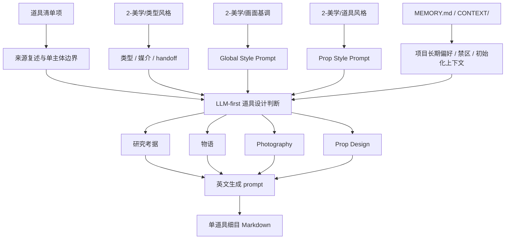
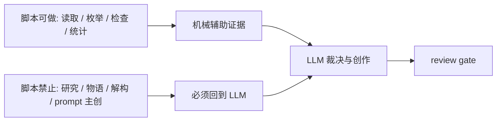

# Prop Design Contract

本文件定义 `道具/2-设计` 的业务细则。根 `SKILL.md` 拥有入口、路由和输出合同；本文件只展开单道具细目设计规则。

## Upstream Contract

必须消费：

- `projects/aigc/<项目名>/3-主体/道具/1-清单/道具清单.md`
- `projects/aigc/<项目名>/2-美学/类型风格.md`
- `projects/aigc/<项目名>/2-美学/画面基调/全局风格协议.md`
- 当前集优先的 `projects/aigc/<项目名>/2-美学/第N集/道具风格/道具风格协议.md`；缺失时回退 `projects/aigc/<项目名>/2-美学/道具风格/道具风格协议.md`
- `projects/aigc/<项目名>/MEMORY.md`

可按需消费：

- `projects/aigc/<项目名>/CONTEXT/`
- 上游首次登场对应的分组稿或分镜稿，仅用于回查原文证据，不用于新增清单外道具。

## LLM-First Creative Authorship

- 研究考据、物语、解构、道具风格和英文 prompt 必须由 LLM 直接创作与裁决。
- 脚本不得通过模板拼接、启发式补句、字段扩写或规则生成来冒充道具设计正文。
- 脚本可以读取清单、枚举项目路径、检查 Markdown 标题、统计 prompt 字符数、生成空目录或报告缺字段。

## Required Design Sections

每个单道具 Markdown 文件必须包含以下章节：

| section | required content |
| --- | --- |
| `名称 / 首次登场 / 原文描述复述` | 清单项名称、首次登场、对上游原文描述的短复述；不得改写成新事实 |
| `研究考据` | 与道具形制、材质、工艺、设计细节、文化元素、年代、文化来源或功能逻辑有关的考据；必须附研究证据链，冷门信息可网络搜索 |
| `物语` | 道具在故事中的压力、象征、拥有者痕迹、使用历史或情绪功能 |
| `解构` | `## 4. 解构` 标题下方必须先写 `主体ID号：<主体ID>`，再至少包含 `Photography` 和 `Prop Design` 两个字段；`Prop Design` 必须写明 `Design Appeal Target`、`Signature Detail`、`Cultural Element Strategy`、`Craft / Ornament Detail` 与 `Period Context Guardrail` |
| `Prop Corpus Usage Trace` | 触发道具审美、文化元素、工艺装饰、功能结构、使用/保存状态或 prompt 短语时，记录 `knowledge-base/prop-design-corpus.md` 的加载、语料种子、原创转译、时代/文化 guardrail 与 prompt 证据 |
| `提示词设计` | 引用 `画面基调.Global Style Prompt + 道具风格.Prop Style Prompt`，列出 prompt evidence chain，并给出英文 prompt，整合 `## 4. 解构` 全部有效信息，使用自然语言负向约束，不使用 `--no`，1300 characters 内 |

## Fixed Visual Constraint

- 道具设计稿默认是纯色背景上的单道具完整全貌展示，用于锁定物件整体形制、完整轮廓、主要结构、材质和识别点；不得默认做局部特写。
- 默认摄影为 full-view prop shot、45-degree view、full prop in view、entire prop fully visible、uncropped full silhouette、prop only、solid color background。
- 必须完整展示道具全貌、完整轮廓和主要结构，仅展示道具本体；不得写成局部特写、裁切特写、半截道具画面，也不得让道具置身于剧情场景、桌面环境、室内陈设、街景、人物手持情境、多物件场景或任何背景元素中。
- 若道具的使用方式需要说明，只能在 `物语` 或 `Prop Design` 中解释，不得让最终画面出现手、角色或场景。

## Design Source Map





## Research Rules

- 研究必须服务可见设计，不写与造型和拍摄无关的百科段落。
- 每条研究结论必须落到至少一个可见或可生成字段：形制、材料、工艺、设计细节、文化/身份/功能符号适用性、年代、使用状态/保存状态、功能逻辑、风险/不确定性、prompt evidence token。
- 道具设计必须主动追求审美吸引力，但不能把“有设计感”机械等同于贴花、纹样或做旧。每个道具都要具备独特轮廓、材质记忆点、工艺/结构细节、条件性文化/身份/功能符号、使用状态/保存状态和功能结构中的有效组合；关键道具必须有可被一眼记住的 `signature detail`。
- 使用/保存状态必须按证据选择：全新、未启封、洁净/无菌、高维护抛光、展陈级完好、仪式封存、轻度使用、重度磨损、修补、氧化、污染或损伤都可以成立。`wear_trace` 只是 `condition_state` 的条件子类，不是默认输出；不得为了“设计感”给所有道具添加划痕、污渍、包浆、锈蚀、破损或折旧感。
- 文化元素、身份符号、机构标识、纹样、铭文、徽记和装饰不得随机堆砌，必须绑定项目时代、地域、阶层、职业、宗教/族群禁区、叙事功能、`2-美学` 输出和项目记忆；无依据时使用克制、极简或功能主导细节，不得为了填字段错置现代奢侈品、街头潮牌、战术风、赛博朋克、哥特奇幻等脱离语境的装饰。
- 当任务进入单道具设计、批量设计、增量补缺或修复，并涉及审美、文化元素、工艺装饰、功能结构、使用/保存状态或 prompt 短语时，必须加载 `knowledge-base/prop-design-corpus.md`，只做原创转译，不照搬为第二规则源。
- 研究证据链应区分 `source_fact`、`inference`、`inspired_by` 与 `unknown`：确定事实可直接锁定，推断和灵感只能作为设计方向，不得伪装成上游事实。
- 研究输出优先使用短表格或短条目，避免长段抄写；每条最好能回答“它改变了哪个形状、材料、工艺、使用/保存状态、年代或 prompt token”。
- 冷门信息允许网络搜索的条件：用户明确要求考据、项目题材依赖真实历史/工艺/地域信息、或 LLM 对事实置信度不足。
- 使用网络搜索时应优先可靠来源，并在输出中用简短来源说明或“不确定性注记”标识，不长篇摘录。
- 若无法验证冷门信息，设计可使用“受某类工艺启发”的措辞，避免伪造具体史实。
- 与现实危险物、医疗器械、武器或违法用途相关的研究只能转译为外观和叙事安全描述，不得提供可执行制造、使用或伤害步骤。

## Research Evidence Chain Contract

研究层必须形成如下最小链路：

```text
source cue -> confidence -> visual translation -> design lock -> prompt evidence token
```

| chain slot | required decision |
| --- | --- |
| `source cue` | 来自清单、`2-美学`、项目记忆、项目 CONTEXT、本地知识或网络来源的哪一类证据 |
| `confidence` | `confirmed` / `probable` / `inferred` / `uncertain`，并说明不确定性 |
| `visual translation` | 转成形制、材料、工艺、设计细节、文化元素、年代、使用状态/保存状态、功能逻辑或安全边界 |
| `design lock` | 哪些特征必须固定，哪些允许生成时微变 |
| `prompt evidence token` | 最终英文 prompt 中应出现的紧凑 token 或短语 |

推荐研究覆盖面：

| research axis | output expectation |
| --- | --- |
| `form_factor` | 轮廓、比例、开口、接口、可动件、握持/携带方式；不得加入手或场景入镜 |
| `material_system` | 主材、副材、表面处理、反光/吸光、透明度、重量感 |
| `craft_process` | 手作、铸造、锻打、漆面、缝制、雕刻、磨蚀、拼接等可见工艺痕迹 |
| `design_detail_culture` | 独特轮廓、材质记忆点、工艺/结构细节、条件性装饰、纹样、铭文、徽记、封缄、器型、地域/时代/阶层/职业/机构/功能符号和 signature detail；无依据时可写克制/极简/功能主导设计 |
| `period_logic` | 年代、地域、技术水平或世界观阶段如何改变形制与装饰 |
| `condition_state` | 使用状态与保存状态：全新、未启封、洁净/无菌、高维护抛光、展陈级完好、仪式封存、轻度使用、重度磨损、修补、氧化、污染或损伤；旧化痕迹只在证据支持时出现 |
| `wear_trace` | `condition_state` 的条件子类：划痕、磨损、污渍、修补、包浆、断裂、氧化等叙事痕迹；不得默认套用 |
| `function_logic` | 道具如何被使用、储存、开启、识别或误用；只写可见逻辑，不写操作教程 |
| `risk_uncertainty` | 事实缺口、文化误读、危险用途、生成歧义和需要保守表达的位置 |

## Prompt Evidence Chain Rules

- 英文 prompt 的关键名词、材质、年代、使用/保存状态、工艺、形制和禁止项，应能回指 `研究考据`、`物语` 或 `解构` 的字段；worn、scratched、dirty、patinated、rusted、damaged 等旧化 token 必须有证据。
- 英文 prompt 中的设计细节、条件性文化/身份/功能符号、纹样、铭文、徽记、封缄、工艺/结构细节和 signature detail，应能回指 `Prop Design` 或 `Prop Corpus Usage Trace`；无依据的文化贴花或装饰 token 应删除。
- `prompt evidence chain` 不要求每个英文词都溯源，但必须覆盖会影响生成结果的核心 token。
- 若某 token 只是画面基调 `Global Style Prompt` 的一部分，应标注 `visual_tone`；若来自道具风格 `Prop Style Prompt`，应标注 `prop_style`。
- 不得为了塞入证据链而增加场景、人物、手持、桌面、房间或街景 token。

## Aesthetic And Project Memory Consumption

`2-美学/类型风格.md`、`2-美学/画面基调/全局风格协议.md` 与当前集优先/项目级回退的 `2-美学/道具风格/道具风格协议.md` 应转译为：

- 类型元素、媒介属性与下游 handoff 边界。
- `Global Style Prompt + Prop Style Prompt`。
- 视觉母题、材质倾向、工艺策略、道具层负向边界和图像执行偏好。

`MEMORY.md` / `CONTEXT/` 应转译为：

- 项目长期偏好、禁区、时代/地域约束、初始化资料吸收摘要和阶段上下文读取指南。
- 与设计、摄影、美术、动作、导演或审美有关的初始化设计种子、约束、启发和风险。
- 至少一条可见的设计决策，例如材质克制、形制陌生化、手作痕迹、可拍摄反光、握持方式或留白。
- 不把成员名字当装饰性标签，不补造顾问问答；必须说明它如何改变道具方案。

## Deconstruction Rules

`Photography` 字段应回答：

- 镜头距离、角度、焦段感、景深、光线、反光、阴影、运动或静置状态。
- 道具在画面中如何被识别，如何用全貌构图、边缘光或轮廓隔离让整体结构可读。
- 默认固定为完整全貌展示、45 度视角、完整展示道具全貌与完整轮廓、仅展示道具、纯色背景；不得写成局部特写、裁切特写或半截道具画面，不得把人物、手、桌面、房间、街景、环境对照或背景元素写入默认画面，只能在文字中说明用途。

`Prop Design` 字段应回答：

- 外形轮廓、材质、工艺、颜色、尺度、重量感、使用状态/保存状态、条件性损伤、可动部件、接口、包装或携带方式。
- 道具为什么有可见设计价值、哪里有设计感、它的 `signature detail` 是什么；若使用文化元素、身份符号、纹样、铭文、徽记或装饰，必须说明它如何与时代/地域/阶层/职业/功能绑定。
- 文化元素、身份符号、纹样、铭文、徽记、封缄、器型、材质和装饰必须符合项目语境；不得为了“风格化”加入脱离时代的现代奢侈品、战术、赛博、哥特奇幻或街头潮流符号。无依据时应采用材质、结构、比例、维护状态或功能逻辑形成美感。
- 哪些元素是生成时必须锁定的识别点，哪些可以随机变化。

## Prompt Rules

- prompt 必须为英文，最多 1300 characters。
- prompt 必须以主体 ID 号开头，格式为 `<主体ID>: ...`；主体 ID 来自上游清单、source row 或安全文件名派生的 ASCII ID。
- prompt 开头的主体 ID 必须与 `## 4. 解构` 下方 `主体ID号：<主体ID>` 和 `提示词设计` 中记录的主体 ID 完全一致。
- prompt 必须同时包含 `画面基调.Global Style Prompt + 道具风格.Prop Style Prompt`。
- 最终英文整合提示词的整合对象是 `## 4. 解构` 的全部有效信息，包括 `Photography` 与 `Prop Design` 中的全貌构图、45 度角度、完整轮廓、形制、线条、体积、材料、纹理、装饰、年代、使用/保存状态、功能逻辑、尺度和固定画面约束；不得只把主体 ID、画面基调、道具风格、固定画面词或负向词作为前缀/后缀拼接后宣布完成。
- prompt 必须纳入与当前道具相符的设计细节、条件性文化/身份/功能符号、工艺/结构细节、材质记忆点、signature detail 或功能结构 token；不得输出简单平凡的通用物件描述，也不得无依据加入文化贴花或装饰纹样。
- prompt 应聚焦单个道具，避免把角色、场景或完整剧情塞入主体。
- prompt 必须包含 `full-view prop shot, 45-degree view, full prop in view, entire prop fully visible, uncropped full silhouette, prop only, solid color background, no people, no background elements, no scene environment` 或等价约束。
- prompt 必须使用自然语言负向约束，例如 `avoid people, hands, character, model, body parts, tabletop scene, room set, street, landscape, props cluster, background elements, cropped prop, partial prop`，但不得压过主体设计；不得使用 Midjourney `--no` 参数。
- 若画面基调或道具风格缺失，必须写明缺失路径与字段，例如 `Global Style Prompt: missing 2-美学/画面基调 source` 或 `Prop Style Prompt: missing 2-美学/道具风格 source`，不得从项目记忆或旧初始化风格载体补造最终风格提示词。

## Non-Goals

- 不重新生成 `道具清单.md`。
- 不创建图像、视频或生成任务。
- 不修改角色、场景、父级路由、registry 或其他 worker 的文件。
- 不把多个道具合成一个并列总稿。

## Review Gate Mapping

| Review Question | Review Gate | Fail Code | Rework Target | Report Evidence |
| --- | --- | --- | --- | --- |
| 设计稿是否消费 `道具清单.md`、`2-美学/类型风格.md`、`2-美学/画面基调/全局风格协议.md`、当前集优先/项目级回退的 `2-美学/道具风格/道具风格协议.md`，并把项目 `MEMORY.md / CONTEXT/` 与首次登场分组稿只作为补充证据而非新增清单外道具？ | `GATE-PROP-DESIGN-01` / `GATE-PROP-DESIGN-04` | `FAIL-PROP-DESIGN-01` / `FAIL-PROP-DESIGN-04` | `N2-UPSTREAM` / `N3-SCOPE` | `upstream_manifest`、项目上下文清单、补充证据使用边界、episode override / fallback |
| 每个 Markdown 是否只对应一个道具主体，没有并列多个道具、生成清单外主体或把上游冲突静默裁决为新 canonical 真源？ | `GATE-PROP-DESIGN-02` | `FAIL-PROP-DESIGN-02` | `N3-SCOPE` | `prop_worklist`、单主体边界说明、上游修复建议 |
| 研究考据、物语、解构、道具风格和英文 prompt 是否由 LLM 直接创作与裁决，脚本只做读取、枚举、检查、统计、空目录或缺字段报告？ | `GATE-PROP-DESIGN-05` | `FAIL-SCRIPT-AUTHORSHIP` | `N6-DESIGN` | 脚本职责清单、LLM 主创声明、正文生成来源说明 |
| 设计稿是否包含 `名称 / 首次登场 / 原文描述复述`、`研究考据`、`物语`、`解构`、`提示词设计` 五个必填章节，且复述未改写为新事实？ | `GATE-PROP-DESIGN-03` | `FAIL-PROP-DESIGN-03` | `N6-DESIGN` | 模板块覆盖检查、上游复述对照、缺块 finding |
| 固定画面是否为纯色背景单道具完整全貌展示、45 度视角、完整展示道具全貌、完整轮廓和主要结构、仅展示道具本体，并排除局部特写、裁切特写、半截道具、人物、手持、桌面、室内、街景、多物件和背景元素？ | `GATE-PROP-DESIGN-08` | `FAIL-PROP-DESIGN-07` | `N6-DESIGN` | `Photography` 字段、英文 prompt 固定画面短语、禁用元素清单 |
| 研究是否服务可见设计，并把每条关键结论落到形制、材料、工艺、年代、使用状态/保存状态、功能逻辑、风险/不确定性或 prompt evidence token？ | `GATE-PROP-DESIGN-09` | `FAIL-PROP-DESIGN-08` | `N5-RESEARCH-CHAIN` | research evidence chain、`visual translation`、`design lock`、prompt token |
| 道具是否有可见设计价值，包含独特轮廓、材质记忆点、工艺/结构细节、条件性文化/身份/功能符号、使用/保存状态、功能结构和关键道具 signature detail，而不是简单和平凡的功能物；且未无证据强行旧化、贴文化符号或加装饰纹样？ | `GATE-PROP-DESIGN-13` | `FAIL-PROP-DESIGN-DETAIL-CULTURE` | `N5-RESEARCH-CHAIN` / `N6-DESIGN` | `Design Appeal Target`、`Signature Detail`、`Cultural Element Strategy`、`Craft / Ornament Detail`、状态证据、prompt token、克制设计依据 |
| 触发审美、文化元素、工艺装饰、功能结构、使用/保存状态或 prompt 短语时，是否加载 `knowledge-base/prop-design-corpus.md`，并说明语料种子、原创转译、时代/文化 guardrail 和 prompt 证据？ | `GATE-PROP-DESIGN-14` | `FAIL-PROP-DESIGN-CORPUS-MISSING` | `N5-RESEARCH-CHAIN` / `N6-DESIGN` | `Prop Corpus Usage Trace`、语料种子、原创转译说明、period/culture guardrail |
| 研究证据链是否区分 `source_fact / inference / inspired_by / unknown` 与 `confirmed / probable / inferred / uncertain`，没有把低证据推断写成确定事实？ | `GATE-PROP-DESIGN-09` | `FAIL-PROP-DESIGN-08` | `N5-RESEARCH-CHAIN` | 来源姿态、置信度/不确定性标注、待确认项 |
| 冷门网络信息是否只在必要或用户许可时使用，并用可靠来源、简短来源说明或不确定性注记收束，避免长篇摘录或覆盖清单真源？ | `GATE-PROP-DESIGN-RESEARCH-SAFETY` | `FAIL-PROP-DESIGN-RESEARCH-SAFETY` | `N5-RESEARCH-CHAIN` | 搜索必要性、来源摘要、使用边界、不确定性注记 |
| 危险物、医疗器械、武器或违法用途相关研究是否只转译为外观和叙事安全描述，没有提供制造、使用或伤害步骤？ | `GATE-PROP-DESIGN-RESEARCH-SAFETY` | `FAIL-PROP-DESIGN-RESEARCH-SAFETY` | `N5-RESEARCH-CHAIN` | 安全转译记录、删除的操作性信息、风险注记 |
| `2-美学/类型风格` 是否转译为类型/媒介/handoff 边界，`2-美学/画面基调` 是否转译为 `Global Style Prompt`，`2-美学/道具风格` 是否转译为 `Prop Style Prompt`，项目 `MEMORY.md` 是否转译为至少一条可见设计决策，而不是成员名字装饰或伪顾问问答？ | `GATE-PROP-DESIGN-04` | `FAIL-PROP-DESIGN-04` | `N2-UPSTREAM` / `N5-RESEARCH-CHAIN` | `project_design_context`、project memory source、设计决策证据 |
| `Photography` 是否回答镜头距离、角度、焦段感、景深、光线、识别方式和默认固定画面；`Prop Design` 是否回答外形、材质、工艺、颜色、尺度、重量、使用/保存状态和锁定/可变项？ | `GATE-PROP-DESIGN-03` / `GATE-PROP-DESIGN-08` | `FAIL-PROP-DESIGN-03` / `FAIL-PROP-DESIGN-07` | `N6-DESIGN` | `Photography` / `Prop Design` 双字段证据、锁定/可变项 |
| prompt 是否为英文、以 `<主体ID>: ...` 开头，并与 `## 4. 解构` 主体 ID、`提示词设计` 主体 ID 完全一致？ | `GATE-PROP-DESIGN-06` | `FAIL-PROP-DESIGN-05` | `N6-DESIGN` | 三处主体 ID 对照、prompt 开头检查 |
| prompt 是否同时包含 `画面基调.Global Style Prompt + 道具风格.Prop Style Prompt`，并整合 `## 4. 解构` 全部有效 Photography 与 Prop Design 信息，而不是前缀/后缀拼接？ | `GATE-PROP-DESIGN-06` / `GATE-PROP-DESIGN-10` | `FAIL-PROP-DESIGN-05` / `FAIL-PROP-DESIGN-09` | `N6-DESIGN` | prompt 字符数、解构槽位覆盖、`deconstruction_coverage` |
| prompt 是否包含 full-view prop shot、45-degree view、full prop in view、entire prop fully visible、uncropped full silhouette、prop only、solid color background、no people、no background elements、no scene environment 等等价约束？ | `GATE-PROP-DESIGN-08` | `FAIL-PROP-DESIGN-07` | `N6-DESIGN` | fixed visual phrase 检查、prompt 约束位置 |
| prompt 是否使用自然语言负向约束，未使用 Midjourney `--no`，且不超过 1300 characters？ | `GATE-PROP-DESIGN-06` | `FAIL-PROP-DESIGN-05` | `N6-DESIGN` | prompt 字符数、自然语言负向约束文本、`--no` 检查 |
| prompt 关键名词、材质、年代、使用/保存状态、工艺、形制和禁止项是否能回指研究、物语、解构、`visual_tone` 或 `prop_style`，且未为证据链新增场景、人物、手持或无依据旧化 token？ | `GATE-PROP-DESIGN-10` | `FAIL-PROP-DESIGN-09` | `N5-RESEARCH-CHAIN` / `N6-DESIGN` | `prompt_evidence_chain`、token 来源对照、禁用 token 检查、旧化 token 依据 |
| 本文件的 Non-Goals 是否被执行：不重生成清单、不创建图像/视频/生成任务、不修改角色/场景/父级/registry/其他 worker 文件、不把多个道具合成总稿？ | `GATE-PROP-DESIGN-07` / `GATE-PROP-DESIGN-02` | `FAIL-PROP-DESIGN-06` / `FAIL-PROP-DESIGN-02` | `N8-WRITE` / `N3-SCOPE` | 改动文件清单、输出路径、越界项排除说明 |
