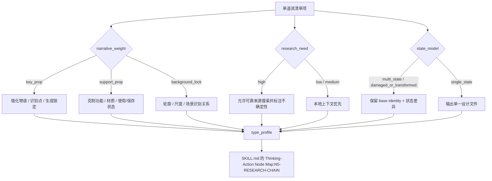

# Prop Design Type Map

## 类型包加载边界

- 每次调用本技能时，必须依据本文件识别并加载同目录 `types/` 中选中的类型包（单选或多选）。
- `types/` 中命中的类型包作为固定上下文加载；`knowledge-base/` 只作为按需检索、切片或向量召回的知识库，不替代类型包。


本文件承载 `道具/2-设计` 的类型变量和分型策略。执行时先形成 `type_profile`，再进入 `SKILL.md 的 Thinking-Action Node Map`。

## Type Variables

| variable | values | use |
| --- | --- | --- |
| `narrative_weight` | `key_prop` / `support_prop` / `background_lock` | 决定物语和识别点密度 |
| `function_mode` | `ritual` / `tool` / `weapon` / `document` / `container` / `costume_adjacent` / `device` / `misc` | 决定研究和 Prop Design 重点 |
| `research_need` | `low` / `medium` / `high` | 决定是否允许网络搜索冷门信息 |
| `state_model` | `single_state` / `multi_state` / `damaged_or_transformed` | 决定命名和版本处理 |
| `style_pressure` | `realist` / `symbolic` / `surreal` / `period_specific` / `sci_fi_or_fantasy` | 决定 `画面基调.Global Style Prompt + 道具风格.Prop Style Prompt` 的融合方式 |
| `design_detail_priority` | `signature` / `crafted` / `cultural` / `functional_beauty` / `restrained` | 决定道具审美吸引力、可见细节和 signature detail 的强度 |
| `cultural_context_policy` | `strict_period` / `regional_symbolic` / `class_profession_marked` / `function_led_minimal` / `inspired_by_only` / `avoid_sensitive` | 决定文化/身份/机构/功能符号是否适用，以及如何绑定时代、地域、阶层、职业、禁区和功能逻辑 |
| `evidence_mode` | `source_fact` / `inference` / `inspired_by` / `unknown` | 决定研究结论能否进入确定性设计锁定 |
| `research_axis` | `form_factor` / `material_system` / `craft_process` / `design_detail_culture` / `period_logic` / `condition_state` / `wear_trace_conditional` / `function_logic` / `risk_uncertainty` | 决定研究必须转译到哪些可见设计字段；`condition_state` 为通用状态轴，`wear_trace_conditional` 只在证据支持时启用 |

## Routing Matrix

| type signal | route | required emphasis | review focus |
| --- | --- | --- | --- |
| 关键剧情道具、规则物、反复出现 | `key_prop` | 物语、识别点、生成锁定、signature detail、条件性文化/身份/功能符号 | 是否可跨镜头稳定复现，是否有可见设计价值且一眼可识别 |
| 普通功能道具 | `support_prop` | 材质、使用/保存状态、功能逻辑、克制但明确的设计细节 | 是否过度扩写剧情；是否平凡到缺少设计感；是否无证据做旧 |
| 背景但需要生成锁定 | `background_lock` | 轮廓和场景识别关系 | 是否仍为单道具主体 |
| 历史、宗教、工艺、地域冷门物件 | `research_high` | 考据来源、形制、工艺 | 是否伪造史实或无来源断言 |
| 武器、危险装置、医疗器械 | `safety_sensitive` | 视觉描述而非现实操作指导 | 是否包含可执行伤害步骤 |
| 多状态或损坏变形 | `multi_state` | 状态差异、同一主体识别点 | 文件命名是否清楚 |
| 研究结论会进入 prompt 核心 token | `evidence_chain_required` | source cue、confidence、visual translation、prompt token | prompt token 是否能回指研究/物语/解构 |

## Routing Topology



## Research Axis Strategy

| route | research axis emphasis |
| --- | --- |
| `ritual` | `period_logic`、`craft_process`、`condition_state`；可为仪式封存、供奉痕迹、高维护抛光或象征性旧痕，避免伪造宗教或族群事实 |
| `tool` | `function_logic`、`material_system`、`condition_state`、`design_detail_culture`；突出可见使用/维护状态与工匠细节，不写操作教程，不默认磨损 |
| `weapon` | `form_factor`、`material_system`、`design_detail_culture`、`risk_uncertainty`；只保留美术外观和有依据的文化/身份符号，避免现实伤害指导 |
| `document` | `material_system`、`period_logic`、`design_detail_culture`、`condition_state`；关注纸张、封缄、平整/折叠/污损状态、印迹、铭文和阶层/机构符号 |
| `container` | `form_factor`、`craft_process`、`design_detail_culture`、`function_logic`；关注开合结构、接口、封缄、纹样和内部不可见逻辑的外部暗示 |
| `costume_adjacent` | `material_system`、`craft_process`、`design_detail_culture`、`condition_state`；仍按单道具呈现，不让人物入镜 |
| `device` | `form_factor`、`function_logic`、`design_detail_culture`、`risk_uncertainty`；保留外观机制与时代技术语境，不输出可复现工程步骤 |
| `misc` | 至少覆盖 `form_factor`、`material_system`、`design_detail_culture`、`condition_state` 四项 |

## Design Detail And Cultural Context Rules

| profile | application |
| --- | --- |
| `signature` | 关键道具必须有可复现的独特轮廓、材质记忆点、功能结构或条件性文化/身份符号，能在纯色背景全貌图中一眼识别。 |
| `crafted` | 工具、器皿、容器、饰件等应突出工艺痕迹、连接件、缝线、铆钉、刻痕、镶嵌、漆层、封缄或修补。 |
| `cultural` | 仪式物、文书、令牌、族群/地域相关物件应写明纹样、铭文、徽记、器型、封缄与文化语境，不随机贴花。 |
| `functional_beauty` | 普通功能道具也要有材质、比例、状态证据和结构上的设计美感；状态证据可为洁净、维护、封存、使用或磨损，但不扩写成清单外剧情真源。 |
| `strict_period` | 时代、地域、阶层、职业与技术水平优先于装饰冲动；风格化不得脱离项目语境，低证据道具走 `function_led_minimal` 而不是随机贴花。 |

## Prompt Strategy By Type

| route | prompt strategy |
| --- | --- |
| `key_prop` | 强化 unique silhouette、material memory、story-linked condition state、signature detail |
| `support_prop` | 保持紧凑，聚焦功能逻辑、材质、年代、可见使用/保存状态和一到两个克制设计细节，避免平凡通用物件 |
| `background_lock` | 降低戏剧性，明确尺度、位置关系和可识别轮廓 |
| `research_high` | 用 verified / inspired by 语言区分确定事实和灵感转译 |
| `safety_sensitive` | 避免操作教程、结构拆解到可复现伤害层级，只保留美术可见特征 |
| `multi_state` | prompt 中写清 base identity 与当前状态，不丢主体识别点 |

## Default Fallback

类型不确定时采用：

```yaml
narrative_weight: support_prop
function_mode: misc
research_need: medium
state_model: single_state
style_pressure: realist
evidence_mode: inference
research_axis:
  - form_factor
  - material_system
  - design_detail_culture
  - condition_state
```

并在输出中保守处理，不新增复杂机制或多状态版本。
