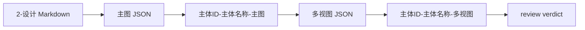

# 道具 3-生成

`$aigc-prop-generation` 是 AIGC 工作流中 `3-主体/道具/3-生成` 的 Skill 2.0 包。它消费上游 `2-设计` 的单道具设计文档，调用 `$libTV` 生成单主体图与多视图主体设计图。

## 目录树

```text
3-生成/
├── references/
├── scripts/
├── templates/
├── review/
├── SKILL.md runtime spine
├── knowledge-base/
├── types/
├── agents/
│   └── openai.yaml
├── CHANGELOG.md
├── SKILL.md
├── CONTEXT.md
├── test-prompts.json
└── README.md
```

## 快速入口

- 调用名：`$aigc-prop-generation`
- 输入：`projects/aigc/<项目名>/3-主体/道具/2-设计/<主体名称>.md`
- 输出：`projects/aigc/<项目名>/3-主体/道具/3-生成/`
- 命名：`主体ID-主体名称-主图`、`主体ID-主体名称-多视图`，并为二者分别保存同名 JSON 提示词。

## 路由图



## 执行摘要

1. 读取 `SKILL.md + CONTEXT.md`，并加载项目记忆与 `$libTV` 合同。
2. 从上游道具设计文档抽取 `4. 解构`。
3. 生成单主体图与 JSON。
4. 多视图默认取消；不套用 `templates/prop-multiview-prompt.json`，不生成 `-多视图` 图与 JSON。
5. 执行 `review/review-contract.md` 门禁。

## 质量入口

- 结构校验：`python3 /Users/vincentlee/.codex/skills/meta/构建/技能/skill-2.0/scripts/validate_skill_2_0.py .agents/skills/aigc/3-主体/道具/3-生成 --mode delivery`
- 语义门禁：检查 `SKILL.md` 的 runtime-spine 控制块、`test-prompts.json`、默认 libTV 执行器边界、主图 reference image 可见化和反模板伪差异 gate。
- `SKILL.md` runtime spine 仅作为 legacy read-only reference；运行时节点真源在 `SKILL.md`。
