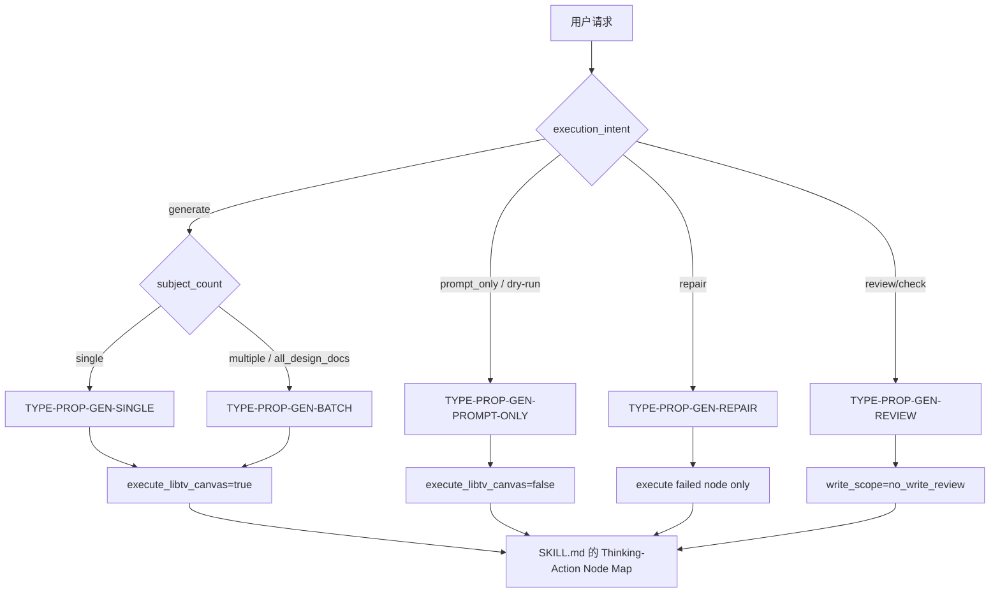

# Prop Generation Type Map

## 类型包加载边界

- 每次调用本技能时，必须依据本文件识别并加载同目录 `types/` 中选中的类型包（单选或多选）。
- `types/` 中命中的类型包作为固定上下文加载；`knowledge-base/` 只作为按需检索、切片或向量召回的知识库，不替代类型包。


本文件定义 `道具/3-生成` 的请求分型。执行前先形成 `type_profile`，再进入 `SKILL.md 的 Thinking-Action Node Map`。

## Type Variables

| variable | values | owner |
| --- | --- | --- |
| `subject_count` | `single` / `multiple` / `all_design_docs` | `N1-INTAKE` |
| `execution_intent` | `generate` / `prompt_only` / `repair` / `review_only` | 用户请求与 `N2-TYPE` |
| `execute_libtv_canvas` | `true` / `false` | `type_profile` |
| `libtv_canvas_mode` | `canvas_image_node` / `canvas_image_node_with_reference` / `external_provider_explicit` | `.agents/skills/cli/libTV` 画布节点合同与用户显式 provider 选择 |
| `canvas_resolution` | `resolved` / `ambiguous` / `missing` | 是否已按项目名-集数解析唯一 libTV 画布 UUID |
| `model_resolution` | `midjourney_v8_1_resolved` / `lib_image_resolved` / `missing` | 普通新主体解析 Midjourney V8.1；状态变体解析 Lib Image |
| `midjourney_suffix` | `--ar 3:2 --hd --style raw` plus optional style preset | 道具图固定后缀，风格预设来自 `../../_shared/midjourney风格参数.yaml` |
| `asset_reuse_decision` | `generate_new_subject` / `reuse_existing_asset` / `upload_existing_asset` / `generate_state_variant` | 生成前对项目 `3-主体` 既有主体图的判定 |
| `canvas_action` | `create_new_node` / `node_already_present` / `uploaded_existing_image_to_canvas` | 当前 libTV 画布中的节点处理动作 |
| `local_sync_status` | `already_present` / `synced` / `copied` / `pending` / `failed` | 项目 `道具/3-生成` 是否已有同 stem 本地资产；`already_present` 表示本地 canonical 已有并跳过下载/复制 |
| `local_asset_path` | canonical project image path / empty | 画布节点下载或本地复制后的项目侧最终资产路径 |
| `download_command` | `libtv download -p <canvas_uuid> -n <node> -o <dir>` / empty / `not_applicable` | 仅下载分支必填；本地 canonical 已有或复制分支可为空或 `not_applicable` |
| `generation_model_policy` | `new_subject_midjourney_default` / `lib_image_state_variant` | 普通新主体与状态变体的模型策略 |
| `state_variant_suffix` | empty / file-safe state suffix | 同主体新状态才填写，并加入输出 stem |
| `base_reference_node_name` | empty / same-subject libTV image node name | 状态变体使用的既有同主体参考节点 |
| `reference_context_status` | `pending_libtv_node_reference` / `linked_in_libtv_canvas` / `no_reference_image` | 道具主图节点是否已在同一 libTV 画布中可被多视图节点引用 |
| `write_scope` | `3-生成-only` / `no_write_review` | `SKILL.md Output Contract` |
| `repair_scope` | `main_prompt` / `main_image` / `multiview_prompt` / `multiview_image` / `json_path` / `canvas_node_link` | `review/review-contract.md` findings |

## Type Matrix

| type_id | trigger | route | required templates | review focus |
| --- | --- | --- | --- | --- |
| `TYPE-PROP-GEN-SINGLE` | 用户指定单个道具或单份设计文档 | `single_prop_generation` | `single-subject-prompt.json`、`prop-multiview-prompt.json` | 单主体忠实度、主图参照链 |
| `TYPE-PROP-GEN-BATCH` | 用户指定项目或全部 `2-设计` 文档 | `batch_from_designs` | 同上，每个主体独立实例化 | 不合并主体、命名不冲突 |
| `TYPE-PROP-GEN-PROMPT-ONLY` | 用户要求只输出 JSON / dry-run | `prompt_only` | 同上 | JSON 可复跑，预期路径完整 |
| `TYPE-PROP-GEN-REUSE` | 同主体同状态已有本地或画布主体图 | `reuse_existing_asset` | 共享复用规则 | 跳过生成或上传本地图 |
| `TYPE-PROP-GEN-STATE-VARIANT` | 同主体出现开合、破损、修复、激活等新状态 | `state_variant_generation` | 共享复用规则 | Lib Image + 参考图 + 状态后缀 |
| `TYPE-PROP-GEN-REPAIR` | 已有资产缺失、错名、错路径或 JSON 脱节 | `repair` | 按失败节点选择 | 最小修复、不触碰无关资产 |
| `TYPE-PROP-GEN-REVIEW` | 用户只要求检查 | `review_only` | 无新增模板，读取现有 JSON | findings 准确、无写入 |

## Routing Diagram



## Type Profile Schema

```yaml
type_profile:
  type_id: ""
  project_root: "projects/aigc/<项目名>"
  source_design_docs: []
  output_dir: "projects/aigc/<项目名>/3-主体/道具/3-生成"
  execute_libtv_canvas: true
  libtv_canvas_mode: canvas_image_node
  canvas_name_hint: "<项目名>-第<集数>集"
  canvas_uuid: ""
  model_display_name: Midjourney V8.1
  model_key: ""
  generation_model_policy: new_subject_midjourney_default
  variant_model_display_name: Lib Image
  variant_model_key: ""
  asset_reuse_decision: generate_new_subject
  generation_skipped: false
  canvas_action: create_new_node
  local_sync_required: true
  local_sync_status: pending
  local_asset_path: ""
  download_command: ""
  state_variant_suffix: ""
  base_reference_node_name: ""
  midjourney_suffix: "--ar 3:2 --hd --style raw"
  allow_external_provider: false
  allow_external_provider: false
  reference_context_status: pending_libtv_node_reference
  subjects: []
```

## Route To Step Map

| route | node sequence | write behavior |
| --- | --- | --- |
| `single_prop_generation` | `N1 -> N2 -> N3 -> N4 -> N5 -> N6 -> N7` | 写入一个主体的两图两 JSON 与可选报告 |
| `batch_from_designs` | `N1 -> N2 -> per subject N3-N7 -> batch verdict` | 每个主体独立输出，不合并 prompt |
| `prompt_only` | `N1 -> N2 -> N3 -> N5 -> N7` | 只写 JSON 或按用户要求只返回 JSON 内容 |
| `repair` | `N1 -> N2 -> failed node -> downstream deps -> N7` | 最小重写失败节点及依赖产物 |
| `review_only` | `N1 -> N2 -> N7` | 默认无写入，只输出 findings / verdict |

## Routing Notes

- `execute_libtv_canvas: false` 只允许在 `prompt_only` 或用户明确暂停生图时使用。
- `allow_external_provider: true` 只能来自用户显式选择；默认始终通过 `.agents/skills/cli/libTV` 画布节点入口执行，不能由批量、质量或路径需求自动推导。
- `allow_external_provider: true` 只能来自用户显式点名其他 provider / API / model；否则不得调用 `nano-banana`、Dreamina、AnyFast 子技能或其他图像执行器。
- 生成前必须扫描 `projects/aigc/<项目名>/3-主体`。同主体同状态已有图时优先复用或上传，不进入 Midjourney 新生成。
- 任一集 libTV 画布上的道具主体图生成、复用或上传成功后，都必须确保 `projects/aigc/<项目名>/3-主体/道具/3-生成/` 已有同 stem 本地资产；本地 canonical 已有则跳过下载/复制并记录 `already_present`，本地缺失才下载或复制补齐；真实生成分支的 `local_sync_status` 不能停留在 `pending` 或空值。
- 同主体新状态必须填写 `state_variant_suffix`、`base_reference_node_name`，并把 `generation_model_policy` 设为 `lib_image_state_variant`。
- 批量任务必须拆成每个主体独立 prompt 和独立 libTV 画布节点调用。
- 真实多视图生成必须先确认对应主图节点在同一 libTV 画布中可引用，不能只把本地路径写进 `reference_image`。
- 真实生成前必须先解析 `canvas_uuid` 与 Midjourney V8.1 `model_key`；无法解析时只能进入 `prompt_only`，不得切换到其他 provider。
- `review_only` 的 `write_scope` 固定为 `no_write_review`；不得为了“修正结构完整性”补空 JSON 或占位图。
