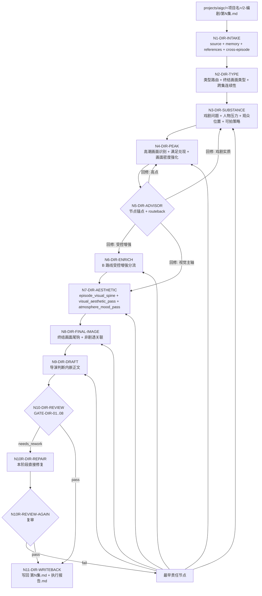
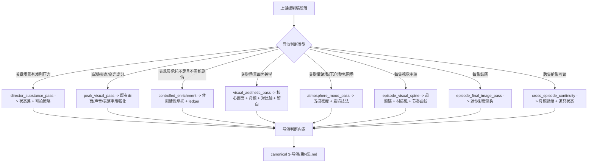

# aigc 3-导演

`3-导演` 负责在 `2-编剧` 逐集稿基础上，注入导演级创作判断：戏剧实质、高潮画面处理、整集视觉主轴、单场画面美学、终结画面尾钩、氛围意境、受控增强和跨集连续性。它把剧本结构转化为导演层面的艺术决策，只在既有剧本字段内部组织和强化，不改写剧情事实、对白、场景顺序或编剧字段标签。

`3-导演` 不负责：对白保真、字段格式化、slugline 稳定、小说表述二次画面化、声画配对（这些属于 `2-编剧`）；心理反应可感知化、演员表演控制、场景工艺、场面调度权力关系（这些属于 `4-表演`）。它的核心创意价值是回答"这场戏在导演层面该怎么拍才有戏"，而不是"这行字段该怎么格式化"。

## Context Loading Contract

- 每次调用 `$aigc-director` 时，必须同时加载同目录 `CONTEXT.md`。
- 每次调用本技能时，必须同时加载同目录 `CONTEXT.md`。
- 每次调用本技能时，必须同时识别并加载同目录 `types/` 中选中的类型包（单选或多选）。
- 若任务绑定 `projects/aigc/<项目名>/`，必须先加载项目根 `MEMORY.md`、`0-初始化/north_star.yaml` 与 `team.yaml`，再按需加载项目根 `CONTEXT/` 中与导演创作判断、视觉风格、氛围基调或类型气质相关的上下文文件。
- 若本阶段启动 subagents 模式（包含用户显式要求或仓库合同视为默认启用），必须读取 `../_shared/team-advisor-consultation-contract.md`，以 `team.yaml` 中明确的监制组相关智能顾问团作为导演监制；主 agent 必须基于本技能当前 `Thought Pass Map`、`steps/director-workflow.md` 节点、目标集上下文和当前导演判断阶段动态派生顾问问题，要求顾问代入其角色意识、创作风格和专业水准参与节点判断、执行取舍与 gate 风险提示，并在 LLM 导演判断注入前把可执行结论沉淀为 `advisor_consultation_packet` 作为后续任务上下文。
- 上游正文真源固定为 `projects/aigc/<项目名>/2-编剧/第N集.md`，除非用户显式指定其他编剧稿文件。
- 冲突优先级：用户显式请求 > 根 `AGENTS.md` / meta 规则 > 本 `SKILL.md` > `references/` / `steps/` / `types/` / `review/` / `templates/` > `agents/openai.yaml` > 项目 `MEMORY.md` > 项目 `CONTEXT/` > 本 `CONTEXT.md`。
- 新的稳定失败模式或可复用打法先写入 `CONTEXT.md`；只有稳定为强制规则后再晋升到 `SKILL.md` 或对应分区。

## Multi-Subskill Continuous Workflow

当本主技能包被整体调用时，视为用户已授权按本级声明的同级子技能包、阶段分区或内部连续节点自动完成整个技能组任务；在满足本技能必要输入、显式选择和安全门后，不再为"是否继续下一步"额外确认。

- 无序号同级子技能包默认全选并发执行，由本主技能包汇总、裁决和写回唯一 canonical 输出。
- 数字序号子技能包或节点（如 `1-`、`2-`、`3-`）默认按数字升序串行执行，前一节点产物自动作为后一节点输入。
- 英文序号子技能包或路线（如 `A-`、`B-`、`C-`）默认按用户意图、父级路由或输入类型单选分流；只有用户明确要求对比、并跑或批量多路线时才多选。
- 卫星技能只承担查询、恢复、审查承接或辅助动作；不会因连续调度自动改写 `3-导演` canonical 输出，除非父级合同或用户明确要求回接。
- 连续调度不得绕过本技能的阻断门：缺少必需输入、上游编剧稿不可读、破坏性覆盖未授权、子技能缺失或路线歧义会造成错误 canonical 写回时，必须先停下并给出最小澄清或阻断报告。
- 每个被调度的子技能包仍必须加载自身 `SKILL.md + CONTEXT.md`；脚本只能承担机械辅助，不得替代 LLM 导演判断或父级最终裁决。

## Input Contract

Accepted input:

- 项目名、项目路径、单个 `projects/aigc/<项目名>/2-编剧/第N集.md` 文件，或多个集号范围。
- 用户要求"导演""导演判断""导演稿""画面美学""高潮强化""氛围意境""视觉主轴""终结画面""从 2-编剧 到 3-导演"等任务。
- 已完成或部分完成的 `2-编剧` 逐集稿；默认以集为单位处理 `第N集.md`。

Required input:

- 可定位、可读取的 `2-编剧/第N集.md`。
- 至少一个目标集号，或允许默认处理 `2-编剧/` 中全部 `第N集.md`。

Optional input:

- 项目 `MEMORY.md` 中的长期导演偏好、禁区、风格要求、审美方向。
- 项目 `0-初始化/north_star.yaml` 中的核心创作北极星、类型承诺、审美方向和不可偏离目标。
- 项目 `team.yaml` 中的团队配置、导演/美学角色口径、协作分工和可用审美参照。
- 项目 `CONTEXT/` 中的角色、美术、场景、世界观、视觉参考、类型气质补充。
- 用户额外指定的参考导演、参考影片、风格倾向、氛围密度偏好或制作限制。
- 前集已完成的 `3-导演/第N-1集.md` 或执行报告中的跨集连续性证据。

Reject or clarify when:

- 上游 `2-编剧/第N集.md` 不存在、不可读，或正文缺少可处理字段。
- 用户要求改写剧情事实、新增对白、删减原编剧内容、合并集数或改变场景顺序（应转回 `2-编剧`）。
- 用户要求对白保真检查、字段格式化、slugline 修正、小说表述二次画面化（这些属于 `2-编剧`）。
- 用户要求心理反应可感知化、演员微表情控制、场面调度权力关系细化（这些属于 `4-表演`）。
- 用户要求直接生成分镜明细、图像提示词、视频请求或摄影方案（应转交 `3-摄影`）。
- 用户要求脚本自动生成导演判断正文；必须改为 LLM 主创、脚本只校验。

## Mode Selection

| mode | 触发信号 | 输出 |
| --- | --- | --- |
| `single_episode` | 指定单个 `第N集.md` 或单个集号 | `projects/aigc/<项目名>/3-导演/第N集.md` |
| `episode_range` | 指定多个集号或集号范围 | 多个逐集导演稿与更新后的执行报告 |
| `all_ready_episodes` | 未指定集号但 `2-编剧/` 下有 `第N集.md` | 全部可读逐集导演稿 |
| `controlled_enrichment` | 用户要求"更有戏/更有氛围/适当新增可拍承托"，或质量门发现表现层承托不足但无需新增剧情 | canonical 导演稿 + `controlled_enrichment_ledger` |
| `repair` | 已有导演稿存在戏剧实质缺失、高潮未强化、视觉主轴断裂、氛围空转或终结画面缺失 | 最小修复后的逐集导演稿与问题报告 |
| `stage_end_review_repair` | 任一非 `review_only` 导演任务完成候选稿后自动进入 | 阶段内 review -> 直接修复 -> 复审 -> canonical 写回 |
| `review_only` | 用户只要求检查 `3-导演` 输出 | 审查报告，不改写正文，除非用户随后要求修复 |

## Subagents Execution Mechanism

当 `3-导演` 启动 subagents 模式时，执行语义固定为"项目监制顾问团请教 -> 导演参谋汇流 -> 上下文沉淀 -> 后续导演任务消费"，而不是让 subagents 直接主创或改写 canonical 导演稿。

1. 主 agent 先读取项目 `team.yaml`，按 `../_shared/team-advisor-consultation-contract.md` 解析监制组相关智能顾问团；优先使用 `roles.supervision.members`、`roles.supervising.members` 或其引用成员，必要时才按共享合同补位并记录原因。
2. 被启动的 subagents 作为导演监制顾问运行：围绕当前集 `2-编剧` 上游正文、项目 `MEMORY.md`、`north_star.yaml`、相关 `CONTEXT/`、本技能的 `PASS-DIR-*` 思维通过点、`N*-DIR-*` 执行节点、review gate 和当前导演判断阶段，代入各自角色意识、创作风格和专业水准提出参谋建议。
3. 顾问问题不得固定为一组预设字段清单；必须从当前技能包本身的思维·执行节点派生问题，让顾问参与该节点的判断、动作、证据、route_out、gate 和失败回路设计。例如进入戏剧实质时请顾问判断哪些上游隐性压力值得强化，进入高点处理时请顾问判断满足兑现模式和画面密度，进入视觉主轴时请顾问判断母题链和材质弧如何贯穿全集，进入氛围意境时请顾问判断五感通道和意境技法。问题必须能推动当前节点执行，不得停留在泛泛"更有导演感"。
4. 主 agent 负责裁决、去重和汇流，把顾问建议压缩成 `advisor_consultation_packet.must_do / must_not_do / inspiration_to_use / execution_brief`，并保留必要的 `node_ref / pass_ref / role_lens` 摘要，作为 LLM 导演判断注入、阶段内修复和复审的额外上下文继续执行后续任务。
5. `advisor_consultation_packet` 不拥有上游编剧稿原文、对白、场景顺序、字段合同或 canonical 写回权；顾问建议若与上游真源或本技能合同冲突，必须舍弃或降级为风险提示。
6. 若真实 subagent dispatch 被 system / developer / tool / user 上层策略阻断，必须在执行报告中记录阻断层级、原计划顾问路径、实际降级路径和未启动成员；不得把主 agent 本地顺序扮演写成真实 subagents 已执行。

## Reference Loading Guide

| 场景 | 必读文件 |
| --- | --- |
| 任意导演判断任务 | `steps/director-workflow.md`、`references/directorial-authorship-contract.md` |
| 导演创作阶段启动 subagents 模式 / team reviewer runtime | `../_shared/team-advisor-consultation-contract.md`，并按本 `Subagents Execution Mechanism` 执行 |
| 编导创作内核、戏剧问题、人物压力、观众位置、可拍执行策略 | `references/directorial-authorship-contract.md` |
| 高潮画面识别、满足兑现模式与重点强化 | `references/climax-visual-treatment-contract.md` |
| 整集视觉主轴、母题链、材质/色彩弧、节奏曲线、呼应目标和克制规则 | `references/episode-visual-spine-contract.md` |
| 单场画面美学、视觉母题变奏、对比轴、景境氛围、画面节奏和留白 | `references/visual-aesthetic-contract.md` |
| 每集终结画面、迷你彩蛋尾钩、下一集非剧透关联 | `references/episode-final-image-contract.md`、`types/episode-final-image-type-map.md` |
| 氛围感与意境表现力、五感通感、微观质感、情绪-景境映射、声景层次、反衬留白 | `references/atmosphere-and-mood-contract.md` |
| B 路线受控新增式 / 非剧情性承托增强 | `references/controlled-enrichment-contract.md` |
| 跨集连续性追踪、视觉母题延续、表演弧线、道具状态 | `types/cross-episode-continuity-type-map.md` |
| 判断终结画面类型与手法 | `types/episode-final-image-type-map.md` |
| 验收、修复和 review gate | `review/review-contract.md` |
| 思维·执行节点 schema、节点 ledger、学习集成验证闭环 | `steps/director-workflow.md#Thinking-Action Node Contract`、`steps/director-workflow.md#Learning Integration Review Closure` |
| 阶段末审计后直接修复闭环 | 本 `Stage-End Review-Repair Contract`、`steps/director-workflow.md`、`review/review-contract.md` |
| 输出样板 | `templates/output-template.md`、`templates/episode-director.template.md` |
| 脚本辅助边界与机械校验 | `scripts/README.md` |
| 可复用经验 | `knowledge-base/directing-heuristics.md` |
| 产品入口元数据 | `agents/openai.yaml` |

## Output Contract

### Required output

1. 逐集导演稿固定写入 `projects/aigc/<项目名>/3-导演/第N集.md`。
2. 阶段执行报告写入或更新 `projects/aigc/<项目名>/3-导演/执行报告.md`。
3. 每个逐集导演稿必须完整保留 `2-编剧/第N集.md` 的原有结构、字段、对白和顺序，只在内部增强导演判断内嵌质量。
4. 导演稿的核心输出是：把 `director_substance_plan`、`peak_visual_plan`、`episode_visual_spine`、`visual_aesthetic_plan`、`atmosphere_mood_evidence`、`episode_final_image_plan` 和 `controlled_enrichment_ledger` 的创作判断内嵌到既有剧本字段中，使每个关键场景有可感知的戏剧实质、画面美学、氛围密度和高潮承托。
5. 启用 `controlled_enrichment` 时，执行报告必须包含 `controlled_enrichment_ledger`，逐项记录新增承托细节的上游锚点、目标字段、用途和风险检查。
6. 启动 subagents 模式时，执行报告必须包含 `advisor_consultation_packet` 及其 `node_ref / pass_ref / role_lens` 来源锚点。

### Output format

| output_id | format |
| --- | --- |
| `OUTPUT-DIRECTOR-EPISODE` | Markdown 导演稿 |
| `OUTPUT-DIRECTOR-REPORT` | Markdown 执行报告 |

### Output path

| output_id | canonical path |
| --- | --- |
| `OUTPUT-DIRECTOR-EPISODE` | `projects/aigc/<项目名>/3-导演/第N集.md` |
| `OUTPUT-DIRECTOR-REPORT` | `projects/aigc/<项目名>/3-导演/执行报告.md` |

### Naming convention

- 逐集导演稿命名为 `第N集.md`。
- 阶段报告命名为 `执行报告.md`。
- 不创建 `第N集-导演.md`、`director.md`、`directorial.md` 等平行真源。

### Completion gate

- 已读取本 `SKILL.md + CONTEXT.md`，并在项目任务中加载项目 `MEMORY.md`、`0-初始化/north_star.yaml`、`team.yaml` 与相关 `CONTEXT/`。
- 上游 `2-编剧/第N集.md` 可回指，输出 frontmatter 记录 `source_screenplay_path`。
- 上游剧情事实、信息量、顺序和对白完整承接，无摘要、删减、自由改写或因果重排。
- 对白逐字保真；`3-导演` 不修改引号内对白内容。
- 场景标题、slugline、字段标签和字段顺序保持上游原状；`3-导演` 只在字段内部增强导演判断内嵌质量。
- 关键场景已执行 `director_substance_pass`：有戏剧问题、人物选择压力、观众位置、场景状态差和可拍执行策略，并已内嵌到既有剧本句段。
- 上游存在高潮画面成分时，已执行 `peak_visual_pass`：识别 1-3 个高点或最强 `micro_payoff`，把强化结果落入既有正式画面/声音/表演字段，不新增剧情事实或对白。
- 每集已按 `references/episode-visual-spine-contract.md` 建立 `episode_visual_spine`：形成整集视觉问题、母题链、材质/色彩弧、节奏曲线、呼应目标和克制规则。
- 关键场景、强情绪场、压迫场、离别场、高潮场和类型氛围场已按 `references/visual-aesthetic-contract.md` 执行 `visual_aesthetic_pass`，形成核心画面、视觉气质、母题变化、对比轴、景境氛围、画面节奏和留白取舍，并内嵌到既有字段；不得新增终稿字段、摄影方案或剧情事实。
- 关键情绪场、压迫场、离别场或类型氛围场已按 `references/atmosphere-and-mood-contract.md` 执行 `atmosphere_mood_pass`：按五感氛围框架和意境技法清单为场景补意境密度；正文中应能看到至少两个感官通道的细节和至少一种意境技法；意境细节只改变表现层，不得新增剧情事实、对白、事件或抽象审美词空转。
- 每集已按 `types/episode-final-image-type-map.md` 形成 `final_image_type_profile`，再按 `references/episode-final-image-contract.md` 建立 `episode_final_image_plan`：终结画面作为迷你彩蛋尾钩，与下一集真实有关联但不剧透，从本集最后的剧情、情绪、视觉母题、道具状态或高点余波丝滑顺延，落入既有字段，不新增正文字段、剧情事实、对白或摄影方案。
- 若有前集 `3-导演/第N-1集.md` 可读，已按 `types/cross-episode-continuity-type-map.md` 检查跨集连续性：视觉母题延续、材质/色彩弧延续、道具状态延续、空间延续，母题有变化而不机械复读。
- 启用 `controlled_enrichment` 时，执行报告包含完整 `controlled_enrichment_ledger`，每项有上游锚点、目标字段、用途和 `risk_check`。
- 启动 subagents 模式时，已按 `team.yaml` 监制组相关智能顾问团形成带 `node_ref / pass_ref / gate_ref / role_lens` 来源锚点的 `advisor_consultation_packet`，并把基于当前思维·执行节点的参谋指导作为后续 LLM 导演判断注入、阶段内修复和复审上下文；若被上层阻断，执行报告已记录降级说明。
- 执行报告包含 `thinking_action_node_ledger`、`director_substance_evidence`、`peak_visual_plan`、`advisor_consultation_packet`、`controlled_enrichment_ledger`、`visual_aesthetic_evidence.episode_visual_spine`、`visual_aesthetic_evidence.scene_items`、`episode_final_image_evidence` 和 `atmosphere_mood_evidence`；若本轮新增或显著修改学习型合同，还必须包含 `learning_integration_review_evidence`。
- 已运行等价人工 review 或脚本校验；若发现阻断项，已在本阶段内完成最小直接修复并复审通过，结果写入 `执行报告.md`。

## Stage-End Review-Repair Contract

`3-导演` 不另设独立"导演润色"阶段。每次生成或修复候选导演稿后，必须在本阶段内部完成末段审计和直接修复闭环，只有复审通过的结果才允许写回 canonical `3-导演/第N集.md`。

固定执行语义：

1. `N9-DIR-DRAFT` 产物先视为 `candidate_director_script`，不是终稿。
2. `N10-DIR-REVIEW` 按 `review/review-contract.md` 审计戏剧实质、高潮画面、视觉主轴、单场美学、氛围意境、终结画面、受控增强边界、顾问汇流、创作证据和输出路径。
3. 若 verdict 为 `needs_rework`，必须在本阶段直接执行 `N10R-DIR-REPAIR`，只修导演判断内嵌、画面美学密度、氛围浓度、高潮承托、视觉主轴连贯、终结画面尾钩、受控增强留证或报告证据；不得改写上游剧情事实、对白、场景标题或字段顺序。
4. 修复后必须执行 `N10R-REVIEW-AGAIN`；复审仍失败时继续最小修复循环，或在源层冲突、输入缺失、权限阻断时输出阻断报告，不得把失败稿推进下游。
5. `review_only` 只产出审查报告，不自动修复；除此之外的生成、批量和 repair 模式都默认启用本闭环。
6. `执行报告.md` 必须记录本轮 review verdict、repair actions、复审结果、未修复风险和是否允许进入 `3-摄影`。

## Visual Maps

## Field Mapping

| field_id | 输出/证据 | 内容要求 | 失败码 |
| --- | --- | --- | --- |
| `FIELD-DIR-01` | 输入取证 | source screenplay episode、项目记忆、north star、team 配置、相关上下文、目标集号明确 | `FAIL-DIR-01` |
| `FIELD-DIR-02` | 戏剧实质 | 关键场景有 `director_substance_plan` 级创作判断：戏剧问题、人物压力、观众位置、信息释放和可拍执行策略，并已内嵌进正文 | `FAIL-DIR-02` |
| `FIELD-DIR-03` | 高潮画面 | 上游高点或最强 `micro_payoff` 被识别并落入可拍字段，无新增事实 | `FAIL-DIR-03` |
| `FIELD-DIR-04` | 画面美学 | 整集有视觉主轴；关键场景有核心画面、视觉气质、母题/变化、对比轴、景境氛围、节奏和留白取舍，并内嵌到既有字段；无摄影越权或审美词空转 | `FAIL-DIR-04` |
| `FIELD-DIR-05` | 氛围意境 | 关键情绪场、压迫场、离别场或类型氛围场至少有两个感官通道细节和一种意境技法；意境细节只改变表现层，不新增事实或对白 | `FAIL-DIR-05` |
| `FIELD-DIR-06` | 终结画面尾钩 | 每集有 `episode_final_image_plan`；尾钩与下一集真实相关但不剧透，并从本集内容丝滑顺延，落入既有字段且无新增事实、对白或摄影越权 | `FAIL-DIR-06` |
| `FIELD-DIR-07` | Team advisor consult | 启动 subagents 模式时已按 `team.yaml` 请教项目监制顾问，顾问问题同步于当前 `PASS-DIR-*` / `N*-DIR-*` 思维·执行节点，并把角色意识、创作风格、专业水准转化为后续任务上下文；阻断时有降级报告 | `FAIL-DIR-07` |
| `FIELD-DIR-08` | Controlled enrichment | B 路线新增项均为非剧情性承托，有上游锚点、目标字段、用途和风险检查；无新增对白/事件/因果/规则 | `FAIL-DIR-08` |
| `FIELD-DIR-09` | 创作证据 | 执行报告包含 `thinking_action_node_ledger`、`director_substance_evidence`、`peak_visual_plan`、`visual_aesthetic_evidence`、`atmosphere_mood_evidence`、`episode_final_image_evidence` 和 `controlled_enrichment_ledger`，证明导演判断、高潮强化、画面美学、氛围意境和终结画面不是只停留在文档规则层 | `FAIL-DIR-09` |
| `FIELD-DIR-10` | 保真 | 不改写原 `2-编剧` 字段内容、对白、场景顺序和剧情事实 | `FAIL-DIR-10` |
| `FIELD-DIR-11` | 输出落盘 | `3-导演/第N集.md` 与 `执行报告.md` 可复查 | `FAIL-DIR-11` |
| `FIELD-DIR-12` | 阶段末闭环 | candidate 已审计、阻断项已直接修复并复审，执行报告记录 verdict 和 repair actions | `FAIL-DIR-12` |
| `FIELD-DIR-13` | 占位泄露 | 终稿无内部规则句、模板占位句或任务说明；导演判断以创作干货形式内嵌，不以"已执行XX pass"形式泄露 | `FAIL-DIR-13` |
| `FIELD-DIR-14` | 跨集连续性 | 若有前集可读，已检查视觉母题、材质/色彩弧、道具状态和空间的跨集延续；母题有变化而非机械复读 | `FAIL-DIR-14` |
| `FIELD-DIR-15` | 学习集成验证 | 新增或显著修改学习型合同时，执行报告包含 `learning_integration_review_evidence`，说明静态接入点、真实样例或 smoke 状态、残余风险和下一次生产观察点 | `FAIL-DIR-15` |

## Thought Pass Map

| step_id | pass_name | input | judgment | output |
| --- | --- | --- | --- | --- |
| `PASS-DIR-01` | 输入取证 | `2-编剧/第N集.md`、项目记忆、north star、team 配置、相关 CONTEXT | 是否具备可承接逐集编剧稿、目标集号和项目语境 | `source_context_profile` |
| `PASS-DIR-02` | 类型与跨集路由 | `types/episode-final-image-type-map.md`、`types/cross-episode-continuity-type-map.md`、前集 `3-导演/第N-1集.md`、`source_context_profile` | 终结画面类型画像如何？前集可读性、跨集连续性需求如何？ | `final_image_type_profile`、`cross_episode_continuity_profile` |
| `PASS-DIR-03` | 戏剧实质 | `source_context_profile`、`cross_episode_continuity_profile`、`references/directorial-authorship-contract.md`、上游正文与场景表 | 关键场景是否提炼出戏剧问题、人物压力、观众位置、信息释放和可拍执行策略，而非只做结构/文采处理 | `director_substance_plan` |
| `PASS-DIR-04` | 高潮画面处理 | `director_substance_plan`、`references/climax-visual-treatment-contract.md`、上游正文 | 是否存在高潮/爽点/高光成分，满足兑现模式是什么，是否需要强化为可拍字段 | `peak_visual_plan` |
| `PASS-DIR-05` | 顾问请教汇流 | `team.yaml`、共享顾问合同、上游正文、`steps/director-workflow.md`、`Thought Pass Map`、`director_substance_plan` 与相关 review gate | 是否已把当前思维·执行节点转化为顾问任务，并将角色意识、创作风格和专业水准参谋汇流为带节点锚点的可执行上下文 | `advisor_consultation_packet` |
| `PASS-DIR-06` | B 路线受控增强 | `director_substance_plan`、`peak_visual_plan`、`references/controlled-enrichment-contract.md`、上游正文 | 是否需要非剧情性承托新增；每项新增是否有上游锚点和风险检查 | `controlled_enrichment_ledger` |
| `PASS-DIR-07` | 视觉主轴与画面美学 | `director_substance_plan`、`peak_visual_plan`、`controlled_enrichment_ledger`、`references/episode-visual-spine-contract.md`、`references/visual-aesthetic-contract.md`、`references/atmosphere-and-mood-contract.md`、`cross_episode_continuity_profile`、上游正文 | 是否形成整集视觉主轴、核心画面、视觉气质、母题变化、对比轴、景境氛围、节奏和留白取舍；关键场景是否有多感官意境密度 | `episode_visual_spine`、`visual_aesthetic_plan`、`atmosphere_mood_evidence` |
| `PASS-DIR-08` | 终结画面尾钩 | `final_image_type_profile`、`peak_visual_plan`、`episode_visual_spine`、`visual_aesthetic_plan`、`references/episode-final-image-contract.md`、上游末场、下一集可读上下文或本集局部推断 | 是否形成迷你彩蛋尾钩，既关联下一集又不剧透，并从本集相关内容自然顺延 | `episode_final_image_plan` |
| `PASS-DIR-09` | LLM 导演判断注入 | `director_substance_plan`、`peak_visual_plan`、`advisor_consultation_packet`、`controlled_enrichment_ledger`、`episode_visual_spine`、`visual_aesthetic_plan`、`atmosphere_mood_evidence`、`episode_final_image_plan`、`cross_episode_continuity_profile`、上游正文 | 是否完整承接事实、对白、顺序，同时把导演创作判断内嵌到既有字段 | `director_episode_script` |
| `PASS-DIR-10` | 验收回写 | 导演稿、校验结果、`thinking_action_node_ledger` | 是否满足保真、戏剧实质、高潮画面、视觉主轴、画面美学、氛围意境、终结画面、受控增强边界和输出门禁 | `review_result` |
| `PASS-DIR-11` | 直接修复复审 | `review_result`、candidate 导演稿、修复稿 | 阻断项是否已在本阶段最小修复并复审通过 | `review_repair_result` |

## Pass Table

| pass_id | pass standard | fail code | Rework Entry |
| --- | --- | --- | --- |
| `PASS-DIR-01` | 上游逐集编剧稿、项目记忆、north star、team 配置和目标集号明确 | `FAIL-DIR-01` | `Input Contract` |
| `PASS-DIR-02` | 终结画面类型画像已建立；跨集连续性已检查或标注不适用 | `FAIL-DIR-06` / `FAIL-DIR-14` | `types/episode-final-image-type-map.md`、`types/cross-episode-continuity-type-map.md` |
| `PASS-DIR-03` | 关键场景有导演级创作判断，能把上游原文转成戏剧问题、人物压力、观众位置、信息释放和可拍策略 | `FAIL-DIR-02` | `references/directorial-authorship-contract.md` |
| `PASS-DIR-04` | 上游高点被识别，满足兑现模式明确，且强化不新增事实、对白或因果 | `FAIL-DIR-03` | `references/climax-visual-treatment-contract.md` |
| `PASS-DIR-05` | 启动 subagents 模式时完成项目监制顾问请教，且顾问任务同步于当前思维·执行节点、上下文沉淀或记录降级 | `FAIL-DIR-07` | `../_shared/team-advisor-consultation-contract.md` + 本 `Subagents Execution Mechanism` |
| `PASS-DIR-06` | B 路线新增项只属于非剧情性承托，且有完整 `controlled_enrichment_ledger` | `FAIL-DIR-08` | `references/controlled-enrichment-contract.md` |
| `PASS-DIR-07` | 整集有视觉主轴；关键场景有视觉核心、画面层级、母题变化、对比轴、景境氛围、留白取舍和多感官意境密度；美学和意境增强不新增事实、对白或摄影方案 | `FAIL-DIR-04` / `FAIL-DIR-05` | `references/episode-visual-spine-contract.md`、`references/visual-aesthetic-contract.md`、`references/atmosphere-and-mood-contract.md` |
| `PASS-DIR-08` | 终结画面作为迷你彩蛋尾钩，能非剧透地关联下一集，并从本集内容丝滑顺延到最后既有字段 | `FAIL-DIR-06` | `references/episode-final-image-contract.md` |
| `PASS-DIR-09` | 剧情事实、顺序和对白完整保真，且导演创作判断内嵌到既有字段，未越权到编剧或摄影 | `FAIL-DIR-10` | `steps/director-workflow.md` |
| `PASS-DIR-10` | 输出路径、执行报告、思维·执行节点 ledger 和 review gate 齐全 | `FAIL-DIR-11` / `FAIL-DIR-15` | `review/review-contract.md`、`steps/director-workflow.md#Thinking-Action Node Contract` |
| `PASS-DIR-11` | review 阻断项已直接修复并复审；未通过时不写 canonical 终稿 | `FAIL-DIR-12` | `Stage-End Review-Repair Contract` |

## Root-Cause Execution Contract (Mandatory)

出现以下问题时，必须沿链路上溯并修复源层合同：

- 改写了上游对白、删减了剧情事实、重排了场景顺序或改变了字段标签内容。
- 用摘要替代完整剧情承接。
- 把"增强戏剧张力""提升电影感""节奏更紧凑"等口号写入终稿，但没有动作、声音、空间或表演承托。
- 只把上游原文改成更漂亮的句子，却没有场景目标、人物压力和状态差。
- 关键场景没有 `director_substance_plan` 级创作判断，只有结构规整或文字漂亮。
- 上游存在明显高潮/爽点/高光成分，但导演稿把它压平成普通叙述，或为了强化高点新增事实、对白、事件结果。
- 整集画面没有 `episode_visual_spine`，每场各自好看但缺少可记忆的视觉母题链、材质/色彩弧、节奏曲线和呼应目标。
- 关键场景没有核心画面、视觉层级、母题变化、对比轴、画面节奏或留白取舍；或用"电影感/高级感/宿命感"等抽象审美词替代可见画面。
- 关键情绪场、压迫场、离别场或类型氛围场只写地点点缀，没有五感意境密度；或意境细节新增了剧情事实、对白或事件。
- `环境描写` 在关键场景只有宏观景物（飘雪、落叶），缺少微观感官细节——声音穿过材质后的质感、空气湿度在皮肤上的触感、光线穿透材质形成的纹理、时间在静物上留下的痕迹。
- 每集结尾没有 `episode_final_image_plan`，或终结画面只是剧情总结/硬塞预告/剧透下一集，未形成从本集内容自然顺延的迷你彩蛋尾钩。
- 前集可读但未检查跨集连续性，导致视觉母题断裂、道具状态脱节或空间基调突变。
- B 路线受控增强没有 `controlled_enrichment_ledger`，或新增项缺少上游锚点、目标字段、用途和风险检查。
- 把 `controlled_enrichment` 当成自由新增式，新增对白、事件、桥段、因果、规则、线索、人物动机或事件结果。
- 内部任务说明或规则复述泄露到终稿字段正文，例如"本场执行 director_substance_pass..."。
- 终稿把导演判断写成场景末尾的总结块，而不是内嵌到对应环境、动作、对白画面、道具、群像、声音、停顿和反应字段。
- `场面调度` 写成摄影机位、景别、镜头运动或分镜方案，造成 `3-导演` 越权到下游 `3-摄影`。
- 脚本、模板拼接或规则补句替代 LLM 的核心导演创作判断。
- 启动 subagents 模式时跳过 `team.yaml` 监制顾问请教、把顾问问题固定成脱离当前思维·执行节点的题型清单、没有把节点级参谋指导沉淀为后续上下文，或把主 agent 本地模拟顾问当成真实 dispatch。
- review 发现阻断项后未在本阶段直接修复和复审，却把候选稿写成终稿或推进下游。

必经链路：

`Symptom -> Direct Script/Prompt/Subagent Overreach -> 3-导演 Section Owner -> AGENTS.md LLM-first / Subagent / Skill 2.0 Rule`

## Execution Rules

- 核心导演判断必须由 LLM 直接完成；脚本只允许读取、统计、格式检查和字段覆盖校验。
- `3-导演` 是 `2-编剧` 的导演级创作判断注入层，不得压缩、摘要、删减剧情事实或自由改写剧情因果。
- 除在既有字段内部增强导演判断内嵌质量外，必须完整承接上游原文信息量、顺序、对白和字段结构。
- 导演质量不以结构规整或表达漂亮为充分条件；必须按 `references/directorial-authorship-contract.md` 形成 `director_substance_plan`，把上游原文中的戏剧问题、人物压力、观众位置、信息释放和可拍执行策略转成内嵌在正文中的创作干货。
- 当启动 subagents 模式时，先按共享团队顾问合同解析 `team.yaml` 中明确的监制组相关智能顾问团，再把当前 `steps/director-workflow.md` 的节点、`Thought Pass Map` 的 pass、相关 review gate 和目标集上下文转化为顾问任务；顾问必须代入角色意识、创作风格和专业水准参与节点判断、执行取舍、证据补强与风险提示，主 agent 只吸收可执行指导和风险提示，综合为带节点锚点的 `advisor_consultation_packet` 后沉淀进后续 LLM 导演判断注入、阶段内修复和复审上下文。
- 顾问意见不得替代上游逐集编剧稿、对白、场景顺序或导演主真源；若真实 subagent dispatch 被上层阻断，必须在执行报告中记录阻断层级、原计划顾问路径、实际降级路径和未启动成员。
- 候选稿不得跳过阶段末 review-repair 闭环直接成为终稿；review 发现阻断项时，必须在本阶段直接最小修复并复审，或明确阻断源层。
- `steps/director-workflow.md` 中的节点必须按思维·执行节点执行：每个关键节点先判断 `judgment_question`，再执行动作，留下 `evidence_keys`，声明 `route_out`、`gate_status` 与 `source_owner`；执行报告以 `thinking_action_node_ledger` 留证。节点不得退化为普通 checklist，也不得只写"已优化/已增强"而没有证据字段和失败回路。
- 高潮画面处理以 `references/climax-visual-treatment-contract.md` 为准；其职责是识别并强化上游已存在的满足兑现点，不得制造新的事件、对白或因果。
- 整集视觉主轴以 `references/episode-visual-spine-contract.md` 为准；它组织整集视觉问题、母题链、材质/色彩弧、节奏曲线、呼应目标和克制规则，不替代单场戏剧功能。
- 单场画面美学以 `references/visual-aesthetic-contract.md` 为准；它只组织核心画面、视觉气质、母题变化、对比轴、景境氛围、画面节奏和留白，不新增字段、摄影方案或剧情事实。
- 氛围感与意境表现力以 `references/atmosphere-and-mood-contract.md` 为准；它提供五感氛围框架、情绪-景境映射和意境技法清单，为关键场景补意境密度，不新增剧情事实、对白、事件或抽象审美词。
- 每集终结画面以 `references/episode-final-image-contract.md` 为准；它作为迷你彩蛋尾钩，负责让本集最后一个画面/声音/动作落点与下一集真实关联但不剧透，并从本集内容自然顺延，不新增事实、对白或正文字段。
- 受控新增式以 `references/controlled-enrichment-contract.md` 为准；B 路线只补表现层承托，必须写入 `controlled_enrichment_ledger`，不得替代 `C-authorized_adaptation`。

## Script And Metadata Contract

| path | role |
| --- | --- |
| `scripts/README.md` | 说明脚本只做机械辅助，不替代 LLM 导演创作判断 |
| `agents/openai.yaml` | 提供产品侧入口元数据，默认提示必须显式提到 `$aigc-director` |
