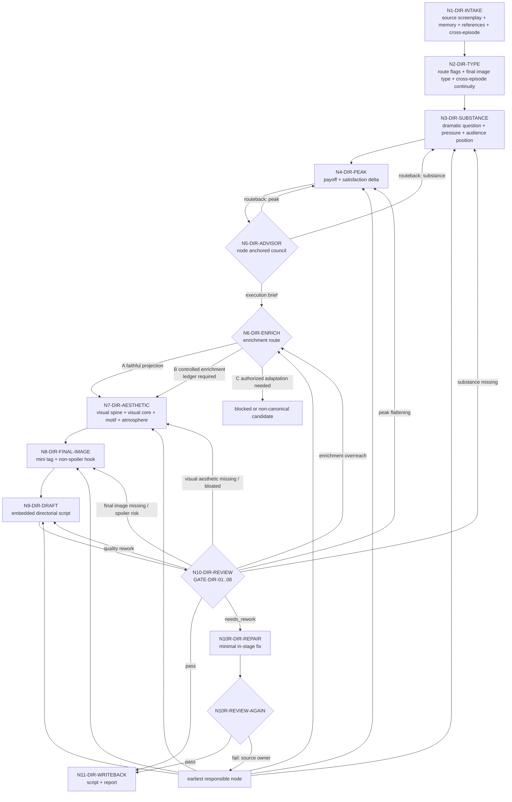
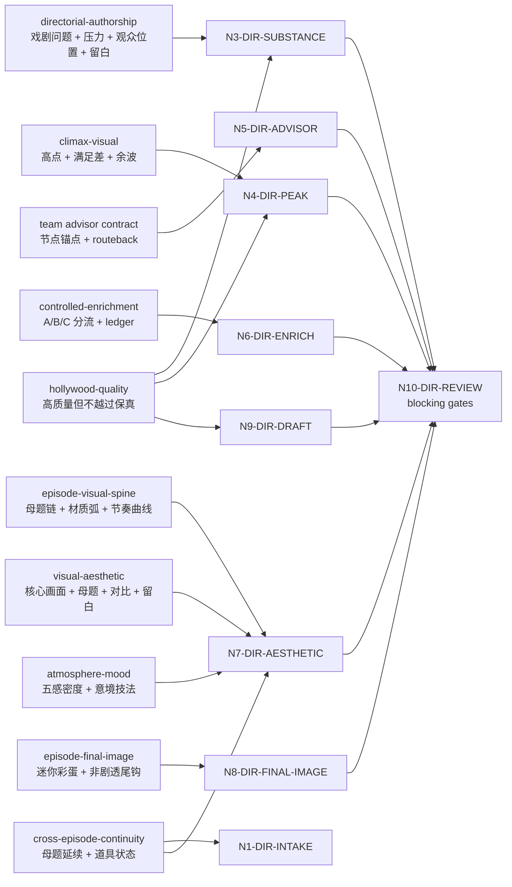

# Directing Workflow

## Business Requirement Analysis

| slot | value |
| --- | --- |
| `business_goal` | 在 `2-编剧` 逐集稿基础上注入导演级创作判断：戏剧实质、高潮画面处理、整集视觉主轴、单场画面美学、终结画面尾钩、氛围意境、受控增强和跨集连续性 |
| `business_object` | `projects/aigc/<项目名>/2-编剧/第N集.md` |
| `constraint_profile` | 不改写剧情事实、不修改对白、不改变场景顺序和字段标签；只在既有剧本字段内部组织和强化导演判断；导演创作内核、高潮画面识别、视觉主轴、画面美学、氛围意境、终结画面、受控增强留证、跨集连续性、LLM-first、subagents 监制顾问上下文沉淀 |
| `success_criteria` | 输出能完整承接上游编剧稿，且把关键场景的戏剧问题、人物压力、观众位置、高潮画面、视觉主轴、画面美学、氛围意境和终结画面转成内嵌在既有字段中的导演创作干货 |
| `non_goals` | 不做对白保真检查、字段格式化、slugline 修正、小说表述二次画面化（归属 `2-编剧`）；不做心理反应可感知化、演员微表情控制、场面调度权力关系细化（归属 `4-表演`）；不生成分镜明细、图像提示词或摄影方案 |
| `complexity_source` | 编导创作内核提炼、高潮画面识别与强化、整集视觉主轴、单场画面美学、氛围意境密度、终结画面类型化尾钩、受控增强边界、跨集连续性、监制顾问参谋汇流、保真与质量的优先级协调 |
| `topology_fit` | 串行主干 + 类型分支 + subagents 顾问分支 + B 路线受控增强分支 + review 回路 |

## Reference-To-Node Coverage

| reference | consumed_by | node evidence | blocking gate |
| --- | --- | --- | --- |
| `references/directorial-authorship-contract.md` | `N3-DIR-SUBSTANCE` / `N9-DIR-DRAFT` / `N10-DIR-REVIEW` | `director_substance_plan`、`adaptation_payload`、`director_substance_evidence` | `FAIL-DIRECTOR-SUBSTANCE` |
| `references/climax-visual-treatment-contract.md` | `N4-DIR-PEAK` / `N9-DIR-DRAFT` / `N10-DIR-REVIEW` | `peak_visual_plan`、`peak_visual_candidates`、`micro_payoff`、`cost_or_aftershock` | `FAIL-PEAK-VISUAL` |
| `references/episode-visual-spine-contract.md` | `N7-DIR-AESTHETIC` / `N9-DIR-DRAFT` / `N10-DIR-REVIEW` | `episode_visual_spine`、`visual_question`、`motif_chain`、`material_and_color_arc`、`rhythm_curve`、`callback_targets` | `FAIL-VISUAL-AESTHETIC` / `FAIL-CREATIVE-EVIDENCE` |
| `references/visual-aesthetic-contract.md` | `N7-DIR-AESTHETIC` / `N9-DIR-DRAFT` / `N10-DIR-REVIEW` | `visual_aesthetic_plan`、`core_image`、`image_motif_map`、`contrast_axis_map`、`atmospheric_palette`、`restraint_notes` | `FAIL-VISUAL-AESTHETIC` |
| `references/atmosphere-and-mood-contract.md` | `N7-DIR-AESTHETIC` / `N9-DIR-DRAFT` / `N10-DIR-REVIEW` | `atmosphere_mood_evidence`、五感通道覆盖、意境技法使用 | `FAIL-ATMOSPHERE-MOOD` |
| `references/episode-final-image-contract.md` / `types/episode-final-image-type-map.md` | `N2-DIR-TYPE` / `N8-DIR-FINAL-IMAGE` / `N9-DIR-DRAFT` / `N10-DIR-REVIEW` | `final_image_type_profile`、`episode_final_image_plan`、`final_image_method`、`next_episode_relation`、`spoiler_boundary`、`final_field_projection` | `FAIL-EPISODE-FINAL-IMAGE` / `FAIL-CREATIVE-EVIDENCE` |
| `references/controlled-enrichment-contract.md` | `N6-DIR-ENRICH` / `N9-DIR-DRAFT` / `N10-DIR-REVIEW` | `enrichment_route_decision`、`controlled_enrichment_ledger` | `FAIL-CONTROLLED-ENRICHMENT` |
| `references/hollywood-quality-spec.md` | `N3-DIR-SUBSTANCE` / `N4-DIR-PEAK` / `N9-DIR-DRAFT` / `N10-DIR-REVIEW` | `hollywood_quality_notes`、`quality_rework_targets` | `hollywood_quality: needs_rework` |
| `types/cross-episode-continuity-type-map.md` / `references/episode-visual-spine-contract.md#Cross-Episode Spine Continuity` | `N1-DIR-INTAKE` / `N7-DIR-AESTHETIC` | `cross_episode_continuity_profile`、前集 `motif_chain` 延续候选、前集 `callback_targets` 延续候选 | 不阻断；不适用时标注 `episode-local continuity` |
| `../_shared/team-advisor-consultation-contract.md` | `N5-DIR-ADVISOR` / `N10-DIR-REVIEW` | `advisor_consultation_packet`、`advisor_routeback_targets`、`downgrade` | `FAIL-ADVISOR-CONSULT` |

## Thinking-Action Node Contract

`steps/directing-workflow.md` 中的节点不是普通 checklist。每次执行 `3-导演` 时，主 agent 必须把每个实际经过的节点记录为 `thinking_action_node_ledger`，并让 review 能反查"判断、动作、证据、路由、gate"是否同时发生。

节点最小字段固定如下：

| field | requirement |
| --- | --- |
| `node_id` | 稳定节点 ID，必须能回指下方 `Thinking-Action Nodes` 表 |
| `judgment_question` | 当前节点必须先判断什么，不能只写"执行某 pass" |
| `decision` | 本轮判断结果；可为 `pass / needs_rework / blocked / routeback / not_applicable` |
| `actions_taken` | 实际执行动作，必须说明投影、取舍、删除、补证、分流或回修动作 |
| `evidence_keys` | 本节点产出的证据字段或文件锚点 |
| `route_out` | 下一节点、回修节点或阻断出口 |
| `gate_status` | 本节点 gate 是否通过；失败时写 `fail_code` 和最早责任节点 |
| `source_owner` | 失败或降级时对应的合同 owner，例如 `directorial-authorship`、`climax-visual`、`review` |

节点退化判定：

- 只有动作描述、没有 `judgment_question`，视为 checklist 退化。
- 只有"已优化/已增强/已影视化"等结论、没有 `evidence_keys`，视为证据退化。
- 只有 `route_out` 到下一步、没有失败回路，视为路由退化。
- 只在报告里列节点名、终稿正文没有对应字段内嵌，视为投影退化。
- 新增 reference、gate 或 evidence 时，必须同步更新本文件的 `Reference-To-Node Coverage`、`Thinking-Action Nodes`、`Failure Loops` 和 Mermaid。

报告中的最小形态：

```yaml
thinking_action_node_ledger:
  - node_id: "N3-DIR-SUBSTANCE"
    judgment_question: "关键场景是否提炼出戏剧问题、人物压力、观众位置和可拍执行策略，而非只做结构规整或文字漂亮？"
    decision: "pass | needs_rework | blocked | routeback | not_applicable"
    actions_taken:
      - "对每个关键场景执行 director_substance_pass，提炼戏剧问题、观众位置、人物主动目标、阻碍、隐藏恐惧、选择压力"
    evidence_keys:
      - "director_substance_evidence"
      - "adaptation_payload"
    route_out: "N4-DIR-PEAK"
    gate_status:
      passed: true
      fail_code: ""
    source_owner: "references/directorial-authorship-contract.md"
```

## Learning Integration Review Closure

上一轮审查结论：导演层学习成果已接入 `references`、workflow、review gate、模板和 `CONTEXT.md`，但仍存在"静态合同已接入，不等于真实生成时一定产出合格证据"的残余风险。

本 workflow 因此新增以下闭环：

- `N10-DIR-REVIEW` 必须检查 `thinking_action_node_ledger` 是否覆盖本轮经过的关键节点，尤其是 `N3-DIR-SUBSTANCE`、`N7-DIR-AESTHETIC`、`N9-DIR-DRAFT` 和 `N11-DIR-WRITEBACK`。
- 若新增或显著修改了学习型合同，必须在本轮执行报告中加入 `learning_integration_review_evidence`，说明静态接入点、真实样例或等价 smoke 检查、未覆盖风险和下一次生产运行的观察点。
- 若本轮没有真实项目剧集可运行，允许在 `learning_integration_review_evidence.status` 标注 `static_only`，但不得把它写成 fully verified；review 必须把残余风险保留在报告中。
- 后续真实导演产物一旦触发该合同，应把至少一个关键场景的 `source_anchor -> director_substance_evidence -> embedded_in_fields` 作为样例写入执行报告。

## Thinking-Action Nodes

| node_id | objective | inputs | actions | evidence | route_out | gate |
| --- | --- | --- | --- | --- | --- | --- |
| `N1-DIR-INTAKE` | 锁定项目、集号、上游编剧稿和本轮加载边界 | 用户请求、项目根、`2-编剧/` | 定位目标集，读取 `SKILL.md + CONTEXT.md`、项目 `MEMORY.md`、`0-初始化/north_star.yaml`、`team.yaml`、相关 `CONTEXT/`，建立本轮 reference load manifest；若第 N-1 集导演稿存在，按 `types/cross-episode-continuity-type-map.md` 形成 `cross_episode_continuity_profile`，为视觉母题、材质弧、道具状态和空间提供跨集延续参考 | `source_screenplay_path`、目标输出路径、`reference_load_manifest`、`cross_episode_continuity_profile` | `N2-DIR-TYPE` | 上游编剧稿可读，加载边界不缺失 |
| `N2-DIR-TYPE` | 形成导演层 `type_profile`、`final_image_type_profile` 与节点策略开关 | 上游编剧稿结构、下一集可读状态、`types/episode-final-image-type-map.md`、`types/cross-episode-continuity-type-map.md` | 判断终结画面的下一集关联状态、anchor surface、hook promise、剧透风险、连续方式和优先手法；判断跨集连续性需求 | `type_profile`、`final_image_type_profile`、`cross_episode_continuity_profile`、`route_flags` | `N3-DIR-SUBSTANCE` | 类型策略不改变编剧层保真 |
| `N3-DIR-SUBSTANCE` | 编导创作内核 | `type_profile`、场景表、字段映射、上游编剧稿正文、`references/directorial-authorship-contract.md`、`references/hollywood-quality-spec.md` | 对关键场景执行 `director_substance_pass`：提炼戏剧问题、观众位置、人物主动目标、阻碍、隐藏恐惧、选择压力、进入/转折/退出状态、信息释放、表演发动机、空间/道具/声音发动机、节奏取舍和 `adaptation_payload` | `director_substance_plan`、`adaptation_payload`、`director_substance_evidence`、`hollywood_quality_notes` | `N4-DIR-PEAK` | 每个关键判断能回指上游；不是漂亮改写或结构整理；无新增事实、对白、桥段或摄影越权；必须说明哪些内容该显影、该发声、该留白 |
| `N4-DIR-PEAK` | 高潮画面识别与强化计划 | `director_substance_plan`、上游段落、字段映射、`references/climax-visual-treatment-contract.md`、`references/hollywood-quality-spec.md` | 识别 1-3 个上游高点或最强 `micro_payoff`，锁 `source_evidence / audience_desire / promise_source / character_anchor / payoff_mode / build_up / delivery_action / satisfaction_delta / visual_payload / audio_payload / cost_or_aftershock`；必要时标注 `payoff_variation_axis` | `peak_visual_plan`、`peak_visual_candidates`、`micro_payoff` | `N5-DIR-ADVISOR` | 高点可回指上游，强化只提高画面/声音/表演/空间/余波密度，不新增事实、对白、胜负、死亡、反转或因果 |
| `N5-DIR-ADVISOR` | subagents 导演监制参谋汇流 | `team.yaml`、共享顾问合同、上游编剧稿、场景表、`director_substance_plan`、高潮画面计划、项目 `MEMORY.md`、`north_star.yaml`、相关 `CONTEXT/`、当前 `node_id/pass_id/gate_id` | 启动或按阻断报告处理 `team.yaml.roles.supervision.stage_profiles."3-导演"` 或共享合同回退路径中的导演监制顾问；主 agent 将当前思维·执行节点的 judgment、actions、evidence、route_out、gate 与失败回路转化为顾问任务；顾问代入角色意识、创作风格和专业水准参与节点判断、执行取舍、证据补强、回修建议和风险提示；主 agent 汇流为后续任务上下文 | `advisor_consultation_packet`、`advisor_routeback_targets` 或降级报告 | `N3-DIR-SUBSTANCE` / `N4-DIR-PEAK` / `N6-DIR-ENRICH` / `N7-DIR-AESTHETIC` | packet 已包含 roster 来源、`node_ref/pass_ref/gate_ref/role_lens`、可执行指导、风险提示、`routeback_targets` 和 `execution_brief`；若顾问发现前置节点证据不成立，必须先回修对应节点 |
| `N6-DIR-ENRICH` | B 路线受控增强判定与留证 | `director_substance_plan`、`peak_visual_plan`、上游正文、`references/controlled-enrichment-contract.md` | 判定 `A-faithful_projection / B-controlled_enrichment / C-authorized_adaptation`；只允许 B 路线补环境、群体反应、表演外显、场面调度、声音/道具/余波承托；为每个新增项记录 `source_anchor / added_detail / target_field / purpose / risk_check` | `enrichment_route_decision`、`controlled_enrichment_ledger` 或 `enrichment_mode: none` | `N7-DIR-AESTHETIC` | 每个新增项有上游锚点；删掉该项后剧情事实仍完全不变；无新增对白、事件、因果、规则、线索或人物动机 |
| `N7-DIR-AESTHETIC` | 画面美学组织、视觉主轴与景境层次 | 场景表、字段映射、`director_substance_plan`、`peak_visual_plan`、`controlled_enrichment_ledger`、`cross_episode_continuity_profile`、上游正文、`references/episode-visual-spine-contract.md`、`references/visual-aesthetic-contract.md`、`references/atmosphere-and-mood-contract.md` | 先按 `episode-visual-spine` 建立 `episode_visual_spine`：锁定整集视觉问题、母题链、材质/色彩弧、节奏曲线、呼应目标和克制规则；若 `cross_episode_continuity_profile.motif_continuity` 为 `required` 或 `optional`，参考前集 `motif_chain` 和 `callback_targets` 作为延续候选，但母题必须变化且不得为延续新增剧情事实；再按 `visual-aesthetic` 执行 `visual_aesthetic_pass`；对关键情绪场、压迫场、离别场和类型氛围场执行 `atmosphere_mood_pass`：按五感氛围框架和意境技法清单补意境密度，要求至少两个感官通道和至少一种意境技法；为关键场景锁定 `visual_tone / visual_core / image_hierarchy / motif_and_variation / contrast_axis / atmospheric_scenery / rhythm_and_negative_space / restraint` | `episode_visual_spine`、`visual_aesthetic_plan`、`core_image`、`image_motif_map`、`contrast_axis_map`、`atmospheric_palette`、`visual_rhythm_notes`、`restraint_notes`、`atmosphere_mood_evidence` | `N8-DIR-FINAL-IMAGE` | 整集视觉主轴和单场美学计划能回指上游或 B 路线留证；只提升画面层级、气质、节奏和留白，不新增事实、对白、线索、障碍、结果或摄影方案 |
| `N8-DIR-FINAL-IMAGE` | 每集终结画面与迷你彩蛋尾钩 | 上游末场、下一集可读状态、`final_image_type_profile`、`episode_visual_spine`、`visual_aesthetic_plan`、`peak_visual_plan`、`references/episode-final-image-contract.md` | 建立 `episode_final_image_plan`：锁定本集来源锚点、下一集关联方向、剧透边界、丝滑顺延方式、尾钩表层吸引力、环境描写式/道具特写式/情绪酝酿式/高潮结尾式手法和落入字段；若下一集不可读，标注 `episode-local inference` | `episode_final_image_plan`、`final_image_method`、`next_episode_relation`、`spoiler_boundary`、`final_field_projection`、`final_image_risk_check`、`episode_final_image_evidence` | `N9-DIR-DRAFT` | 尾钩与下一集真实相关或明确本集局部推断；不剧透下一集具体事件、台词、答案或结果；不新增事实、对白、线索、道具、规则或摄影方案 |
| `N9-DIR-DRAFT` | LLM 直出逐集导演稿 | 场景表、字段映射、`director_substance_plan`、`peak_visual_plan`、`advisor_consultation_packet`、`controlled_enrichment_ledger`、`episode_visual_spine`、`visual_aesthetic_plan`、`atmosphere_mood_evidence`、`episode_final_image_plan`、`cross_episode_continuity_profile`、上游编剧稿正文 | 在完整保留上游编剧稿结构、字段标签、对白和顺序的前提下，把导演创作内核、高潮画面、顾问参谋、受控增强、视觉主轴、画面美学、氛围意境和终结画面尾钩拆入对应句段的既有字段；模板占位和内部规则只能指导写作，不得输出到正文 | `第N集.md` 导演稿草稿、`faithful_directing_trace` | `N10-DIR-REVIEW` | 不改写上游剧情事实、对白、场景标题和字段顺序；导演判断以创作干货内嵌，不以"已执行XX pass"形式泄露；无第二字段体系，无场景末尾总结块 |
| `N10-DIR-REVIEW` | 保真、戏剧实质、高潮画面、视觉主轴、画面美学、氛围意境、终结画面、受控增强边界、顾问汇流、思维·执行节点与质量门禁 | candidate 导演稿、上游编剧稿正文、`review/review-contract.md`、各节点证据、`thinking_action_node_ledger`、`learning_integration_review_evidence` | 运行机械校验或人工 review；逐项执行 `GATE-DIR-01..08`；检查每个关键节点是否具备 `judgment_question / actions_taken / evidence_keys / route_out / gate_status / source_owner`；把 finding 映射到最早责任节点和 source owner | 校验结果、问题清单、`thinking_action_node_ledger`、`learning_integration_review_evidence`、`gate_to_node_repair_map`、repair targets | `N10R-DIR-REPAIR` 或 `N11-DIR-WRITEBACK` | 无阻断项才可写回；质量建议不得掩盖保真、戏剧实质、高潮画面、视觉主轴、画面美学、氛围意境、终结画面、受控增强越权或节点退化问题 |
| `N10R-DIR-REPAIR` | 阶段内直接修复阻断项 | `repair targets`、candidate 导演稿、上游编剧稿正文、责任节点证据 | 最小修复导演判断内嵌、画面美学密度、氛围浓度、高潮承托、视觉主轴连贯、终结画面尾钩、受控增强留证或报告证据；不改上游剧情事实、对白、场景标题或字段顺序 | repaired draft、repair actions、updated node evidence | `N10R-REVIEW-AGAIN` | 修复范围不越权；若需要改事实/对白/事件顺序，立即 blocked |
| `N10R-REVIEW-AGAIN` | 复审修复稿 | repaired draft、上游编剧稿正文、repair actions、updated node evidence | 复跑阻断 gate；通过则准入写回，失败则回最早责任节点 | re-review verdict、unresolved source owner | `N11-DIR-WRITEBACK` 或 `N3-DIR-SUBSTANCE` / `N4-DIR-PEAK` / `N6-DIR-ENRICH` / `N7-DIR-AESTHETIC` / `N8-DIR-FINAL-IMAGE` / `N9-DIR-DRAFT` / `N10R-DIR-REPAIR` | 复审通过或明确阻断 |
| `N11-DIR-WRITEBACK` | 落盘、报告和下游 handoff | 最终导演稿、校验证据、所有 planning evidence、`thinking_action_node_ledger` | 写入 `3-导演/第N集.md` 和 `执行报告.md`；报告记录 `thinking_action_node_ledger`、`learning_integration_review_evidence`、`director_substance_evidence`、`peak_visual_plan`、`advisor_consultation_packet`、`controlled_enrichment_ledger`、`visual_aesthetic_evidence.episode_visual_spine`、`visual_aesthetic_evidence.scene_items`、`episode_final_image_evidence`、`atmosphere_mood_evidence`、review/repair/re-review | 文件路径、verdict、handoff status、node ledger status | done | 输出路径、节点 ledger、报告证据和下游准入状态完整 |

## Branch Rules

- 若关键场景只能得到结构、字段或漂亮改写而没有戏剧问题、人物压力、观众位置和可拍执行策略，不能进入 `N4-DIR-PEAK`。
- 若 `director_substance_plan` 缺少 `adaptation_payload.must_make_visible / must_make_audible / must_leave_unsaid`，视为导演判断不可执行，回到 `N3-DIR-SUBSTANCE`。
- 若上游出现行动结果、认知翻转、关系暖点、规则显影、奇观、怪异落点或高超对决，必须进入 `N4-DIR-PEAK`；强化落入既有字段，不新增 `高潮画面` 字段作为第二解析体系。
- 若启动 subagents 模式，`N5-DIR-ADVISOR` 必须在 `N6-DIR-ENRICH`、`N7-DIR-AESTHETIC` 与 `N9-DIR-DRAFT` 前完成；顾问参谋必须绑定当前思维·执行节点并只转化为 `advisor_consultation_packet` 上下文，不直接写正文，不替换上游事实、对白或事件顺序。
- 若 `N5-DIR-ADVISOR` 发现前置节点证据不成立，必须产出 `advisor_routeback_targets` 并回到最早责任节点：戏剧实质空泛回 `N3-DIR-SUBSTANCE`，高点识别或强化越权回 `N4-DIR-PEAK`；回修后重新进入 `N5-DIR-ADVISOR` 汇流，不得把前置问题仅作为 packet 建议继续下游。
- 若用户要求"更影视化/适当新增可拍承托/景境更有氛围"，或质量门发现表现层承托不足，进入 `N6-DIR-ENRICH`；B 路线只允许非剧情性承托新增，必须产出 `controlled_enrichment_ledger`。
- `N6-DIR-ENRICH` 后必须进入 `N7-DIR-AESTHETIC`；若整集没有 `episode_visual_spine`，或关键场景没有核心画面、视觉气质、母题变化、对比轴、节奏或留白取舍，不得进入 `N9-DIR-DRAFT`。
- `N7-DIR-AESTHETIC` 后必须进入 `N8-DIR-FINAL-IMAGE`；若没有 `episode_final_image_plan`，或尾钩没有通过 `final_image_type_profile` 完成手法匹配，不得进入 `N9-DIR-DRAFT`。
- 若下一集正文可读，`N8-DIR-FINAL-IMAGE` 只允许提取关联方向，不得搬运下一集事件、台词、反转、角色身份或结果；若下一集不可读，必须标注 `episode-local inference`，不得硬造下一集事实。
- 若 `cross_episode_continuity_profile.motif_continuity` 为 `required` 或 `optional`，`N7-DIR-AESTHETIC` 必须参考前集 `motif_chain` 和 `callback_targets` 作为延续候选，但母题必须变化且不得为延续新增剧情事实。
- 若任一关键节点无法在 `thinking_action_node_ledger` 中说明 `judgment_question / actions_taken / evidence_keys / route_out / gate_status / source_owner`，不得进入 `N11-DIR-WRITEBACK`；必须回到该节点补判断、动作、证据、路由和 gate。
- 若用户要求或节点需求触发 C 路线新增对白、新桥段、新因果、新规则或新事件结果，必须阻断 canonical 写回并另行授权为候选稿，不得混入 `3-导演` 默认主线。

## Failure Loops

| symptom | route_back |
| --- | --- |
| 导演稿只有结构规整或表达漂亮，没有戏剧问题、人物压力、观众体验或可拍执行策略 | `N3-DIR-SUBSTANCE` |
| 上游高点被压平成普通叙述，或强化时新增事实 | `N4-DIR-PEAK` |
| subagents 启用但缺 team.yaml 监制顾问请教、节点锚点、个人风格参谋或上下文沉淀 | `N5-DIR-ADVISOR` |
| 顾问指出戏剧实质或高点前置证据不成立，但流程仍继续下游 | 最早责任节点：`N3-DIR-SUBSTANCE` / `N4-DIR-PEAK` |
| controlled enrichment 新增项缺少上游锚点，或新增了对白/事件/因果/规则 | `N6-DIR-ENRICH` |
| 整集没有视觉主轴，或关键场景画面没有核心、主次、对比、母题、节奏或留白，或用抽象审美词替代可见画面 | `N7-DIR-AESTHETIC` |
| 关键情绪场、压迫场、离别场或类型氛围场只写地点标签，缺少五感通感、微观质感、声景层次或意境技法 | `N7-DIR-AESTHETIC` |
| 终结画面缺失、尾钩没有类型化匹配、硬塞下一集预告、剧透下一集，或无法从本集内容丝滑顺延 | `N8-DIR-FINAL-IMAGE` |
| 改写了上游对白、删减了剧情事实、重排了场景顺序或改变了字段标签内容 | `N9-DIR-DRAFT` |
| 内部任务说明或规则复述泄露到终稿字段正文 | `N9-DIR-DRAFT` |
| 导演判断写成场景末尾的总结块，而不是内嵌到对应字段 | `N9-DIR-DRAFT` |
| `场面调度` 写成摄影机位、景别、镜头运动或分镜方案 | `N9-DIR-DRAFT` |
| 思维·执行节点只有 checklist 动作，没有判断问题、证据、路由、gate 或 source owner | 对应最早责任节点 + `N10-DIR-REVIEW` |
| 学习型新合同只在文档中引用，没有真实样例、静态 smoke 状态或残余风险说明 | `N10-DIR-REVIEW` / `N11-DIR-WRITEBACK` |
| 前集可读但未检查跨集连续性，导致视觉母题断裂、道具状态脱节或空间基调突变 | `N7-DIR-AESTHETIC` |
| 质量不足但保真通过 | `N9-DIR-DRAFT` |
| review 阻断项可在本阶段修复 | `N10R-DIR-REPAIR` |
| 修复后复审仍失败 | 回到最早责任节点：`N3-DIR-SUBSTANCE` / `N4-DIR-PEAK` / `N6-DIR-ENRICH` / `N7-DIR-AESTHETIC` / `N8-DIR-FINAL-IMAGE` / `N9-DIR-DRAFT` |

## Mermaid




