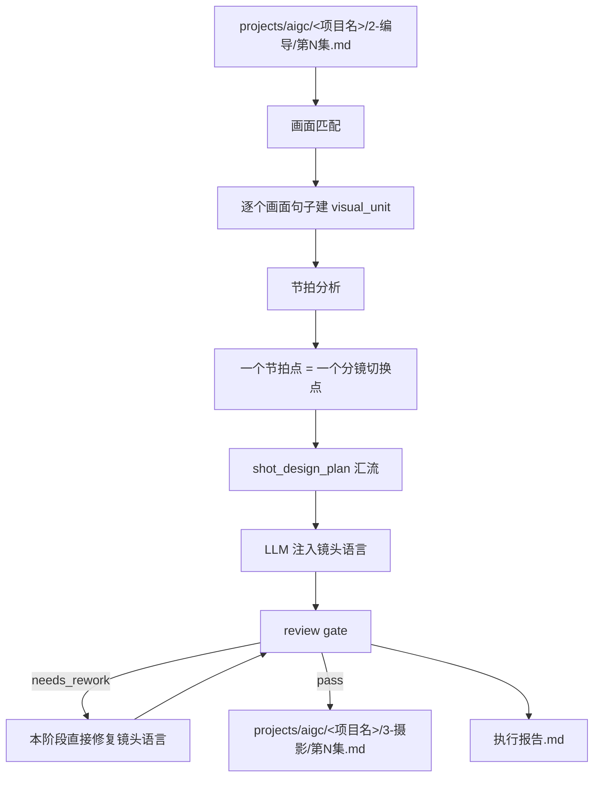
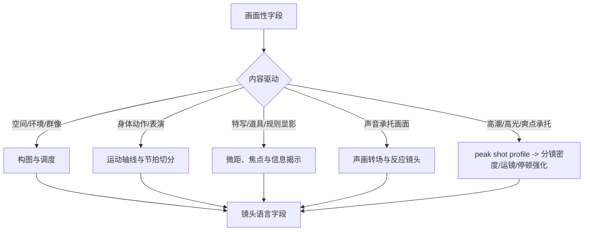

# aigc 3-摄影

`3-摄影` 负责在 `2-编导` 逐集稿基础上，为每一个画面性句子注入大师级分镜、摄影、运镜、转场、光影和色彩设计。它不改写剧情事实、对白、场景顺序或编导字段，只在命中的画面句子下方新增 `镜头语言：` 字段。

`镜头语言：` 是为兼容下游 `4-分组`、图像与视频阶段保留的字段名，不是开放式文学或主题阐释标题。本字段的语义别名固定为“运镜摄影设计”：内容必须聚焦运镜手法、摄影美学、构图/机位/景别/景深/焦点/光影/色彩，以及有明确画面动机时才使用的转场特效。不得写抽象主题、人物心理结论、剧情寓意、价值判断、世界观解释、导演阐释或无法被摄影/剪辑执行的气氛口号。

## Context Loading Contract

- 每次调用 `$3-摄影` 时，必须同时加载同目录 `CONTEXT.md`。
- 每次调用本技能时，必须同时加载同目录 `CONTEXT.md`。
- 每次调用本技能时，必须同时识别并加载同目录 `types/` 中选中的类型包（单选或多选）。
- 若任务绑定 `projects/aigc/<项目名>/`，必须先加载项目根 `MEMORY.md`、`0-初始化/north_star.yaml` 与 `team.yaml`，再按需加载项目根 `CONTEXT/` 中与摄影、美术、风格或制作约束相关的上下文文件。
- 若本阶段启动 subagents 模式（包含用户显式要求或仓库合同视为默认启用），必须读取 `../_shared/team-advisor-consultation-contract.md`，以 `team.yaml` 中明确的监制组相关智能顾问团作为摄影监制；主 agent 针对已知上下文向顾问提出摄影方向问题，要求其代入专业视角和个人风格进行参谋指导，并在 LLM 镜头语言注入前把可执行结论沉淀为 `advisor_consultation_packet` 作为后续任务上下文。
- 上游正文真源固定为 `projects/aigc/<项目名>/2-编导/第N集.md`，除非用户显式指定其他编导稿文件。
- 冲突优先级：用户显式请求 > 根 `AGENTS.md` / meta 规则 > 本 `SKILL.md` > `references/` / `steps/` / `types/` / `review/` / `templates/` > `agents/openai.yaml` > 项目 `MEMORY.md` > 项目 `CONTEXT/` > 本 `CONTEXT.md`。
- 核心镜头语言、节拍判断和审美设计必须由 LLM 直接完成；`scripts/` 只能做读取、标记检查、字段覆盖统计和机械校验。

## Multi-Subskill Continuous Workflow

当本主技能包被整体调用时，视为用户已授权按本级声明的同级子技能包、阶段分区或内部连续节点自动完成整个技能组任务；在满足本技能必要输入、显式选择和安全门后，不再为“是否继续下一步”额外确认。

- 无序号同级子技能包默认全选并发执行，由本主技能包汇总、裁决和写回唯一 canonical 输出。
- 数字序号子技能包或节点（如 `1-`、`2-`、`3-`）默认按数字升序串行执行，前一节点产物自动作为后一节点输入。
- 英文序号子技能包或路线（如 `A-`、`B-`、`C-`）默认按用户意图、父级路由或输入类型单选分流；只有用户明确要求对比、并跑或批量多路线时才多选。
- 卫星技能只承担查询、恢复、审查承接或辅助动作；不会因连续调度自动改写 `3-摄影` canonical 输出，除非父级合同或用户明确要求回接。
- 连续调度不得绕过本技能的阻断门：缺少必需输入、上游编导稿不可读、破坏性覆盖未授权、子技能缺失或路线歧义会造成错误 canonical 写回时，必须先停下并给出最小澄清或阻断报告。
- 每个被调度的子技能包仍必须加载自身 `SKILL.md + CONTEXT.md`；脚本只能承担机械辅助，不得替代 LLM 镜头语言主创或父级最终裁决。

## Input Contract

Accepted input:

- 项目名、项目路径、单个 `projects/aigc/<项目名>/2-编导/第N集.md` 文件，或多个集号范围。
- 用户要求“摄影”“分镜摄影”“镜头语言”“运镜”“画面句子下加镜头语言”“从 2-编导 到 3-摄影”等任务。
- 已完成或部分完成的 `2-编导` 逐集稿；默认以集为单位处理 `第N集.md`。

Required input:

- 可定位、可读取的 `2-编导/第N集.md`。
- 至少一个目标集号，或允许默认处理 `2-编导/` 中全部 `第N集.md`。
- 输入正文中存在可识别的画面性字段或画面性句子。

Optional input:

- 项目 `MEMORY.md` 中的长期摄影偏好、禁区、色彩倾向、节奏偏好。
- 项目 `0-初始化/north_star.yaml` 中的核心创作北极星、类型承诺、审美方向和不可偏离目标。
- 项目 `team.yaml` 中的团队配置、导演/摄影/美学角色口径、协作分工和可用审美参照。
- 项目 `CONTEXT/` 中的角色、美术、场景、世界观、视觉参考、镜头风格补充。
- 用户额外指定的参考导演、摄影师、影片、画幅、镜头焦段、运动强度或制作限制。

Reject or clarify when:

- 上游 `2-编导/第N集.md` 不存在、不可读，或正文缺少可处理字段。
- 用户要求重写剧情、改对白、删减原编导内容、合并集数或改变场景顺序。
- 用户要求直接生成图像提示词、视频请求、资产设计或分组拆分；这些应转交下游阶段。
- 用户要求脚本自动生成镜头语言正文；必须改为 LLM 主创、脚本只校验。

## Mode Selection

| mode | 触发信号 | 输出 |
| --- | --- | --- |
| `single_episode` | 指定单个 `第N集.md` 或单个集号 | `projects/aigc/<项目名>/3-摄影/第N集.md` |
| `episode_range` | 指定多个集号或集号范围 | 多个逐集摄影稿与更新后的执行报告 |
| `all_ready_episodes` | 未指定集号但 `2-编导/` 下有 `第N集.md` | 全部可读逐集摄影稿 |
| `repair` | 已有摄影稿缺失 `镜头语言`、分镜编号断裂、误改原文、节拍过粗/过碎，或把字段写成抽象主题阐释 | 最小修复后的逐集摄影稿与问题报告 |
| `stage_end_review_repair` | 任一非 `review_only` 摄影任务完成候选稿后自动进入 | 阶段内 review -> 直接修复镜头语言 -> 复审 -> canonical 写回 |
| `review_only` | 用户只要求检查 `3-摄影` 输出 | 审查报告，不改写正文，除非用户随后要求修复 |

## Subagents Execution Mechanism

当 `3-摄影` 启动 subagents 模式时，执行语义固定为“项目监制顾问团请教 -> 摄影参谋汇流 -> 上下文沉淀 -> 后续镜头语言任务消费”，而不是让 subagents 直接主创、改写上游编导稿或替代 LLM 镜头语言注入。

1. 主 agent 先读取项目 `team.yaml`，按 `../_shared/team-advisor-consultation-contract.md` 解析监制组相关智能顾问团；优先使用 `roles.supervision.members`、`roles.supervising.members` 或其引用成员，必要时才按共享合同补位并记录原因。
2. 被启动的 subagents 作为摄影监制顾问运行：围绕当前集 `2-编导` 上游正文、项目 `MEMORY.md`、`north_star.yaml`、相关 `CONTEXT/`、画面匹配、节拍分析、画面节奏、峰值分镜、连续性和视觉母题，代入各自专业视角与个人风格提出摄影方向参谋建议。
3. 顾问问题必须面向摄影决策，例如镜头连续性、节拍密度、景别尺度、运镜路径、光影母题、色彩控制、峰值镜头、转场动机、收敛/发散取舍和下游图像/视频可执行性；不得停留在泛泛“更电影感”。
4. 主 agent 负责裁决、去重和汇流，把顾问建议压缩成 `advisor_consultation_packet.must_do / must_not_do / inspiration_to_use / execution_brief`，并作为 LLM 镜头语言注入、阶段内修复和复审的额外上下文继续执行后续任务。
5. `advisor_consultation_packet` 不拥有上游 `2-编导` 原文、对白、场景顺序、字段合同或 canonical 写回权；顾问建议若与上游真源或本技能合同冲突，必须舍弃或降级为风险提示。
6. 若真实 subagent dispatch 被 system / developer / tool / user 上层策略阻断，必须在执行报告中记录阻断层级、原计划顾问路径、实际降级路径和未启动成员；不得把主 agent 本地顺序扮演写成真实 subagents 已执行。

## Reference Loading Guide

| 场景 | 必读文件 |
| --- | --- |
| 任意摄影注入任务 | `steps/cinematography-workflow.md`、`references/visual-matching-contract.md`、`references/beat-analysis-contract.md` |
| 摄影创作阶段启动 subagents 模式 / team reviewer runtime | `../_shared/team-advisor-consultation-contract.md`，并按本 `Subagents Execution Mechanism` 执行 |
| 画面节奏、信息重要性、张弛有度、收敛/发散 | `references/visual-rhythm-analysis-contract.md` |
| 高潮画面分镜强化、峰值运镜和高点余波交接 | `references/peak-shot-language-contract.md` |
| 分镜生成前的细则汇流、分镜数量裁决、上下镜衔接 | `references/shot-planning-integration-contract.md` |
| 镜头语言动态化表达、变化、组合运镜、流畅感 | `references/dynamic-lens-language-contract.md` |
| 镜头连续性、临近画面回顾、轴线一致、风格一致 | `references/shot-continuity-contract.md` |
| 景别景深、镜头视角、镜头类型、运镜速度、经典构图、高超运镜、高能转场、光影、色彩 | `references/cinematic-technique-library.md` |
| 判断画面句子类型与镜头策略 | `types/visual-unit-type-map.md` |
| 验收、修复和 review gate | `review/review-contract.md` |
| 阶段末审计后直接修复闭环 | 本 `Stage-End Review-Repair Contract`、`steps/cinematography-workflow.md`、`review/review-contract.md` |
| 输出样板 | `templates/output-template.md`、`templates/episode-cinematography.template.md` |
| 脚本辅助边界与机械校验 | `scripts/README.md` |
| 可复用经验 | `knowledge-base/cinematography-heuristics.md` |
| 产品入口元数据 | `agents/openai.yaml` |

## Visual Maps

## Execution Contract

1. 读取本 `SKILL.md + CONTEXT.md`，并在项目任务中加载项目 `MEMORY.md`、`0-初始化/north_star.yaml`、`team.yaml` 与相关 `CONTEXT/`。
2. 锁定上游 `2-编导/第N集.md`，保留 frontmatter、`【剧本正文】`、场景标题、字段顺序和原文。
3. 按 `references/visual-matching-contract.md` 执行 step1：匹配包含或等价于 `画面`、`动作`、`表演`、`描写`、`特写`、`显影` 的画面性内容；每一个画面句子成为一个镜头语言处理单位。
4. 按 `references/beat-analysis-contract.md` 执行 step2：先判断该画面句子的戏剧功能、注意力转移、动作相位、信息揭示和情绪转折，再决定分镜切换点；一个节拍点对应一个 `分镜N`。
5. 按 `references/visual-rhythm-analysis-contract.md` 执行 step2.5：根据画面句子的类型、节奏、信息重要性、情绪压力和上下文位置，判断镜头语言应收敛还是发散，决定描述密度、运动复杂度、景别变化幅度、转场强度和停顿时长。
6. 按 `references/peak-shot-language-contract.md` 执行 step2.6：若上游存在 `peak_visual_policy`、`peak_visual_pass` 或明显高潮/爽点/高光承托，形成内部 `peak_shot_profile`，决定是否加强分镜密度、景别尺度、运镜速度、停顿、转场、反应镜头和余波交接；若无真实高点，不硬造高潮。
7. 当启动 subagents 模式时，按共享团队顾问合同解析 `team.yaml` 中明确的监制组相关智能顾问团，向摄影、导演、美术、剪辑或类型视觉顾问提出镜头连续性、节拍密度、运镜、光影、色彩、峰值镜头和转场动机等具体问题；顾问必须代入专业视角和个人风格做摄影方向参谋，主 agent 将回答汇流为 `advisor_consultation_packet`，只吸收可执行镜头指导、节奏取舍和风险提示，不允许顾问改写上游编导正文。
8. 按 `references/shot-planning-integration-contract.md` 执行 step2.8：为每个 `visual_unit` 形成内部 `shot_design_plan`，把 `beat_map`、`rhythm_profile`、`peak_shot_profile`、`continuity_profile`、动态表达合同和技法库汇流成逐分镜计划；该计划决定分镜数量、顺序、入口、运动、落点和交出点。禁止未形成 `shot_design_plan` 就直接写 `分镜N`。
9. 按 `references/shot-continuity-contract.md`、`references/dynamic-lens-language-contract.md` 与 `references/cinematic-technique-library.md` 执行 step3：在每个画面句子下方新增 `镜头语言：` 字段。写作前必须在内部回顾整集中临近至少前 3 个画面句子的镜头语言表现，并消费 `advisor_consultation_packet` 中可执行指导；输出时集中描写当前画面本身，每个分镜写成“从 XX 到 XX”的动态变化、组合运镜和速度曲线。`镜头语言：` 字段只允许承载运镜手法、摄影美学与有画面动机的转场特效；抽象主题、心理解释、世界观解释和导演阐释只能作为内部判断，不得显式写入该字段。
10. 将 LLM 注入后的摄影稿先视为 `candidate_cinematography`，按 `review/review-contract.md` 执行验收；脚本只能做机械字段检查，不能替代镜头语言主创。若真实顾问 subagent dispatch 被上层阻断，必须在执行报告中记录阻断层级、原计划路径、实际降级路径和未启动成员。
11. 若 review 发现阻断项，必须在本阶段直接修复 `镜头语言` 覆盖、分镜编号、节拍、张弛、连续性、专业可执行、峰值分镜、分镜计划汇流或报告证据，并复审通过；不得改写 `2-编导` 原文。
12. 复审通过后写入 `projects/aigc/<项目名>/3-摄影/第N集.md`，并生成或更新 `projects/aigc/<项目名>/3-摄影/执行报告.md`。

## Stage-End Review-Repair Contract

`3-摄影` 不另设独立“摄影润色”阶段。每次生成或修复候选摄影稿后，必须在本阶段内部完成末段审计和直接修复闭环，只有复审通过的结果才允许写回 canonical `3-摄影/第N集.md`。

固定执行语义：

1. `N7-INJECT` 产物先视为 `candidate_cinematography`，不是终稿。
2. `N8-REVIEW` 按 `review/review-contract.md` 审计画面覆盖、分镜编号、节拍、画面节奏、连续性、专业可执行、动态流畅、空间一致、戏剧服务、原文保真、高潮分镜和输出路径。
3. 若 verdict 为 `needs_rework`，必须在本阶段直接执行 `N8R-DIRECT-REPAIR`，只修 `镜头语言：`、`分镜N`、镜头连续性、节奏张弛、峰值分镜、报告和证据字段；不得改写 `2-编导` 原文、对白、场景标题、字段顺序或剧情事实。
4. 修复后必须执行 `N8R-REVIEW-AGAIN`；复审仍失败时继续最小修复循环，或在源层冲突、输入缺失、权限阻断时输出阻断报告，不得把失败稿推进下游。
5. `review_only` 只产出审查报告，不自动修复；除此之外的生成、批量和 repair 模式都默认启用本闭环。
6. `执行报告.md` 必须记录本轮 review verdict、repair actions、复审结果、未修复风险和是否允许进入 `4-分组` / 后续设计与视频链路。

## Script And Metadata Contract

| path | role |
| --- | --- |
| `scripts/README.md` | 说明脚本只能承担机械辅助，不替代 LLM 镜头语言创作 |
| `scripts/validate_cinematography_markup.py` | 可选机械校验：检查画面性字段后是否就近存在 `镜头语言：` 与连续 `分镜N` |
| `agents/openai.yaml` | 提供产品侧入口元数据，默认提示必须显式提到 `$3-摄影` |

## Field Mapping

| field_id | 输出/证据 | 内容要求 | 失败码 |
| --- | --- | --- | --- |
| `FIELD-CINE-01` | 输入取证 | source directing episode、项目记忆、north star、team 配置、相关上下文、目标集号明确 | `FAIL-CINE-01` |
| `FIELD-CINE-02` | 画面匹配 | 所有画面性句子被识别，非画面字段不被强行注入 | `FAIL-CINE-02` |
| `FIELD-CINE-03` | 节拍判断 | 分镜数量来自内容节拍，不按固定数量灌水 | `FAIL-CINE-03` |
| `FIELD-CINE-04` | 运镜摄影设计（字段名：镜头语言） | 每个命中句子下方有 `镜头语言：` 和连续 `分镜N:`；字段内容聚焦运镜手法、摄影美学、构图/机位/景别/景深/焦点/光影/色彩与有动机转场，不输出抽象主题阐释 | `FAIL-CINE-04` |
| `FIELD-CINE-05` | 连续性 | 当前镜头语言回看临近至少前 3 个画面单位，保持轴线、运动方向、景别梯度、光色和风格连贯 | `FAIL-CINE-05` |
| `FIELD-CINE-06` | 节奏张弛 | 根据类型、节奏和信息重要性决定收敛/发散，避免轻信息过度炫技或重信息写得太薄 | `FAIL-CINE-06` |
| `FIELD-CINE-07` | 专业性 | 景别景深、镜头视角、镜头类型、运镜速度、构图、组合运镜、转场、光影、色彩至少按当前画面需要选择性生效，且表达呈现动态变化 | `FAIL-CINE-07` |
| `FIELD-CINE-08` | 保真 | 不改写原 `2-编导` 字段、对白、场景顺序和剧情事实 | `FAIL-CINE-08` |
| `FIELD-CINE-09` | 输出落盘 | `3-摄影/第N集.md` 与 `执行报告.md` 可复查 | `FAIL-CINE-09` |
| `FIELD-CINE-10` | 高潮分镜 | 上游高点被识别为 `peak_visual_unit`，并以分镜密度、运镜、景别、停顿、转场或余波交接强化，不新增事实 | `FAIL-CINE-10` |
| `FIELD-CINE-11` | Team advisor consult | 启动 subagents 模式时已按 `team.yaml` 请教项目监制顾问，并把摄影参谋指导沉淀为后续任务上下文；阻断时有降级报告 | `FAIL-CINE-11` |
| `FIELD-CINE-12` | 阶段末闭环 | candidate 已审计、阻断项已直接修复并复审，执行报告记录 verdict 和 repair actions | `FAIL-CINE-12` |
| `FIELD-CINE-13` | 分镜计划汇流 | 每个 `visual_unit` 在输出前已形成 `shot_design_plan`；每个 `分镜N` 可回指节拍触发、节奏密度、连续性入口、技法选择、落点和交出点 | `FAIL-CINE-13` |

## Thought Pass Map

| step_id | pass_name | input | judgment | output |
| --- | --- | --- | --- | --- |
| `PASS-CINE-01` | 画面匹配 | `2-编导/第N集.md` 字段行 | 是否属于可被摄影机处理的画面句子 | `visual_unit list` |
| `PASS-CINE-02` | 节拍分析 | 单个 `visual_unit` | 注意力、动作、信息、情绪、空间或声画是否需要换镜 | `beat_map` |
| `PASS-CINE-03` | 画面节奏分析 | `visual_unit`、`beat_map`、上下文位置 | 当前画面应收敛、标准展开、发散强化还是突发断裂；该判断只影响输出密度，不显式写入分镜 | `rhythm_profile` |
| `PASS-CINE-04` | 高潮分镜强化 | `visual_unit`、`beat_map`、`rhythm_profile`、上游 peak 证据 | 当前画面是否是高点，是否需要加强分镜密度、运镜、停顿、转场或余波交接 | `peak_shot_profile` |
| `PASS-CINE-05` | 顾问请教汇流 | `team.yaml`、共享顾问合同、`visual_unit` 与阶段目标 | 是否已向项目监制顾问提出具体摄影问题，并将专业视角和个人风格参谋汇流为可执行上下文 | `advisor_consultation_packet` |
| `PASS-CINE-06` | 连续性回看 | 当前 `visual_unit`、`peak_shot_profile`、`advisor_consultation_packet` 与临近前 3 个镜头语言块 | 哪些轴线、运动方向、景别梯度、光色和风格必须延续或有动机变化 | `continuity_profile` |
| `PASS-CINE-07` | 分镜计划汇流 | `beat_map`、`rhythm_profile`、`peak_shot_profile`、`continuity_profile`、动态表达合同与技法库 | 每个分镜的数量、顺序、入口、路径、落点和交出点是否由前序判断共同决定 | `shot_design_plan` |
| `PASS-CINE-08` | 镜头语言注入 | `shot_design_plan`、`advisor_consultation_packet` | 哪种景别、景深、视角、镜头类型、速度、构图、组合运镜、转场、光影、色彩最服务当前节拍且张弛得当 | `镜头语言` 块 |
| `PASS-CINE-09` | 保真审查 | enriched draft | 是否只新增镜头语言而不改写上游编导稿 | review result |
| `PASS-CINE-10` | 直接修复复审 | review result、candidate 摄影稿、修复稿 | 阻断项是否已在本阶段最小修复并复审通过 | review repair result |

## Pass Table

| pass_id | must_do | evidence | Rework Entry |
| --- | --- | --- | --- |
| `PASS-CINE-01` | 找到 `画面/动作/表演/描写/特写/显影` 等画面性内容 | 命中行清单、场景锚点 | `references/visual-matching-contract.md` |
| `PASS-CINE-02` | 为每个画面句子判断节拍点 | `分镜N` 数量与切换理由 | `references/beat-analysis-contract.md` |
| `PASS-CINE-03` | 判断该收敛还是发散 | rhythm profile、描述密度、运动复杂度、转场强度 | `references/visual-rhythm-analysis-contract.md` |
| `PASS-CINE-04` | 对上游高点形成 `peak_shot_profile` | 高点证据、峰值分镜/运镜/停顿/余波策略 | `references/peak-shot-language-contract.md` |
| `PASS-CINE-05` | 启动 subagents 模式时完成项目监制顾问请教、上下文沉淀或记录降级 | roster 来源、问题类型、可执行指导或降级说明 | `../_shared/team-advisor-consultation-contract.md` + 本 `Subagents Execution Mechanism` |
| `PASS-CINE-06` | 回看临近至少前 3 个画面单位 | continuity profile、轴线/运动方向/光色/景别梯度 | `references/shot-continuity-contract.md` |
| `PASS-CINE-07` | 在输出前形成 `shot_design_plan`，将 references 细则真实汇流到分镜数量、顺序和衔接 | 每个分镜可回指 beat/rhythm/continuity/technique/handoff | `references/shot-planning-integration-contract.md` |
| `PASS-CINE-08` | 写出大师级但可执行的动态镜头语言 | 从起点到终点的变化、组合运镜、速度曲线、景别、景深、镜头视角、镜头类型、转场、光影、色彩选择 | `references/dynamic-lens-language-contract.md`、`references/cinematic-technique-library.md` |
| `PASS-CINE-09` | 做覆盖率、连续编号和保真门禁 | review 结果或 validator 输出 | `review/review-contract.md` |
| `PASS-CINE-10` | review 阻断项已直接修复并复审；未通过时不写 canonical 终稿 | repair actions、re-review verdict | `Stage-End Review-Repair Contract` |

## Root-Cause Execution Contract (Mandatory)

出现以下问题时，必须沿链路上溯并修复源层合同：

- 漏掉 `画面`、`动作`、`表演`、`描写`、`特写`、`显影` 等画面性字段。
- 对每条画面句子机械固定为 1 个或 3 个分镜，而不是按节拍判断。
- `镜头语言` 只写空泛形容词，没有景别、景深、镜头视角、镜头类型、运镜速度、构图、机位、运动、光影、色彩或转场的可执行选择。
- `镜头语言` 把字段名理解成抽象表达空间，输出主题寓意、心理结论、世界观解释、导演阐释或无法执行的气氛口号，而不是运镜手法、摄影美学和转场特效。
- `镜头语言` 只列静态参数，没有“从 XX 到 XX”的动态变化、组合运镜、速度曲线或注意力转移路径。
- references 细则只被加载或引用，没有在输出前汇流为 `shot_design_plan`，导致分镜数量、顺序、技法和衔接像随机生成。
- 当前镜头语言不回看临近画面，导致轴线、运动方向、光色、景别或空间位置无动机跳变。
- 轻信息画面过度铺陈，重信息画面又过分简略，导致整集节奏没有张弛。
- 上游存在高潮/爽点/高光画面，但摄影稿按普通画面处理，或为了强化高点新增事实、对白、动作结果。
- 为了镜头炫技而改写原编导稿事实、对白或场景顺序。
- 脚本、模板拼接或规则补句替代 LLM 的摄影主创判断。
- 启动 subagents 模式时跳过 `team.yaml` 监制顾问请教、没有把摄影参谋指导沉淀为后续上下文，或把主 agent 本地模拟顾问当成真实 dispatch。
- review 发现阻断项后未在本阶段直接修复和复审，却把候选稿写成终稿或推进下游。

必经链路：

`Symptom -> Direct Script/Prompt/Subagent Overreach -> 3-摄影 Section Owner -> AGENTS.md LLM-first / Subagent / Skill 2.0 Rule`

## Output Contract

### Required output

1. 逐集摄影稿固定写入 `projects/aigc/<项目名>/3-摄影/第N集.md`。
2. 阶段执行报告写入或更新 `projects/aigc/<项目名>/3-摄影/执行报告.md`。
3. 每个逐集摄影稿必须完整保留 `2-编导/第N集.md` 原结构，并在每个画面性句子下方新增 `镜头语言：`。
4. `镜头语言：` 下方使用 `分镜1: ...`、`分镜2: ...` 的连续编号；分镜数量由节拍分析决定。
5. `镜头语言：` 是兼容字段名，实际内容必须按“运镜摄影设计”写作：能被摄影、分镜、现场调度或后续图像/视频阶段执行，不得只写抽象气氛词、主题寓意、心理结论、世界观解释或导演阐释；每个分镜默认包含景别/景深、镜头视角、镜头类型、运镜速度等摄影执行参数，并以动态句法呈现运动路径和变化结果。转场特效只在场景、注意力、动作方向、形态、声音或信息显影存在明确切换动机时写入。
6. 每个画面句子的镜头语言必须在内部回顾临近至少前 3 个画面单位；输出时不显式展示该回顾。若发生跨轴线、反向运动、光色突变、景别断崖或空间跳跃，才在镜头语言中简短给出转场、反应镜头、建立镜头、焦点转移或声画桥作为动机。
7. 每个 `visual_unit` 输出前必须形成内部 `shot_design_plan`；最终 `分镜N` 的数量、顺序、入口、路径、落点和交出点必须能从该计划反推，不得只增加分镜数量但缺少递进和衔接。

### Output format

| output_id | format |
| --- | --- |
| `OUTPUT-CINE-EPISODE` | Markdown 摄影镜头语言稿 |
| `OUTPUT-CINE-REPORT` | Markdown 执行报告 |

### Output path

| output_id | canonical path |
| --- | --- |
| `OUTPUT-CINE-EPISODE` | `projects/aigc/<项目名>/3-摄影/第N集.md` |
| `OUTPUT-CINE-REPORT` | `projects/aigc/<项目名>/3-摄影/执行报告.md` |

### Naming convention

- 逐集摄影稿命名为 `第N集.md`。
- 阶段报告命名为 `执行报告.md`。
- 不创建 `第N集-摄影.md`、`shot-language.md`、`cinematography.md` 等平行真源。
- `分镜N` 从 1 开始，在单个画面句子的 `镜头语言：` 字段内连续编号；不同画面句子重新从 `分镜1` 开始。

### Completion gate

- 已读取本 `SKILL.md + CONTEXT.md`，并在项目任务中加载项目 `MEMORY.md`、`0-初始化/north_star.yaml`、`team.yaml` 与相关 `CONTEXT/`。
- 上游 `2-编导/第N集.md` 可回指，输出 frontmatter 记录 `source_directing_path`。
- 所有命中的画面性句子下方均有 `镜头语言：` 字段；非画面字段没有被滥加。
- 每个 `镜头语言：` 块至少有 `分镜1:`，多分镜编号连续，且每个分镜对应明确节拍点。
- 每个 `镜头语言：` 块在输出前已完成 `shot_design_plan` 汇流；每个 `分镜N` 都有明确起点、路径、速度、落点、节拍动机和交出点，多分镜之间首尾相接。
- 镜头语言根据画面类型、节奏和信息重要性张弛有度：过场和低信息句收敛，关键揭示/强情绪/空间重置句发散强化；节奏标签留在内部判断，不显式输出。
- 上游存在 `peak_visual_policy`、`peak_visual_pass` 或明显高潮/爽点/高光承托时，摄影稿必须完成峰值分镜强化：高点具备清晰节拍、镜头策略、观看停顿或断裂、反应/结果/余波交接，且不新增事实或对白。
- 启动 subagents 模式时，已按 `team.yaml` 监制组相关智能顾问团形成 `advisor_consultation_packet`，并把摄影方向参谋指导作为后续 LLM 镜头语言注入、修复和复审上下文；若被上层阻断，执行报告已记录降级说明。
- `镜头语言：` 字段按运镜摄影设计验收：体现景别景深、镜头视角、镜头类型、运镜速度、经典电影构图、高超运镜、有动机转场、光影美学、色彩美学中的必要项，以动态变化和组合运镜形成流畅感、丝滑感；同时回看临近至少前 3 个画面单位，保持整集镜头表现的连贯性、一致性和空间方向感，并服从当前画面句子的戏剧任务。字段不得显式输出抽象主题、心理解释、世界观解释、导演阐释或不可执行的气氛口号。
- 原编导稿事实、对白、场景标题和字段顺序未被改写。
- 已运行 `scripts/validate_cinematography_markup.py` 或执行等价人工 review；若发现阻断项，已在本阶段内完成最小直接修复并复审通过，结果写入 `执行报告.md`。
