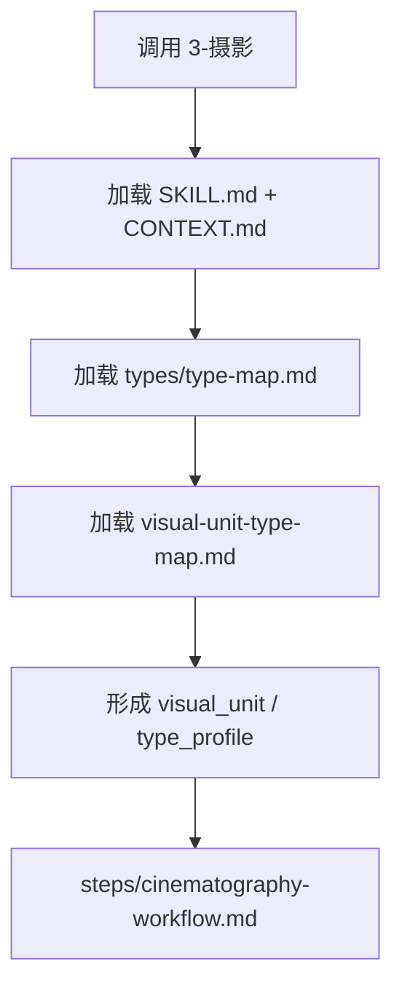

# Type Map

## Package Index

| package | role |
| --- | --- |
| `visual-unit-type-map.md` | 判断画面句子、声画承托、高点画面和非画面字段的镜头语言处理策略 |

## Default Package Rule

- 默认加载 `visual-unit-type-map.md`。
- 若输入含多类画面字段，先由该类型包形成 `visual_unit` 与 `type_profile`，再进入 `steps/cinematography-workflow.md`。
- 本索引只负责类型包发现，不替代 `SKILL.md` 的输入、输出、subagents 或 review 合同。

## Loading Flow

