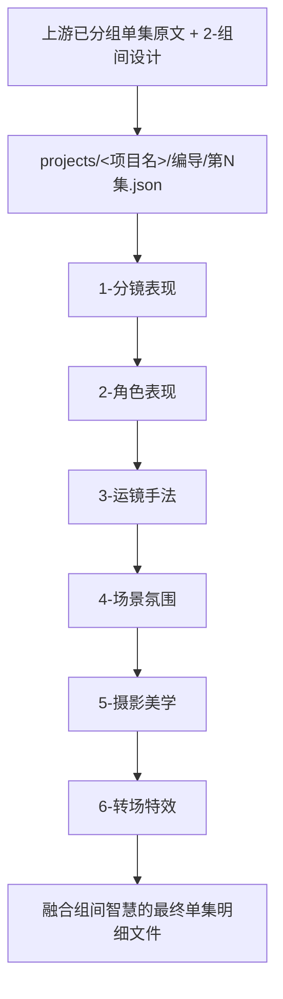
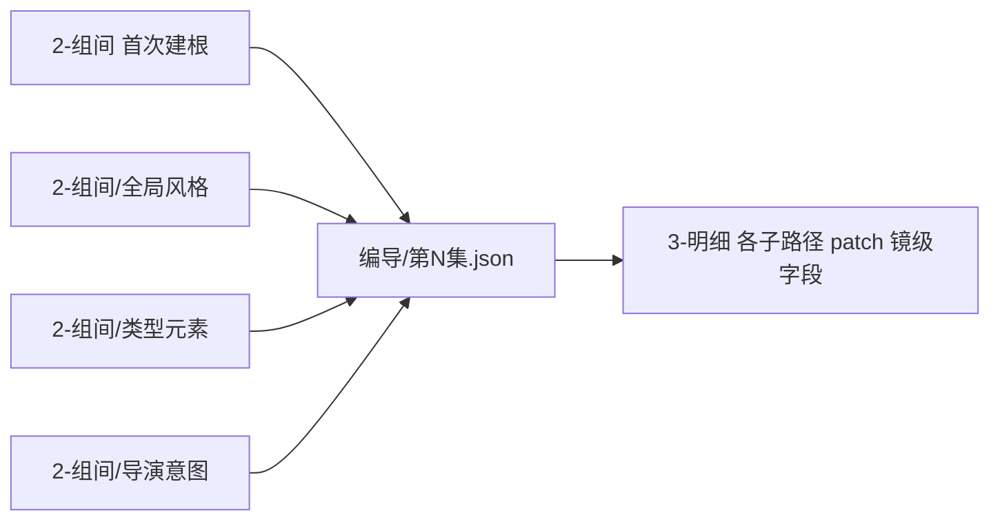

# aigc 3-明细

## 概述

`3-明细` 是 `aigc` 技能树里承接 `1-规划 + 2-组间` 的组内明细设计阶段真源。

本阶段不再把任务理解成泛化的“写脚本”或“补正文”，而是锁定为围绕分镜组内颗粒度展开的多层精修设计：

1. 以上游已经完成分集、分组的原文为底稿
2. 以“分镜组内明细”而不是“泛化正文推进”作为默认工作粒度
3. 按任务类型进入不同精修层，在同一份单集编导根文件上连续 patch-in-place
4. 最终沉淀为一份融合组间约束、镜头组织、角色动作、氛围与转场设计的单集明细主文件

当前 canonical 子路径包括：

1. `1-分镜表现`
2. `2-角色表现`
3. `3-运镜手法`
4. `4-场景氛围`
5. `5-摄影美学`
6. `6-转场特效`

交付类型：`内容输出型`
## When to Use

- 需要把上游已分组的单集原文继续收束成可拍、可感、可继续下游消费的明细主文件。
- 需要围绕某个分镜组或镜头段继续精修分镜表现、角色表现、运镜、氛围、摄影或转场层。
- 需要把 `2-组间` 的风格、类型与导演意图中的节奏提示，逐层压进 `3-明细` 的单一明细真源。
## When Not to Use

- 当前仍在做 `0-Init`、`1-规划` 或 `2-组间`，上游结构与编导约束还未锁定。
- 当前任务已经进入 `4-主体`、`5-画面` 或 `6-视频` 的资产/执行层。
- 用户要的是泛化剧情改写、对白创作或一次性正文重写，而不是组内明细精修。
## 阶段总前提（Mandatory）

1. `3-明细` 的输入真源是“已 bootstrap 且已具备组间字段的统一编导根文件”，不是空白页。
2. 每个子路径都只能在原文基础上做“组内明细精修”，不得擅自改写上游事实。
3. 各子路径默认共享同一份单集编导主文件：`projects/<项目名>/编导/第N集.json`。
4. 子路径输出优先采用 `patch-in-place`，并把证据、分析、校验侧车落到各自子目录。
5. 编排顺序默认服从数字前缀，从 `1-分镜表现` 开始逐层向后发酵。
6. 若 `metadata.source_profile.preset_retention_mode in {preserve_and_extend, preserve_only}`，则 storyboard 预设点属于上游保护性锚点；本阶段只能顺着这些锚点扩写，不得推翻其已锁定轴。
## 核心约束（Mandatory）

- 工匠级契约继承：遵循 `skill-内容输出型/SKILL.md` 的反模板化与深度思考要求，本阶段不做模板化批量写稿，也不退回泛化脚本写作，只在已锁定 grouped source 与单一主文件上做分层精修设计。
- Root-Cause 执行契约继承：一旦出现阶段路由失真、主文件漂移、子路径并行冲突或越权改写，先按根 `AGENTS.md` 与本技能 `Root-Cause Execution Contract` 上溯规则源，再决定是否改正文。
- 自评偏差与缓解：LLM 容易把 `3-明细` 误写回泛化剧本任务，或把多个子路径混写进同一轮；执行时必须先锁 `2-组间 首次建根 -> 组级 patch -> 第N集.json -> 3-明细 patch-in-place` 的单一真源链，再判唯一主入口。
- 阶段真源保持为“已分组原文 -> projects/<项目名>/编导/第N集.json -> 子路径 patch-in-place”，不得把 `3-明细` 退化成一次性另写整稿或泛化正文改写。
- 若上游来源画像表明当前集来自 `storyboard_script`，则 `3-明细` 的默认动作是“preserve and extend”：补角色、氛围、摄影、微动作与必要细化，但不重排已锁定的场次边界、镜头顺序、核心运镜母题与转场钩子。
## Visual Maps

## Reference Modules (Mandatory)

`aigc 3-明细/SKILL.md` 只保留主合同、边界、门禁、回指和 Mermaid 摘要；专项细则以下列模块为真源：

- `references/chain-of-thought.md`
- `references/execution-flow.md`
- `references/type-strategies.md`
- `references/output-template.md`

硬规则：

1. 根 `SKILL.md` 仍是唯一主合同；`references/` 是模块化细则承载层，不是并行第二真源。
2. 若字段、流程、路由或输出契约需要升级，优先回写对应 `references/*.md`。
3. 主 `SKILL.md` 只保留摘要与回链，不重复展开长表格、长流程与长写位合同。
## Route Summary

- 当前技能的详细路由矩阵、默认调度顺序与回退规则已下沉到 `references/type-strategies.md`，并以“哪个组内明细层最先介入”为首要判断。
- 若 `metadata.source_profile` 存在，详细来源保护规则同样以下沉到 `references/type-strategies.md` 的 source-mode 小节为准。
- 主 `SKILL.md` 只保留入口边界与判路摘要，不再重复长表。
## Execution Summary

- canonical landing、共享运行时继承与完整 workflow 已下沉到 `references/execution-flow.md`。
- 主 `SKILL.md` 只保留阶段边界与执行摘要，不重复整段流程细则。
## Output Summary

- canonical write slot 与辅助输出责任已整理到 `references/output-template.md`。
- 统一根文件、bootstrap 模板与共享字段壳统一由 `.agents/skills/aigc/_shared/project-runtime-layout.md`、`.agents/skills/aigc/_shared/director_episode_bootstrap.template.json`、`.agents/skills/aigc/_shared/director_episode_output.schema.json` 共同约束。
- 本技能即使没有独立模板，也必须沿唯一写位与单一真源执行。

## Unified Root File Output Governance (Mandatory)

`3-明细` 的标准输出机制固定为“单一根文件真源 + 子技能 sidecar + 父级 patch 聚合”：

1. `projects/<项目名>/编导/第N集.json` 是唯一业务真相，只承载最终镜级事实，不承载各子技能的完整创作过程稿。
2. 各子技能默认直接对自己负责的镜级字段做 `field patch`，不得先各写一份平行主稿再让父级二次汇总。
3. 子技能若需要保留完整三段式创作过程，必须写到本子技能 sidecar，而不是重复灌入统一根文件。
4. sidecar 默认允许采用三段式 `MD`：`元数据 / 思维链 / 主内容`；它是工作侧车，不是 episode 真源。
5. 父级根技能负责在执行前完整加载 `projects/<项目名>/编导/第N集.json`，在执行后聚合并校验各子技能 `field patch`，再统一落盘。
6. 若 shared schema 当前仍保留顶层 `thinking_chain`，该字段只允许承载父级精简决策摘要、patch provenance 或阶段级验收摘要，不允许重复塞入各子技能完整思维链。
7. 任何子技能都不得创建第二份 episode 主文件、第二份 JSON 根稿、或第二份“汇总后总稿”。

对应引用路径固定如下：

- 统一根文件结构真源：`.agents/skills/aigc/_shared/director_episode_output.schema.json`
- 项目运行时真源：`.agents/skills/aigc/_shared/project-runtime-layout.md`
- 本阶段输出模板真源：`references/output-template.md`
- 子技能局部写位与 sidecar 规则：各自 `references/execution-flow.md` / `references/type-strategies.md`

## Selective Dispatch And Aggregation Contract (Mandatory)

`3-明细` 的子技能调度默认是选择性的，而不是为了结构完整做全量运行：

1. 父级根技能必须先做 route decision，明确本轮 `selected_subskills[]`，再进入执行。
2. 只有命中的子技能才允许在本轮执行并返回 `field patch`。
3. 聚合器只接收并合并 `selected_subskills[]` 的有效 patch，不得把未命中子技能视为隐式参与者。
4. 未调度子技能与总 `json` 无关，禁止为了“结构完整”而补空聚合。
5. 若某镜级字段在本轮没有命中对应子技能，则该字段保持现状，不创建空字段、不覆盖既有值、不写默认占位。
6. 若多个子技能同时命中，仍必须先服从父级默认顺序或显式 route decision，再按序聚合，不得把“多层可做”误当作“全层齐跑”许可。
7. 阶段验收、validation-report 与 patch provenance 只记录本轮实际调度到的子技能，不记录未执行子技能的伪状态。

本合同与上一节的输出治理合同共同约束：

- `Unified Root File Output Governance` 解决“根文件放什么、sidecar 放什么”
- `Selective Dispatch And Aggregation Contract` 解决“哪些子技能本轮进入聚合、哪些完全与总 json 无关”
## Field System Summary

- 字段主表、thought pass 与 pass table 已下沉到 `references/chain-of-thought.md`。
- 主 `SKILL.md` 只保留字段系统摘要，不再重复长表。
## Root-Cause Execution Contract (Mandatory)

当出现以下症状时，必须先修 `3-明细` 的源层合同：

- 子路径很多，但都在各写各的版本，无法汇总为单一根文件
- 上游 grouped source 没有被保留，明细阶段直接退回泛化正文重写
- `1-分镜表现` 尚未完成，后续子路径却开始叠加细节
- 子路径编号存在，但父级没有显式解释“为什么按这个顺序发酵”
- `2-角色表现` 已补齐父子合同，但父级状态仍把它写成待补
- `3-明细` 没有读取已落盘的整份 `projects/<项目名>/编导/第N集.json`，只凭局部字段盲写

必经链路：

`Symptom -> Direct Technical Cause -> Rule Source -> Meta Rule Source -> Fix Landing Points`

优先检查：

- `Rule Source`
  - `.agents/skills/aigc/3-明细/SKILL.md`
  - `.agents/skills/aigc/3-明细/CONTEXT.md`
  - `.agents/skills/aigc/3-明细/subtypes/*/SKILL.md`
- `Meta Rule Source`
  - `.agents/skills/aigc/SKILL.md`
  - 根 `AGENTS.md`
## SKILL / CONTEXT 分工（Mandatory）

- `SKILL.md` 锁定本层触发条件、唯一真源、执行顺序、写位边界与验收门槛。
- `CONTEXT.md` 沉淀失败类型、修复策略、成功 heuristic 与复用证据，不重写本层主合同。
- 经多轮验证稳定成立的经验，才允许从 `CONTEXT.md` 晋升回本 `SKILL.md` 或上层技能合同。
## Context Preload (Mandatory)

- 执行前先加载上层 `.agents/skills/aigc/SKILL.md` 与 `CONTEXT.md`。
- 再加载本 `SKILL.md` 与本地 `CONTEXT.md`。
- 再读取 `.agents/skills/aigc/_shared/project-runtime-layout.md` 与完整的 `projects/<项目名>/编导/第N集.json`。
- 读取 `projects/<项目名>/编导/第N集.json` 时，必须先检查 `metadata.source_profile`，再决定当前轮是否允许自由扩写。
- 若进入某个子路径，再继续加载对应 `subtypes/<子路径>/SKILL.md + CONTEXT.md`。
- 若项目根 `team.yaml.enabled == true`，继续加载 `.agents/skills/aigc/_shared/council-runtime/module-spec.md`。
- 优先级遵循：用户显式请求 > 根 `AGENTS.md` > `.agents/skills/aigc/SKILL.md` > 本 `SKILL.md` > 各级 `CONTEXT.md`。
- 需要细化局部思维链、执行流、类型策略与输出模板时，继续加载本目录 `references/*.md`。
