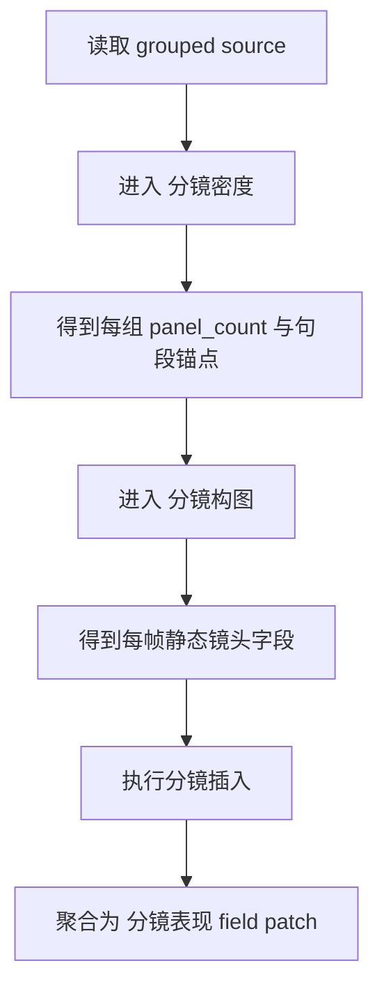

# aigc 3-明细 / 1-分镜表现

## 概述

`1-分镜表现` 是 `3-明细` 阶段的第一层加权扩写。

它的核心功能只有一个：`分镜插入`。

也就是在“上游已经完成分组的单集原文”基础上，不改写原句段事实，而是在相关句段之前内联注入：

`[分镜1] / [分镜2] / [分镜3] ...`

并为每条分镜补齐最小可读的静态镜头信息，使脚本从“只有文字”升级为“已经具有镜头感的文字”。

交付类型：`内容输出型`
## When to Use

- 需要先把 grouped source 变成带分镜标签的脚本主文件。
- 需要在原句段之前插入 `[分镜N]` 标记与静态镜头字段。
- 需要先决定“一个组到底切几镜”，再决定“每一镜长什么样”。
## When Not to Use

- 当前任务主要是角色心理、动作细化，应进入 `2-角色表现`。
- 当前任务主要是镜头运动、转场、光影或色彩，不属于本层。
- 上游 grouped source 还没有锁定，或者原文分组本身仍不稳定。
## 子技能边界

### `1-分镜表现` 拥有

- 分镜插入总合同
- 组内 `[分镜N]` 编号规则
- 句段锚点定位
- `分镜密度 -> 分镜构图 -> 内联回写` 的父级编排
- `projects/<项目名>/编导/第N集.json` 中 `分镜表现` 字段的第一次镜头化补强

### `1-分镜表现` 不拥有

- 运镜与镜头运动
- 光影、色彩、天气氛围
- 转场设计
- 角色深写与心理层扩写
## 核心约束（Mandatory）

- 工匠级契约继承：遵循 `skill-内容输出型/SKILL.md` 的反模板化与深度思考要求，本层不凭空发明分镜，而是在 grouped source 与父级主文件上做有证据的分镜化增强。
- Root-Cause 执行契约继承：一旦出现分镜插入漂移、子技能顺序错乱、主文件回写冲突或越权补写，先按根 `AGENTS.md` 与本技能 `Root-Cause Execution Contract` 上溯规则源，再决定是否改正文。
- 自评偏差与缓解：LLM 容易跳过上游裁决直接写内联分镜，或把运镜/摄影信息提前写进本层；执行时必须先锁 `分镜密度 -> 分镜构图 -> 分镜插入` 的受控链，再进入主文件回写。
- 本层只允许沿 `分镜密度 -> 分镜构图 -> 分镜插入` 的受控链推进，不得跳过上游裁决直接回写主文件。
- 若 `metadata.source_profile.preset_registry` 存在，必须先判每个锚点的 `lock_level + projected_shot_mode`。默认规则是：外部分镜保骨架，本层长血肉；`hard_lock` 只能补厚，`soft_lock` 可以一锚多镜，`reference_only` 才允许重构。
## Visual Maps

## Reference Modules (Mandatory)

`aigc 3-明细 / 1-分镜表现/SKILL.md` 只保留主合同、边界、门禁、回指和 Mermaid 摘要；专项细则以下列模块为真源：

- `references/chain-of-thought.md`
- `references/execution-flow.md`
- `references/type-strategies.md`
- `.agents/skills/aigc/3-明细/references/output-template.md`

硬规则：

1. 根 `SKILL.md` 仍是唯一主合同；`references/` 是模块化细则承载层，不是并行第二真源。
2. 若字段、流程、路由或输出契约需要升级，优先回写对应 `references/*.md`。
3. 主 `SKILL.md` 只保留摘要与回链，不重复展开长表格、长流程与长写位合同。
## Route Summary

- 当前技能的路由矩阵、VSM 变量、情况判定、策略映射与回退规则已下沉到 `references/type-strategies.md`。
- 若命中 storyboard 粗锚点，“一锚多镜”与锁级处理合同同样以下沉到 `references/type-strategies.md` 为准。
- 主 `SKILL.md` 只保留入口边界与判路摘要，不再重复长表。
## Execution Summary

- canonical landing、共享运行时继承与完整 workflow 已下沉到 `references/execution-flow.md`。
- 主 `SKILL.md` 只保留阶段边界与执行摘要，不重复整段流程细则。
## Output Summary

- 输出内容模板统一继承父级 `.agents/skills/aigc/3-明细/references/output-template.md`，本技能不再定义本地 output-template 真源；局部写位与侧车规则继续由 `references/execution-flow.md` 与 `references/type-strategies.md` 承载。
- 主 `SKILL.md` 只保留输出职责摘要，不再重复整段模板正文。
## Field System Summary

- 字段主表、thought pass 与 pass table 已下沉到 `references/chain-of-thought.md`。
- 主 `SKILL.md` 只保留字段系统摘要，不再重复长表。
## Root-Cause Execution Contract (Mandatory)

当出现以下症状时，必须先修本父级合同：

- 已有 `panel_count`，但不知道怎么插回原文
- 构图字段写出来了，却没有统一内联格式
- `[分镜N]` 插到句段后面或插到了错误分组
- 两个子技能各自成立，但没有父级把它们编成一条链

必经链路：

`Symptom -> Direct Technical Cause -> Rule Source -> Meta Rule Source -> Fix Landing Points`

优先检查：

- `Rule Source`
  - `.agents/skills/aigc/3-明细/subtypes/1-分镜表现/SKILL.md`
  - `.agents/skills/aigc/3-明细/subtypes/1-分镜表现/CONTEXT.md`
  - `.agents/skills/aigc/3-明细/subtypes/1-分镜表现/subtypes/分镜密度/SKILL.md`
  - `.agents/skills/aigc/3-明细/subtypes/1-分镜表现/subtypes/分镜构图/SKILL.md`
- `Meta Rule Source`
  - `.agents/skills/aigc/3-明细/SKILL.md`
  - `.agents/skills/aigc/SKILL.md`
  - 根 `AGENTS.md`
## SKILL / CONTEXT 分工（Mandatory）

- `SKILL.md` 锁定本层触发条件、唯一真源、执行顺序、写位边界与验收门槛。
- `CONTEXT.md` 沉淀失败类型、修复策略、成功 heuristic 与复用证据，不重写本层主合同。
- 经多轮验证稳定成立的经验，才允许从 `CONTEXT.md` 晋升回本 `SKILL.md` 或上层技能合同。
## Context Preload (Mandatory)

- 执行前先加载 `.agents/skills/aigc/3-明细/SKILL.md + CONTEXT.md`。
- 再加载本 `SKILL.md + CONTEXT.md`。
- 若项目根 `team.yaml.enabled == true`，继承上层 `3-明细` 的顾问团运行时，不在本层重复定义第二套规则。
- 进入子路径时，继续加载对应 `subtypes/<子路径>/SKILL.md + CONTEXT.md`。
- 优先级遵循：用户显式请求 > 根 `AGENTS.md` > `.agents/skills/aigc/SKILL.md` > `.agents/skills/aigc/3-明细/SKILL.md` > 本 `SKILL.md` > 各级 `CONTEXT.md`。
- 需要细化局部思维链、执行流、类型策略与输出模板时，继续加载本目录 `references/*.md`。
