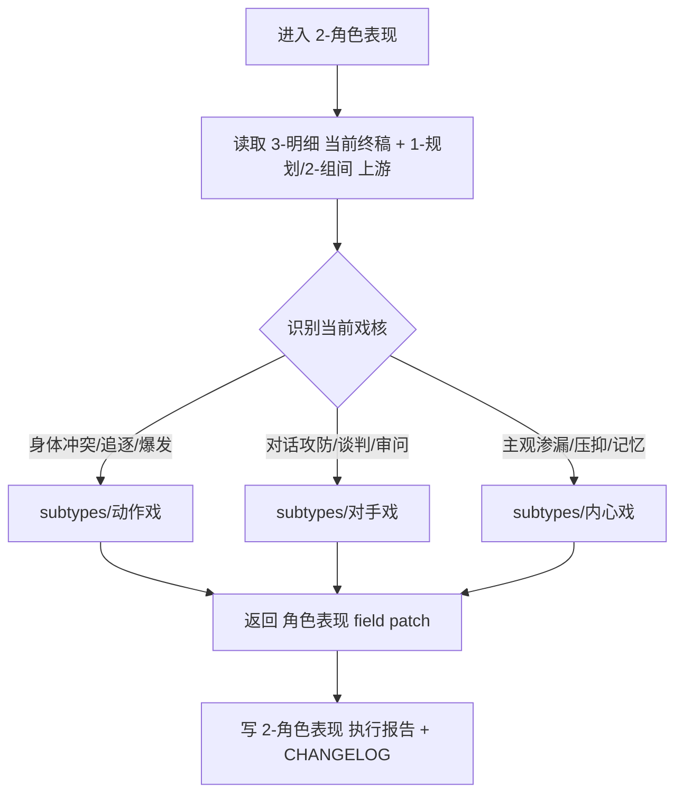
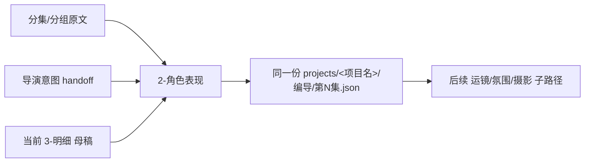

# aigc 3-明细 / 2-角色表现

## 概述

`2-角色表现` 是 `3-明细` 串行扩写链中的第二层表现增强站。

它负责把人物“能看见什么、能感到什么、为什么这一刻会这样行动/沉默/爆裂”补到终稿里，但不另起一份平行稿。

在本阶段里，角色表现不是泛泛补细节，而是按三条无序子路径进行精确路由：

1. `动作戏`
2. `对手戏`
3. `内心戏`

三者目录名都不带数字前缀，命名上属于 `unordered`。但因为它们默认共享同一份 `projects/<项目名>/编导/第N集.json` 的 `角色表现` 写位，所以父级必须显式声明：单任务唯一进入；多命中同集时受控串行，不做并行乱写。

交付类型：`内容输出型`
默认写感：`具象 / 克制 / 可拍摄 / 有呼吸感`
## When to Use

- 需要为终稿脚本补强角色的身体动作、对话攻防或内心主观层。
- 需要把 `2-组间` 的导演意图与其中的节奏提示进一步压到角色层的可演性上。
- 需要判断当前角色表现任务属于 `动作戏 / 对手戏 / 内心戏` 中哪一类唯一主入口。
- 同一集已有基础正文，但人物还是“会说事、不会活”。
## When Not to Use

- 当前问题主要是镜头骨架、运镜语法、摄影光色或转场设计，应进入其他脚本子路径。
- 项目还没有稳定的分集原文或组间 handoff，人物层没有可依托的戏核。
- 当前任务已进入演员表演指导、镜头调度或分镜页绘制层。
## 职责边界

### `2-角色表现` 拥有

- 角色行为层的加权扩写路由
- `动作戏 / 对手戏 / 内心戏` 的唯一主入口裁决
- 对同一终稿文件的人物层增强
- 对表演加压、反应链、主观层与冲突层的父级协调

### `2-角色表现` 不拥有

- 全阶段脚本总路由
- 镜头语言、摄影语言、转场语言的最终真源
- 角色设定资产本体
- 分镜页与画面设计资产
## 核心约束（Mandatory）

- 工匠级契约继承：遵循 `skill-内容输出型/SKILL.md` 的反模板化与深度思考要求，本层不把人物增强写成泛泛补细节，而是按戏核与 dominant subtype 做精准路由。
- Root-Cause 执行契约继承：一旦出现 leaf 冲突、写集并发、戏核误判或上游 handoff 缺失，先按根 `AGENTS.md` 与本技能 `Root-Cause Execution Contract` 上溯规则源，再决定是否改正文。
- 自评偏差与缓解：LLM 容易把 `动作戏 / 对手戏 / 内心戏` 平均分配到同一场景，或只盯正文不读上游；执行时必须先锁输入链、戏核压力中心与唯一主入口，再决定是否补充 secondary leaf。
- 同一集多命中时必须先判 dominant subtype，再按 `dominant -> supplemental` 受控串行，不得并行写同一份终稿。
- 共享风格基线：正文增强必须优先落在可见行为、节奏停顿、空间关系与物件交互上；禁止把“痛苦、紧张、愤怒、心虚”这类抽象情绪词单独当作完成态。
- 不可变层：禁止改写对白、独白、旁白原文；禁止新增关键剧情事实、关键角色关系与关键世界规则。本层只做 `patch-in-place` 式外化增强，不重写上游事实。
- 微表演增强法（MPEA）：每个关键节拍优先覆盖至少 3 类锚点，锚点池为 `面部 / 目光 / 姿态 / 手部与道具 / 呼吸与微观节奏 / 交互反馈`；按需选择，不机械凑满。
- Lens-awareness：动作与反应要能同时支持 `特写级` 微震、`中景级` 重心变化、`全景级` 空间关系变化中的至少一层，不得只剩悬浮形容词。
- Subtext-driven：允许言行错位，但只允许通过动作、停顿、视线、手部或空间压迫制造潜台词，不允许借改字改句来伪造深度。
- 输入优先级：`writer.performance` bundle 是本层默认消费入口；legacy `project_preset.json` 仅作兼容回退，不再视为长期主合同。
## Visual Maps

## Reference Modules (Mandatory)

`aigc 3-明细 / 2-角色表现/SKILL.md` 只保留主合同、边界、门禁、回指和 Mermaid 摘要；专项细则以下列模块为真源：

- `references/chain-of-thought.md`
- `references/execution-flow.md`
- `references/type-strategies.md`
- `.agents/skills/aigc/3-明细/references/output-template.md`

硬规则：

1. 根 `SKILL.md` 仍是唯一主合同；`references/` 是模块化细则承载层，不是并行第二真源。
2. 若字段、流程、路由或输出契约需要升级，优先回写对应 `references/*.md`。
3. 主 `SKILL.md` 只保留摘要与回链，不重复展开长表格、长流程与长写位合同。
## Route Summary

- 当前技能的详细路由矩阵、默认调度顺序与回退规则已下沉到 `references/type-strategies.md`。
- 主 `SKILL.md` 只保留入口边界与判路摘要，不再重复长表。
## Execution Summary

- canonical landing、共享运行时继承与完整 workflow 已下沉到 `references/execution-flow.md`。
- 主 `SKILL.md` 只保留阶段边界与执行摘要，不重复整段流程细则。
## Output Summary

- 输出内容模板统一继承父级 `.agents/skills/aigc/3-明细/references/output-template.md`，本技能不再定义本地 output-template 真源；局部写位与侧车规则继续由 `references/execution-flow.md` 与 `references/type-strategies.md` 承载。
- 本技能即使没有独立模板，也必须沿唯一写位与单一真源执行。
## Field System Summary

- Think-Think 设计快照、字段主表、thought pass 与 pass table 已下沉到 `references/chain-of-thought.md`。
- 主 `SKILL.md` 只保留字段系统摘要，不再重复长表。
## Root-Cause Execution Contract (Mandatory)

当出现以下症状时，必须先修 `2-角色表现` 的父级合同，而不是只补单个 leaf：

- 三个子路径都存在，但父级看不出何时进哪个
- 同一集多子路径同时命中时发生并行写冲突
- 只补了某个 leaf，却没有把父级写集冲突规则收紧
- 角色表现补写没有读取 `2-组间` handoff
- 父级仍把角色表现理解成“堆细节”，而不是“按戏核路由”

必经链路：

`Symptom -> Direct Technical Cause -> Rule Source -> Meta Rule Source -> Fix Landing Points`

优先检查：

- `Rule Source`
  - `.agents/skills/aigc/3-明细/subtypes/2-角色表现/SKILL.md`
  - `.agents/skills/aigc/3-明细/subtypes/2-角色表现/CONTEXT.md`
  - `.agents/skills/aigc/3-明细/subtypes/2-角色表现/subtypes/*/SKILL.md`
- `Meta Rule Source`
  - `.agents/skills/aigc/3-明细/SKILL.md`
  - 根 `AGENTS.md`
## SKILL / CONTEXT 分工（Mandatory）

- `SKILL.md` 锁定本层触发条件、唯一真源、执行顺序、写位边界与验收门槛。
- `CONTEXT.md` 沉淀失败类型、修复策略、成功 heuristic 与复用证据，不重写本层主合同。
- 经多轮验证稳定成立的经验，才允许从 `CONTEXT.md` 晋升回本 `SKILL.md` 或上层技能合同。
## Context Preload (Mandatory)

- 每次调用本技能时，必须自动加载同目录 `CONTEXT.md`。
- 进入具体 leaf 时，继续加载 `subtypes/<leaf>/SKILL.md` 与 `CONTEXT.md`。
- 读取项目配置时，优先消费 `writer.performance` bundle；仅在 bundle 缺失时回退到 legacy `project_preset.json`。
- 若项目根 `team.yaml.enabled == true`，继承上层 `3-明细` 的顾问团运行时，不在本层重复定义第二套规则。
- 优先级遵循：用户显式请求 > 根 `AGENTS.md` > `.agents/skills/aigc/3-明细/SKILL.md` > 本 `SKILL.md` > 本 `CONTEXT.md`。
- 需要细化局部思维链、执行流、类型策略与输出模板时，继续加载本目录 `references/*.md`。
