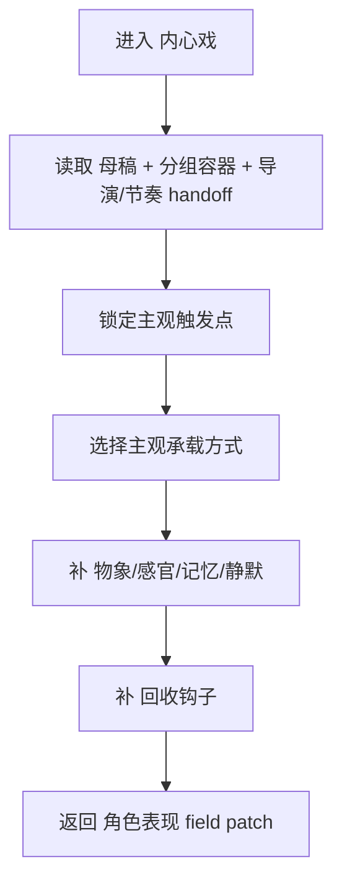

# aigc 3-明细 / 2-角色表现 / 内心戏

## 概述

`内心戏` 负责把角色的主观压力、失语、记忆渗漏、欲望反冲或感官错位写成可见、可感的戏。

它参考 `AIGC-ZEN-VOID/.agents/skills/aigc2026/1-编剧/5-非现实画面` 的高价值能力，但不把自己写成“非现实画面”的复制品，而是收束为当前 `3-明细` 终稿语境中的“内心戏” leaf：

- 主观画面只是手段，不是唯一答案
- 可用静默、物象、感官、记忆碎片、轻度非现实化来承接内心戏
- 一切主观强化都必须回到当下场景、关系或下一动作

交付类型：`内容输出型`
## When to Use

- 场景的真正张力在“人没说出口、也没真正做出来”的那部分。
- 角色正在压抑、迟疑、崩裂、回忆、幻听、心口不一或情绪即将失控。
- 文本已经有事件，但缺少主观感受层，导致人物像只在完成剧情流程。
## When Not to Use

- 场景核心是身体追逐或打斗，应进入 `动作戏`。
- 场景核心是双边语言攻防，应进入 `对手戏`。
- 当前只是想堆抽象抒情词，没有明确触发与回收点。
## 职责边界

### `内心戏` 拥有

- 主观触发判定
- 记忆/感官/物象/轻度非现实的内层增强
- 主观段的回收钩子
- 静场承压与情绪泄露

### `内心戏` 不拥有

- 脱离场景的独立意识流短篇
- 世界规则级幻觉系统
- 纯镜头特效脚本
- 摄影/转场的最终方案
## 核心约束（Mandatory）

- 工匠级契约继承：遵循 `skill-内容输出型/SKILL.md` 的反模板化与深度思考要求，本层只在已锁定真源与唯一写位上做有证据的增强。
- Root-Cause 执行契约继承：一旦出现路由失真、写位冲突、越权改写或主文件漂移，先按根 `AGENTS.md` 与本技能 `Root-Cause Execution Contract` 上溯规则源，再决定是否改正文。
- 自评偏差与缓解：LLM 容易把 sibling 能力混写、用抽象形容词代替可执行落笔，或忽略唯一主入口；执行时必须先锁输入链、边界与写位，再补本层字段，并把未覆盖问题显式留口给后续层。
- 本层只增强主观承载与回收钩子；不得把当前场景扩成脱离现场的独立意识流或世界规则。

1. 先有触发，再有内层增强；没有触发证据，不得强写主观段。
2. 正文只允许自然融写，类型名只作内部裁决标签；不得出现 `内心OS画面：`、`回忆画面：` 一类标签式行首。
3. 对白、独白、旁白的既有文本逐字不可变；不得新增关键剧情事实、关键角色关系或关键世界规则。
4. 单个关键节拍默认只选一种主观承载方式；只有当辅类型提供第二叙事价值时，才允许 `1 主 + 1 辅` 协同。
5. 单场景默认融写 `1-3` 条、单段最多 `1` 条；同一触发点不得重复堆叠同类画面，非现实段必须在触发语句后就近落盘。
6. 内心戏必须回收，至少回到 `当下动作 / 关系对象 / 下一决定` 之一。
7. 禁止把内心戏写成标签说明腔、脱离现场的长篇意识流，或把非现实段扩成替代现实叙事的独立支线。
8. 允许增强主观层，但不得新建世界规则、独立剧情线或改变场景事实结论。
9. 关键节拍优先覆盖至少 3 类 MPEA 锚点，但静场允许把锚点收紧到 `呼吸 / 目光 / 姿态` 的极小变化，不为凑数而加动作。
## Visual Maps

## Reference Modules (Mandatory)

`aigc 3-明细 / 2-角色表现 / 内心戏/SKILL.md` 只保留主合同、边界、门禁、回指和 Mermaid 摘要；专项细则以下列模块为真源：

- `references/chain-of-thought.md`
- `references/execution-flow.md`
- `references/type-strategies.md`
- `.agents/skills/aigc/3-明细/references/output-template.md`

硬规则：

1. 根 `SKILL.md` 仍是唯一主合同；`references/` 是模块化细则承载层，不是并行第二真源。
2. 若字段、流程、路由或输出契约需要升级，优先回写对应 `references/*.md`。
3. 主 `SKILL.md` 只保留摘要与回链，不重复展开长表格、长流程与长写位合同。
## Route Summary

- 本技能是父级裁定后的唯一执行入口，不在本层再展开第二套路由矩阵。
- 局部进入前提、`NRVM-3D` 类型裁决、`IOS-Visual` 子机制、主辅类型协同与 unknown 回退见 `references/type-strategies.md`。
## Execution Summary

- canonical landing、共享运行时继承与完整 workflow 已下沉到 `references/execution-flow.md`。
- 主 `SKILL.md` 只保留阶段边界与执行摘要，不重复整段流程细则。
- 执行顺序固定为：先判主观任务，再锁触发证据、主类型、可视化落盘、回收钩子，最后再做密度与连续性复核。
## Output Summary

- 输出内容模板统一继承父级 `.agents/skills/aigc/3-明细/references/output-template.md`，本技能不再定义本地 output-template 真源；局部写位与侧车规则继续由 `references/execution-flow.md` 与 `references/type-strategies.md` 承载。
- 本技能即使没有独立模板，也必须沿唯一写位与单一真源执行。
- 若启用结构化执行报告或 JSON 镜像，主辅类型、落盘模式、回收钩子与证据链必须可追溯，但不得把结构化字段直接倒灌成正文标签。
## Field System Summary

- 字段主表、thought pass 与 pass table 已下沉到 `references/chain-of-thought.md`。
- 主 `SKILL.md` 只保留字段系统摘要，不再重复长表。
- 当前字段系统已显式覆盖：触发证据、主类型裁决、辅类型合法性、自然融写、现实回收、硬门禁校验与 sibling handoff。
## Root-Cause Execution Contract (Mandatory)

当出现以下症状时，必须先修 `内心戏` leaf 合同，而不是只在正文里继续补抒情句：

- 主观段没有明确触发点
- 同一节拍同时堆叠多种主观承载方式，或主辅类型没有第二价值
- 内心戏脱离当下动作或关系对象，写成悬空意识流
- 内心OS只剩心理判断句，没有镜头可见锚点
- 标签式写法、越权改对白/旁白、密度失控或跨场景漂移
- 本层越权改写摄影、特效或世界规则

必经链路：

`Symptom -> Direct Technical Cause -> Rule Source -> Meta Rule Source -> Fix Landing Points`

优先检查：

- `Rule Source`
  - `.agents/skills/aigc/3-明细/subtypes/2-角色表现/subtypes/内心戏/SKILL.md`
  - `.agents/skills/aigc/3-明细/subtypes/2-角色表现/subtypes/内心戏/CONTEXT.md`
- `Meta Rule Source`
  - `.agents/skills/aigc/3-明细/subtypes/2-角色表现/SKILL.md`
  - `.agents/skills/aigc/3-明细/SKILL.md`
  - 根 `AGENTS.md`
## SKILL / CONTEXT 分工（Mandatory）

- `SKILL.md` 锁定本层触发条件、唯一真源、执行顺序、写位边界与验收门槛。
- `CONTEXT.md` 沉淀失败类型、修复策略、成功 heuristic 与复用证据，不重写本层主合同。
- 经多轮验证稳定成立的经验，才允许从 `CONTEXT.md` 晋升回本 `SKILL.md` 或上层技能合同。
## Context Preload (Mandatory)

- 每次调用本技能时，必须自动加载同目录 `CONTEXT.md`。
- 优先级遵循：用户显式请求 > 根 `AGENTS.md` > `.agents/skills/aigc/3-明细/subtypes/2-角色表现/SKILL.md` > 本 `SKILL.md` > 本 `CONTEXT.md`。
- 需要细化局部思维链、执行流、类型策略与输出模板时，继续加载本目录 `references/*.md`。
