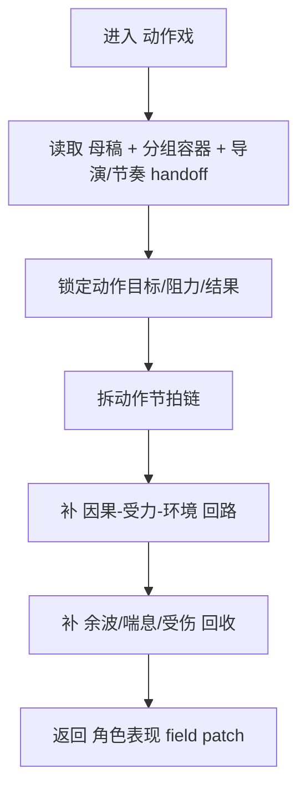

# aigc 3-明细 / 2-角色表现 / 动作戏

## 概述

`动作戏` 负责把“身体如何冲、如何撞、如何失衡、如何追回来”写清楚。

它参考 `AIGC-ZEN-VOID/.agents/skills/aigc2026/1-编剧/8-动作戏` 的高价值能力，但落地语境改写为当前仓的 `3-明细` 阶段：

- 不输出独立动作稿
- 只返回 `projects/<项目名>/编导/第N集.json` 中 `角色表现` 字段 patch
- 服务的是最终脚本终稿，而不是旧仓的单阶段 writer profile

交付类型：`内容输出型`
## When to Use

- 场景核心是追逐、搏斗、爆发、冲撞、逃生、夺取、压制。
- 文本里已经有“打起来了/跑起来了/乱起来了”，但身体因果、受击余波、环境利用仍很薄。
- 需要把角色行动从“抽象激烈”改成“可拍、可演、可分镜拆开”的动作链。
## When Not to Use

- 场景主要靠语言压迫、试探与谈判，应进入 `对手戏`。
- 场景主要靠主观情绪、记忆渗漏或内心失衡，应进入 `内心戏`。
- 当前需要的是镜头切法、摄影质感或特效表现，不是动作行为本身。
## 职责边界

### `动作戏` 拥有

- 身体攻防节拍链
- 动作因果与受力回路
- 环境/道具/空间对动作的参与
- 余波、伤感、喘息与回收

### `动作戏` 不拥有

- 完整镜头表
- 摄影参数与光色方案
- 特效镜头设计
- 角色设定资产的改写
## 核心约束（Mandatory）

- 工匠级契约继承：遵循 `skill-内容输出型/SKILL.md` 的反模板化与深度思考要求，本层只在已锁定真源与唯一写位上做有证据的增强。
- Root-Cause 执行契约继承：一旦出现路由失真、写位冲突、越权改写或主文件漂移，先按根 `AGENTS.md` 与本技能 `Root-Cause Execution Contract` 上溯规则源，再决定是否改正文。
- 自评偏差与缓解：LLM 容易把 sibling 能力混写、用抽象形容词代替可执行落笔，或忽略唯一主入口；执行时必须先锁输入链、边界与写位，再补本层字段，并把未覆盖问题显式留口给后续层。
- 本层输出必须落在动作节拍、受力回路与环境参与上；镜头、摄影、特效只允许作为留口，不得偷写为本层真源。

1. 每个关键动作节拍都要回答：谁要达成什么，遇到什么阻力，如何改变局势。
2. 禁止只写“很激烈、迅速、狠狠地”这类抽象强度词，不写动作结果。
3. 每个关键动作节拍优先覆盖至少 5 类物理锚点：`切入线 / 接触点 / 受力传递 / 失衡与补偿 / 脱离与再逼近 / 借景借物 / 伤势与余势`。
4. 允许强化动作线，但不得改变上游已锁定的场景结果、阵营站位与剧情结论。
5. 复杂走位、轴线与镜头组织问题要显式留口给后续 `分镜表现 / 运镜手法`，不在本技能里硬写成镜头脚本。
6. 当前段一旦命中兵器近战，必须先判兵器子类型，再决定交换链和受力链；未知兵器只能走保守泛化分支。
7. 默认追求接近香港黄金时代武指体系的可回放性：谁打中谁、怎么借势、怎么失衡、怎么追回线，都必须看得清。
8. 对白、独白、旁白原文属于不可变层；动作增强只能写入其周围的身体与环境链，不能为了“爽感”改字改剧情。
9. 若使用概括句，后面必须立刻跟上可回放细节链；至少出现一个完整交换回合：`试探/逼近 -> 接触/交击 -> 失衡/改线 -> 反制/脱离 -> 再逼近或结果落锤`。
## Visual Maps

## Reference Modules (Mandatory)

`aigc 3-明细 / 2-角色表现 / 动作戏/SKILL.md` 只保留主合同、边界、门禁、回指和 Mermaid 摘要；专项细则以下列模块为真源：

- `references/chain-of-thought.md`
- `references/execution-flow.md`
- `references/type-strategies.md`
- `.agents/skills/aigc/3-明细/references/output-template.md`

硬规则：

1. 根 `SKILL.md` 仍是唯一主合同；`references/` 是模块化细则承载层，不是并行第二真源。
2. 若字段、流程、路由或输出契约需要升级，优先回写对应 `references/*.md`。
3. 主 `SKILL.md` 只保留摘要与回链，不重复展开长表格、长流程与长写位合同。
## Route Summary

- 本技能是父级裁定后的唯一执行入口，不在本层再展开第二套路由矩阵。
- 局部进入前提、回退规则与 unknown 处理见 `references/type-strategies.md`。
## Execution Summary

- canonical landing、共享运行时继承与完整 workflow 已下沉到 `references/execution-flow.md`。
- 主 `SKILL.md` 只保留阶段边界与执行摘要，不重复整段流程细则。
## Output Summary

- 输出内容模板统一继承父级 `.agents/skills/aigc/3-明细/references/output-template.md`，本技能不再定义本地 output-template 真源；局部写位与侧车规则继续由 `references/execution-flow.md` 与 `references/type-strategies.md` 承载。
- 本技能即使没有独立模板，也必须沿唯一写位与单一真源执行。
## Field System Summary

- 字段主表、thought pass 与 pass table 已下沉到 `references/chain-of-thought.md`。
- 主 `SKILL.md` 只保留字段系统摘要，不再重复长表。
## Root-Cause Execution Contract (Mandatory)

当出现以下症状时，必须先修 `动作戏` leaf 合同，而不是只在正文里继续堆动词：

- 动作段没有触发原因，只剩表面打斗描写
- 节拍链断裂，看不出因果和受力
- 角色与环境没有真实交互，动作像悬浮发生
- 本层越权改写剧情结果、镜头方案或特效包装

必经链路：

`Symptom -> Direct Technical Cause -> Rule Source -> Meta Rule Source -> Fix Landing Points`

优先检查：

- `Rule Source`
  - `.agents/skills/aigc/3-明细/subtypes/2-角色表现/subtypes/动作戏/SKILL.md`
  - `.agents/skills/aigc/3-明细/subtypes/2-角色表现/subtypes/动作戏/CONTEXT.md`
- `Meta Rule Source`
  - `.agents/skills/aigc/3-明细/subtypes/2-角色表现/SKILL.md`
  - `.agents/skills/aigc/3-明细/SKILL.md`
  - 根 `AGENTS.md`
## SKILL / CONTEXT 分工（Mandatory）

- `SKILL.md` 锁定本层触发条件、唯一真源、执行顺序、写位边界与验收门槛。
- `CONTEXT.md` 沉淀失败类型、修复策略、成功 heuristic 与复用证据，不重写本层主合同。
- 经多轮验证稳定成立的经验，才允许从 `CONTEXT.md` 晋升回本 `SKILL.md` 或上层技能合同。
## Context Preload (Mandatory)

- 每次调用本技能时，必须自动加载同目录 `CONTEXT.md`。
- 优先级遵循：用户显式请求 > 根 `AGENTS.md` > `.agents/skills/aigc/3-明细/subtypes/2-角色表现/SKILL.md` > 本 `SKILL.md` > 本 `CONTEXT.md`。
- 需要细化局部思维链、执行流、类型策略与输出模板时，继续加载本目录 `references/*.md`。
