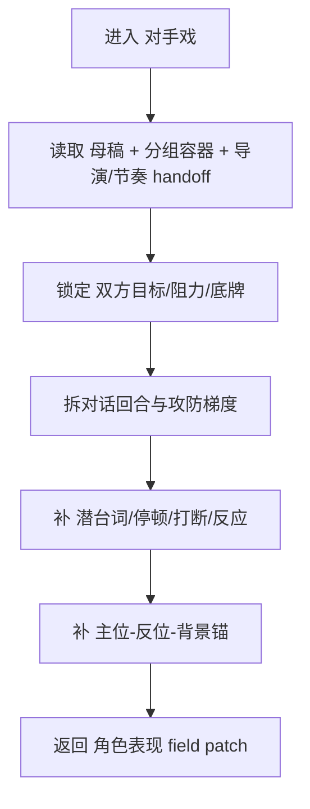

# aigc 3-明细 / 2-角色表现 / 对手戏

## 概述

`对手戏` 主要指对话戏，但不是简单整理对白。

它负责把双方或多方之间的语言攻防、权力升降、潜台词、停顿、打断与画面对位写得更像一场真正的“对手戏”。

它参照 `AIGC-ZEN-VOID/.agents/skills/aigc2026/1-编剧/2-对白·独白·旁白/标准剧` 中关于对话场景、正反打背景锚、对白画面同命题配对的高价值经验，但改写为当前 `3-明细` 终稿语境：

- 对白原文属于不可变层，只增强其周围的动作、停顿、反应与空间对位
- 重点是让对话成为对抗，而不是格式整理
- 同时保留可拍的对位反应与背景锚

交付类型：`内容输出型`
## When to Use

- 场景以谈判、审问、摊牌、试探、拉扯、表白、对峙等对话攻防为主。
- 人物都在说话，但你看不出谁在压谁、谁在退、谁在试探、谁在爆口。
- 对话信息很多，却缺少真正的回合推进、潜台词与对位反应。
## When Not to Use

- 场景主要靠追逐、格斗、爆炸或肢体冲撞，应进入 `动作戏`。
- 场景主要是压抑、失语、记忆渗漏或主观幻化，应进入 `内心戏`。
- 当前任务只是做对白格式冻结/说话人标注，应回到对白整理类技能，而不是本 leaf。
## 职责边界

### `对手戏` 拥有

- 双方目标与冲突命题
- 对话轮次与攻防转折
- 潜台词、停顿、打断、回避、反问
- 发言主位、受话反位与背景锚的可拍提示

### `对手戏` 不拥有

- 纯格式化对白整理
- 复杂空间调度与轴线设计
- 镜头清单与摄影语言
- 角色设定资产改写
## 核心约束（Mandatory）

- 工匠级契约继承：遵循 `skill-内容输出型/SKILL.md` 的反模板化与深度思考要求，本层只在已锁定真源与唯一写位上做有证据的增强。
- Root-Cause 执行契约继承：一旦出现路由失真、写位冲突、越权改写或主文件漂移，先按根 `AGENTS.md` 与本技能 `Root-Cause Execution Contract` 上溯规则源，再决定是否改正文。
- 自评偏差与缓解：LLM 容易把 sibling 能力混写、用抽象形容词代替可执行落笔，或忽略唯一主入口；执行时必须先锁输入链、边界与写位，再补本层字段，并把未覆盖问题显式留口给后续层。
- 本层只增强对话攻防、潜台词与对位反应；复杂空间调度与镜头组织继续留给后续 sibling。

1. 每段对手戏先锁双方 `想要什么 / 害怕什么 / 不能明说什么`。
2. 禁止改写对白、独白、旁白原文；只能围绕原句前后补 `停顿 / 动作 / 视线 / 呼吸 / 手部 / 空间压迫 / 交互反应`，且不得改变上游已锁定的场景结论、角色立场与关键事实。
3. 每一轮台词最好只承担一个主动作：`施压 / 躲闪 / 试探 / 反击 / 暴露 / 收口` 之一。
4. 至少补齐其中 3 类：`权力落差 / 轮次推进 / 潜台词 / 打断停顿 / 对位反应 / 背景锚`。
5. 对话场景的画面提示必须能支撑正反打或过肩理解，但复杂站位与换位问题要留给后续 sibling。
6. 关键回合优先覆盖至少 3 类 MPEA 锚点，尤其优先 `目光 / 呼吸与节奏 / 交互反馈`，再按角色口径补 `手部与道具` 或 `姿态`。
7. 允许言行错位来制造潜台词，但只能通过动作反差、停顿留白与空间行为体现，不允许借改字改句来制造“深度”。
## Visual Maps

## Reference Modules (Mandatory)

`aigc 3-明细 / 2-角色表现 / 对手戏/SKILL.md` 只保留主合同、边界、门禁、回指和 Mermaid 摘要；专项细则以下列模块为真源：

- `references/chain-of-thought.md`
- `references/execution-flow.md`
- `references/type-strategies.md`
- `.agents/skills/aigc/3-明细/references/output-template.md`

硬规则：

1. 根 `SKILL.md` 仍是唯一主合同；`references/` 是模块化细则承载层，不是并行第二真源。
2. 若字段、流程、路由或输出契约需要升级，优先回写对应 `references/*.md`。
3. 主 `SKILL.md` 只保留摘要与回链，不重复展开长表格、长流程与长写位合同。
## Route Summary

- 本技能是父级裁定后的唯一执行入口，不在本层再展开第二套路由矩阵。
- 局部进入前提、回退规则与 unknown 处理见 `references/type-strategies.md`。
## Execution Summary

- canonical landing、共享运行时继承与完整 workflow 已下沉到 `references/execution-flow.md`。
- 主 `SKILL.md` 只保留阶段边界与执行摘要，不重复整段流程细则。
## Output Summary

- 输出内容模板统一继承父级 `.agents/skills/aigc/3-明细/references/output-template.md`，本技能不再定义本地 output-template 真源；局部写位与侧车规则继续由 `references/execution-flow.md` 与 `references/type-strategies.md` 承载。
- 本技能即使没有独立模板，也必须沿唯一写位与单一真源执行。
## Field System Summary

- 字段主表、thought pass 与 pass table 已下沉到 `references/chain-of-thought.md`。
- 主 `SKILL.md` 只保留字段系统摘要，不再重复长表。
## Root-Cause Execution Contract (Mandatory)

当出现以下症状时，必须先修 `对手戏` leaf 合同，而不是只在正文里继续堆台词：

- 双方目标和攻防理由不成立
- 台词很多，但局势没有变化
- 攻守关系模糊，看不出谁在逼谁退
- 本层越权改写剧情事实、镜头方案或人物设定真源

必经链路：

`Symptom -> Direct Technical Cause -> Rule Source -> Meta Rule Source -> Fix Landing Points`

优先检查：

- `Rule Source`
  - `.agents/skills/aigc/3-明细/subtypes/2-角色表现/subtypes/对手戏/SKILL.md`
  - `.agents/skills/aigc/3-明细/subtypes/2-角色表现/subtypes/对手戏/CONTEXT.md`
- `Meta Rule Source`
  - `.agents/skills/aigc/3-明细/subtypes/2-角色表现/SKILL.md`
  - `.agents/skills/aigc/3-明细/SKILL.md`
  - 根 `AGENTS.md`
## SKILL / CONTEXT 分工（Mandatory）

- `SKILL.md` 锁定本层触发条件、唯一真源、执行顺序、写位边界与验收门槛。
- `CONTEXT.md` 沉淀失败类型、修复策略、成功 heuristic 与复用证据，不重写本层主合同。
- 经多轮验证稳定成立的经验，才允许从 `CONTEXT.md` 晋升回本 `SKILL.md` 或上层技能合同。
## Context Preload (Mandatory)

- 每次调用本技能时，必须自动加载同目录 `CONTEXT.md`。
- 优先级遵循：用户显式请求 > 根 `AGENTS.md` > `.agents/skills/aigc/3-明细/subtypes/2-角色表现/SKILL.md` > 本 `SKILL.md` > 本 `CONTEXT.md`。
- 需要细化局部思维链、执行流、类型策略与输出模板时，继续加载本目录 `references/*.md`。
