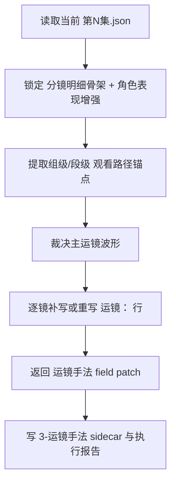
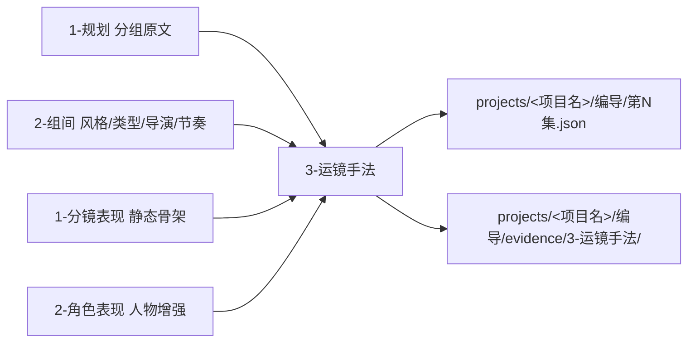

# aigc 3-明细 / 3-运镜手法

## 概述

`3-运镜手法` 是 `3-明细` 串行扩写链中的第三层镜头运动增强站。

它的任务不是再补一轮静态构图，也不是把光影、氛围或摄影术语提前写进正文，而是把已经具备 `[分镜N]` 静态镜头骨架、角色表现增强、上游组间 handoff 的段落，继续发酵成“镜头到底怎么走、怎么收、为什么这样看”的可执行运镜语言。

本技能吸收 `AIGC-ZEN-VOID` 中 `2-导演/8-运镜手法` 的高门槛思路，但不直接复制其 JSON 组级 `镜头运动` 合同；在当前阶段，真源已经统一到 `projects/<项目名>/编导/第N集.json`，所以本层的 canonical 落笔是：

1. 对命中的 `分镜明细[]` 生成 `运镜手法` 字段 patch
2. 在 sidecar 里沉淀组级/段级“观看路径波形”与裁决理由
3. 由父级把 patch 聚合回统一根文件，而不是另起平行稿

交付类型：`内容输出型`
## When to Use

- 当前 `第N集.json` 已经具备 grouped source 与 `分镜明细[]` 骨架，但镜头还是“能看见什么”，还没回答“镜头怎么动”。
- 需要把 `2-组间` 的导演意图、类型元素、节奏蓝图压到观看路径、推进节拍和收束落点上。
- 需要在不改写剧情事实的前提下，补强镜头前压、跟移、环绕、停顿、回拉、静止观察位等运镜设计。
- 需要把运镜写成可拍、可演、可继续交给 `4-场景氛围 / 5-摄影美学 / 6-转场特效` 的终稿层语言。
## When Not to Use

- 当前还没有 `[分镜N]` 与静态镜头骨架，应先回到 `1-分镜表现`。
- 当前问题主要是人物关系、心理爆裂、动作外化，应先进入 `2-角色表现`。
- 当前任务主要是环境压强、光影质地、色彩摄影或段间衔接，不属于本层。
- 用户要的是导演阶段 JSON 组级 `镜头运动` 字段，而不是脚本终稿增强，应回到导演链路。
## 职责边界

### `3-运镜手法` 拥有

- `3-明细` 阶段的镜头运动增强合同
- 从静态分镜骨架到动态观看路径的加权扩写
- 命中镜位的 `运镜手法` 字段 patch
- 组级/段级运镜波形的侧车裁决与执行报告

### `3-运镜手法` 不拥有

- `[分镜N]` 静态镜头字段的真源
- 原文剧情事实与角色设定的改写权
- 光影、色彩、摄影美学与转场的最终真源
- 导演阶段 JSON 主文件里的组级 `镜头运动` 字段
## 当前结构说明

- 当前 `3-运镜手法` 先作为单体父技能运行，不额外拆 leaf。
- 原因不是本层不复杂，而是当前最高杠杆的真源先是“把脚本里的运镜落笔方式锁死”。
- 未来若出现稳定且互斥的运镜子类，再升级到 `subtypes/<leaf>/SKILL.md + CONTEXT.md`。
## 核心约束（Mandatory）

- 工匠级契约继承：遵循 `skill-内容输出型/SKILL.md` 的反模板化与深度思考要求，本层不刷通用推拉摇移套话，而是按镜头波形、叙事动势与空间证据裁决逐镜运镜。
- Root-Cause 执行契约继承：一旦出现 `运镜：` 行模板化、组内波形断裂、写位漂移或职责越界，先按根 `AGENTS.md` 与本技能 `Root-Cause Execution Contract` 上溯规则源，再决定是否改正文。
- 自评偏差与缓解：LLM 容易把单镜炫技误当整组方案，或提前写入光色氛围与转场；执行时必须先锁组级波形，再拆到逐镜 `运镜：` 行，并把未覆盖问题留给后续层。
- 本层只改命中镜位的 `运镜手法` 字段与运镜 sidecar，不重写静态骨架、光色摄影或转场真源。
## Visual Maps

## Reference Modules (Mandatory)

`aigc 3-明细 / 3-运镜手法/SKILL.md` 只保留主合同、边界、门禁、回指和 Mermaid 摘要；专项细则以下列模块为真源：

- `references/chain-of-thought.md`
- `references/execution-flow.md`
- `references/type-strategies.md`
- `.agents/skills/aigc/3-明细/references/output-template.md`

硬规则：

1. 根 `SKILL.md` 仍是唯一主合同；`references/` 是模块化细则承载层，不是并行第二真源。
2. 若字段、流程、路由或输出契约需要升级，优先回写对应 `references/*.md`。
3. 主 `SKILL.md` 只保留摘要与回链，不重复展开长表格、长流程与长写位合同。
## Route Summary

- 当前技能的 VSM 变量、情况判定、策略映射与回退规则已下沉到 `references/type-strategies.md`。
- 主 `SKILL.md` 只保留入口边界与判路摘要，不再重复长表。
## Execution Summary

- canonical landing、共享运行时继承与完整 workflow 已下沉到 `references/execution-flow.md`。
- 主 `SKILL.md` 只保留阶段边界与执行摘要，不重复整段流程细则。
## Output Summary

- 输出内容模板统一继承父级 `.agents/skills/aigc/3-明细/references/output-template.md`，本技能不再定义本地 output-template 真源；局部写位与侧车规则继续由 `references/execution-flow.md` 与 `references/type-strategies.md` 承载。
- 主 `SKILL.md` 只保留输出职责摘要，不再重复整段模板正文。
## Field System Summary

- Think-Think 设计快照、字段主表、thought pass 与 pass table 已下沉到 `references/chain-of-thought.md`。
- 主 `SKILL.md` 只保留字段系统摘要，不再重复长表。
## Root-Cause Execution Contract (Mandatory)

当出现以下症状时，必须先修 `3-运镜手法` 的源层合同：

- 已有 `[分镜N]`，但镜头依然像静态图，没有观看路径
- `运镜：` 行存在，但全是同一套推拉摇移模板
- 单镜很酷，但组内前后镜没有连续波形
- 这一层越权开始写光色、氛围或直接改原文事实
- 直接把导演阶段 JSON 的 `镜头运动` 合同搬过来，导致脚本阶段真源错位

必经链路：

`Symptom -> Direct Technical Cause -> Rule Source -> Meta Rule Source -> Fix Landing Points`

优先检查：

- `Rule Source`
  - `.agents/skills/aigc/3-明细/subtypes/3-运镜手法/SKILL.md`
  - `.agents/skills/aigc/3-明细/subtypes/3-运镜手法/CONTEXT.md`
- `Meta Rule Source`
  - `.agents/skills/aigc/3-明细/SKILL.md`
  - `.agents/skills/aigc/SKILL.md`
  - 根 `AGENTS.md`
## SKILL / CONTEXT 分工（Mandatory）

- `SKILL.md` 锁定本层触发条件、唯一真源、执行顺序、写位边界与验收门槛。
- `CONTEXT.md` 沉淀失败类型、修复策略、成功 heuristic 与复用证据，不重写本层主合同。
- 经多轮验证稳定成立的经验，才允许从 `CONTEXT.md` 晋升回本 `SKILL.md` 或上层技能合同。
## Context Preload (Mandatory)

- 每次调用本技能时，必须自动加载同目录 `CONTEXT.md`。
- 执行前继续加载 `.agents/skills/aigc/3-明细/SKILL.md + CONTEXT.md`。
- 再向上回查 `.agents/skills/aigc/SKILL.md + CONTEXT.md` 与根 `AGENTS.md`。
- 优先级遵循：用户显式请求 > 根 `AGENTS.md` > `.agents/skills/aigc/SKILL.md` > `.agents/skills/aigc/3-明细/SKILL.md` > 本 `SKILL.md` > 各级 `CONTEXT.md`。
- 需要细化局部思维链、执行流、类型策略与输出模板时，继续加载本目录 `references/*.md`。
