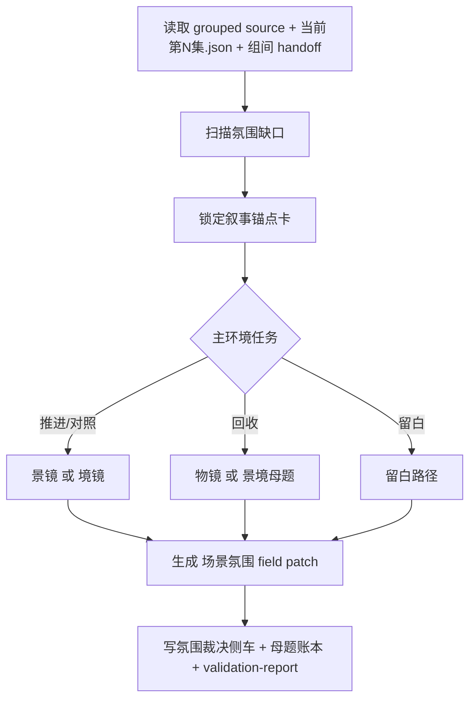

# aigc 3-明细 / 4-场景氛围

## 概述

`4-场景氛围` 是 `3-明细` 串行扩写链中的第四层环境增强站。

它接在 `1-分镜表现`、`2-角色表现`、`3-运镜手法` 之后，负责把“场景如何呼吸、空间如何施压、环境如何承接情绪与主题”补进统一根文件 `projects/<项目名>/编导/第N集.json` 的镜级字段，而不是另起一份平行稿。

本技能参考 `/Volumes/AIGC/AIGC-ZEN-VOID/.agents/skills/aigc2026/1-编剧/6-氛围感` 的成熟判断内核，但在当前 `3-明细` 阶段做了显式适配：

1. 保留 `景 / 境 / 物` 三镜法与“叙事锚点先行”的裁决顺序。
2. 收缩为 `patch-in-place` 的字段阶段合同，只服务统一根文件。
3. 把光影、色彩、镜头美学等摄影语法显式留给 `5-摄影美学`，不在本层越权。

交付类型：`内容输出型`
## When to Use

- 需要为现有脚本主文件补环境压力、空间温度、空气质感、背景声场或可回收物件母题。
- 场景事件和角色动作已经成立，但画面“会发生事、不会呼吸”，需要环境层承接情绪与主题。
- 需要把 `2-组间` 的风格、类型、导演意图、节奏提示继续压进具体场景的氛围表达。
- 需要在不改写上游事实和对白的前提下，让同一集终稿更具可拍摄、可感知、可继续下游消费的氛围层。
## When Not to Use

- 当前主要任务是插分镜、补人物表现、补运镜逻辑、补摄影光色或设计转场，应进入相应 sibling 子路径。
- 上游 grouped source 还不稳定，或统一根文件尚未建立。
- 用户只要抽象风格说明，不需要直接 patch `projects/<项目名>/编导/第N集.json`。
## 职责边界

### `4-场景氛围` 拥有

- 场景环境与情绪压力的加权扩写
- `景 / 境 / 物 / 留白` 的裁决与补写
- 环境母题、空间压力、空气温度、湿度、气味、声场的脚本化表达
- 对同一份 `第N集.json` 的 `场景氛围` 字段补写与母题 sidecar 沉淀

### `4-场景氛围` 不拥有

- 镜头运动、推进、摇移、跟拍等运镜语法
- 光影、色调、摄影质感、镜头美学的最终真源
- 段间转场与特效衔接
- 另起平行正文或重写剧情事实
## 核心约束（Mandatory）

- 工匠级契约继承：遵循 `skill-内容输出型/SKILL.md` 的反模板化与深度思考要求，本层只在已锁定真源与唯一写位上做有证据的增强。
- Root-Cause 执行契约继承：一旦出现路由失真、写位冲突、越权改写或主文件漂移，先按根 `AGENTS.md` 与本技能 `Root-Cause Execution Contract` 上溯规则源，再决定是否改正文。
- 自评偏差与缓解：LLM 容易把 sibling 能力混写、用抽象形容词代替可执行落笔，或忽略唯一主入口；执行时必须先锁输入链、边界与写位，再补本层字段，并把未覆盖问题显式留口给后续层。
- 本层只增强环境压力、空间温度与母题回声；镜头组织、光色捕捉与转场包装仍需留给 sibling 层。
- 预设护栏：环境语气与题材路由优先读取 `writer.story` bundle 的 `世界卡 / 风格卡`；仅在 bundle 缺失时兼容回退 canonical `project_preset.json`，不得跳过结构化预设直接凭感觉选风格。

### 原文与层级守恒

1. grouped source 与当前 `第N集.json` 是事实真源，本层只能补写，不得改写关键剧情事实。
2. 不得删除既有 `[分镜N]`、有效角色表现层内容与已稳定的场景节拍。
3. 不得改写对白、独白、旁白原句；只允许在其前后邻接补环境句。
4. 默认以“原段内自然融写”为主，不得独立堆成一段功能清单。

### sibling 边界

1. `3-运镜手法` 负责镜头运动，本层不写推拉摇移跟甩等镜头动作。
2. `5-摄影美学` 负责光影、色调、质感，本层不写镜头焦距、光圈、布光方案、色彩分级。
3. `6-转场特效` 负责段间衔接，本层只补场内环境，不主导段间跳切或特效设定。

### 叙事锚点先行

对每个准备注入氛围的场景或段落，至少先锁定以下 6 项中的 4 项：

1. `场次功能`：`铺垫 / 推进 / 对照 / 转折 / 爆发 / 余波 / 回收`
2. `节拍角色`：`setup / escalate / decision / reversal / payoff / aftershock / idle`
3. `角色当前目标/阻力`
4. `关系温差`：`升温 / 降温 / 僵持 / 错位 / 断裂 / 无变化`
5. `情绪走向`：`上扬 / 下坠 / 停滞 / 反转 / 平滞`
6. `环境任务`：`推进 / 对照 / 回收 / 留白`

若锚点卡未达最低完整度，只允许保守基线增强，不允许强行追求风格化补写。

补充门禁：

1. 先回答“这段环境在推进什么”，再回答“它应该长成什么天气或空间样子”。
2. 粗裁决阶段只锁 `环境任务`，不提前沉迷“哪条路线更美”。
3. 题材相容、留白密度与母题闭环未成立前，不得把 `景 / 境 / 物` 当作纯美学装饰。

### 氛围升华三镜法（JJW-3，Mandatory）

1. `景镜`
   - 审美指向：偏东方式自然主义诗意，以可见自然信号承接情绪与关系温差。
   - 常用信号：风、雨、雾、树影、水面、湿度、季节、声场留白。
   - 门禁：必须与当前戏核同向；不允许只堆抽象意境词或无剧情意义的景物铺陈。
2. `境镜`
   - 审美指向：偏西方式存在压力场，通过空间尺度、秩序、迟滞与异化制造压迫。
   - 常用信号：空旷/拥挤失衡、工业或公共空间冷感、时间停滞、噪声与静默反差。
   - 门禁：必须落到具体空间状态与角色处境，不能写成抽象哲思或空洞议论。
3. `物镜`
   - 审美指向：以可触物件折射关系与时间，优先承担欲望、错位、失语、延迟等回声。
   - 常用信号：旧票据、杯壁水痕、表盘、钥匙、外套、录音带、灯管、便签等反复出现物。
   - 门禁：只能使用场景已有或上游可证实的物件；优先选择自带时间刻度的状态变化，如融化、生锈、燃烧、变质；暗喻链至少满足“物理状态 -> 心理/关系映射 -> 叙事功能”。
4. `留白`
   - 高留白场景默认新增 `0-1` 条氛围句。
   - 优先用环境音、空镜感、无动于衷的日常物象承接余波，而不是把静场写满。
   - 真正的留白不是不写，而是只留下最有张力的最小环境信号。

### 密度与母题

1. 默认每个场景新增氛围句 `1-3` 条；关键转折或回收场可到 `4` 条，但必须说明必要性。
2. 同一触发点优先单主策略，不做 `景 + 境 + 物` 全开。
3. 对重复空间、重复关系轴或重复物件，优先建立“首次 -> 变体 -> 回收”的最小母题链。
4. 母题不只属于道具；同一扇窗的光、同一条走廊的回声、同一片雨幕的强弱变化，也可承担关系与主题回收。
## Visual Maps

## Reference Modules (Mandatory)

`aigc 3-明细 / 4-场景氛围/SKILL.md` 只保留主合同、边界、门禁、回指和 Mermaid 摘要；专项细则以下列模块为真源：

- `references/chain-of-thought.md`
- `references/execution-flow.md`
- `references/type-strategies.md`
- `.agents/skills/aigc/3-明细/references/output-template.md`

硬规则：

1. 根 `SKILL.md` 仍是唯一主合同；`references/` 是模块化细则承载层，不是并行第二真源。
2. 若字段、流程、路由或输出契约需要升级，优先回写对应 `references/*.md`。
3. 主 `SKILL.md` 只保留摘要与回链，不重复展开长表格、长流程与长写位合同。
## Route Summary

- 当前技能的路由矩阵、VSM 变量、情况判定、策略映射与回退规则已下沉到 `references/type-strategies.md`。
- 主 `SKILL.md` 只保留入口边界与判路摘要，不再重复长表。
## Execution Summary

- canonical landing、共享运行时继承与完整 workflow 已下沉到 `references/execution-flow.md`。
- 主 `SKILL.md` 只保留阶段边界与执行摘要，不重复整段流程细则。
## Output Summary

- 输出内容模板统一继承父级 `.agents/skills/aigc/3-明细/references/output-template.md`，本技能不再定义本地 output-template 真源；局部写位与侧车规则继续由 `references/execution-flow.md` 与 `references/type-strategies.md` 承载。
- 本技能即使没有独立模板，也必须沿唯一写位与单一真源执行。
## Field System Summary

- Think-Think 设计快照、字段主表、thought pass 与 pass table 已下沉到 `references/chain-of-thought.md`。
- 主 `SKILL.md` 只保留字段系统摘要，不再重复长表。
## Root-Cause Execution Contract (Mandatory)

当出现以下症状时，必须先修本技能源层，而不是只修单次正文：

- 氛围补写老是写成摄影说明或镜头说明
- 场景很美，但环境与戏核脱节
- 一补氛围就改坏对白、分镜或角色层
- 高留白场戏被写满，余波被抹平
- `景 / 境 / 物` 频繁全开，导致文本噪声过高

必经链路：

`Symptom -> Direct Technical Cause -> Rule Source -> Meta Rule Source -> Fix Landing Points`

优先检查：

- `Rule Source`
  - `.agents/skills/aigc/3-明细/subtypes/4-场景氛围/SKILL.md`
  - `.agents/skills/aigc/3-明细/subtypes/4-场景氛围/CONTEXT.md`
- `Meta Rule Source`
  - `.agents/skills/aigc/3-明细/SKILL.md`
  - `.agents/skills/aigc/SKILL.md`
  - 根 `AGENTS.md`
## SKILL / CONTEXT 分工（Mandatory）

- `SKILL.md` 锁定本层触发条件、唯一真源、执行顺序、写位边界与验收门槛。
- `CONTEXT.md` 沉淀失败类型、修复策略、成功 heuristic 与复用证据，不重写本层主合同。
- 经多轮验证稳定成立的经验，才允许从 `CONTEXT.md` 晋升回本 `SKILL.md` 或上层技能合同。
## Context Preload (Mandatory)

- 每次调用本技能时，必须自动加载同目录 `CONTEXT.md`。
- 执行前继续加载 `.agents/skills/aigc/3-明细/SKILL.md + CONTEXT.md`。
- 读取项目配置时，优先消费 `writer.story` bundle 的 `世界卡 / 风格卡`；仅在 bundle 缺失时回退 canonical `project_preset.json`。
- 优先级遵循：用户显式请求 > 根 `AGENTS.md` > `.agents/skills/aigc/SKILL.md` > `.agents/skills/aigc/3-明细/SKILL.md` > 本 `SKILL.md` > 本 `CONTEXT.md`。
- 需要细化局部思维链、执行流、类型策略与输出模板时，继续加载本目录 `references/*.md`。
