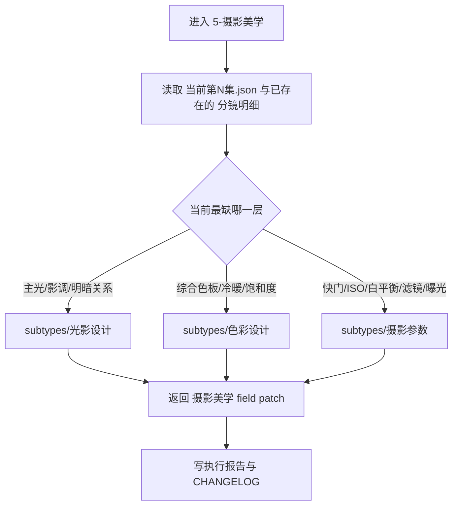
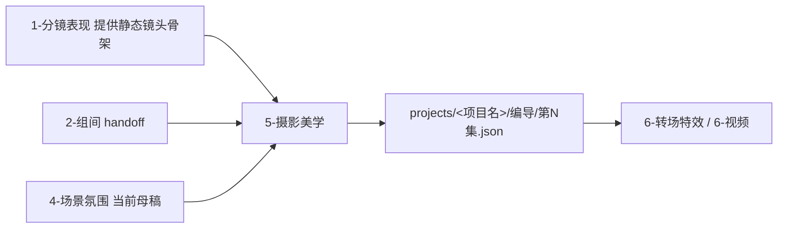

# aigc 3-明细 / 5-摄影美学

## 概述

`5-摄影美学` 是 `3-明细` 串行扩写链中的第五层视听精修站。

它不另写一份“摄影稿”，也不重做 `1-分镜表现` 已经锁定的静态镜头骨架，而是在统一根文件
`projects/<项目名>/编导/第N集.json`
里，为既有 `分镜明细[]` 补上真正能被镜头看到、能被后续视频层继承的摄影美学合同：

1. `光影设计`
2. `色彩设计`
3. `摄影参数`

三者目录名都不带数字前缀，命名上属于 `unordered`。但因为默认共享同一份终稿与同一批 `[分镜N]` 写位，父级必须显式覆盖默认并发，采用：

`光影设计 -> 色彩设计 -> 摄影参数`

的受控串行链。

交付类型：`内容输出型`
## When to Use

- 需要把终稿中的 `[分镜N]` 从“只有静态镜头骨架”继续发酵为“具备光影、色彩、质感、捕捉策略”的可拍文本。
- 需要补齐主光来源、综合色彩、曝光与质感控制，而不是再补角色行为或运镜路径。
- 当前脚本已经有分镜插入，但画面仍然“能看构图，不能感受到摄影”。
## When Not to Use

- 当前还没有 `1-分镜表现` 形成的 `[分镜N]` 骨架，应先回到 `1-分镜表现`。
- 当前问题主要是镜头怎么动、如何接上一镜，应进入 `3-运镜手法` 或 `6-转场特效`。
- 当前任务主要是空间气味、温度、天气压迫，应先进入 `4-场景氛围`。
## 职责边界

### `5-摄影美学` 拥有

- `[分镜N]` 对应的摄影美学补强总合同
- `光影设计 / 色彩设计 / 摄影参数` 的唯一主入口裁决
- 同一集终稿内的 `[摄影美学]` 行 patch-in-place
- 为下游视频层保留可继承的光色与捕捉信息

### `5-摄影美学` 不拥有

- 分镜数、景别、构图、角度、焦距、景深、光圈、对焦点的首次裁决
- 镜头运动与机位推进真源
- 转场与特效包装真源
- 上游剧情事实、角色关系与世界规则改写
## 核心约束（Mandatory）

- 工匠级契约继承：遵循 `skill-内容输出型/SKILL.md` 的反模板化与深度思考要求，本层不把摄影感退化成审美形容词堆，而是按光影、色彩、参数三类缺口做唯一主入口裁决。
- Root-Cause 执行契约继承：一旦出现 `[摄影美学]` 行冲突、leaf 越权、静态光学字段漂移或多份平行摄影真相，先按根 `AGENTS.md` 与本技能 `Root-Cause Execution Contract` 上溯规则源，再决定是否改正文。
- 自评偏差与缓解：LLM 容易把 `光影 / 色彩 / 摄影参数` 混成一团，或把 leaf 结果散落在不同写位；执行时必须先锁唯一主入口，再把多 leaf 结果收敛到同一条 continuation line。
- 多 leaf 的结果必须收敛到同一条 `[摄影美学]` continuation line，不得为同一镜位生成多份平行摄影真相。
## Visual Maps

## Reference Modules (Mandatory)

`aigc 3-明细 / 5-摄影美学/SKILL.md` 只保留主合同、边界、门禁、回指和 Mermaid 摘要；专项细则以下列模块为真源：

- `references/chain-of-thought.md`
- `references/execution-flow.md`
- `references/type-strategies.md`
- `.agents/skills/aigc/3-明细/references/output-template.md`

硬规则：

1. 根 `SKILL.md` 仍是唯一主合同；`references/` 是模块化细则承载层，不是并行第二真源。
2. 若字段、流程、路由或输出契约需要升级，优先回写对应 `references/*.md`。
3. 主 `SKILL.md` 只保留摘要与回链，不重复展开长表格、长流程与长写位合同。
## Route Summary

- 当前技能的详细路由矩阵、默认调度顺序与回退规则已下沉到 `references/type-strategies.md`。
- 主 `SKILL.md` 只保留入口边界与判路摘要，不再重复长表。
## Execution Summary

- canonical landing、共享运行时继承与完整 workflow 已下沉到 `references/execution-flow.md`。
- 主 `SKILL.md` 只保留阶段边界与执行摘要，不重复整段流程细则。
## Output Summary

- 输出内容模板统一继承父级 `.agents/skills/aigc/3-明细/references/output-template.md`，本技能不再定义本地 output-template 真源；局部写位与侧车规则继续由 `references/execution-flow.md` 与 `references/type-strategies.md` 承载。
- 主 `SKILL.md` 只保留输出职责摘要，不再重复整段模板正文。
## Field System Summary

- 字段主表、thought pass 与 pass table 已下沉到 `references/chain-of-thought.md`。
- 主 `SKILL.md` 只保留字段系统摘要，不再重复长表。
## Root-Cause Execution Contract (Mandatory)

当出现以下症状时，必须先修 `5-摄影美学` 的父级合同，而不是只补某个 leaf：

- 三个 leaf 都存在，但父级看不出何时进哪个
- 同一集多个 leaf 同时命中时发生 `[摄影美学]` 行写冲突
- 直接在 `[分镜N]` 行上乱改 `焦距 / 光圈`，职责边界漂移
- 色彩或参数没有回查光影与上游氛围，导致摄影感知层互相打架
- 各 leaf 各写一条说明，终稿里出现多份摄影真相

必经链路：

`Symptom -> Direct Technical Cause -> Rule Source -> Meta Rule Source -> Fix Landing Points`

优先检查：

- `Rule Source`
  - `.agents/skills/aigc/3-明细/subtypes/5-摄影美学/SKILL.md`
  - `.agents/skills/aigc/3-明细/subtypes/5-摄影美学/CONTEXT.md`
  - `.agents/skills/aigc/3-明细/subtypes/5-摄影美学/subtypes/*/SKILL.md`
- `Meta Rule Source`
  - `.agents/skills/aigc/3-明细/SKILL.md`
  - 根 `AGENTS.md`
## SKILL / CONTEXT 分工（Mandatory）

- `SKILL.md` 锁定本层触发条件、唯一真源、执行顺序、写位边界与验收门槛。
- `CONTEXT.md` 沉淀失败类型、修复策略、成功 heuristic 与复用证据，不重写本层主合同。
- 经多轮验证稳定成立的经验，才允许从 `CONTEXT.md` 晋升回本 `SKILL.md` 或上层技能合同。
## Context Preload (Mandatory)

- 每次调用本技能时，必须自动加载同目录 `CONTEXT.md`。
- 进入具体 leaf 时，继续加载 `subtypes/<leaf>/SKILL.md` 与 `CONTEXT.md`。
- 若项目根 `team.yaml.enabled == true`，继承上层 `3-明细` 的顾问团运行时，不在本层重复定义第二套规则。
- 优先级遵循：用户显式请求 > 根 `AGENTS.md` > `.agents/skills/aigc/3-明细/SKILL.md` > 本 `SKILL.md` > 本 `CONTEXT.md`。
- 需要细化局部思维链、执行流、类型策略与输出模板时，继续加载本目录 `references/*.md`。
