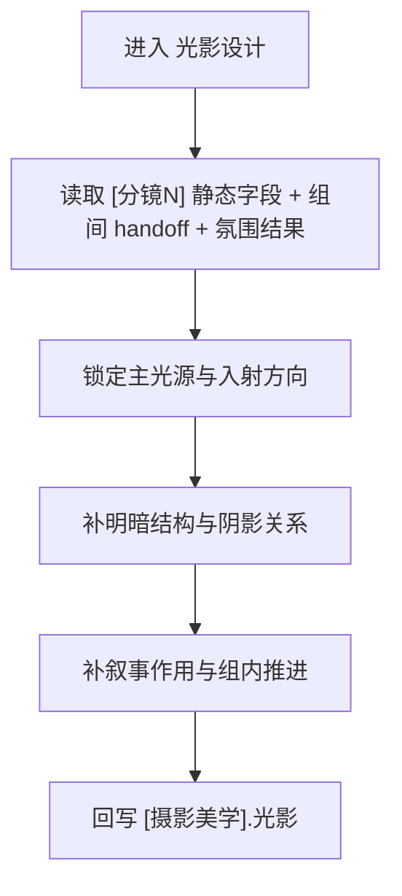

# aigc 3-明细 / 5-摄影美学 / 光影设计

## 概述

`光影设计` 负责把“这一镜的光从哪里来、怎么切、影子压到哪里、为什么此刻这样照”写清楚。

它参考旧仓 `2-导演/6-光影美学` 的高价值判断维度，但在当前仓的落地方式改写为：

- 不输出独立导演 JSON
- 只返回 `projects/<项目名>/编导/第N集.json` 中 `摄影美学` 字段 patch
- 只补 `[摄影美学]` 行里的 `光影` 段

交付类型：`内容输出型`
## When to Use

- 当前 `[分镜N]` 已有静态镜头骨架，但主光来源、明暗关系、影调推进很薄。
- 需要让同一镜位具备明确的光源实体、入射方向和叙事性阴影。
- 需要服务悬疑、压迫、亲密、揭示、反转等光影叙事，而不是只写“氛围更好”。
## When Not to Use

- 当前主要缺的是综合色板、冷暖关系与饱和节奏，应进入 `色彩设计`。
- 当前主要缺的是快门、ISO、白平衡、滤镜或曝光策略，应进入 `摄影参数`。
- 当前问题其实是镜头怎么动或如何衔接上下镜，不属于本层。
## 职责边界

### `光影设计` 拥有

- 光源实体
- 入射方向
- 明暗结构与阴影关系
- 光影流动与叙事作用

### `光影设计` 不拥有

- 主色系统与综合色彩
- 捕捉参数与曝光配方
- 运镜路径与转场包装
## 核心约束（Mandatory）

- 工匠级契约继承：遵循 `skill-内容输出型/SKILL.md` 的反模板化与深度思考要求，本层只在已锁定真源与唯一写位上做有证据的增强。
- Root-Cause 执行契约继承：一旦出现路由失真、写位冲突、越权改写或主文件漂移，先按根 `AGENTS.md` 与本技能 `Root-Cause Execution Contract` 上溯规则源，再决定是否改正文。
- 自评偏差与缓解：LLM 容易把 sibling 能力混写、用抽象形容词代替可执行落笔，或忽略唯一主入口；执行时必须先锁输入链、边界与写位，再补本层字段，并把未覆盖问题显式留口给后续层。
- 本层只补 `[摄影美学].光影` 段，不回头改写 `[分镜N]` 静态字段、综合色板或捕捉参数。

1. 每条 `光影` 至少覆盖以下 5 项中的 3 项，优先覆盖 4 项：
   - 光源实体
   - 入射方向
   - 明暗结构
   - 作用对象
   - 叙事作用
2. 禁止只写“电影感更强、很有氛围、光线很好看”这类空泛判断，必须落到窗、门缝、吊灯、霓虹、屏幕、火光、车灯、反光面等可见实体。
3. 允许高戏剧性影调，但不得改变上游剧情事实与空间基本关系。
4. 若光影判断核心已经变成综合色彩或参数选择，应显式留口给 `色彩设计` 或 `摄影参数`，不得硬吞。
5. 本层只写 `[摄影美学].光影`，不得改写 `[分镜N]` 静态镜头字段。
## Visual Maps

## Reference Modules (Mandatory)

`aigc 3-明细 / 5-摄影美学 / 光影设计/SKILL.md` 只保留主合同、边界、门禁、回指和 Mermaid 摘要；专项细则以下列模块为真源：

- `references/chain-of-thought.md`
- `references/execution-flow.md`
- `references/type-strategies.md`
- `.agents/skills/aigc/3-明细/references/output-template.md`

硬规则：

1. 根 `SKILL.md` 仍是唯一主合同；`references/` 是模块化细则承载层，不是并行第二真源。
2. 若字段、流程、路由或输出契约需要升级，优先回写对应 `references/*.md`。
3. 主 `SKILL.md` 只保留摘要与回链，不重复展开长表格、长流程与长写位合同。
## Route Summary

- 本技能是父级裁定后的唯一执行入口，不在本层再展开第二套路由矩阵。
- 局部进入前提、回退规则与 unknown 处理见 `references/type-strategies.md`。
## Execution Summary

- canonical landing、共享运行时继承与完整 workflow 已下沉到 `references/execution-flow.md`。
- 主 `SKILL.md` 只保留阶段边界与执行摘要，不重复整段流程细则。
## Output Summary

- 输出内容模板统一继承父级 `.agents/skills/aigc/3-明细/references/output-template.md`，本技能不再定义本地 output-template 真源；局部写位与侧车规则继续由 `references/execution-flow.md` 与 `references/type-strategies.md` 承载。
- 本技能即使没有独立模板，也必须沿唯一写位与单一真源执行。
## Field System Summary

- 字段主表、thought pass 与 pass table 已下沉到 `references/chain-of-thought.md`。
- 主 `SKILL.md` 只保留字段系统摘要，不再重复长表。
## Root-Cause Execution Contract (Mandatory)

当出现以下症状时，必须先修 `光影设计` leaf 合同，而不是只在正文里继续堆“氛围感”形容词：

- 看不出光从哪里来、照向哪里
- 只有亮暗判断，没有阴影结构和作用对象
- 光影很美，但不服务当前戏核
- 本层越权改写综合色板、摄影参数或镜头方案

必经链路：

`Symptom -> Direct Technical Cause -> Rule Source -> Meta Rule Source -> Fix Landing Points`

优先检查：

- `Rule Source`
  - `.agents/skills/aigc/3-明细/subtypes/5-摄影美学/subtypes/光影设计/SKILL.md`
  - `.agents/skills/aigc/3-明细/subtypes/5-摄影美学/subtypes/光影设计/CONTEXT.md`
- `Meta Rule Source`
  - `.agents/skills/aigc/3-明细/subtypes/5-摄影美学/SKILL.md`
  - `.agents/skills/aigc/3-明细/SKILL.md`
  - 根 `AGENTS.md`
## SKILL / CONTEXT 分工（Mandatory）

- `SKILL.md` 锁定本层触发条件、唯一真源、执行顺序、写位边界与验收门槛。
- `CONTEXT.md` 沉淀失败类型、修复策略、成功 heuristic 与复用证据，不重写本层主合同。
- 经多轮验证稳定成立的经验，才允许从 `CONTEXT.md` 晋升回本 `SKILL.md` 或上层技能合同。
## Context Preload (Mandatory)

- 每次调用本技能时，必须自动加载同目录 `CONTEXT.md`。
- 优先级遵循：用户显式请求 > 根 `AGENTS.md` > `.agents/skills/aigc/3-明细/subtypes/5-摄影美学/SKILL.md` > 本 `SKILL.md` > 本 `CONTEXT.md`。
- 需要细化局部思维链、执行流、类型策略与输出模板时，继续加载本目录 `references/*.md`。
