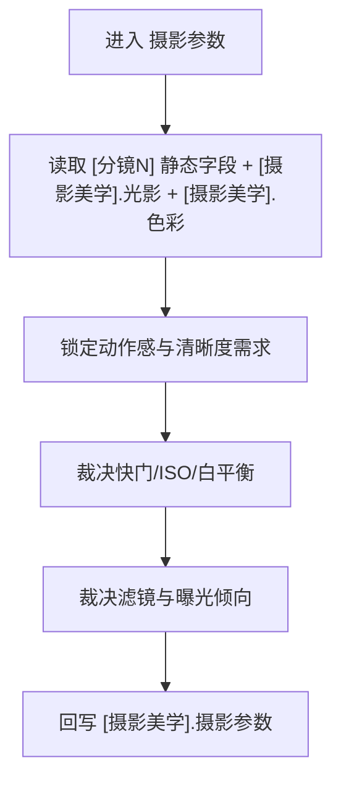

# aigc 3-明细 / 5-摄影美学 / 摄影参数

## 概述

`摄影参数` 负责把“这镜应该以怎样的捕捉方式被拍出来”写清楚。

它不是回头重做 `1-分镜表现` 的静态光学字段，而是在已有
`景别 / 景深 / 焦距 / 对焦点 / 光圈`
之上，继续补足真正决定画面质感与可执行性的捕捉参数：

- `快门`
- `ISO`
- `白平衡`
- `滤镜`
- `曝光`

交付类型：`内容输出型`
## When to Use

- 当前 `[分镜N]` 已有静态镜头骨架与基础光色，但仍缺少实际拍摄时的捕捉配方。
- 需要明确动作质感、颗粒/噪点容忍、色温倾向、柔化或眩光质感。
- 需要把“摄影感”从审美描述落到可执行参数层。
## When Not to Use

- 当前核心问题是主光来源、阴影结构或影调，应先进入 `光影设计`。
- 当前核心问题是综合色板、主辅色与饱和节奏，应先进入 `色彩设计`。
- 当前需要调整 `焦距 / 光圈 / 景深 / 对焦点` 本身，应回到 `1-分镜表现`，不属于本层。
## 职责边界

### `摄影参数` 拥有

- 快门速度策略
- ISO 感光策略
- 白平衡倾向
- 滤镜/质感选择
- 曝光倾向

### `摄影参数` 不拥有

- 焦距、光圈、景深、对焦点的首次裁决
- 主光源、阴影切割与综合色板判断
- 运镜路径与转场包装
## 核心约束（Mandatory）

- 工匠级契约继承：遵循 `skill-内容输出型/SKILL.md` 的反模板化与深度思考要求，本层只在已锁定真源与唯一写位上做有证据的增强。
- Root-Cause 执行契约继承：一旦出现路由失真、写位冲突、越权改写或主文件漂移，先按根 `AGENTS.md` 与本技能 `Root-Cause Execution Contract` 上溯规则源，再决定是否改正文。
- 自评偏差与缓解：LLM 容易把 sibling 能力混写、用抽象形容词代替可执行落笔，或忽略唯一主入口；执行时必须先锁输入链、边界与写位，再补本层字段，并把未覆盖问题显式留口给后续层。
- 本层只补 `[摄影美学].摄影参数` 段；若与静态光学字段冲突，只能上溯，不得静默篡改上游。

1. 每条 `摄影参数` 默认应补齐 5 项：`快门 / ISO / 白平衡 / 滤镜 / 曝光`。
2. 若镜头动作爆发或运动模糊需求强，快门必须与动作质感逻辑自洽，不得随意填值。
3. ISO、白平衡与曝光必须能被当前 `光影` 与 `色彩` 条件解释。
4. 本层不得静默改写 `焦距 / 光圈 / 景深 / 对焦点`；如发现与已有静态字段冲突，必须上溯报告边界问题。
5. 参数句子必须可执行，不得写成泛泛的“电影机参数感、胶片味更强”。
## Visual Maps

## Reference Modules (Mandatory)

`aigc 3-明细 / 5-摄影美学 / 摄影参数/SKILL.md` 只保留主合同、边界、门禁、回指和 Mermaid 摘要；专项细则以下列模块为真源：

- `references/chain-of-thought.md`
- `references/execution-flow.md`
- `references/type-strategies.md`
- `.agents/skills/aigc/3-明细/references/output-template.md`

硬规则：

1. 根 `SKILL.md` 仍是唯一主合同；`references/` 是模块化细则承载层，不是并行第二真源。
2. 若字段、流程、路由或输出契约需要升级，优先回写对应 `references/*.md`。
3. 主 `SKILL.md` 只保留摘要与回链，不重复展开长表格、长流程与长写位合同。
## Route Summary

- 本技能是父级裁定后的唯一执行入口，不在本层再展开第二套路由矩阵。
- 局部进入前提、回退规则与 unknown 处理见 `references/type-strategies.md`。
## Execution Summary

- canonical landing、共享运行时继承与完整 workflow 已下沉到 `references/execution-flow.md`。
- 主 `SKILL.md` 只保留阶段边界与执行摘要，不重复整段流程细则。
## Output Summary

- 输出内容模板统一继承父级 `.agents/skills/aigc/3-明细/references/output-template.md`，本技能不再定义本地 output-template 真源；局部写位与侧车规则继续由 `references/execution-flow.md` 与 `references/type-strategies.md` 承载。
- 本技能即使没有独立模板，也必须沿唯一写位与单一真源执行。
## Field System Summary

- 字段主表、thought pass 与 pass table 已下沉到 `references/chain-of-thought.md`。
- 主 `SKILL.md` 只保留字段系统摘要，不再重复长表。
## Root-Cause Execution Contract (Mandatory)

当出现以下症状时，必须先修 `摄影参数` leaf 合同，而不是只在正文里继续罗列参数名词：

- 快门、ISO、白平衡、曝光之间互相打架
- 参数没有对应的捕捉目标或戏核理由
- 参数层静默改写了上游分镜骨架字段
- 本层越权承担光影、综合色彩或运镜职责

必经链路：

`Symptom -> Direct Technical Cause -> Rule Source -> Meta Rule Source -> Fix Landing Points`

优先检查：

- `Rule Source`
  - `.agents/skills/aigc/3-明细/subtypes/5-摄影美学/subtypes/摄影参数/SKILL.md`
  - `.agents/skills/aigc/3-明细/subtypes/5-摄影美学/subtypes/摄影参数/CONTEXT.md`
- `Meta Rule Source`
  - `.agents/skills/aigc/3-明细/subtypes/5-摄影美学/SKILL.md`
  - `.agents/skills/aigc/3-明细/SKILL.md`
  - 根 `AGENTS.md`
## SKILL / CONTEXT 分工（Mandatory）

- `SKILL.md` 锁定本层触发条件、唯一真源、执行顺序、写位边界与验收门槛。
- `CONTEXT.md` 沉淀失败类型、修复策略、成功 heuristic 与复用证据，不重写本层主合同。
- 经多轮验证稳定成立的经验，才允许从 `CONTEXT.md` 晋升回本 `SKILL.md` 或上层技能合同。
## Context Preload (Mandatory)

- 每次调用本技能时，必须自动加载同目录 `CONTEXT.md`。
- 优先级遵循：用户显式请求 > 根 `AGENTS.md` > `.agents/skills/aigc/3-明细/subtypes/5-摄影美学/SKILL.md` > 本 `SKILL.md` > 本 `CONTEXT.md`。
- 需要细化局部思维链、执行流、类型策略与输出模板时，继续加载本目录 `references/*.md`。
