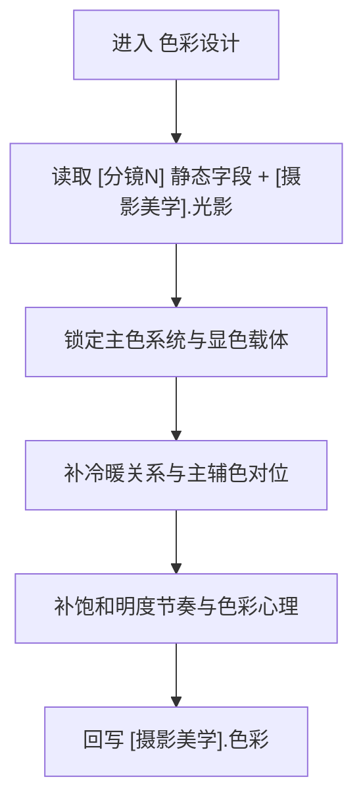

# aigc 3-明细 / 5-摄影美学 / 色彩设计

## 概述

`色彩设计` 负责把“这一镜到底是什么综合色板、冷暖如何对位、哪里该去饱和、哪里该炸出刺点”写清楚。

它参考旧仓 `2-导演/7-色彩美学` 的高价值判断维度，但在当前仓的落地方式改写为：

- 不输出独立 JSON 色彩对象
- 只返回 `projects/<项目名>/编导/第N集.json` 中 `摄影美学` 字段 patch
- 只补 `[摄影美学]` 行里的 `色彩` 段

交付类型：`内容输出型`
## When to Use

- 当前 `[分镜N]` 已有基本镜头与光影，但综合色板、冷暖组织、饱和明度节奏仍然发虚。
- 需要让画面拥有明确的主色系统、辅助色对位与情绪导向。
- 需要避免“只写冷暖形容词”，而是写成可见载体上的色彩控制。
## When Not to Use

- 当前核心问题是主光源、阴影结构与影调，应先进入 `光影设计`。
- 当前核心问题是快门、ISO、白平衡、滤镜或曝光策略，应先进入 `摄影参数`。
- 当前问题主要是服装、道具或场景资产本体设计，不属于本层。
## 职责边界

### `色彩设计` 拥有

- 主色系统
- 辅色与破色刺点
- 冷暖关系
- 饱和度与明度节奏
- 色彩心理与叙事导向

### `色彩设计` 不拥有

- 主光源与阴影切割
- 捕捉参数与曝光配方
- 运镜与转场设计
## 核心约束（Mandatory）

- 工匠级契约继承：遵循 `skill-内容输出型/SKILL.md` 的反模板化与深度思考要求，本层只在已锁定真源与唯一写位上做有证据的增强。
- Root-Cause 执行契约继承：一旦出现路由失真、写位冲突、越权改写或主文件漂移，先按根 `AGENTS.md` 与本技能 `Root-Cause Execution Contract` 上溯规则源，再决定是否改正文。
- 自评偏差与缓解：LLM 容易把 sibling 能力混写、用抽象形容词代替可执行落笔，或忽略唯一主入口；执行时必须先锁输入链、边界与写位，再补本层字段，并把未覆盖问题显式留口给后续层。
- 本层只补 `[摄影美学].色彩` 段，并与既有 `光影` 条件协同，不得越权到参数或运镜。

1. 每条 `色彩` 至少覆盖以下 6 项中的 4 项，优先覆盖 5 项：
   - 主色实体
   - 辅色对位
   - 冷暖关系
   - 饱和与明度节奏
   - 作用对象
   - 叙事作用
2. 禁止把结果写成抽象色彩理论词堆；必须落到墙面、皮肤、衣料、雾层、灯招、水面、金属反光、血迹、灰尘等可见载体。
3. 若当前场景已建立光影段，色彩段必须与其显色条件协同，不得互相打架。
4. 允许出现高冲击跳色，但必须能解释其节拍触发或叙事作用。
5. 本层只写 `[摄影美学].色彩`，不得回头改写光源判断或捕捉参数。
## Visual Maps

## Reference Modules (Mandatory)

`aigc 3-明细 / 5-摄影美学 / 色彩设计/SKILL.md` 只保留主合同、边界、门禁、回指和 Mermaid 摘要；专项细则以下列模块为真源：

- `references/chain-of-thought.md`
- `references/execution-flow.md`
- `references/type-strategies.md`
- `.agents/skills/aigc/3-明细/references/output-template.md`

硬规则：

1. 根 `SKILL.md` 仍是唯一主合同；`references/` 是模块化细则承载层，不是并行第二真源。
2. 若字段、流程、路由或输出契约需要升级，优先回写对应 `references/*.md`。
3. 主 `SKILL.md` 只保留摘要与回链，不重复展开长表格、长流程与长写位合同。
## Route Summary

- 本技能是父级裁定后的唯一执行入口，不在本层再展开第二套路由矩阵。
- 局部进入前提、回退规则与 unknown 处理见 `references/type-strategies.md`。
## Execution Summary

- canonical landing、共享运行时继承与完整 workflow 已下沉到 `references/execution-flow.md`。
- 主 `SKILL.md` 只保留阶段边界与执行摘要，不重复整段流程细则。
## Output Summary

- 输出内容模板统一继承父级 `.agents/skills/aigc/3-明细/references/output-template.md`，本技能不再定义本地 output-template 真源；局部写位与侧车规则继续由 `references/execution-flow.md` 与 `references/type-strategies.md` 承载。
- 本技能即使没有独立模板，也必须沿唯一写位与单一真源执行。
## Field System Summary

- 字段主表、thought pass 与 pass table 已下沉到 `references/chain-of-thought.md`。
- 主 `SKILL.md` 只保留字段系统摘要，不再重复长表。
## Root-Cause Execution Contract (Mandatory)

当出现以下症状时，必须先修 `色彩设计` leaf 合同，而不是只在正文里继续堆综合色词：

- 主色系统不明确，只剩空泛色感形容
- 冷暖、饱和、明度关系彼此冲突
- 色彩节奏不能服务镜内情绪变化
- 本层越权承担光影、参数或运镜职责

必经链路：

`Symptom -> Direct Technical Cause -> Rule Source -> Meta Rule Source -> Fix Landing Points`

优先检查：

- `Rule Source`
  - `.agents/skills/aigc/3-明细/subtypes/5-摄影美学/subtypes/色彩设计/SKILL.md`
  - `.agents/skills/aigc/3-明细/subtypes/5-摄影美学/subtypes/色彩设计/CONTEXT.md`
- `Meta Rule Source`
  - `.agents/skills/aigc/3-明细/subtypes/5-摄影美学/SKILL.md`
  - `.agents/skills/aigc/3-明细/SKILL.md`
  - 根 `AGENTS.md`
## SKILL / CONTEXT 分工（Mandatory）

- `SKILL.md` 锁定本层触发条件、唯一真源、执行顺序、写位边界与验收门槛。
- `CONTEXT.md` 沉淀失败类型、修复策略、成功 heuristic 与复用证据，不重写本层主合同。
- 经多轮验证稳定成立的经验，才允许从 `CONTEXT.md` 晋升回本 `SKILL.md` 或上层技能合同。
## Context Preload (Mandatory)

- 每次调用本技能时，必须自动加载同目录 `CONTEXT.md`。
- 优先级遵循：用户显式请求 > 根 `AGENTS.md` > `.agents/skills/aigc/3-明细/subtypes/5-摄影美学/SKILL.md` > 本 `SKILL.md` > 本 `CONTEXT.md`。
- 需要细化局部思维链、执行流、类型策略与输出模板时，继续加载本目录 `references/*.md`。
