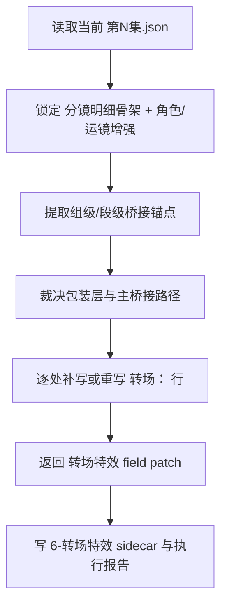
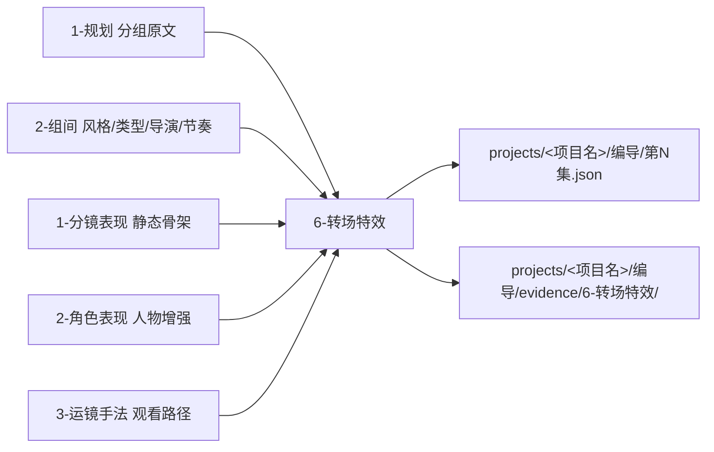

# aigc 3-明细 / 6-转场特效

## 概述

`6-转场特效` 是 `3-明细` 串行扩写链中的第六层、也是收束层的段间衔接与后期包装增强站。

它的任务不是把导演阶段的 JSON `转场` 字段直接搬进脚本链，也不是另写一份 VFX 方案稿，而是在已经具备 grouped source、`分镜明细[]` 骨架、角色增强、运镜节拍的统一根文件 `projects/<项目名>/编导/第N集.json` 上，继续发酵出“这一镜怎么交给下一镜、这一段怎么过给下一段、哪些必要的镜内后期结果该被写成观众可感知的终稿语言”。

本技能吸收 `AIGC-ZEN-VOID` 中 `2-导演/9-转场特效` 的高门槛思路，但在 `3-明细` 阶段必须改写成脚本链真源：

1. 对命中的 `分镜明细[]` 生成 `转场特效` 字段 patch
2. 在 sidecar 里沉淀组级/段级桥接锚点、包装层裁决与回写理由
3. 由父级把 patch 聚合回统一根文件，而不是另起平行稿

交付类型：`内容输出型`
## When to Use

- 当前 `第N集.json` 已有 grouped source 和 `分镜明细[]` 骨架，但镜头之间、段落之间、场景之间的交接依然生硬。
- 需要把 `2-组间` 的导演意图、节奏设计、风格母题继续压进“怎么切、怎么连、怎么把情绪或信息带过去”的收束层。
- 需要在不改写剧情事实的前提下，为相关 `[分镜N]` 补强转场语句、桥接动作、声音提前量、视觉吞没或必要的镜内后期结果。
- 需要把转场写成可看见、可听见、可感知、可继续交给后续执行层的终稿语言。
## When Not to Use

- 当前还没有 `[分镜N]` 与静态镜头骨架，应先回到 `1-分镜表现`。
- 当前问题主要是人物动作/对话/内心表现，应先进入 `2-角色表现`。
- 当前问题主要是镜头运动路径本身还没成立，应先进入 `3-运镜手法`。
- 用户要的是导演阶段 JSON 对象里的 `转场` 字段，而不是脚本终稿增强，应回到导演链路。
## 职责边界

### `6-转场特效` 拥有

- `3-明细` 阶段的转场与必要镜内后期包装增强合同
- 段间/镜间桥接锚点的发现、裁决与终稿落笔
- 命中镜位的 `转场特效` 字段 patch
- 组级/段级转场裁决侧车、执行报告与留口

### `6-转场特效` 不拥有

- `[分镜N]` 静态镜头字段的真源
- 原文剧情事实、角色关系与世界规则的改写权
- 光影、色彩、摄影美学的最终真源
- 导演阶段 JSON 主文件里的镜级 `转场` 字段与审计账本
## 当前结构说明

- 当前 `6-转场特效` 先作为单体父技能运行，不额外拆 leaf。
- 原因不是本层不复杂，而是当前最高杠杆的真源先是“把脚本里的转场落笔方式锁死”。
- 未来若出现稳定且互斥的转场子类，再升级到 `subtypes/<leaf>/SKILL.md + CONTEXT.md`。
## 核心约束（Mandatory）

- 工匠级契约继承：遵循 `skill-内容输出型/SKILL.md` 的反模板化与深度思考要求，本层不批量刷“镜头切到/黑场/闪回感”类空泛桥接句，而是按组级桥接需求裁决最小必要转场语言。
- Root-Cause 执行契约继承：一旦出现桥接断裂、特效越权、转场模板化或主文件写位漂移，先按根 `AGENTS.md` 与本技能 `Root-Cause Execution Contract` 上溯规则源，再决定是否改正文。
- 自评偏差与缓解：LLM 容易把转场层写成炫技包装，或借转场名义重写上游事实；执行时必须先锁当前桥接问题，再仅在允许写位内补最小必要的转场与特效说明。
- 本层只补镜间桥接、段间衔接与必要特效表述，不得借转场名义回写上游事实或 sibling 真源。
## Visual Maps

## Reference Modules (Mandatory)

`aigc 3-明细 / 6-转场特效/SKILL.md` 只保留主合同、边界、门禁、回指和 Mermaid 摘要；专项细则以下列模块为真源：

- `references/chain-of-thought.md`
- `references/execution-flow.md`
- `references/type-strategies.md`
- `.agents/skills/aigc/3-明细/references/output-template.md`

硬规则：

1. 根 `SKILL.md` 仍是唯一主合同；`references/` 是模块化细则承载层，不是并行第二真源。
2. 若字段、流程、路由或输出契约需要升级，优先回写对应 `references/*.md`。
3. 主 `SKILL.md` 只保留摘要与回链，不重复展开长表格、长流程与长写位合同。
## Route Summary

- 当前技能的 VSM 变量、情况判定、策略映射与回退规则已下沉到 `references/type-strategies.md`。
- 主 `SKILL.md` 只保留入口边界与判路摘要，不再重复长表。
## Execution Summary

- canonical landing、共享运行时继承与完整 workflow 已下沉到 `references/execution-flow.md`。
- 主 `SKILL.md` 只保留阶段边界与执行摘要，不重复整段流程细则。
## Output Summary

- 输出内容模板统一继承父级 `.agents/skills/aigc/3-明细/references/output-template.md`，本技能不再定义本地 output-template 真源；局部写位与侧车规则继续由 `references/execution-flow.md` 与 `references/type-strategies.md` 承载。
- 主 `SKILL.md` 只保留输出职责摘要，不再重复整段模板正文。
## Field System Summary

- Think-Think 设计快照、字段主表、thought pass 与 pass table 已下沉到 `references/chain-of-thought.md`。
- 主 `SKILL.md` 只保留字段系统摘要，不再重复长表。
## Root-Cause Execution Contract (Mandatory)

当出现以下症状时，必须先修 `6-转场特效` 的源层合同：

- 已有 `[分镜N]`，但镜间、段间仍像硬断拼接，没有桥接余波
- `转场：` 行存在，但全是“更流畅/更电影感/更高级”的空话
- 所有命中位都套同一套黑场、白闪或声桥模板
- 本层越权开始写摄影、色彩、氛围或直接改原文事实
- 直接把导演阶段 JSON `转场` 合同搬过来，导致脚本阶段真源错位

必经链路：

`Symptom -> Direct Technical Cause -> Rule Source -> Meta Rule Source -> Fix Landing Points`

优先检查：

- `Rule Source`
  - `.agents/skills/aigc/3-明细/subtypes/6-转场特效/SKILL.md`
  - `.agents/skills/aigc/3-明细/subtypes/6-转场特效/CONTEXT.md`
- `Meta Rule Source`
  - `.agents/skills/aigc/3-明细/SKILL.md`
  - `.agents/skills/aigc/SKILL.md`
  - 根 `AGENTS.md`
## SKILL / CONTEXT 分工（Mandatory）

- `SKILL.md` 锁定本层触发条件、唯一真源、执行顺序、写位边界与验收门槛。
- `CONTEXT.md` 沉淀失败类型、修复策略、成功 heuristic 与复用证据，不重写本层主合同。
- 经多轮验证稳定成立的经验，才允许从 `CONTEXT.md` 晋升回本 `SKILL.md` 或上层技能合同。
## Context Preload (Mandatory)

- 每次调用本技能时，必须自动加载同目录 `CONTEXT.md`。
- 执行前继续加载 `.agents/skills/aigc/3-明细/SKILL.md + CONTEXT.md`。
- 再向上回查 `.agents/skills/aigc/SKILL.md + CONTEXT.md` 与根 `AGENTS.md`。
- 优先级遵循：用户显式请求 > 根 `AGENTS.md` > `.agents/skills/aigc/SKILL.md` > `.agents/skills/aigc/3-明细/SKILL.md` > 本 `SKILL.md` > 各级 `CONTEXT.md`。
- 需要细化局部思维链、执行流、类型策略与输出模板时，继续加载本目录 `references/*.md`。
