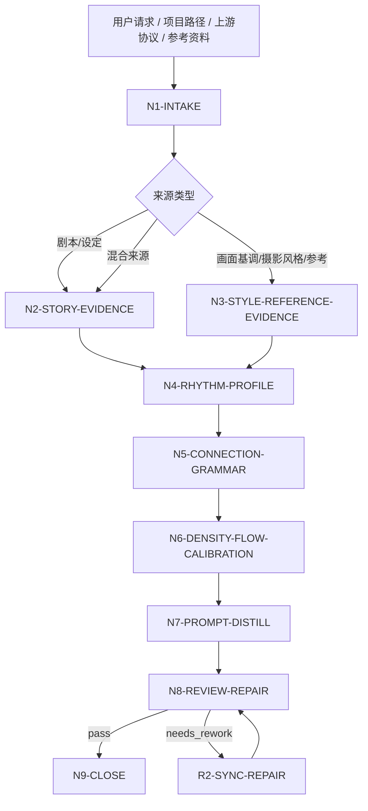
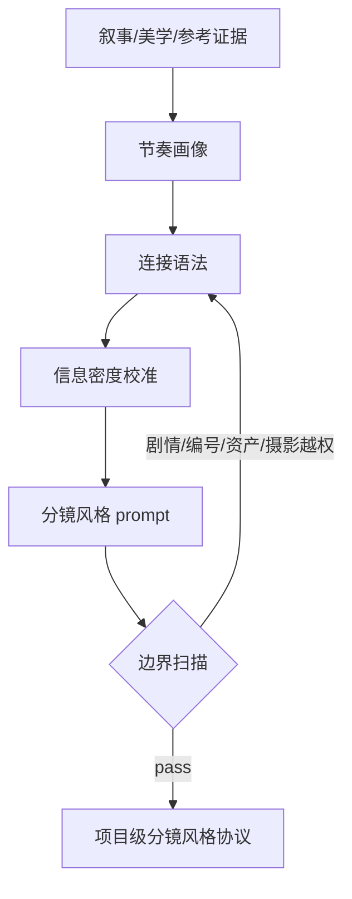

# aigc 3-美学/分镜风格

`分镜风格` 是 AIGC 影片项目的分镜层级风格协议技能。它从上游剧本、画面基调、摄影风格、参考图、参考视频或候选分镜资料中提取分镜组织规律，研究节奏、景别切换、镜头组合、镜头连招、流畅性、连贯性、段落推进、信息密度和 AI 视频下游可执行的分镜连接方式。

本技能只定义“分镜如何组织和衔接”的风格层级，不写具体分镜正文、具体镜头编号、剧情动作、资产设计、角色表演细节或单镜头 prompt。默认输出中文，核心 `storyboard_style_prompt` 约 100 字。

## Context Loading Contract

- 每次调用 `$aigc-storyboard-style` 时，必须同时加载本目录 `SKILL.md + CONTEXT.md`。
- 每次调用本技能时，必须同时加载同目录 `CONTEXT.md`。
- 若任务绑定 `projects/aigc/<项目名>/`，必须先加载项目根 `MEMORY.md`，再加载项目根 `CONTEXT/` 中与剧本结构、画面基调、摄影风格、参考视频、分镜偏好、禁区或下游模型限制相关的文件。
- 默认上游来源包括 `2-编剧/`、`3-美学/画面基调/全局风格协议.md`、`3-美学/摄影风格/`、用户粘贴文本、参考图/视频说明和已有候选分镜风格协议；用户显式指定来源时，以用户输入为本轮来源并标注来源类型。
- 多模态参考只允许提供节奏事实、转场语法、段落推进、镜头组合倾向、信息密度和连接方式，不得复制参考中的具体剧情、人物、动作、物件、场景或镜头编号。
- 核心风格判断、节奏归纳、分镜组织策略和提示词蒸馏必须由 LLM 直接完成；脚本只可承担读取、转写整理、字数统计、JSON/Markdown 校验和越权词扫描。
- 脚本、映射表、规则模板、关键词锚点替换、句式轮换、同义改写批量生成、批量插入、正则套句或映射投影生成分镜风格协议、连接语法、信息密度规则或 prompt，直接 fail。
- 冲突优先级：用户显式请求 > 根 `AGENTS.md` / meta 规则 > 本 `SKILL.md` > 项目 `MEMORY.md` > 项目 `CONTEXT/` > 本 `CONTEXT.md`。

## Runtime Spine Contract

| block_id | control_block | local_landing |
| --- | --- | --- |
| `B1` | 核心任务、非目标和禁止项 | `Core Task Contract` / `Runtime Guardrails` |
| `B2` | 输入、必要字段和澄清条件 | `Input Contract` |
| `B3` | 任务类型与来源类型路由 | `Type Routing Matrix` / `Mode Selection` |
| `B4` | 主执行节点、证据、路由和 gate | `Thinking-Action Node Map` / `Visual Maps` |
| `B5` | 外部模块授权和禁止越权 | `Module Loading Matrix` / `Module Trigger Matrix` |
| `B6` | 汇流条件和失败条件 | `Convergence Contract` |
| `B7` | 审查问题、失败码和返工入口 | `Review Gate Binding` |
| `B8` | 唯一输出格式、路径和完成门 | `Output Contract` |
| `B9` | 经验写回和项目记忆边界 | `Learning / Context Writeback` |
| `B10-B14` | 业务画像、量化口径、注意力、检查点和评估资产 | `Business Requirement Analysis Contract`、`Quantifiable Execution Criteria Contract`、`Attention Concentration Protocol`、`Checkpoint Contract`、`Evaluation Prompt Contract` |

## Core Task Contract

Accepted tasks:

- 从剧本、画面基调、摄影风格或项目设定中提取分镜层面的节奏和连接协议。
- 从参考图、参考视频或参考作品中归纳分镜组织方式，包括段落推进、景别切换倾向、镜头组合和转场语法。
- 为当前 AIGC 影片项目制定可供分镜、图像和视频阶段继承的分镜风格协议与约 100 字中文提示词。
- 审查或修复已有分镜风格协议中的剧情越权、镜头编号越权、资产设计越权、摄影参数越权、信息密度失衡或下游不可执行问题。

Non-goals:

- 不写具体分镜正文、镜头编号、镜头表、剧情动作、台词、角色表演、资产设计、单镜头构图或单镜头 prompt。
- 不替代 `画面基调` 的全局视觉风格、`摄影风格` 的摄影参数/运镜策略，或后续分镜正文阶段的具体镜头决策。
- 不从参考视频照搬具体段落、剧情动作、人物关系、地点、物件或镜头顺序。
- 不以脚本、模板拼接或规则启发式生成核心分镜风格结论。

Runtime persona:

- 角色：分镜导演与剪辑节奏顾问（Storyboard Director / Editorial Rhythm Advisor）。
- 专业域：分镜设计、电影剪辑、动画 layout、镜头调度、AI 视频连续性控制。
- 语调：专业、精确、制作化；优先使用可执行术语，例如 `建立镜头`、`反应镜头`、`节奏压缩`、`动作承接`、`视线匹配`、`段落钩子`、`信息揭示`。
- 表达禁区：避免“很有节奏”“丝滑”“高级”等不可验证形容；每条判断必须能回到来源证据、连接规则或下游执行边界。

## Business Requirement Analysis Contract

| field | requirement | evidence | fail_code |
| --- | --- | --- | --- |
| `business_goal` | 建立分镜层级节奏、景别切换、镜头组合和连接方式协议，并蒸馏约 100 字中文分镜风格提示词 | 用户请求、上游剧本、画面基调、摄影风格、参考图/视频说明 | `FAIL-SBS-BUSINESS-GOAL` |
| `business_object` | 被处理对象是分镜组织风格，不是具体镜头正文、镜头编号、剧情动作或资产设计 | 输入路径、项目名、资料类型 | `FAIL-SBS-BUSINESS-OBJECT` |
| `constraint_profile` | 锁定无剧情动作越权、无镜头编号越权、无资产设计越权、无摄影参数越权、无参考内容照搬 | 用户边界、本 SKILL 禁止项 | `FAIL-SBS-CONSTRAINT` |
| `success_criteria` | 输出包含来源清单、节奏协议、景别流转、镜头组合语法、连接策略、信息密度、下游执行边界、约 100 字 prompt 和执行报告 | Output Contract、Review Gate Binding | `FAIL-SBS-SUCCESS` |
| `complexity_source` | 复杂度来自多来源节奏证据归纳、摄影/分镜边界隔离、参考视频去内容化、连续性与信息密度平衡 | route 说明、source profile | `FAIL-SBS-COMPLEXITY` |
| `topology_fit` | 先取证、再抽象节奏、再建连接语法、再校准连续性、再蒸馏 prompt、再越权扫描；该拓扑能防止剧情代写、镜头表代写和参考内容复制 | Visual Maps、节点表、review gate | `FAIL-SBS-TOPOLOGY-FIT` |

拓扑适配理由至少满足三条：

- `证据先行`：先建立 `storyboard_source_evidence_map`，避免凭空指定节奏或转场。
- `层级隔离`：将摄影参数、具体镜头编号和剧情动作挡在协议外，只保留分镜组织规律。
- `连接优先`：先定义镜头之间如何承接，再谈节奏和信息密度，保证 AI 视频下游可执行。
- `过滤收束`：最终 prompt 前执行越权扫描，确保提示词不抢分镜正文、摄影或资产阶段权力。

## Input Contract

Accepted input:

- `projects/aigc/<项目名>/2-编剧/第N集.md`、整季 `2-编剧/`、`2-编导/`、项目设定或用户指定剧本文本。
- `projects/aigc/<项目名>/3-美学/画面基调/全局风格协议.md`、摄影风格协议、项目 `MEMORY.md` 中长期节奏偏好或禁区。
- 参考图、参考视频、参考作品名称、已有候选分镜风格协议或用户描述的分镜偏好。
- 已有下游模型限制，例如单次视频时长、镜头连贯性弱点、主体一致性限制或转场容错。

Required input:

- 至少一种可读取的分镜风格来源：剧本/项目设定/画面基调/摄影风格/参考图/参考视频/候选协议。
- 若要正式写回项目，必须能定位 `projects/aigc/<项目名>/`。
- 若用户只给参考图/视频而无项目资料，输出只能标记为 `reference_only` 候选协议，不得伪造项目叙事节奏因果链。

Optional input:

- 用户指定的节奏取向、分镜参考、禁用剪辑方式、目标视频模型、输出语言。
- 上游画面基调和摄影风格中的全局限制；这些只能作为约束和继承背景，不得反向改写上游真源。
- 已有分镜正文或镜头表；这些只用于审查风格一致性，不得在本技能中重写具体分镜。

Reject or clarify when:

- 没有任何可读取来源，且用户要求正式项目级定稿。
- 用户要求本技能直接写镜头编号、剧情动作、具体分镜正文、资产外观或摄影参数。
- 用户要求照搬参考视频的具体镜头顺序、动作段落或剧情调度。
- 用户要求脚本自动生成分镜风格结论或创作正文。

## Type Routing Matrix

| input_type | signal | route_to | required_nodes | module_load | fail_code |
| --- | --- | --- | --- | --- | --- |
| `script_storyboard_analysis` | 指定 `2-编剧`、`2-编导` 或粘贴剧本文本 | `Script Storyboard Style Path` | `N1,N2,N4,N5,N6,N7,N8,N9` | `CONTEXT.md` | `FAIL-SBS-TYPE-SCRIPT` |
| `visual_camera_inheritance` | 提供画面基调、摄影风格或项目美学协议 | `Aesthetic Inheritance Path` | `N1,N3,N4,N5,N6,N7,N8,N9` | `CONTEXT.md` | `FAIL-SBS-TYPE-INHERITANCE` |
| `reference_motion_analysis` | 提供参考图、参考视频或参考作品 | `Reference Motion Path` | `N1,N2,N3,N4,N5,N6,N7,N8,N9` | `CONTEXT.md` | `FAIL-SBS-TYPE-REFERENCE` |
| `hybrid_project_analysis` | 同时提供剧本/项目资料和上游美学/参考资料 | `Hybrid Storyboard Style Path` | `N1,N2,N3,N4,N5,N6,N7,N8,N9` | `CONTEXT.md` | `FAIL-SBS-TYPE-HYBRID` |
| `repair` | 已有协议存在剧情越权、镜头编号、资产设计、摄影参数、字数超限或下游不可执行 | `Repair Path` | `N1,R1,R2,N8,N9` | `CONTEXT.md` | `FAIL-SBS-TYPE-REPAIR` |
| `review_only` | 用户只要求检查候选分镜风格 | `Review Path` | `N1,V1,N9` | `CONTEXT.md` | `FAIL-SBS-TYPE-REVIEW` |

## Mode Selection

| mode | trigger | canonical_output |
| --- | --- | --- |
| `single_episode_seed` | 基于单集剧本或单段资料建立候选分镜风格 | 候选 `分镜风格协议.md`，报告标记样本范围 |
| `series_storyboard_protocol` | 基于多集、整季或项目资料建立正式项目级协议 | `projects/aigc/<项目名>/3-美学/分镜风格/分镜风格协议.md` |
| `aesthetic_inheritance` | 基于画面基调和摄影风格抽取分镜组织边界 | 正式或候选协议，明确继承项与不继承项 |
| `reference_only` | 只有参考图/视频/作品，无项目叙事资料 | 临时候选协议，不正式覆盖项目真源 |
| `hybrid_calibration` | 项目资料 + 上游美学 + 参考资料 | 正式协议，报告区分 script-derived、style-derived 与 reference-derived 证据 |
| `repair` | 修复已有协议或 prompt | 最小修复后的协议与修复报告 |
| `review_only` | 只审查不改写 | 审查报告 |

## Thinking-Action Node Map

| node_id | objective | inputs | actions | evidence | route_out | gate |
| --- | --- | --- | --- | --- | --- | --- |
| `N1-INTAKE` | 锁定来源、项目、模式、写回权限和注意力锚点 | 用户请求、路径、参考资料 | 判定 source type、mode、禁区、是否正式写回；形成 `business_profile` | `source_manifest`、`mode`、`constraint_profile` | `N2` / `N3` / `R1` / `V1` | 至少 1 类来源可读；正式写回必须有项目根 |
| `N2-STORY-EVIDENCE` | 从剧本/设定抽取分镜节奏证据 | `2-编剧`、`2-编导` 或文本 | 提取段落推进、信息揭示、冲突密度、情绪转折、场景转换压力；禁止生成具体镜头或动作 | `storyboard_source_evidence_map`，至少 5 条证据 | `N4` / `N3` | 每条证据能回指输入片段或项目资料 |
| `N3-STYLE-REFERENCE-EVIDENCE` | 从画面基调、摄影风格或参考资料提取组织事实 | 上游美学协议、参考图/视频/作品 | 提取节奏倾向、景别流转、转场语法、镜头组合、连续性策略、负面特征；剔除具体内容和摄影参数 | `style_reference_evidence_map`，每类来源至少 3 条风格事实 | `N4` | 不得复制参考具体剧情、动作、镜头顺序或摄影参数 |
| `N4-RHYTHM-PROFILE` | 汇流分镜节奏画像 | N2/N3 证据 | 建立 8 个解析维度：节奏密度、景别流转、镜头组合、转场逻辑、动作承接、信息揭示、段落推进、下游容错 | `storyboard_rhythm_profile` | `N5` | 只保留分镜组织属性；剧情和资产内容必须删除 |
| `N5-CONNECTION-GRAMMAR` | 定义镜头连接语法 | `storyboard_rhythm_profile` | 形成镜头连招、段落起承转合、视线/动作/情绪承接、AI 视频连续性策略；至少覆盖 6 类连接规则 | `shot_connection_grammar` | `N6` | 每条连接规则有适用场景和禁用边界 |
| `N6-DENSITY-FLOW-CALIBRATION` | 校准信息密度和流畅性 | N4/N5 输出 | 平衡建立信息、推进信息、反应信息和尾钩信息；明确慢/中/快段落的切换原则 | `density_flow_matrix`，至少 4 类信息功能 | `N7` | 不得把节奏策略写成具体剧情动作 |
| `N7-PROMPT-DISTILL` | 蒸馏分镜风格 prompt | N4-N6 输出 | 生成约 100 字中文 `storyboard_style_prompt`；包含节奏、景别流转、镜头组合、连接方式、信息密度、下游容错；过滤镜头编号、剧情动作、资产设计、摄影参数 | `candidate_storyboard_style_prompt`、`boundary_scan` | `N8` | 字数 80-130；禁用类别残留 0 个；只保留风格层级 |
| `N8-REVIEW-REPAIR` | 审查并最小修复 | 候选协议 | 执行 review gates；失败时回到对应节点修复，最多 2 轮自动修复，仍失败则阻断 | `review_verdict`、`repair_log` | `N9` / `R2` | 所有 P0 gate pass 后才能正式写回 |
| `N9-CLOSE` | 输出或写回唯一结果 | 通过审查的协议 | 按 Output Contract 输出；正式写回时生成执行报告 | `final_output_manifest` | done | 只允许一个 canonical 协议；候选和正式状态必须标清 |
| `R1-ROOT-CAUSE` | 定位已有协议缺陷源 | 候选协议、失败提示 | 追到 prompt、节奏画像、连接语法、信息密度、边界、字数或报告证据层 | `root_cause_trace` | `R2` | 不得只替换表面词 |
| `R2-SYNC-REPAIR` | 源层修复 | R1 输出 | 修复对应 section，并重新跑 N8 | `sync_patch` | `N8` | 修复后同类越权或不可执行问题不得残留 |
| `V1-REVIEW` | 只审查候选协议 | 候选协议 | 执行 Review Gate Binding，不改写正文 | `review_findings` | `N9` | findings 必须有证据、fail code、返工目标 |

## Visual Maps





## Quantifiable Execution Criteria Contract

| criteria_slot | required_content | landing_place | fail_code |
| --- | --- | --- | --- |
| `action_scope` | 剧本来源至少抽取 5 条分镜节奏证据；每类上游美学或参考来源至少抽取 3 条组织事实；正式协议至少覆盖 8 个解析维度 | `N2/N3/N4.actions` | `FAIL-SBS-QUANT-SCOPE` |
| `evidence_count` | 镜头连接语法至少 6 条；信息功能至少 4 类；负面特征至少 3 条 | `N5/N6.evidence` | `FAIL-SBS-QUANT-EVIDENCE` |
| `pass_threshold` | P0 gate 全部通过；`storyboard_style_prompt` 80-130 字；剧情动作、镜头编号、资产设计、摄影参数残留 0 个；`GATE-SBS-11-ANTI-SCRIPTED-STYLE` 阻断项为 0 | `N7/N8.gate` | `FAIL-SBS-QUANT-THRESHOLD` |
| `retry_limit` | 自动修复最多 2 轮；仍出现 P0 越权、来源不足或下游不可执行时阻断并报告 | `N8.route_out` | `FAIL-SBS-QUANT-RETRY` |
| `fallback_evidence` | 参考资料不可机器读取时，使用用户文字说明和可见元数据；无法验证的节奏判断标为 `unverified_reference_claim`，不得作为核心证据 | `Review Gate Binding.report_evidence` | `FAIL-SBS-QUANT-FALLBACK` |

## Module Loading Matrix

| module | load_when | authority | forbidden_use | rework_target |
| --- | --- | --- | --- | --- |
| `CONTEXT.md` | 每次调用本技能 | 经验层、失败模式、分镜边界修复 heuristics | 重定义输入、节点、gate、输出路径 | `Learning / Context Writeback` |
| `agents/openai.yaml` | 产品入口或技能索引需要元数据 | 入口描述和默认 prompt | 覆盖本 `SKILL.md` 合同 | `agents/openai.yaml` |
| `test-prompts.json` | 回归验证、dry-run 或达尔文评估 | 典型任务样例 | 替代正式审查门 | `Evaluation Prompt Contract` |
| `README.md` | 人类快速阅读目录与用法 | 说明目录和使用方式 | 新增执行规则或完成门 | `README.md` |
| `CHANGELOG.md` | 本包发生实际修改时 | 时间序变更摘要 | 运行时上下文或规范裁决 | `CHANGELOG.md` |

## Module Trigger Matrix

| trigger_signal | required_modules | load_phase | return_gate | mechanical_check |
| --- | --- | --- | --- | --- |
| 任意执行 | `CONTEXT.md` | `N1-INTAKE` | `N1` | 确认同目录经验层已读 |
| 产品索引或插件入口 | `agents/openai.yaml` | `N9-CLOSE` | `Output Contract` | entrypoint 指向本 `SKILL.md` |
| 回归验证或审计 | `test-prompts.json` | `V1-REVIEW` | `Evaluation Prompt Contract` | 至少 3 条 prompt，包含 script/inheritance/repair |
| 修改本技能包 | `CHANGELOG.md` | `N9-CLOSE` | `Checkpoint Contract` | 追加日期、变更和验证摘要 |

## Convergence Contract

Pass conditions:

- `source_manifest` 已标明输入来源、样本范围、上游继承项和写回权限。
- `storyboard_rhythm_profile` 覆盖 8 个解析维度，且只包含分镜组织属性。
- `shot_connection_grammar` 至少 6 条，能说明镜头组合、段落推进和连接方式如何来自输入证据。
- `density_flow_matrix` 至少覆盖 4 类信息功能，并说明慢/中/快段落切换原则。
- `storyboard_style_prompt` 为 80-130 字中文，且没有具体分镜正文、镜头编号、剧情动作、资产设计、摄影参数或参考内容照搬。
- `anti_scripted_style_audit` 证明分镜组织策略、连接语法和 prompt 不是脚本化生成、批量插入、正则套句、映射投影、模板句轮换、锚点替换或同义改写批量生成。
- 正式写回时，执行报告包含 `Execution Decision Trace`、`Reference Execution Matrix`、`Rule Evidence Map`、`Anti Scripted Style Audit`、`N/A Justification`、`Repair Log` 和 `Boundary Scan`。

Fail conditions:

- 无可读来源却要求正式项目级定稿。
- prompt 写成镜头表、剧情动作说明或单镜头 prompt。
- prompt 含具体镜头编号、角色动作、场景物件、资产外观、焦段、光圈、机位或运镜参数。
- 参考视频的具体镜头顺序或动作段落被照搬为项目协议。
- 分镜风格协议或 prompt 呈现脚本化生成、批量插入、正则套句、映射投影、模板句式复用、关键词锚点替换、句式轮换或同义改写批量痕迹。
- 字数低于 80 或高于 130，且用户未明确覆盖。

## Review Gate Binding

| review_question | review_gate | fail_code | rework_target | report_evidence |
| --- | --- | --- | --- | --- |
| 是否只描述分镜组织风格，不写具体分镜正文？ | `GATE-SBS-01-STYLE-LEVEL` | `FAIL-SBS-SHOT-TEXT-OVERREACH` | `N7-PROMPT-DISTILL` | 被删除或降级的镜头正文片段 |
| 是否无具体镜头编号、镜头列表或分镜 ID？ | `GATE-SBS-02-ID-SAFETY` | `FAIL-SBS-SHOT-ID-OVERREACH` | `N7-PROMPT-DISTILL` | 编号/列表扫描结果 |
| 是否无具体剧情动作、台词或角色表演？ | `GATE-SBS-03-STORY-ACTION-SAFETY` | `FAIL-SBS-STORY-ACTION-OVERREACH` | `N4-RHYTHM-PROFILE` / `N7-PROMPT-DISTILL` | 剧情动作词清单和替代表达 |
| 是否无角色、场景、道具、服装或资产设计？ | `GATE-SBS-04-ASSET-BOUNDARY` | `FAIL-SBS-ASSET-OVERREACH` | `N7-PROMPT-DISTILL` | 资产设计词清单 |
| 是否没有焦段、光圈、机位、运镜参数等摄影越权？ | `GATE-SBS-05-CAMERA-BOUNDARY` | `FAIL-SBS-CAMERA-OVERREACH` | `N3-STYLE-REFERENCE-EVIDENCE` / `N7-PROMPT-DISTILL` | 摄影越权术语清单 |
| 分镜连接策略是否可追溯到来源证据？ | `GATE-SBS-06-CAUSALITY` | `FAIL-SBS-CAUSALITY-MISSING` | `N5-CONNECTION-GRAMMAR` | `shot_connection_grammar` 与证据映射 |
| 是否说明信息密度、流畅性和连贯性？ | `GATE-SBS-07-DENSITY-FLOW` | `FAIL-SBS-DENSITY-MISSING` | `N6-DENSITY-FLOW-CALIBRATION` | `density_flow_matrix` |
| prompt 是否 80-130 字且中文默认？ | `GATE-SBS-08-LENGTH-LANGUAGE` | `FAIL-SBS-LENGTH` | `N7-PROMPT-DISTILL` | 字数统计与语言标记 |
| 是否适合 AI 视频下游执行，不要求模型完成过细动作链？ | `GATE-SBS-09-DOWNSTREAM-EXECUTABLE` | `FAIL-SBS-DOWNSTREAM-UNSAFE` | `N5-CONNECTION-GRAMMAR` / `N6-DENSITY-FLOW-CALIBRATION` | 下游风险清单 |
| 正式写回是否有结构化执行报告？ | `GATE-SBS-10-REPORT-EVIDENCE` | `FAIL-SBS-REPORT-MISSING` | `N9-CLOSE` | 报告 section 完整性 |
| 分镜风格协议、连接语法、信息密度规则和 prompt 是否无脚本化生成、批量插入、正则套句、映射投影、模板句式复用、关键词锚点替换、句式轮换或同义改写批量生成痕迹？ | `GATE-SBS-11-ANTI-SCRIPTED-STYLE` | `FAIL-SBS-SCRIPTED-STYLE` | `N4-RHYTHM-PROFILE` / `N5-CONNECTION-GRAMMAR` / `N7-PROMPT-DISTILL` | `anti_scripted_style_audit` |

## Runtime Guardrails

- 默认禁止具体分镜正文：最终 prompt 不写 “镜头1/镜头2”、四段式分镜 ID、逐镜头列表或单镜头描述。
- 默认禁止剧情动作：最终 prompt 不写具体人物做什么、说什么、看见什么或发生什么事件。
- 默认禁止资产设计：最终 prompt 不写角色身份、服装、道具、建筑、怪物、场景地点或具体物件。
- 默认禁止摄影参数：最终 prompt 不写焦段、光圈、机位高度、相机运动参数、灯位或具体构图法；如需继承摄影风格，只转译为分镜连接和节奏约束。
- 默认禁止参考照搬：参考图/视频只能抽取节奏、连接、信息密度和段落推进规律，不复制具体镜头顺序或动作段落。
- 可保留的分镜风格类别：节奏密度、景别流转倾向、镜头组合语法、段落推进、动作/视线/情绪承接、信息揭示方式、连续性策略、下游容错和负面特征。

## Output Contract

正式写回路径：

- `projects/aigc/<项目名>/3-美学/分镜风格/分镜风格协议.md`
- `projects/aigc/<项目名>/3-美学/分镜风格/执行报告.md`

单次回答或候选输出结构：

```markdown
# 分镜风格协议

## Source Manifest
- project:
- mode:
- sources:
- inherited_from:
- writeback_status:

## Storyboard Rhythm Profile
| dimension | decision | evidence |
| --- | --- | --- |

## Shot Connection Grammar
| connection_rule | use_when | boundary |
| --- | --- | --- |

## Density Flow Matrix
| information_function | rhythm_policy | continuity_note |
| --- | --- | --- |

## Downstream Execution Boundaries
- 允许项 1
- 禁止项 1

## Storyboard Style Prompt
80-130 字中文分镜风格提示词。

## Negative Traits
- 避免项 1
- 避免项 2
- 避免项 3
```

正式执行报告必须包含：

- `Execution Decision Trace`：关键判断、适用规则、输入证据、取舍理由和输出落点。
- `Reference Execution Matrix`：本技能无外部 `references/` 时记录 `N/A: no references module authorized`；若未来启用 references，逐条记录 load_status、trigger_reason、applied_to、evidence_in_output、verdict 和 n/a_reason。
- `Rule Evidence Map`：映射 `GATE-SBS-*` 到正文位置或证据。
- `Anti Scripted Style Audit`：记录脚本化生成、批量插入、正则套句、映射投影、模板句式复用、锚点替换、句式轮换和同义改写批量风险的检查结论。
- `N/A Justification`：说明未触发来源、模块或例外规则。
- `Repair Log`：记录失败码、修复目标和复审结果。
- `Boundary Scan`：分镜正文、镜头编号、剧情动作、资产设计、摄影参数和参考照搬六类扫描结果。

Completion gate:

- `review_verdict=pass` 后才可正式写回。
- `reference_only` 模式不得覆盖正式项目协议，除非用户明确批准。
- 输出只能有一个 canonical `Storyboard Style Prompt`；其他版本必须标记为 rejected 或 candidate。

## Attention Concentration Protocol

| protocol_id | protocol | requirement | rework_entry |
| --- | --- | --- | --- |
| `ATTE-SBS-01` | 注意力锚点 | 当前目标始终是“分镜层级组织与连接风格协议”，不是分镜正文、镜头编号、剧情动作或摄影参数 | `N1-INTAKE` |
| `ATTE-SBS-02` | 转移规则 | 来源证据完成后转节奏画像；节奏画像完成后转连接语法；连接语法完成后转信息密度；信息密度完成后转 prompt 蒸馏 | `Thinking-Action Node Map` |
| `ATTE-SBS-03` | 漂移检测 | 出现镜头编号、具体动作、资产名、焦段/光圈/运镜、参考镜头照搬、无连接证据或字数失控即判定漂移 | `Review Gate Binding` |
| `ATTE-SBS-04` | 再集中机制 | 发现漂移时回到最近证据或连接节点，不继续润色当前越权句 | `R1-ROOT-CAUSE` / `R2-SYNC-REPAIR` |

## Checkpoint Contract

| checkpoint_id | checkpoint_trigger | required_action | pass_evidence | fail_code |
| --- | --- | --- | --- | --- |
| `CHK-SBS-SCOPE` | 正式覆盖已有项目协议、删除用户指定参考、启用参考内容例外 | 确认用户授权或写入报告说明 | 影响路径、替换范围、例外理由 | `FAIL-SBS-CHECKPOINT-SCOPE` |
| `CHK-SBS-SEMANTIC` | 定稿节奏画像、连接语法、信息密度和 prompt | 确认来源证据、边界扫描和下游执行安全均可回指 | `shot_connection_grammar`、`density_flow_matrix`、`boundary_scan` | `FAIL-SBS-CHECKPOINT-SEMANTIC` |
| `CHK-SBS-VALIDATION` | 审查失败或字数/越权扫描失败 | 回到对应节点最小修复 | fail code、修复点、复审结果 | `FAIL-SBS-CHECKPOINT-VALIDATION` |
| `CHK-SBS-EVAL` | 用户要求回归验证或达尔文评分 | 使用 `test-prompts.json` dry-run 或真实评估 | prompt ids、eval_mode、预期摘要 | `FAIL-SBS-CHECKPOINT-EVAL` |

## Evaluation Prompt Contract

`test-prompts.json` 至少包含 3 条典型任务，覆盖剧本解析、上游美学继承、参考视频分析和越权修复。每条必须包含 `id`、`prompt`、`expected`。无法真实读取图像或视频时，评估模式标记为 `dry_run`，并说明预期多模态证据结构。

## Root-Cause Execution Contract (Mandatory)

污染或失败处理必须上溯：

`Symptom -> Direct Output Defect -> Source Node -> Gate/Rule -> Repair Target`

常见追因：

- 镜头编号残留：`candidate_storyboard_style_prompt -> GATE-SBS-02 -> N7-PROMPT-DISTILL`
- 剧情动作残留：`candidate_storyboard_style_prompt -> GATE-SBS-03 -> N7-PROMPT-DISTILL`
- 资产设计残留：`candidate_storyboard_style_prompt -> GATE-SBS-04 -> N7-PROMPT-DISTILL`
- 摄影参数越权：`style_reference_evidence_map -> GATE-SBS-05 -> N3-STYLE-REFERENCE-EVIDENCE`
- 连接语法缺证据：`shot_connection_grammar -> GATE-SBS-06 -> N5-CONNECTION-GRAMMAR`
- 下游不可执行：`density_flow_matrix -> GATE-SBS-09 -> N6-DENSITY-FLOW-CALIBRATION`

## Field Master

| field_id | owner | canonical_landing | must_contain | fail_code |
| --- | --- | --- | --- | --- |
| `FIELD-SBS-01` | source evidence | `Source Manifest` / `storyboard_source_evidence_map` / `style_reference_evidence_map` | 来源、样本范围、证据类型、继承项和写回状态 | `FAIL-SBS-SOURCE` |
| `FIELD-SBS-02` | rhythm profile | `Storyboard Rhythm Profile` | 8 个分镜组织维度，且只含风格属性 | `FAIL-SBS-RHYTHM` |
| `FIELD-SBS-03` | connection grammar | `Shot Connection Grammar` | 至少 6 条镜头连接规则、适用场景和禁用边界 | `FAIL-SBS-CONNECTION` |
| `FIELD-SBS-04` | density flow | `Density Flow Matrix` | 至少 4 类信息功能、节奏政策和连续性说明 | `FAIL-SBS-DENSITY-MISSING` |
| `FIELD-SBS-05` | storyboard prompt | `Storyboard Style Prompt` | 80-130 字中文提示词，无六类越权 | `FAIL-SBS-PROMPT` |
| `FIELD-SBS-06` | audit evidence | `执行报告.md` | decision trace、rule evidence、N/A、repair log、boundary scan | `FAIL-SBS-REPORT-MISSING` |

## Thought Pass Map

| pass_id | focus_field | core_question | action | evidence |
| --- | --- | --- | --- | --- |
| `PASS-SBS-01` | `FIELD-SBS-01` | 输入来源是否足以支撑正式分镜风格？ | 锁定 source_manifest、mode 和继承项 | 来源清单、样本范围 |
| `PASS-SBS-02` | `FIELD-SBS-02` | 抽取结果是否只剩分镜组织属性？ | 过滤剧情、资产、摄影参数并补 8 维 profile | `storyboard_rhythm_profile` |
| `PASS-SBS-03` | `FIELD-SBS-03` | 镜头连接方式是否可追溯且可执行？ | 建立并审查连接语法 | `shot_connection_grammar` |
| `PASS-SBS-04` | `FIELD-SBS-04` | 信息密度是否支持流畅和连贯？ | 校准建立、推进、反应、尾钩信息 | `density_flow_matrix` |
| `PASS-SBS-05` | `FIELD-SBS-05` | prompt 是否只表达分镜风格层级？ | 执行字数和六类边界扫描 | `boundary_scan` |
| `PASS-SBS-06` | `FIELD-SBS-06` | 正式写回是否有可审计证据？ | 生成报告并映射 gate | `Rule Evidence Map` |

## Pass Table

| pass_id | pass_standard | fail_code | rework_entry |
| --- | --- | --- | --- |
| `PASS-SBS-01` | 至少 1 类来源可读；正式写回有项目根 | `FAIL-SBS-SOURCE` | `N1-INTAKE` |
| `PASS-SBS-02` | 8 个解析维度齐全，且无剧情、资产和摄影越权 | `FAIL-SBS-RHYTHM` | `N4-RHYTHM-PROFILE` |
| `PASS-SBS-03` | 至少 6 条连接规则且能回指输入证据 | `FAIL-SBS-CONNECTION` | `N5-CONNECTION-GRAMMAR` |
| `PASS-SBS-04` | 至少 4 类信息功能，且说明流畅性与连贯性 | `FAIL-SBS-DENSITY-MISSING` | `N6-DENSITY-FLOW-CALIBRATION` |
| `PASS-SBS-05` | Storyboard Style Prompt 为中文 80-130 字，六类越权为 0 | `FAIL-SBS-PROMPT` | `N7-PROMPT-DISTILL` |
| `PASS-SBS-06` | 正式写回报告包含必需审计 section | `FAIL-SBS-REPORT-MISSING` | `N9-CLOSE` |
| `PASS-SBS-07` | 分镜风格协议无脚本化生成、批量插入、正则套句、映射投影、模板句轮换、锚点替换或同义改写批量痕迹 | `FAIL-SBS-SCRIPTED-STYLE` | `N4-RHYTHM-PROFILE` / `N5-CONNECTION-GRAMMAR` / `N7-PROMPT-DISTILL` |

## Field Mapping

| source_field | internal_field | output_field |
| --- | --- | --- |
| 剧本段落、冲突密度、情绪转折、场景转换压力 | `storyboard_source_evidence_map` | `Storyboard Rhythm Profile.evidence` |
| 画面基调、摄影风格、参考图/视频的节奏和连接事实 | `style_reference_evidence_map` | `Storyboard Rhythm Profile.evidence` |
| 用户偏好与项目 MEMORY | `constraint_profile` | `Negative Traits` / `N/A Justification` |
| 分镜节奏画像 | `storyboard_rhythm_profile` | `Storyboard Rhythm Profile` |
| 镜头连接语法 | `shot_connection_grammar` | `Shot Connection Grammar` |
| 信息密度校准 | `density_flow_matrix` | `Density Flow Matrix` |
| 提示词候选 | `candidate_storyboard_style_prompt` | `Storyboard Style Prompt` |
| 审查和修复 | `review_verdict` / `repair_log` | `执行报告.md` |

## Multi-Subskill Continuous Workflow

当 `3-美学` 父级调度多个同级风格子技能时，`分镜风格` 默认应在 `画面基调` 和 `摄影风格` 之后运行。它继承底层视觉和摄影约束，只输出分镜组织、节奏、连接和信息密度协议；不拥有画面基调、摄影参数、具体分镜正文、角色、场景、道具或资产真源。若上游协议缺失，本技能可输出候选分镜风格，但必须标记依赖缺口，不得反向补写上游结论。

## Learning / Context Writeback

- 本技能执行中发现可复用的分镜越权模式、参考视频误读、连接语法失败、prompt 字数修复策略或下游不可执行模式，应写入本目录 `CONTEXT.md`。
- 用户明确要求“以后这个项目都按某种分镜节奏/连接禁区/信息密度执行”时，且任务绑定具体 `projects/aigc/<项目名>/`，应同步更新项目根 `MEMORY.md`，不要写入本技能经验层。
- 详细执行时间线、迁移流水和正式修改摘要写入 `CHANGELOG.md` 或项目执行报告，不写入 `CONTEXT.md`。
