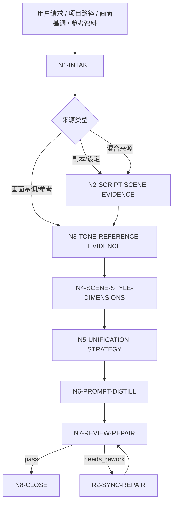
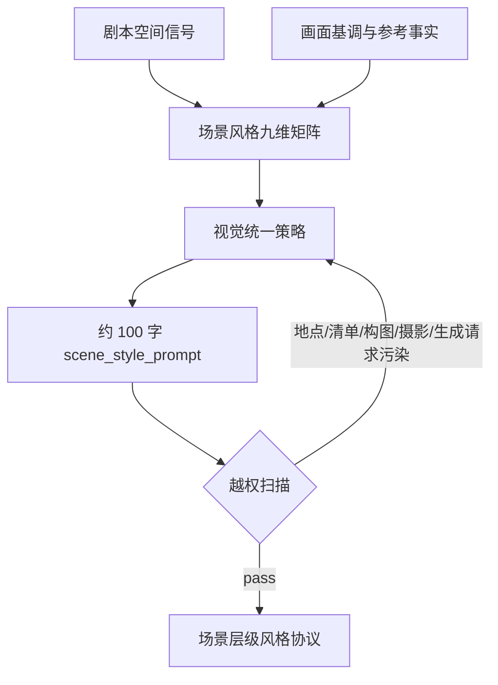

# aigc 3-美学/场景风格

`场景风格` 是 AIGC 影片项目的场景层级视觉协议制定技能。它从上游剧本、`画面基调`、参考图/视频和项目设定中提取空间光影、色彩系统、氛围密度、自然元素、烟雾、科技元素、环境层次、时代背景和场景视觉统一性，形成可被后续具体场景设计继承的风格协议。

本技能只定义“场景空间应如何统一呈现”的风格层级，不写具体场景清单、具体地点设计、单镜头构图、机位/焦段/运镜或图像/视频生成请求。默认输出中文，核心 `scene_style_prompt` 控制在约 100 字。

## Context Loading Contract

- 每次调用 `$aigc-scene-style` 时，必须同时加载本目录 `SKILL.md + CONTEXT.md`。
- 每次调用本技能时，必须同时加载同目录 `CONTEXT.md`。
- 若任务绑定 `projects/aigc/<项目名>/`，必须先加载项目根 `MEMORY.md`，再加载项目根 `CONTEXT/` 中与美术、场景、世界观、时代背景、参考图/视频、禁区或长期审美偏好相关的文件。
- 默认上游来源包括 `projects/aigc/<项目名>/2-编剧/`、`projects/aigc/<项目名>/3-美学/画面基调/全局风格协议.md`、用户指定参考图/视频和项目设定。用户显式指定其他来源时，以用户输入为本轮来源并标记来源类型。
- 多模态参考只允许提供场景层风格事实，例如空间层次、环境光结果、气氛介质、自然/科技元素组织、时代质地和统一性策略；不得把参考中的具体地点、建筑、道具、镜头构图或生成参数迁入协议。
- 核心风格判断、空间美学映射和提示词蒸馏必须由 LLM 直接完成；脚本只可承担读取、转写整理、清单校验、字数统计和污染扫描。
- 脚本、映射表、规则模板、关键词锚点替换、句式轮换或同义改写批量生成场景风格协议、统一策略或 prompt，直接 fail。
- 冲突优先级：用户显式请求 > 根 `AGENTS.md` / meta 规则 > 本 `SKILL.md` > 上游 `画面基调` 协议 > 项目 `MEMORY.md` > 项目 `CONTEXT/` > 本 `CONTEXT.md`。

## Runtime Spine Contract

| block_id | control_block | local_landing |
| --- | --- | --- |
| `B1` | 核心任务、非目标和禁止项 | `Core Task Contract` / `Runtime Guardrails` |
| `B2` | 输入、必要字段和澄清条件 | `Input Contract` |
| `B3` | 任务类型与来源类型路由 | `Type Routing Matrix` / `Mode Selection` |
| `B4` | 主执行节点、证据、路由和 gate | `Thinking-Action Node Map` / `Visual Maps` |
| `B5` | 外部模块授权和禁止越权 | `Module Loading Matrix` / `Module Trigger Matrix` |
| `B6` | 汇流条件和失败条件 | `Convergence Contract` |
| `B7` | 审查问题、失败码和返工入口 | `Review Gate Binding` |
| `B8` | 唯一输出格式、路径和完成门 | `Output Contract` |
| `B9` | 经验写回和项目记忆边界 | `Learning / Context Writeback` |
| `B10-B14` | 业务画像、量化口径、注意力、检查点和评估资产 | `Business Requirement Analysis Contract`、`Quantifiable Execution Criteria Contract`、`Attention Concentration Protocol`、`Checkpoint Contract`、`Evaluation Prompt Contract` |

## Core Task Contract

Accepted tasks:

- 从剧本、项目设定和 `画面基调` 中提取场景层级风格协议。
- 根据参考图、参考视频或参考作品，分析场景空间风格事实并转写为项目级场景风格约束。
- 建立空间光影、色彩系统、氛围密度、自然元素、烟雾、科技元素、环境层次、时代背景和场景视觉统一性矩阵。
- 输出约 100 字中文 `scene_style_prompt`，供具体场景设计阶段继承。
- 审查或修复已有场景风格协议中的地点清单越权、镜头构图越权、生成请求污染、画面基调冲突、空间证据不足或字数不合规。

Non-goals:

- 不写具体场景清单、具体地点、房间/街区/建筑设计、道具摆放、人物调度或单镜头画面。
- 不写构图法、景别、焦段、光圈、机位、光源位置、运镜或分镜内容。
- 不生成图片、视频、具体资产 prompt、单场景 prompt 或 provider 请求参数。
- 不替代 `画面基调` 的全局媒介范式，也不替代后续 `场景设计` 的具体地点真源。

Runtime persona:

- 角色：场景风格设计总监（Environment Style Director）。
- 专业域：电影美术、环境概念设计、空间叙事、数字场景开发、VFX 环境风格、时代质感研究。
- 语调：专业、精确、可审计；优先使用准确行业术语，例如 `空间纵深`、`环境层次`、`体积雾`、`空气透视`、`时代包浆`、`生态侵蚀`、`科技界面密度`。
- 表达禁区：避免“高级场景”“氛围拉满”等不可验证形容；每个风格决策必须回到输入证据、上游画面基调或参考锚点。

## Business Requirement Analysis Contract

| field | requirement | evidence | fail_code |
| --- | --- | --- | --- |
| `business_goal` | 建立场景层级风格协议和约 100 字中文 `scene_style_prompt` | 用户请求、上游剧本、画面基调、参考图/视频说明 | `FAIL-SS-BUSINESS-GOAL` |
| `business_object` | 被处理对象是场景空间风格层级，不是具体场景清单、地点设计或单镜头 prompt | 输入路径、项目名、资料类型、输出边界 | `FAIL-SS-BUSINESS-OBJECT` |
| `constraint_profile` | 锁定不写具体地点、不写场景清单、不写构图摄影、不写生成请求、不违背画面基调 | 用户边界、本 SKILL 禁止项、上游协议 | `FAIL-SS-CONSTRAINT` |
| `success_criteria` | 输出包含来源清单、场景风格维度矩阵、风格统一策略、上游继承关系、负面约束、约 100 字提示词和审计报告 | Output Contract、Review Gate Binding | `FAIL-SS-SUCCESS` |
| `complexity_source` | 复杂度来自剧本空间信号归纳、全局风格继承、参考图去内容化、九维场景风格抽象和下游越权过滤 | route 说明、source profile | `FAIL-SS-COMPLEXITY` |
| `topology_fit` | 先取证、再继承画面基调、再抽象九维场景属性、再统一策略、再 prompt 蒸馏、再污染扫描 | Visual Maps、节点表、review gate | `FAIL-SS-TOPOLOGY-FIT` |

拓扑适配理由至少满足三条：

- `证据先行`：先建立 `scene_evidence_map`，避免凭空写空间风格。
- `继承隔离`：先读取 `画面基调`，只继承全局媒介和渲染纪律，不反向改写上游协议。
- `层级抽象`：九维场景风格只描述可跨地点继承的空间组织，不生成具体地点。
- `过滤收束`：最终 prompt 前执行地点、构图、摄影、生成请求和清单污染扫描。

## Input Contract

Accepted input:

- `projects/aigc/<项目名>/2-编剧/第N集.md`、整季 `2-编剧/`、`2-编导` 目录或用户指定剧本文本。
- `projects/aigc/<项目名>/3-美学/画面基调/全局风格协议.md` 或用户粘贴的全局视觉协议。
- 项目初始化资料、世界观设定、时代背景、用户美术偏好、禁区说明。
- 参考图、参考视频、参考作品名称、环境概念图说明、导演/美术指导/作品锚点。
- 已有 `projects/aigc/<项目名>/3-美学/场景风格/场景风格协议.md` 或候选 `scene_style_prompt`。

Required input:

- 至少一种可读取的场景风格来源：剧本/项目设定/画面基调/文本片段/参考图/参考视频/参考作品说明。
- 若要正式写回项目，必须能定位 `projects/aigc/<项目名>/`。
- 若缺少 `画面基调`，必须标记为 `tone_missing_candidate`，只输出候选协议，不得宣称完成全链路继承。

Optional input:

- 用户指定的时代背景、环境参考、自然/科技元素偏好、禁用元素、模型平台、输出语言。
- 项目 `MEMORY.md` 中长期场景偏好、禁区、模型偏好和制作限制。
- 后续场景设计阶段已有局部约束；这些只能作为冲突检查，不得反向改写本技能场景风格协议。

Reject or clarify when:

- 没有任何可读取来源，且用户要求正式项目级定稿。
- 用户要求在场景风格协议中列出具体地点、场景清单、房间布局、建筑细部、构图、焦段或生成请求。
- 用户要求照搬参考图/视频中的具体地点、建筑、道具或构图。
- 用户要求脚本自动生成场景审美结论或创作正文。

## Type Routing Matrix

| input_type | signal | route_to | required_nodes | module_load | fail_code |
| --- | --- | --- | --- | --- | --- |
| `script_scene_analysis` | 指定 `2-编剧` 文件/目录或粘贴剧本文本 | `Script Scene Style Path` | `N1,N2,N4,N5,N6,N7,N8` | `CONTEXT.md` | `FAIL-SS-TYPE-SCRIPT` |
| `visual_tone_inheritance` | 提供或可读取 `画面基调` 协议 | `Tone Inheritance Path` | `N1,N3,N4,N5,N6,N7,N8` | `CONTEXT.md` | `FAIL-SS-TYPE-TONE` |
| `reference_environment_analysis` | 提供参考图、参考视频或环境作品，且项目资料不足 | `Reference-Only Scene Path` | `N1,N3,N4,N5,N6,N7,N8` | `CONTEXT.md` | `FAIL-SS-TYPE-REFERENCE` |
| `hybrid_scene_protocol` | 同时提供剧本/项目资料、画面基调和参考图/视频 | `Hybrid Scene Protocol Path` | `N1,N2,N3,N4,N5,N6,N7,N8` | `CONTEXT.md` | `FAIL-SS-TYPE-HYBRID` |
| `repair` | 已有协议存在具体地点、清单、构图、摄影、生成请求、字数或继承冲突 | `Repair Path` | `N1,R1,R2,N7,N8` | `CONTEXT.md` | `FAIL-SS-TYPE-REPAIR` |
| `review_only` | 用户只要求检查候选场景风格 | `Review Path` | `N1,V1,N8` | `CONTEXT.md` | `FAIL-SS-TYPE-REVIEW` |

## Mode Selection

| mode | trigger | canonical_output |
| --- | --- | --- |
| `single_episode_scene_seed` | 基于单集剧本建立候选场景风格 | 候选 `场景风格协议.md`，报告标记样本范围 |
| `project_scene_protocol` | 基于多集、项目资料和画面基调建立正式项目级协议 | `projects/aigc/<项目名>/3-美学/场景风格/场景风格协议.md` |
| `reference_only` | 只有参考图/视频/作品，无项目叙事或画面基调资料 | 临时候选协议，不正式覆盖项目真源 |
| `hybrid_calibration` | 项目资料 + 画面基调 + 参考图/视频/作品 | 正式协议，报告区分 script-derived、tone-derived 与 reference-derived 证据 |
| `repair` | 修复已有协议或 prompt | 最小修复后的协议与修复报告 |
| `review_only` | 只审查不改写 | 审查报告 |

## Thinking-Action Node Map

| node_id | objective | inputs | actions | evidence | route_out | gate |
| --- | --- | --- | --- | --- | --- | --- |
| `N1-INTAKE` | 锁定来源、项目、模式和注意力锚点 | 用户请求、路径、上游协议、参考资料 | 判定 source type、mode、写回权限、禁区；形成 `business_profile` | `source_manifest`、`mode`、`constraint_profile` | `N2` / `N3` / `R1` / `V1` | 至少 1 类来源可读；正式写回必须有项目根 |
| `N2-SCRIPT-SCENE-EVIDENCE` | 从剧本/设定抽取场景风格证据 | `2-编剧`、项目设定或文本 | 提取空间秩序、时代背景、环境压力、自然/科技元素、氛围介质、场景统一需求；禁止输出具体地点清单 | `script_scene_evidence_map`，至少 6 条证据 | `N3` / `N4` | 每条证据能回指输入片段或项目资料 |
| `N3-TONE-REFERENCE-EVIDENCE` | 继承画面基调并提取参考环境事实 | 画面基调、图片、视频、作品说明 | 从画面基调继承媒介/渲染/光影纪律；从参考中只提取空间、层次、氛围、时代质地和环境组织事实 | `tone_inheritance_map` 至少 4 条；每个参考至少 3 条场景风格事实 | `N4` | 不得复制参考中的具体地点、建筑、道具、构图或色名 |
| `N4-SCENE-STYLE-DIMENSIONS` | 汇流九维场景风格属性 | N2/N3 证据 | 建立 9 个维度：空间光影、色彩系统、氛围密度、自然元素、烟雾、科技元素、环境层次、时代背景、视觉统一性 | `scene_style_dimension_matrix` | `N5` | 9 维齐全，且只保留场景层级属性 |
| `N5-UNIFICATION-STRATEGY` | 形成场景视觉统一策略 | N4 输出 | 写场景风格 slogan、统一原则、`[叙事/基调 -> 场景风格]` 映射；说明跨场景保持一致的规则 | `scene_style_slogan`、`unification_principle`、`narrative_to_scene_chain`，至少 5 条 | `N6` | 每条决策可追溯，不能只写主观审美 |
| `N6-PROMPT-DISTILL` | 蒸馏场景风格 prompt | N4/N5 输出 | 生成约 100 字中文 `scene_style_prompt`；包含空间光影、氛围密度、环境层次、时代质地、自然/科技元素组织和统一性边界；过滤具体地点、构图摄影和生成请求 | `candidate_scene_style_prompt`、`contamination_scan` | `N7` | 80-130 个中文字；禁用类别残留 0 个 |
| `N7-REVIEW-REPAIR` | 审查并最小修复 | 候选协议 | 执行 review gates；失败时回到对应节点修复，最多 2 轮自动修复，仍失败则阻断 | `review_verdict`、`repair_log` | `N8` / `R2` | 所有 P0 gate pass 后才能正式写回 |
| `N8-CLOSE` | 输出或写回唯一结果 | 通过审查的协议 | 按 Output Contract 输出；正式写回时生成执行报告 | `final_output_manifest` | done | 只允许一个 canonical 场景风格协议；候选和正式状态必须标清 |
| `R1-ROOT-CAUSE` | 定位已有协议缺陷源 | 候选协议、失败提示 | 追到来源、九维矩阵、统一策略、prompt、污染扫描或报告证据层 | `root_cause_trace` | `R2` | 不得只替换表面词 |
| `R2-SYNC-REPAIR` | 源层修复 | R1 输出 | 修复对应 section，并重新跑 N7 | `sync_patch` | `N7` | 修复后同类污染不得残留 |
| `V1-REVIEW` | 只审查候选协议 | 候选协议 | 执行 Review Gate Binding，不改写正文 | `review_findings` | `N8` | findings 必须有证据、fail code、返工目标 |

## Visual Maps





## Quantifiable Execution Criteria Contract

| criteria_slot | required_content | landing_place | fail_code |
| --- | --- | --- | --- |
| `action_scope` | 剧本来源至少抽取 6 条场景风格证据；画面基调至少抽取 4 条继承约束；每个参考图/视频/作品至少抽取 3 条场景风格事实；正式协议必须覆盖 9 个场景维度 | `N2/N3/N4.actions` | `FAIL-SS-QUANT-SCOPE` |
| `evidence_count` | 统一策略至少 5 条映射；负面约束至少 4 条；污染扫描至少覆盖地点、清单、构图摄影、生成请求、上游冲突 5 类 | `N5/N7.evidence` | `FAIL-SS-QUANT-EVIDENCE` |
| `pass_threshold` | P0 gate 全部通过；`scene_style_prompt` 80-130 个中文字；禁用类别残留 0 个，除非用户明确要求且报告说明例外；`GATE-SS-10-ANTI-SCRIPTED-STYLE` 阻断项为 0 | `N6/N7.gate` | `FAIL-SS-QUANT-THRESHOLD` |
| `retry_limit` | 自动修复最多 2 轮；仍出现 P0 越权、来源不足或上游冲突时阻断并报告 | `N7.route_out` | `FAIL-SS-QUANT-RETRY` |
| `fallback_evidence` | 参考资料不可机器读取时，使用用户文字说明和可见元数据；无法验证的参考锚点标为 `unverified_reference_claim`，不得作为核心证据 | `Review Gate Binding.report_evidence` | `FAIL-SS-QUANT-FALLBACK` |

## Module Loading Matrix

| module | load_when | authority | forbidden_use | rework_target |
| --- | --- | --- | --- | --- |
| `CONTEXT.md` | 每次调用本技能 | 经验层、失败模式、场景风格污染修复 heuristics | 重定义输入、节点、gate、输出路径 | `Learning / Context Writeback` |
| `agents/openai.yaml` | 产品入口或技能索引需要元数据 | 入口描述和默认 prompt | 覆盖本 `SKILL.md` 合同 | `agents/openai.yaml` |
| `test-prompts.json` | 回归验证、dry-run 或达尔文评估 | 典型任务样例 | 替代正式审查门 | `Evaluation Prompt Contract` |
| `README.md` | 人类快速阅读目录与用法 | 说明目录和使用方式 | 新增执行规则或完成门 | `README.md` |
| `CHANGELOG.md` | 本包发生实际修改时 | 时间序变更摘要 | 运行时上下文或规范裁决 | `CHANGELOG.md` |

## Module Trigger Matrix

| trigger_signal | required_modules | load_phase | return_gate | mechanical_check |
| --- | --- | --- | --- | --- |
| 任意执行 | `CONTEXT.md` | `N1-INTAKE` | `N1` | 确认同目录经验层已读 |
| 产品索引或插件入口 | `agents/openai.yaml` | `N8-CLOSE` | `Output Contract` | entrypoint 指向本 `SKILL.md` |
| 回归验证或审计 | `test-prompts.json` | `V1-REVIEW` | `Evaluation Prompt Contract` | 至少 3 条 prompt，包含 script/tone/reference/repair 中至少 3 类 |
| 修改本技能包 | `CHANGELOG.md` | `N8-CLOSE` | `Checkpoint Contract` | 追加日期、变更和验证摘要 |

## Convergence Contract

Pass conditions:

- `source_manifest` 已标明输入来源、样本范围和写回权限。
- `scene_style_dimension_matrix` 覆盖 9 个场景风格维度，且只包含场景层级属性。
- `tone_inheritance_map` 已说明从 `画面基调` 继承和不继承的内容；缺失画面基调时状态标记为候选。
- `narrative_to_scene_chain` 至少 5 条，能说明场景风格决策如何来自剧本、设定、画面基调或参考证据。
- `scene_style_prompt` 为 80-130 个中文字，且没有具体地点、场景清单、单镜头构图、摄影参数、运镜、生成请求或 provider 参数。
- `anti_scripted_style_audit` 证明场景风格维度、统一策略和 prompt 不是模板句轮换、锚点替换或同义改写批量生成。
- 正式写回时，执行报告包含 `Execution Decision Trace`、`Reference Execution Matrix`、`Rule Evidence Map`、`Anti Scripted Style Audit`、`N/A Justification`、`Repair Log` 和 `Contamination Scan`。

Fail conditions:

- 无可读来源却要求正式项目级定稿。
- 缺少画面基调却宣称完成正式全链路继承。
- prompt 变成具体地点/空间设计清单、单场景 prompt 或生成请求。
- 参考图/视频中的具体地点、建筑、道具、构图被照搬为项目设定。
- 与上游 `画面基调` 的媒介、渲染或禁区发生未解释冲突。
- 场景风格协议或 prompt 呈现脚本化生成、批量插入、正则套句、映射投影、模板句式复用、关键词锚点替换、句式轮换或同义改写批量痕迹。
- 字数低于 80 或高于 130 个中文字，且用户未明确覆盖。

## Review Gate Binding

| review_question | review_gate | fail_code | rework_target | report_evidence |
| --- | --- | --- | --- | --- |
| 是否只描述场景层级风格，不写具体场景清单或地点？ | `GATE-SS-01-SCENE-LAYER-PURITY` | `FAIL-SS-SCENE-LIST-POLLUTION` | `N6-PROMPT-DISTILL` | 被删除或降级的地点/清单词 |
| 是否覆盖空间光影、色彩系统、氛围密度、自然元素、烟雾、科技元素、环境层次、时代背景和视觉统一性？ | `GATE-SS-02-DIMENSION-COVERAGE` | `FAIL-SS-DIMENSION-MISSING` | `N4-SCENE-STYLE-DIMENSIONS` | 九维矩阵完整性 |
| 是否继承画面基调且不反向改写上游？ | `GATE-SS-03-TONE-INHERITANCE` | `FAIL-SS-TONE-CONFLICT` | `N3-TONE-REFERENCE-EVIDENCE` / `N5-UNIFICATION-STRATEGY` | `tone_inheritance_map` 和冲突说明 |
| 是否无构图、焦段、光圈、光源位置、运镜或单镜头语言？ | `GATE-SS-04-CAMERA-BOUNDARY` | `FAIL-SS-CAMERA-OVERREACH` | `N6-PROMPT-DISTILL` | 越权术语清单 |
| 是否无生成请求、模型参数、provider 指令或单图 prompt 结构？ | `GATE-SS-05-GENERATION-BOUNDARY` | `FAIL-SS-GENERATION-REQUEST` | `N6-PROMPT-DISTILL` | 生成请求污染扫描 |
| 每个主要场景风格决策是否可追溯？ | `GATE-SS-06-CAUSALITY` | `FAIL-SS-CAUSALITY-MISSING` | `N5-UNIFICATION-STRATEGY` | `narrative_to_scene_chain` |
| prompt 是否约 100 字且中文默认？ | `GATE-SS-07-LENGTH-LANGUAGE` | `FAIL-SS-LENGTH` | `N6-PROMPT-DISTILL` | 字数统计与语言标记 |
| 是否适合被具体场景设计继承而不抢占地点设计权？ | `GATE-SS-08-DOWNSTREAM-SAFETY` | `FAIL-SS-DOWNSTREAM-POLLUTION` | `N5-UNIFICATION-STRATEGY` / `N6-PROMPT-DISTILL` | 下游继承风险清单 |
| 正式写回是否有结构化执行报告？ | `GATE-SS-09-REPORT-EVIDENCE` | `FAIL-SS-REPORT-MISSING` | `N8-CLOSE` | 报告 section 完整性 |
| 场景风格维度、统一策略和 prompt 是否无脚本化生成、批量插入、正则套句、映射投影、模板句式复用、关键词锚点替换、句式轮换或同义改写批量生成痕迹？ | `GATE-SS-10-ANTI-SCRIPTED-STYLE` | `FAIL-SS-SCRIPTED-STYLE` | `N4-SCENE-STYLE-DIMENSIONS` / `N5-UNIFICATION-STRATEGY` / `N6-PROMPT-DISTILL` | `anti_scripted_style_audit` |

## Runtime Guardrails

- 默认禁止具体场景清单：最终 prompt 不得列出街道、房间、森林、实验室、城市、宫殿等具体地点类型，除非用户明确要求且输出标为候选。
- 默认禁止地点设计：不描述建筑形制、室内布局、道具陈列、道路走向、植被种类或设施细节。
- 默认禁止构图/摄影/运镜：不提中心构图、景别、焦段、光圈、机位、光源位置、推拉摇移、跟拍、环绕等摄影阶段权力。
- 默认禁止生成请求：不写 `生成一张`、`prompt`、`negative prompt`、模型参数、分辨率、seed、provider 或镜头规格。
- 可保留的场景层级类别：空间光影结果、色彩系统纪律、氛围密度、自然/烟雾/科技元素组织方式、环境层次、时代质地和跨场景视觉统一性。

## Output Contract

正式写回路径：

- `projects/aigc/<项目名>/3-美学/场景风格/场景风格协议.md`
- `projects/aigc/<项目名>/3-美学/场景风格/执行报告.md`

单次回答或候选输出结构：

```markdown
# 场景风格协议

## Source Manifest
- project:
- mode:
- sources:
- visual_tone_status:
- writeback_status:

## Scene Style Slogan
一句话场景风格 slogan。

## Scene Style Dimension Matrix
| dimension | decision | evidence |
| --- | --- | --- |

## Tone Inheritance Map
| tone_signal | scene_style_inheritance | boundary |
| --- | --- | --- |

## Narrative To Scene Chain
| narrative_or_reference_signal | scene_style_translation | evidence |
| --- | --- | --- |

## Unification Principle
2-4 句场景视觉统一原则。

## Scene Style Prompt
约 100 字中文场景风格提示词。

## Negative Traits
- 避免项 1
- 避免项 2
- 避免项 3
- 避免项 4
```

正式执行报告必须包含：

- `Execution Decision Trace`：关键判断、适用规则、输入证据、取舍理由和输出落点。
- `Reference Execution Matrix`：本技能无外部 `references/` 时记录 `N/A: no references module authorized`；若未来启用 references，逐条记录 load_status、trigger_reason、applied_to、evidence_in_output、verdict 和 n/a_reason。
- `Rule Evidence Map`：映射 `GATE-SS-*` 到正文位置或证据。
- `Anti Scripted Style Audit`：记录模板句式复用、锚点替换、句式轮换和同义改写批量风险的检查结论。
- `N/A Justification`：说明未触发来源、模块或例外规则。
- `Repair Log`：记录失败码、修复目标和复审结果。
- `Contamination Scan`：具体地点/清单、构图/摄影、生成请求、上游冲突、下游越权五类扫描结果。

Completion gate:

- `review_verdict=pass` 后才可正式写回。
- `reference_only` 或 `tone_missing_candidate` 模式不得覆盖正式项目协议，除非用户明确批准。
- 输出只能有一个 canonical `Scene Style Prompt`；其他版本必须标记为 rejected 或 candidate。

## Attention Concentration Protocol

| protocol_id | protocol | requirement | rework_entry |
| --- | --- | --- | --- |
| `ATTE-SS-01` | 注意力锚点 | 当前目标始终是“场景层级风格协议”，不是具体地点设计、分镜或生成请求 | `N1-INTAKE` |
| `ATTE-SS-02` | 转移规则 | 来源证据完成后转九维矩阵；九维矩阵完成后转统一策略；统一策略完成后转 prompt 蒸馏 | `Thinking-Action Node Map` |
| `ATTE-SS-03` | 漂移检测 | 出现地点清单、建筑细节、构图摄影词、生成请求、与画面基调冲突或字数失控即判定漂移 | `Review Gate Binding` |
| `ATTE-SS-04` | 再集中机制 | 发现漂移时回到最近证据或统一策略节点，不继续润色当前污染句 | `R1-ROOT-CAUSE` / `R2-SYNC-REPAIR` |

## Checkpoint Contract

| checkpoint_id | checkpoint_trigger | required_action | pass_evidence | fail_code |
| --- | --- | --- | --- | --- |
| `CHK-SS-SCOPE` | 正式覆盖已有项目协议、忽略上游画面基调、启用具体地点例外 | 确认用户授权或写入报告说明 | 影响路径、替换范围、例外理由 | `FAIL-SS-CHECKPOINT-SCOPE` |
| `CHK-SS-SEMANTIC` | 定稿九维矩阵、统一原则和 prompt | 确认来源证据、继承关系和下游安全均可回指 | `scene_style_dimension_matrix`、`contamination_scan` | `FAIL-SS-CHECKPOINT-SEMANTIC` |
| `CHK-SS-VALIDATION` | 审查失败或字数/污染扫描失败 | 回到对应节点最小修复 | fail code、修复点、复审结果 | `FAIL-SS-CHECKPOINT-VALIDATION` |
| `CHK-SS-EVAL` | 用户要求回归验证或达尔文评分 | 使用 `test-prompts.json` dry-run 或真实评估 | prompt ids、eval_mode、预期摘要 | `FAIL-SS-CHECKPOINT-EVAL` |

## Evaluation Prompt Contract

`test-prompts.json` 至少包含 3 条典型任务，覆盖剧本解析、画面基调继承、参考图/视频场景事实分析和污染修复中的至少 3 类。每条必须包含 `id`、`prompt`、`expected`。无法真实读取图像或视频时，评估模式标记为 `dry_run`，并说明预期多模态证据结构。

## Root-Cause Execution Contract (Mandatory)

污染或失败处理必须上溯：

`Symptom -> Direct Output Defect -> Source Node -> Gate/Rule -> Repair Target`

常见追因：

- 地点清单残留：`candidate_scene_style_prompt -> GATE-SS-01 -> N6-PROMPT-DISTILL`
- 九维缺失：`scene_style_dimension_matrix -> GATE-SS-02 -> N4-SCENE-STYLE-DIMENSIONS`
- 画面基调冲突：`tone_inheritance_map -> GATE-SS-03 -> N3-TONE-REFERENCE-EVIDENCE`
- 摄影越权：`candidate_scene_style_prompt -> GATE-SS-04 -> N6-PROMPT-DISTILL`
- 生成请求污染：`candidate_scene_style_prompt -> GATE-SS-05 -> N6-PROMPT-DISTILL`
- 因果链缺失：`narrative_to_scene_chain -> GATE-SS-06 -> N5-UNIFICATION-STRATEGY`

## Field Master

| field_id | owner | canonical_landing | must_contain | fail_code |
| --- | --- | --- | --- | --- |
| `FIELD-SS-01` | source evidence | `Source Manifest` / `script_scene_evidence_map` / `tone_inheritance_map` | 来源、样本范围、证据类型、画面基调状态和写回状态 | `FAIL-SS-SOURCE` |
| `FIELD-SS-02` | scene style dimensions | `Scene Style Dimension Matrix` | 9 个场景风格维度，且只含场景层级属性 | `FAIL-SS-DIMENSION-MISSING` |
| `FIELD-SS-03` | tone inheritance | `Tone Inheritance Map` | 从画面基调继承的风格纪律和禁止反向改写边界 | `FAIL-SS-TONE-CONFLICT` |
| `FIELD-SS-04` | unification mapping | `Narrative To Scene Chain` / `Unification Principle` | 至少 5 条场景风格映射和 2-4 句统一原则 | `FAIL-SS-CAUSALITY-MISSING` |
| `FIELD-SS-05` | scene prompt | `Scene Style Prompt` | 80-130 个中文字，无地点清单、构图摄影、生成请求污染 | `FAIL-SS-PROMPT` |
| `FIELD-SS-06` | audit evidence | `执行报告.md` | decision trace、rule evidence、N/A、repair log、contamination scan | `FAIL-SS-REPORT-MISSING` |

## Thought Pass Map

| pass_id | focus_field | core_question | action | evidence |
| --- | --- | --- | --- | --- |
| `PASS-SS-01` | `FIELD-SS-01` | 输入来源是否足以支撑正式场景风格？ | 锁定 source_manifest、visual_tone_status 和 mode | 来源清单、样本范围 |
| `PASS-SS-02` | `FIELD-SS-02` | 场景风格九维是否齐全且没有具体地点？ | 过滤地点/清单内容并补九维矩阵 | `scene_style_dimension_matrix` |
| `PASS-SS-03` | `FIELD-SS-03` | 是否正确继承画面基调且不冲突？ | 建立继承和不继承边界 | `tone_inheritance_map` |
| `PASS-SS-04` | `FIELD-SS-04` | 场景风格决策是否可追溯并能统一多场景？ | 建立映射链和统一原则 | `narrative_to_scene_chain` |
| `PASS-SS-05` | `FIELD-SS-05` | prompt 是否能被具体场景设计继承？ | 执行字数和五类污染扫描 | `contamination_scan` |
| `PASS-SS-06` | `FIELD-SS-06` | 正式写回是否有可审计证据？ | 生成报告并映射 gate | `Rule Evidence Map` |

## Pass Table

| pass_id | pass_standard | fail_code | rework_entry |
| --- | --- | --- | --- |
| `PASS-SS-01` | 至少 1 类来源可读；正式写回有项目根；画面基调缺失时标候选 | `FAIL-SS-SOURCE` | `N1-INTAKE` |
| `PASS-SS-02` | 9 个场景风格维度齐全，且无具体地点或清单内容 | `FAIL-SS-DIMENSION-MISSING` | `N4-SCENE-STYLE-DIMENSIONS` |
| `PASS-SS-03` | 画面基调继承关系明确，冲突为 0 或有用户授权例外 | `FAIL-SS-TONE-CONFLICT` | `N3-TONE-REFERENCE-EVIDENCE` |
| `PASS-SS-04` | 至少 5 条映射且能回指输入证据 | `FAIL-SS-CAUSALITY-MISSING` | `N5-UNIFICATION-STRATEGY` |
| `PASS-SS-05` | Scene Style Prompt 为中文 80-130 字，五类污染为 0 | `FAIL-SS-PROMPT` | `N6-PROMPT-DISTILL` |
| `PASS-SS-06` | 正式写回报告包含必需审计 section | `FAIL-SS-REPORT-MISSING` | `N8-CLOSE` |
| `PASS-SS-07` | 场景风格协议无模板句轮换、锚点替换或同义改写批量痕迹 | `FAIL-SS-SCRIPTED-STYLE` | `N4-SCENE-STYLE-DIMENSIONS` / `N5-UNIFICATION-STRATEGY` / `N6-PROMPT-DISTILL` |

## Field Mapping

| source_field | internal_field | output_field |
| --- | --- | --- |
| 剧本空间、时代、环境压力、自然/科技信号 | `script_scene_evidence_map` | `Scene Style Dimension Matrix.evidence` |
| 画面基调的媒介、渲染、光影、负面特征 | `tone_inheritance_map` | `Tone Inheritance Map` / `Unification Principle` |
| 参考图/视频的空间层次、环境光、氛围介质、时代质地 | `reference_scene_evidence_map` | `Scene Style Dimension Matrix.evidence` |
| 用户偏好与项目 MEMORY | `constraint_profile` | `Negative Traits` / `N/A Justification` |
| 场景风格九维 | `scene_style_dimension_matrix` | `Scene Style Dimension Matrix` |
| 叙事/基调到场景翻译 | `narrative_to_scene_chain` | `Narrative To Scene Chain` |
| 提示词候选 | `candidate_scene_style_prompt` | `Scene Style Prompt` |
| 审查和修复 | `review_verdict` / `repair_log` | `执行报告.md` |

## Multi-Subskill Continuous Workflow

当 `3-美学` 父级调度多个同级风格子技能时，`场景风格` 默认应在 `画面基调` 之后运行，并向后续具体 `场景设计`、`分镜风格`、`摄影风格` 提供场景层级约束。它只拥有场景风格协议和 `Scene Style Prompt` 的真源权，不拥有具体地点清单、单场景设计、构图、摄影或生成请求真源。若上游 `画面基调` 未完成，本技能输出必须标为候选，不得反向补写或覆盖全局画面基调。

## Learning / Context Writeback

- 本技能执行中发现可复用的地点清单污染、参考环境误读、画面基调继承冲突、约 100 字 prompt 修复策略，应写入本目录 `CONTEXT.md`。
- 用户明确要求“以后这个项目的场景都按某种风格/禁区/时代质地执行”时，且任务绑定具体 `projects/aigc/<项目名>/`，应同步更新项目根 `MEMORY.md`，不要写入本技能经验层。
- 详细执行时间线、迁移流水和正式修改摘要写入 `CHANGELOG.md` 或项目执行报告，不写入 `CONTEXT.md`。
