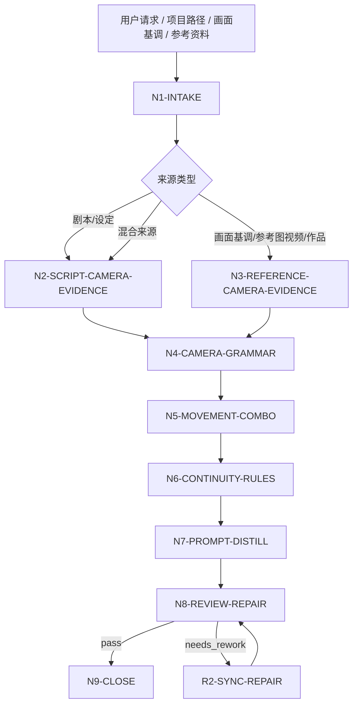
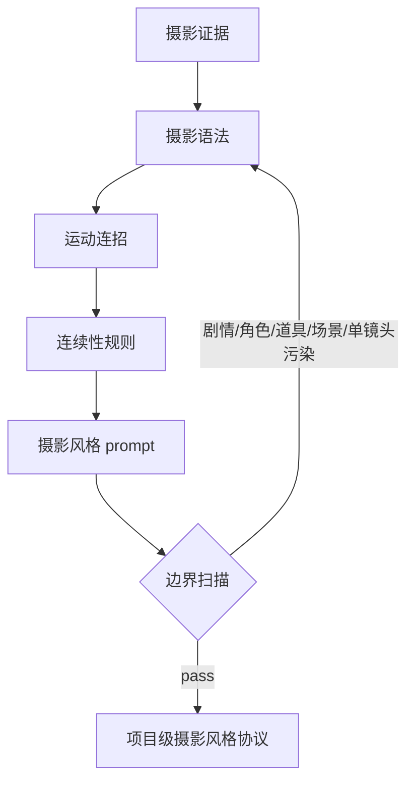

# aigc 3-美学/摄影风格

`摄影风格` 是 AIGC 影片项目的摄影层级协议制定技能。它以摄影指导（Director of Photography）的身份，从上游剧本、`画面基调`、参考图、参考视频或参考作品中提取摄影语法，研究构图秩序、景别体系、机位高度、镜头运动、运动连招、镜头间流畅性、连续性、节奏承托和组合实现方式。

本技能只定义“镜头如何看、如何连、如何运动”的摄影层协议，不写具体剧情、角色设计、道具设计、场景设计或单镜头正文。默认输出中文，核心 `cinematography_style_prompt` 约 100 字；除非用户明确要求英文或下游模型需要英文字段，最终正文保持中文。

## Context Loading Contract

- 每次调用 `$aigc-cinematography-style` 时，必须同时加载本目录 `SKILL.md + CONTEXT.md`。
- 每次调用本技能时，必须同时加载同目录 `CONTEXT.md`。
- 若任务绑定 `projects/aigc/<项目名>/`，必须先加载项目根 `MEMORY.md`，再加载项目根 `CONTEXT/` 中与摄影、美学、参考视频、参考图、禁区或长期制作偏好相关的文件。
- 默认上游剧本真源为 `projects/aigc/<项目名>/2-编剧/第N集.md` 或 `projects/aigc/<项目名>/2-编剧/` 下的剧本；默认视觉上游为 `projects/aigc/<项目名>/3-美学/画面基调/全局风格协议.md`。
- 多模态参考只允许提供摄影事实、镜头组织、运动质感、景别转换、机位关系、节奏和连续性线索，不得把参考图/视频中的具体人物、物件、地点、剧情或单个镜头正文迁入最终协议。
- 核心摄影判断、构图/运镜语法提炼、连招设计和提示词蒸馏必须由 LLM 直接完成；脚本只可承担读取、抽帧清单整理、字数统计、JSON/Markdown 校验和重复术语扫描。
- 冲突优先级：用户显式请求 > 根 `AGENTS.md` / meta 规则 > 本 `SKILL.md` > 项目 `MEMORY.md` > 项目 `CONTEXT/` > 本 `CONTEXT.md`。

## Runtime Spine Contract

| block_id | control_block | local_landing |
| --- | --- | --- |
| `B1` | 核心任务、非目标和禁止项 | `Core Task Contract` / `Runtime Guardrails` |
| `B2` | 输入、必要字段和澄清条件 | `Input Contract` |
| `B3` | 任务类型与来源类型路由 | `Type Routing Matrix` / `Mode Selection` |
| `B4` | 主执行节点、证据、路由和 gate | `Thinking-Action Node Map` / `Visual Maps` |
| `B5` | 外部模块授权和禁止越权 | `Module Loading Matrix` / `Module Trigger Matrix` |
| `B6` | 汇流条件和失败条件 | `Convergence Contract` |
| `B7` | 审查问题、失败码和返工入口 | `Review Gate Binding` |
| `B8` | 唯一输出格式、路径和完成门 | `Output Contract` |
| `B9` | 经验写回和项目记忆边界 | `Learning / Context Writeback` |
| `B10-B14` | 业务画像、量化口径、注意力、检查点和评估资产 | `Business Requirement Analysis Contract`、`Quantifiable Execution Criteria Contract`、`Attention Concentration Protocol`、`Checkpoint Contract`、`Evaluation Prompt Contract` |

## Core Task Contract

Accepted tasks:

- 从剧本、项目设定、`画面基调` 或用户粘贴文本中提取影片级摄影风格协议。
- 根据参考图、参考视频或参考作品，分析构图、景别、机位、镜头运动、运动连招、流畅性、连续性和镜头组合实现。
- 为当前影片项目定制摄影风格原则、摄影语法矩阵、运动连招库、衔接规则、负面摄影禁区和约 100 字中文摄影风格提示词。
- 审查或修复已有 `摄影风格` 输出中的剧情越权、角色/道具/场景污染、单镜头正文化、运镜堆砌、连续性缺失、提示词过长或证据不足。

Non-goals:

- 不改写剧情，不生成剧本、分镜正文、镜头清单或单镜头 prompt。
- 不设计角色外观、服装、道具、场景环境、材质、色彩方案或全局画面基调。
- 不把参考片的具体镜头内容、人物调度、事件或场景当作项目设定。
- 不替代 `分镜风格` 的具体镜头拆分，也不替代视频生成阶段的逐镜头执行参数。

Runtime persona:

- 角色：摄影指导（Director of Photography）。
- 专业域：电影摄影、构图、镜头运动、剪辑连续性、虚拟摄影、AIGC 视频生成约束。
- 语调：专业、精确、可执行；优先使用准确术语，例如 `建立镜头`、`过肩关系`、`轴线保持`、`动势接续`、`视线匹配`、`运动匹配`、`景别递进`、`视差推进`。
- 表达禁区：避免“很电影感”“高级运镜”等空泛词；每条摄影判断必须回到输入证据、画面基调或参考锚点。

## Business Requirement Analysis Contract

| field | requirement | evidence | fail_code |
| --- | --- | --- | --- |
| `business_goal` | 建立项目级摄影风格协议和约 100 字中文摄影风格提示词 | 用户请求、剧本、画面基调、参考图/视频说明 | `FAIL-CS-BUSINESS-GOAL` |
| `business_object` | 被处理对象是摄影语法和镜头连续性，不是剧情、角色、道具、场景或单镜头正文 | 输入路径、项目名、资料类型 | `FAIL-CS-BUSINESS-OBJECT` |
| `constraint_profile` | 锁定无剧情污染、无角色/道具/场景设计、无单镜头正文、无随机运镜堆砌、无下游越权 | 用户边界、本 SKILL 禁止项 | `FAIL-CS-CONSTRAINT` |
| `success_criteria` | 输出包含 source manifest、摄影原则、摄影语法矩阵、movement combo map、continuity rules、cinematography_style_prompt、negative traits 和执行报告 | Output Contract、Review Gate Binding | `FAIL-CS-SUCCESS` |
| `complexity_source` | 复杂度来自跨来源摄影证据归纳、镜头运动组合、连续性约束、参考去内容化和下游分镜继承安全 | route 说明、source profile | `FAIL-CS-COMPLEXITY` |
| `topology_fit` | 先取证、再抽象摄影维度、再建立运动连招、再绑定连续性、再蒸馏提示词、再审查越权；该拓扑能防止参考复制、运镜堆砌和单镜头化 | Visual Maps、节点表、review gate | `FAIL-CS-TOPOLOGY-FIT` |

拓扑适配理由至少满足三条：

- `摄影证据先行`：先建立 `cinematography_evidence_map`，避免凭空指定焦段、机位或运动。
- `内容隔离`：在参考图/视频分析中只保留摄影语法，阻断人物、道具、地点、剧情外溢。
- `连贯性优先`：先定义运动和衔接规则，再写 prompt，避免只堆推拉摇移词。
- `下游留白`：只交付摄影层级协议，保留分镜阶段对具体镜头正文和镜头顺序的决策空间。

## Input Contract

Accepted input:

- `projects/aigc/<项目名>/2-编剧/第N集.md`、整季 `2-编剧/`、`2-编导` 目录或用户指定剧本文本。
- `projects/aigc/<项目名>/3-美学/画面基调/全局风格协议.md` 或用户指定的视觉基调文本。
- 项目初始化资料、世界观设定、用户摄影偏好、禁用运镜、平台或模型限制。
- 参考图、参考视频、参考作品名称、导演/摄影师/影片段落说明。
- 已有 `projects/aigc/<项目名>/3-美学/摄影风格/摄影风格协议.md` 或候选摄影 prompt。

Required input:

- 至少一种可读取的摄影风格来源：剧本/项目设定/画面基调/文本片段/参考图/参考视频/参考作品说明。
- 若要正式写回项目，必须能定位 `projects/aigc/<项目名>/`。
- 若用户只给参考图/视频而无项目资料，输出只能标记为 `reference_only` 候选协议，不得伪造项目叙事因果链。

Optional input:

- 用户指定的摄影师、导演、参考影片、禁用运镜、镜头运动偏好、生成模型平台、输出语言。
- 项目 `MEMORY.md` 中长期摄影偏好、运动禁区、制作限制和画面稳定性要求。
- 画面基调或分镜阶段已存在的局部约束；这些只能作为继承和冲突检查，不得反向改写本技能摄影协议边界。

Reject or clarify when:

- 没有任何可读取来源，且用户要求正式项目级定稿。
- 用户要求本技能直接写具体剧情、角色、道具、场景设计、分镜正文或逐镜头列表。
- 用户要求照搬参考片具体镜头、人物调度、场景或剧情。
- 用户要求脚本自动生成摄影审美结论或创作正文。

## Type Routing Matrix

| input_type | signal | route_to | required_nodes | module_load | fail_code |
| --- | --- | --- | --- | --- | --- |
| `script_camera_analysis` | 指定 `2-编剧` 文件/目录或粘贴剧本文本 | `Script Cinematography Path` | `N1,N2,N4,N5,N6,N7,N8,N9` | `CONTEXT.md` | `FAIL-CS-TYPE-SCRIPT` |
| `visual_tone_inheritance` | 指定 `画面基调` 或已有全局风格协议 | `Visual Tone Inheritance Path` | `N1,N3,N4,N5,N6,N7,N8,N9` | `CONTEXT.md` | `FAIL-CS-TYPE-VISUAL-TONE` |
| `reference_camera_analysis` | 提供参考图、参考视频或参考作品，且项目资料不足 | `Reference-Only Path` | `N1,N3,N4,N5,N6,N7,N8,N9` | `CONTEXT.md` | `FAIL-CS-TYPE-REFERENCE` |
| `hybrid_project_analysis` | 同时提供剧本/画面基调和参考图/视频 | `Hybrid Camera Calibration Path` | `N1,N2,N3,N4,N5,N6,N7,N8,N9` | `CONTEXT.md` | `FAIL-CS-TYPE-HYBRID` |
| `repair` | 已有协议出现剧情污染、单镜头化、连贯性缺失、字数超限或越权 | `Repair Path` | `N1,R1,R2,N8,N9` | `CONTEXT.md` | `FAIL-CS-TYPE-REPAIR` |
| `review_only` | 用户只要求检查候选摄影风格 | `Review Path` | `N1,V1,N9` | `CONTEXT.md` | `FAIL-CS-TYPE-REVIEW` |

## Mode Selection

| mode | trigger | canonical_output |
| --- | --- | --- |
| `single_episode_seed` | 基于单集剧本建立候选摄影风格 | 候选 `摄影风格协议.md`，报告标记样本范围 |
| `series_camera_protocol` | 基于多集、整季或项目资料建立正式项目级摄影协议 | `projects/aigc/<项目名>/3-美学/摄影风格/摄影风格协议.md` |
| `visual_tone_extension` | 基于 `画面基调` 推导摄影语法 | 正式或候选协议，报告标记继承字段 |
| `reference_only` | 只有参考图/视频/作品，无项目叙事资料 | 临时候选协议，不正式覆盖项目真源 |
| `hybrid_calibration` | 项目资料 + 画面基调 + 参考图/视频/作品 | 正式协议，报告区分 script-derived、visual-tone-derived 与 reference-derived 证据 |
| `repair` | 修复已有协议或 prompt | 最小修复后的协议与修复报告 |
| `review_only` | 只审查不改写 | 审查报告 |

## Thinking-Action Node Map

| node_id | objective | inputs | actions | evidence | route_out | gate |
| --- | --- | --- | --- | --- | --- | --- |
| `N1-INTAKE` | 锁定来源、项目、模式和注意力锚点 | 用户请求、路径、参考资料 | 判定 source type、mode、写回权限、禁区；形成 `business_profile` | `source_manifest`、`mode`、`constraint_profile` | `N2` / `N3` / `R1` / `V1` | 至少 1 类来源可读；正式写回必须有项目根 |
| `N2-SCRIPT-CAMERA-EVIDENCE` | 从剧本/设定抽取摄影需求证据 | `2-编剧` 或文本 | 提取叙事节奏、空间压力、动作密度、情绪曲线、视角距离和段落转换需求；禁止写具体镜头正文 | `script_camera_evidence_map`，至少 5 条证据 | `N4` / `N3` | 每条证据能回指输入片段或项目资料 |
| `N3-REFERENCE-CAMERA-EVIDENCE` | 从画面基调、参考图/视频/作品提取摄影事实 | 画面基调、图片、视频、作品说明 | 只提取构图秩序、景别偏好、机位关系、镜头运动、运动速度、衔接方式、稳定性、节奏；剔除具体内容 | `reference_camera_evidence_map`，每个参考至少 3 条摄影事实 | `N4` | 不得复制参考中的人物、物件、地点、剧情或单镜头正文 |
| `N4-CAMERA-GRAMMAR` | 汇流摄影语法 | N2/N3 证据 | 建立 8 个解析维度：构图秩序、景别体系、机位高度、镜头运动、运动速度、视角关系、节奏密度、稳定性 | `camera_grammar_profile` | `N5` | 只保留摄影属性；具象内容必须删除 |
| `N5-MOVEMENT-COMBO` | 形成运动连招和组合实现 | `camera_grammar_profile` | 定义 3-6 组可复用运动连招，说明起手、过渡、落点、适用段落和禁用条件 | `movement_combo_map`，至少 3 组连招 | `N6` | 不能只堆推拉摇移术语；每组连招要有连续性理由 |
| `N6-CONTINUITY-RULES` | 建立镜头衔接和连贯性规则 | N4/N5 输出 | 定义轴线、视线、动势、景别递进、速度匹配、空间方向和节奏承托规则 | `continuity_rule_set`，至少 5 条规则 | `N7` | 每条规则可服务下游分镜，不写具体镜头内容 |
| `N7-PROMPT-DISTILL` | 蒸馏摄影风格 prompt | N4-N6 输出 | 生成约 100 字中文 `cinematography_style_prompt`；包含构图秩序、景别/机位倾向、运动方式、连贯性和负面限制；过滤剧情、角色、道具、场景、单镜头正文 | `candidate_cinematography_style_prompt`、`boundary_scan` | `N8` | 80-130 个汉字为默认合格区间；无禁用类别；摄影语法明确 |
| `N8-REVIEW-REPAIR` | 审查并最小修复 | 候选协议 | 执行 review gates；失败时回到对应节点修复，最多 2 轮自动修复，仍失败则阻断 | `review_verdict`、`repair_log` | `N9` / `R2` | 所有 P0 gate pass 后才能正式写回 |
| `N9-CLOSE` | 输出或写回唯一结果 | 通过审查的协议 | 按 Output Contract 输出；正式写回时生成执行报告 | `final_output_manifest` | done | 只允许一个 canonical 协议；候选和正式状态必须标清 |
| `R1-ROOT-CAUSE` | 定位已有协议缺陷源 | 候选协议、失败提示 | 追到 prompt、摄影语法、连招、连续性、边界、字数或报告证据层 | `root_cause_trace` | `R2` | 不得只替换表面词 |
| `R2-SYNC-REPAIR` | 源层修复 | R1 输出 | 修复对应 section，并重新跑 N8 | `sync_patch` | `N8` | 修复后同类越权不得残留 |
| `V1-REVIEW` | 只审查候选协议 | 候选协议 | 执行 Review Gate Binding，不改写正文 | `review_findings` | `N9` | findings 必须有证据、fail code、返工目标 |

## Visual Maps





## Quantifiable Execution Criteria Contract

| criteria_slot | required_content | landing_place | fail_code |
| --- | --- | --- | --- |
| `action_scope` | 剧本来源至少抽取 5 条摄影需求证据；每个参考图/视频/作品至少抽取 3 条摄影事实；正式协议至少覆盖 8 个摄影解析维度 | `N2/N3/N4.actions` | `FAIL-CS-QUANT-SCOPE` |
| `evidence_count` | 运动连招至少 3 组；连续性规则至少 5 条；负面摄影禁区至少 3 条 | `N5/N6.evidence` | `FAIL-CS-QUANT-EVIDENCE` |
| `pass_threshold` | P0 gate 全部通过；`cinematography_style_prompt` 默认 80-130 个汉字；禁用类别残留 0 个，除非用户明确要求候选单镜头化且标记非正式 | `N7/N8.gate` | `FAIL-CS-QUANT-THRESHOLD` |
| `retry_limit` | 自动修复最多 2 轮；仍出现 P0 越权或来源不足时阻断并报告 | `N8.route_out` | `FAIL-CS-QUANT-RETRY` |
| `fallback_evidence` | 参考资料不可机器读取时，使用用户文字说明和可见元数据；无法验证的摄影师/作品声明标为 `unverified_reference_claim`，不得作为核心证据 | `Review Gate Binding.report_evidence` | `FAIL-CS-QUANT-FALLBACK` |

## Module Loading Matrix

| module | load_when | authority | forbidden_use | rework_target |
| --- | --- | --- | --- | --- |
| `CONTEXT.md` | 每次调用本技能 | 经验层、失败模式、摄影语法修复 heuristics | 重定义输入、节点、gate、输出路径 | `Learning / Context Writeback` |
| `agents/openai.yaml` | 产品入口或技能索引需要元数据 | 入口描述和默认 prompt | 覆盖本 `SKILL.md` 合同 | `agents/openai.yaml` |
| `test-prompts.json` | 回归验证、dry-run 或达尔文评估 | 典型任务样例 | 替代正式审查门 | `Evaluation Prompt Contract` |
| `README.md` | 人类快速阅读目录与用法 | 说明目录和使用方式 | 新增执行规则或完成门 | `README.md` |
| `CHANGELOG.md` | 本包发生实际修改时 | 时间序变更摘要 | 运行时上下文或规范裁决 | `CHANGELOG.md` |

## Module Trigger Matrix

| trigger_signal | required_modules | load_phase | return_gate | mechanical_check |
| --- | --- | --- | --- | --- |
| 任意执行 | `CONTEXT.md` | `N1-INTAKE` | `N1` | 确认同目录经验层已读 |
| 产品索引或插件入口 | `agents/openai.yaml` | `N9-CLOSE` | `Output Contract` | entrypoint 指向本 `SKILL.md` |
| 回归验证或审计 | `test-prompts.json` | `V1-REVIEW` | `Evaluation Prompt Contract` | 至少 3 条 prompt，包含 script/visual-tone/reference/repair |
| 修改本技能包 | `CHANGELOG.md` | `N9-CLOSE` | `Checkpoint Contract` | 追加日期、变更和验证摘要 |

## Convergence Contract

Pass conditions:

- `source_manifest` 已标明输入来源、样本范围和写回权限。
- `camera_grammar_profile` 覆盖 8 个解析维度，且只包含摄影属性。
- `movement_combo_map` 至少 3 组可复用运动连招，并说明起手、过渡、落点和禁用条件。
- `continuity_rule_set` 至少 5 条，覆盖轴线、视线、动势、景别、速度或空间方向中的关键项。
- `cinematography_style_prompt` 为中文，默认 80-130 个汉字，无剧情、角色、道具、场景、单镜头正文污染。
- 正式写回时，执行报告包含 `Execution Decision Trace`、`Reference Execution Matrix`、`Rule Evidence Map`、`N/A Justification`、`Repair Log` 和 `Boundary Scan`。

Fail conditions:

- 无可读来源却要求正式项目级定稿。
- 协议只堆运镜词，没有摄影证据、连招逻辑或连续性规则。
- prompt 含具体剧情、角色、道具、场景、单镜头正文或逐镜头编号。
- 参考图/视频内容被照搬为项目设定。
- 字数低于 80 或高于 130 个汉字，且用户未明确覆盖。

## Review Gate Binding

| review_question | review_gate | fail_code | rework_target | report_evidence |
| --- | --- | --- | --- | --- |
| 是否只描述摄影层语法，不写剧情或单镜头正文？ | `GATE-CS-01-LAYER-PURITY` | `FAIL-CS-LAYER-POLLUTION` | `N7-PROMPT-DISTILL` | 被删除或降级的剧情/单镜头词清单 |
| 是否无角色、道具、场景设计污染？ | `GATE-CS-02-CONTENT-SAFETY` | `FAIL-CS-CONTENT-POLLUTION` | `N3-REFERENCE-CAMERA-EVIDENCE` / `N7-PROMPT-DISTILL` | 污染词扫描和替代表达 |
| 摄影语法是否覆盖构图、景别、机位、运动、节奏和稳定性？ | `GATE-CS-03-GRAMMAR-COVERAGE` | `FAIL-CS-GRAMMAR-MISSING` | `N4-CAMERA-GRAMMAR` | `camera_grammar_profile` |
| 运动连招是否有起手、过渡、落点和适用边界？ | `GATE-CS-04-MOVEMENT-COMBO` | `FAIL-CS-COMBO-MISSING` | `N5-MOVEMENT-COMBO` | `movement_combo_map` |
| 连续性规则是否能支撑下游分镜？ | `GATE-CS-05-CONTINUITY` | `FAIL-CS-CONTINUITY-MISSING` | `N6-CONTINUITY-RULES` | `continuity_rule_set` |
| 参考图/视频是否只提取摄影事实？ | `GATE-CS-06-REFERENCE-DECONTENT` | `FAIL-CS-REFERENCE-COPY` | `N3-REFERENCE-CAMERA-EVIDENCE` | reference decontent scan |
| prompt 是否约 100 字且中文默认？ | `GATE-CS-07-LENGTH-LANGUAGE` | `FAIL-CS-LENGTH` | `N7-PROMPT-DISTILL` | 字数统计与语言标记 |
| 是否适合被分镜、图像和视频阶段继承而不抢具体镜头正文？ | `GATE-CS-08-DOWNSTREAM-SAFETY` | `FAIL-CS-DOWNSTREAM-POLLUTION` | `N7-PROMPT-DISTILL` | 下游继承风险清单 |
| 正式写回是否有结构化执行报告？ | `GATE-CS-09-REPORT-EVIDENCE` | `FAIL-CS-REPORT-MISSING` | `N9-CLOSE` | 报告 section 完整性 |

## Runtime Guardrails

- 默认禁止剧情正文：最终 prompt 不得写事件经过、角色动作、台词、冲突结果或剧情转折。
- 默认禁止资产设计：最终 prompt 不得写角色身份、服装、道具、建筑、场景地点、材质或色彩方案。
- 默认禁止逐镜头正文：最终 prompt 不得出现镜头编号、具体镜头对象、单镜头调度或分镜句式。
- 可写摄影层级：构图秩序、景别体系、机位关系、镜头运动类型、运动速度、稳定性、视角距离、节奏密度、连续性规则和负面摄影禁区。
- 允许出现焦段、光圈等术语仅限内部分析或用户明确要求的技术版输出；默认项目级 prompt 优先使用“视角距离”“透视压缩”“景深纪律”等可继承抽象表达。

## Output Contract

正式写回路径：

- `projects/aigc/<项目名>/3-美学/摄影风格/摄影风格协议.md`
- `projects/aigc/<项目名>/3-美学/摄影风格/执行报告.md`

单次回答或候选输出结构：

```markdown
# 摄影风格协议

## Source Manifest
- project:
- mode:
- sources:
- writeback_status:

## Cinematography Principle
2-4 句摄影原则。

## Camera Grammar Profile
| dimension | decision | evidence |
| --- | --- | --- |

## Movement Combo Map
| combo | start | transition | landing | use_when | avoid_when |
| --- | --- | --- | --- | --- | --- |

## Continuity Rule Set
| rule | purpose | evidence |
| --- | --- | --- |

## Cinematography Style Prompt
约 100 字中文摄影风格提示词。

## Negative Traits
- 避免项 1
- 避免项 2
- 避免项 3
```

正式执行报告必须包含：

- `Execution Decision Trace`：关键判断、适用规则、输入证据、取舍理由和输出落点。
- `Reference Execution Matrix`：本技能无外部 `references/` 时记录 `N/A: no references module authorized`；若未来启用 references，逐条记录 load_status、trigger_reason、applied_to、evidence_in_output、verdict 和 n/a_reason。
- `Rule Evidence Map`：映射 `GATE-CS-*` 到正文位置或证据。
- `N/A Justification`：说明未触发来源、模块或例外规则。
- `Repair Log`：记录失败码、修复目标和复审结果。
- `Boundary Scan`：剧情、角色、道具、场景、单镜头正文五类扫描结果。

Completion gate:

- `review_verdict=pass` 后才可正式写回。
- `reference_only` 模式不得覆盖正式项目协议，除非用户明确批准。
- 输出只能有一个 canonical `Cinematography Style Prompt`；其他版本必须标记为 rejected 或 candidate。

## Attention Concentration Protocol

| protocol_id | protocol | requirement | rework_entry |
| --- | --- | --- | --- |
| `ATTE-CS-01` | 注意力锚点 | 当前目标始终是“项目级摄影层协议”，不是剧情、资产设计或分镜正文 | `N1-INTAKE` |
| `ATTE-CS-02` | 转移规则 | 来源证据完成后转摄影语法；摄影语法完成后转运动连招；连招完成后转连续性；连续性完成后转 prompt 蒸馏 | `Thinking-Action Node Map` |
| `ATTE-CS-03` | 漂移检测 | 出现剧情、角色/道具/场景、单镜头正文、参考内容复制、无连续性理由或字数失控即判定漂移 | `Review Gate Binding` |
| `ATTE-CS-04` | 再集中机制 | 发现漂移时回到最近摄影证据节点，不继续润色当前污染句 | `R1-ROOT-CAUSE` / `R2-SYNC-REPAIR` |

## Checkpoint Contract

| checkpoint_id | checkpoint_trigger | required_action | pass_evidence | fail_code |
| --- | --- | --- | --- | --- |
| `CHK-CS-SCOPE` | 正式覆盖已有项目协议、删除用户指定摄影锚点、启用具体技术参数例外 | 确认用户授权或写入报告说明 | 影响路径、替换范围、例外理由 | `FAIL-CS-CHECKPOINT-SCOPE` |
| `CHK-CS-SEMANTIC` | 定稿摄影原则、运动连招、连续性规则和 prompt | 确认摄影证据、边界扫描和下游安全均可回指 | `camera_grammar_profile`、`continuity_rule_set`、`boundary_scan` | `FAIL-CS-CHECKPOINT-SEMANTIC` |
| `CHK-CS-VALIDATION` | 审查失败或字数/边界扫描失败 | 回到对应节点最小修复 | fail code、修复点、复审结果 | `FAIL-CS-CHECKPOINT-VALIDATION` |
| `CHK-CS-EVAL` | 用户要求回归验证或达尔文评分 | 使用 `test-prompts.json` dry-run 或真实评估 | prompt ids、eval_mode、预期摘要 | `FAIL-CS-CHECKPOINT-EVAL` |

## Evaluation Prompt Contract

`test-prompts.json` 至少包含 3 条典型任务，覆盖剧本解析、画面基调继承、参考视频/图片摄影分析和污染修复。每条必须包含 `id`、`prompt`、`expected`。无法真实读取图像或视频时，评估模式标记为 `dry_run`，并说明预期多模态摄影证据结构。

## Root-Cause Execution Contract (Mandatory)

污染或失败处理必须上溯：

`Symptom -> Direct Output Defect -> Source Node -> Gate/Rule -> Repair Target`

常见追因：

- 剧情或单镜头正文残留：`candidate_cinematography_style_prompt -> GATE-CS-01 -> N7-PROMPT-DISTILL`
- 角色/道具/场景污染：`reference_camera_evidence_map -> GATE-CS-02 -> N3-REFERENCE-CAMERA-EVIDENCE`
- 摄影语法缺维度：`camera_grammar_profile -> GATE-CS-03 -> N4-CAMERA-GRAMMAR`
- 运动连招只堆术语：`movement_combo_map -> GATE-CS-04 -> N5-MOVEMENT-COMBO`
- 连续性缺失：`continuity_rule_set -> GATE-CS-05 -> N6-CONTINUITY-RULES`

## Field Master

| field_id | owner | canonical_landing | must_contain | fail_code |
| --- | --- | --- | --- | --- |
| `FIELD-CS-01` | source evidence | `Source Manifest` / `script_camera_evidence_map` / `reference_camera_evidence_map` | 来源、样本范围、证据类型和写回状态 | `FAIL-CS-SOURCE` |
| `FIELD-CS-02` | camera grammar | `Camera Grammar Profile` | 8 个摄影解析维度，且只含摄影属性 | `FAIL-CS-GRAMMAR-MISSING` |
| `FIELD-CS-03` | movement combos | `Movement Combo Map` | 至少 3 组运动连招，包含起手、过渡、落点和边界 | `FAIL-CS-COMBO-MISSING` |
| `FIELD-CS-04` | continuity rules | `Continuity Rule Set` | 至少 5 条连续性规则 | `FAIL-CS-CONTINUITY-MISSING` |
| `FIELD-CS-05` | camera prompt | `Cinematography Style Prompt` | 默认 80-130 个汉字，无五类污染 | `FAIL-CS-PROMPT` |
| `FIELD-CS-06` | audit evidence | `执行报告.md` | decision trace、rule evidence、N/A、repair log、boundary scan | `FAIL-CS-REPORT-MISSING` |

## Thought Pass Map

| pass_id | focus_field | core_question | action | evidence |
| --- | --- | --- | --- | --- |
| `PASS-CS-01` | `FIELD-CS-01` | 输入来源是否足以支撑正式摄影风格？ | 锁定 source_manifest 和 mode | 来源清单、样本范围 |
| `PASS-CS-02` | `FIELD-CS-02` | 抽取结果是否只剩摄影属性？ | 过滤具象内容并补 8 维 profile | `camera_grammar_profile` |
| `PASS-CS-03` | `FIELD-CS-03` | 运动连招是否可复用且有边界？ | 补起手、过渡、落点、适用和禁用条件 | `movement_combo_map` |
| `PASS-CS-04` | `FIELD-CS-04` | 连续性规则是否能支撑下游分镜？ | 建立并审查轴线、视线、动势、景别和速度匹配 | `continuity_rule_set` |
| `PASS-CS-05` | `FIELD-CS-05` | prompt 是否保持摄影层级且约 100 字？ | 执行字数和五类边界扫描 | `boundary_scan` |
| `PASS-CS-06` | `FIELD-CS-06` | 正式写回是否有可审计证据？ | 生成报告并映射 gate | `Rule Evidence Map` |

## Pass Table

| pass_id | pass_standard | fail_code | rework_entry |
| --- | --- | --- | --- |
| `PASS-CS-01` | 至少 1 类来源可读；正式写回有项目根 | `FAIL-CS-SOURCE` | `N1-INTAKE` |
| `PASS-CS-02` | 8 个解析维度齐全，且无具象内容 | `FAIL-CS-GRAMMAR-MISSING` | `N4-CAMERA-GRAMMAR` |
| `PASS-CS-03` | 至少 3 组运动连招，均有连续性理由和边界 | `FAIL-CS-COMBO-MISSING` | `N5-MOVEMENT-COMBO` |
| `PASS-CS-04` | 至少 5 条连续性规则且可服务下游分镜 | `FAIL-CS-CONTINUITY-MISSING` | `N6-CONTINUITY-RULES` |
| `PASS-CS-05` | Cinematography Style Prompt 为中文 80-130 个汉字，五类污染为 0 | `FAIL-CS-PROMPT` | `N7-PROMPT-DISTILL` |
| `PASS-CS-06` | 正式写回报告包含必需审计 section | `FAIL-CS-REPORT-MISSING` | `N9-CLOSE` |

## Field Mapping

| source_field | internal_field | output_field |
| --- | --- | --- |
| 剧本节奏、空间压力、动作密度、情绪曲线、视角距离 | `script_camera_evidence_map` | `Camera Grammar Profile.evidence` |
| 画面基调中的媒介、光影、情绪和负面特征 | `visual_tone_camera_constraints` | `Cinematography Principle` / `Negative Traits` |
| 参考图/视频的构图、景别、机位、运动和衔接 | `reference_camera_evidence_map` | `Camera Grammar Profile.evidence` |
| 用户偏好与项目 MEMORY | `constraint_profile` | `Negative Traits` / `N/A Justification` |
| 摄影语法 | `camera_grammar_profile` | `Camera Grammar Profile` |
| 运动组合 | `movement_combo_map` | `Movement Combo Map` |
| 连续性规则 | `continuity_rule_set` | `Continuity Rule Set` |
| 提示词候选 | `candidate_cinematography_style_prompt` | `Cinematography Style Prompt` |
| 审查和修复 | `review_verdict` / `repair_log` | `执行报告.md` |

## Multi-Subskill Continuous Workflow

当 `3-美学` 父级调度多个同级风格子技能时，`摄影风格` 默认应继承 `画面基调` 的底层视觉协议，并向后游 `分镜风格`、图像生成和视频生成阶段提供摄影层约束。它不拥有剧情、角色、场景、道具或具体镜头正文真源。下游可以继承 `Cinematography Style Prompt`、`Movement Combo Map` 和 `Continuity Rule Set`，但必须在自身合同内生成具体镜头或分镜内容。

## Learning / Context Writeback

- 本技能执行中发现可复用的摄影污染模式、参考视频误读、运动连招失败、连续性修复策略，应写入本目录 `CONTEXT.md`。
- 用户明确要求“以后这个项目都按某种摄影风格/运镜禁区/稳定性要求执行”时，且任务绑定具体 `projects/aigc/<项目名>/`，应同步更新项目根 `MEMORY.md`，不要写入本技能经验层。
- 详细执行时间线、迁移流水和正式修改摘要写入 `CHANGELOG.md` 或项目执行报告，不写入 `CONTEXT.md`。
