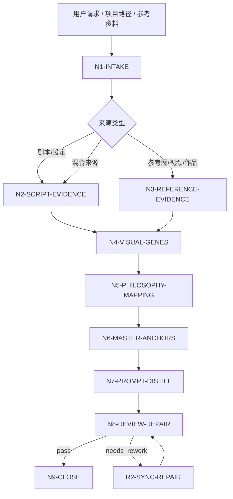
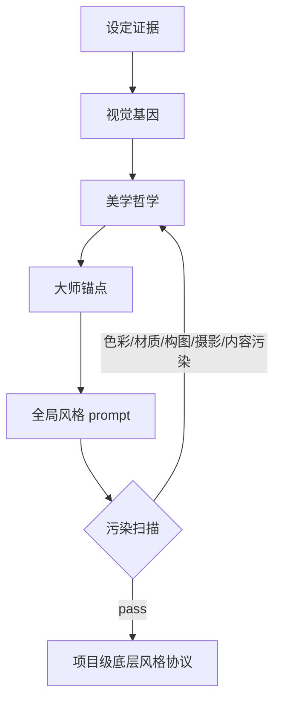

# aigc 3-美学/画面基调

`画面基调` 是 AIGC 影片项目的底层视觉协议制定技能。它以视觉风格总监（Visual Director）的身份，从上游 `2-编剧` 剧本、用户指定参考图、参考视频或混合资料中提取视觉基因，建立可追溯的 `[设定 -> 视觉]` 因果链，选择具体艺术家、导演、摄影师、工作室或作品作为校准锚点，并蒸馏出可被角色、场景、道具、摄影、分镜和图像生成阶段无污染继承的全局风格提示词。

本技能只确立“如何渲染（HOW）”与“属于什么画风/媒介范式（WHAT STYLE）”，不描述“画面里有什么具体内容（WHAT CONTENT）”。默认输出中文，核心 `global_style_prompt` 控制在 200-300 字。除非用户明确要求英文提示词或下游模型需要英文字段，最终正文保持中文。

## Context Loading Contract

- 每次调用 `$aigc-visual-tone` 时，必须同时加载本目录 `SKILL.md + CONTEXT.md`。
- 每次调用本技能时，必须同时加载同目录 `CONTEXT.md`。
- 若任务绑定 `projects/aigc/<项目名>/`，必须先加载项目根 `MEMORY.md`，再加载项目根 `CONTEXT/` 中与美术、世界观、题材、参考图、参考视频、禁区或长期审美偏好相关的文件。
- 默认上游剧本真源为 `projects/aigc/<项目名>/2-编剧/第N集.md` 或 `projects/aigc/<项目名>/2-编剧/` 下的全量剧本；用户显式指定 `2-编导`、初始化资料、文本片段、参考图或参考视频时，以用户输入为本轮来源，但必须标记来源类型。
- 单集剧本只能作为全局画面基调的样本来源或候选证据；正式 canonical output 仍是项目级 `global_singleton`，不得写入 `projects/aigc/<项目名>/3-美学/第N集/画面基调/`。
- 多模态参考只允许提供风格事实、媒介特征、光影范式、渲染痕迹、动画流派、视觉特效和负面约束，不得把参考图/视频中的具体人物、物件、场景或构图迁入全局 prompt。
- 核心审美判断、视觉映射、大师锚点选择和提示词蒸馏必须由 LLM 直接完成；脚本只可承担读取、OCR/转写整理、清单校验、字数统计和违禁词扫描。
- 脚本、映射表、规则模板、关键词锚点替换、句式轮换或同义改写批量生成全局风格协议、大师锚点矩阵、视觉因果链或 prompt，直接 fail。
- 冲突优先级：用户显式请求 > 根 `AGENTS.md` / meta 规则 > 本 `SKILL.md` > 项目 `MEMORY.md` > 项目 `CONTEXT/` > 本 `CONTEXT.md`。

## Runtime Spine Contract

| block_id | control_block | local_landing |
| --- | --- | --- |
| `B1` | 核心任务、非目标和禁止项 | `Core Task Contract` / `Runtime Guardrails` |
| `B2` | 输入、必要字段和澄清条件 | `Input Contract` |
| `B3` | 任务类型与来源类型路由 | `Type Routing Matrix` / `Mode Selection` |
| `B4` | 主执行节点、证据、路由和 gate | `Thinking-Action Node Map` / `Visual Maps` |
| `B5` | 外部模块授权和禁止越权 | `Module Loading Matrix` / `Module Trigger Matrix` |
| `B6` | 汇流条件和失败条件 | `Convergence Contract` |
| `B7` | 审查问题、失败码和返工入口 | `Review Gate Binding` |
| `B8` | 唯一输出格式、路径和完成门 | `Output Contract` |
| `B9` | 经验写回和项目记忆边界 | `Learning / Context Writeback` |
| `B10-B14` | 业务画像、量化口径、注意力、检查点和评估资产 | `Business Requirement Analysis Contract`、`Quantifiable Execution Criteria Contract`、`Attention Concentration Protocol`、`Checkpoint Contract`、`Evaluation Prompt Contract` |

## Core Task Contract

Accepted tasks:

- 从 `2-编剧` 剧本、项目设定或用户粘贴文本中提取影片级画面基调。
- 根据用户提供的参考图、参考视频或参考作品，做风格层面的多模态分析并转写为项目级视觉协议。
- 为当前影片项目定制全局风格提示词、视觉 slogan、设计理念、大师参照和负面风格禁区。
- 审查或修复已有 `画面基调` 输出中的具象污染、色彩污染、材质污染、构图/摄影越权、大师锚点缺失、因果链缺失或字数不合规。

Non-goals:

- 不设计角色外观、服装、道具、场景细节、镜头构图、焦段、光圈、运镜或分镜内容。
- 不生成图片、视频、具体资产 prompt 或单镜头 prompt。
- 不替代 `角色风格`、`场景风格`、`道具风格`、`摄影风格`、`分镜风格` 的局部风格决策。
- 不把参考图/视频中的具体颜色、材质、物件、人物、地点或构图当作默认项目设定。

Runtime persona:

- 角色：视觉风格总监（Visual Director）。
- 专业域：概念艺术设计、电影摄影、CG Rendering、艺术史、动画制作。
- 语调：专业、精确、客观；优先使用准确行业术语，例如 `丁达尔效应`、`赛璐珞`、`次表面散射`、`体积雾`、`路径追踪`、`胶片颗粒`。
- 表达禁区：避免“好看”“高级”“电影感很强”等不可验证形容；每条判断必须回到输入证据或参考锚点。

## Business Requirement Analysis Contract

| field | requirement | evidence | fail_code |
| --- | --- | --- | --- |
| `business_goal` | 建立影片级底层视觉协议和 200-300 字全局风格提示词 | 用户请求、上游剧本、参考图/视频说明 | `FAIL-VT-BUSINESS-GOAL` |
| `business_object` | 被处理对象是项目级全局视觉风格 singleton，不是具体角色/场景/镜头内容，也不是逐集风格覆盖 | 输入路径、项目名、资料类型、scope 判定 | `FAIL-VT-BUSINESS-OBJECT` |
| `constraint_profile` | 锁定无色彩污染、无材质污染、无构图污染、无摄影/运镜越权、无具象内容污染 | 用户边界、本 SKILL 禁止项 | `FAIL-VT-CONSTRAINT` |
| `success_criteria` | 输出包含视觉基因、视觉 slogan、设计理念、因果链、大师参照、负面特征、全局风格 prompt 和审计报告 | Output Contract、Review Gate Binding | `FAIL-VT-SUCCESS` |
| `complexity_source` | 复杂度来自跨来源证据归纳、风格抽象、禁区过滤、大师锚点校准和下游继承安全 | route 说明、source profile | `FAIL-VT-COMPLEXITY` |
| `topology_fit` | 先取证、再抽象、再映射、再校准、再蒸馏、再过滤；该拓扑能防止随机审美、参考图具象复制和 prompt 污染 | Visual Maps、节点表、review gate | `FAIL-VT-TOPOLOGY-FIT` |

拓扑适配理由至少满足三条：

- `证据先行`：先建立 `source_visual_evidence_map`，避免凭空指定风格。
- `抽象隔离`：在 `visual_gene_profile` 中只保留风格属性，阻断人物、道具、场景、构图和镜头内容外溢。
- `校准后蒸馏`：大师锚点必须先解释匹配原因，再进入 prompt，避免只堆艺术家姓名。
- `过滤收束`：最终 prompt 前执行污染扫描，确保可被下游风格继承而不抢占局部设计权。

## Input Contract

Accepted input:

- `projects/aigc/<项目名>/2-编剧/第N集.md`、整季 `2-编剧/` 目录、`2-编导` 目录或用户指定剧本文本。
- 项目初始化资料、世界观设定、题材说明、用户美术偏好、禁区说明。
- 参考图、参考视频、参考作品名称、艺术家/导演/摄影师/工作室名单。
- 已有 `projects/aigc/<项目名>/3-美学/画面基调/全局风格协议.md` 或候选 prompt。

Required input:

- 至少一种可读取的风格来源：剧本/项目设定/文本片段/参考图/参考视频/参考作品说明。
- 若要正式写回项目，必须能定位 `projects/aigc/<项目名>/`。
- 若用户只给参考图/视频而无项目资料，输出只能标记为 `reference_only` 候选协议，不得伪造项目叙事因果链。

Optional input:

- 用户指定的审美方向、参考艺术家、禁用流派、模型平台、输出语言。
- 项目 `MEMORY.md` 中长期视觉偏好、禁区、模型偏好和制作限制。
- 角色、场景、道具阶段已经存在的局部约束；这些只能作为冲突检查，不得反向改写本技能底层协议。

Reject or clarify when:

- 没有任何可读取来源，且用户要求正式项目级定稿。
- 用户要求在全局 prompt 中写入具体角色、道具、场景、构图、焦段、光圈、光源位置或运镜。
- 用户要求随机指定艺术家、随机套用热门风格、照搬参考图/视频具体内容。
- 用户要求脚本自动生成审美结论或创作正文。

## Type Routing Matrix

| input_type | signal | route_to | required_nodes | module_load | fail_code |
| --- | --- | --- | --- | --- | --- |
| `script_text_analysis` | 指定 `2-编剧` 文件/目录或粘贴剧本文本 | `Script Visual Tone Path` | `N1,N2,N4,N5,N6,N7,N8,N9` | `CONTEXT.md` | `FAIL-VT-TYPE-SCRIPT` |
| `reference_visual_analysis` | 提供参考图、参考视频或参考作品，且项目资料不足 | `Reference-Only Path` | `N1,N3,N4,N5,N6,N7,N8,N9` | `CONTEXT.md` | `FAIL-VT-TYPE-REFERENCE` |
| `hybrid_project_analysis` | 同时提供剧本/项目资料和参考图/视频 | `Hybrid Calibration Path` | `N1,N2,N3,N4,N5,N6,N7,N8,N9` | `CONTEXT.md` | `FAIL-VT-TYPE-HYBRID` |
| `repair` | 已有协议存在污染、锚点缺失、因果链缺失、字数超限或越权 | `Repair Path` | `N1,R1,R2,N8,N9` | `CONTEXT.md` | `FAIL-VT-TYPE-REPAIR` |
| `review_only` | 用户只要求检查候选画面基调 | `Review Path` | `N1,V1,N9` | `CONTEXT.md` | `FAIL-VT-TYPE-REVIEW` |

## Mode Selection

| mode | trigger | canonical_output |
| --- | --- | --- |
| `single_episode_seed` | 基于单集 `2-编剧/第N集.md` 建立候选画面基调 | 候选或正式全局 `全局风格协议.md`；报告标记样本范围，正式写回仍只能覆盖项目级 singleton |
| `series_style_protocol` | 基于多集、整季或项目资料建立正式项目级协议 | `projects/aigc/<项目名>/3-美学/画面基调/全局风格协议.md` |
| `reference_only` | 只有参考图/视频/作品，无项目叙事资料 | 临时候选协议，不正式覆盖项目真源 |
| `hybrid_calibration` | 项目资料 + 参考图/视频/作品 | 正式协议，报告区分 script-derived 与 reference-derived 证据 |
| `repair` | 修复已有协议或 prompt | 最小修复后的协议与修复报告 |
| `review_only` | 只审查不改写 | 审查报告 |

## Thinking-Action Node Map

| node_id | objective | inputs | actions | evidence | route_out | gate |
| --- | --- | --- | --- | --- | --- | --- |
| `N1-INTAKE` | 锁定来源、项目、模式和注意力锚点 | 用户请求、路径、参考资料 | 判定 source type、mode、写回权限、禁区；形成 `business_profile` | `source_manifest`、`mode`、`constraint_profile` | `N2` / `N3` / `R1` / `V1` | 至少 1 类来源可读；正式写回必须有项目根 |
| `N2-SCRIPT-EVIDENCE` | 从剧本/设定抽取视觉基因证据 | `2-编剧` 或文本 | 提取题材、时代感、空间压力、情绪底色、叙事机制、世界观质地；禁止提取具体人物/物件作为 prompt 内容 | `script_visual_evidence_map`，至少 5 条证据 | `N4` / `N3` | 每条证据能回指输入片段或项目资料 |
| `N3-REFERENCE-EVIDENCE` | 从参考图/视频/作品提取风格事实 | 图片、视频、作品说明 | 只提取媒介、渲染、光影、颗粒、笔触、动画流派、VFX、负面特征；剔除具体内容 | `reference_style_evidence_map`，每个参考至少 3 条风格事实 | `N4` | 不得复制参考中的具体内容、构图或颜色词 |
| `N4-VISUAL-GENES` | 汇流视觉基因 | N2/N3 证据 | 建立 9 个解析维度的风格属性：媒介、调色倾向、光影氛围、情绪基调、时代参考、渲染技术、艺术家/工作室、VFX、负面特征 | `visual_gene_profile` | `N5` | 只保留风格属性；具象内容必须删除 |
| `N5-PHILOSOPHY-MAPPING` | 形成美学哲学和因果链 | `visual_gene_profile` | 写一句话视觉 slogan、设计理念、`[设定 -> 视觉]` 映射；每个主要决策说明触发原因 | `visual_slogan`、`design_principle`、`setting_to_visual_chain`，至少 5 条因果链 | `N6` | 每条视觉决策可追溯，不能只写主观喜好 |
| `N6-MASTER-ANCHORS` | 选择大师参照 | N5 输出、用户指定参考 | 选择具体艺术家/导演/摄影师/作品/工作室；说明匹配维度和禁用边界 | `master_anchor_matrix`，至少 3 个锚点 | `N7` | 只有名字无匹配原因则失败 |
| `N7-PROMPT-DISTILL` | 蒸馏全局风格 prompt | N4-N6 输出 | 生成 200-300 字中文 `global_style_prompt`；包含媒介/流派、渲染管线、美学范式、光影氛围、VFX、负面特征；过滤具体颜色、材质、构图、摄影/运镜和具象内容 | `candidate_global_style_prompt`、`contamination_scan` | `N8` | 字数 200-300；无禁用类别；至少 1 个大师锚点进入校准语义 |
| `N8-REVIEW-REPAIR` | 审查并最小修复 | 候选协议 | 执行 review gates；失败时回到对应节点修复，最多 2 轮自动修复，仍失败则阻断 | `review_verdict`、`repair_log` | `N9` / `R2` | 所有 P0 gate pass 后才能正式写回 |
| `N9-CLOSE` | 输出或写回唯一结果 | 通过审查的协议 | 按 Output Contract 输出；正式写回时生成执行报告 | `final_output_manifest` | done | 只允许一个 canonical 协议；候选和正式状态必须标清 |
| `R1-ROOT-CAUSE` | 定位已有协议缺陷源 | 候选协议、失败提示 | 追到 prompt、因果链、锚点、边界、字数或报告证据层 | `root_cause_trace` | `R2` | 不得只替换表面词 |
| `R2-SYNC-REPAIR` | 源层修复 | R1 输出 | 修复对应 section，并重新跑 N8 | `sync_patch` | `N8` | 修复后同类污染不得残留 |
| `V1-REVIEW` | 只审查候选协议 | 候选协议 | 执行 Review Gate Binding，不改写正文 | `review_findings` | `N9` | findings 必须有证据、fail code、返工目标 |

## Visual Maps





## Quantifiable Execution Criteria Contract

| criteria_slot | required_content | landing_place | fail_code |
| --- | --- | --- | --- |
| `action_scope` | 剧本来源至少抽取 5 条视觉证据；每个参考图/视频/作品至少抽取 3 条风格事实；正式协议至少覆盖 9 个解析维度 | `N2/N3/N4.actions` | `FAIL-VT-QUANT-SCOPE` |
| `evidence_count` | 因果链至少 5 条；大师锚点至少 3 个；负面特征至少 3 条 | `N5/N6.evidence` | `FAIL-VT-QUANT-EVIDENCE` |
| `pass_threshold` | P0 gate 全部通过；`global_style_prompt` 200-300 字；禁用类别残留 0 个，除非报告声明核心视觉符号例外；`GATE-VT-10-ANTI-SCRIPTED-TONE` 阻断项为 0 | `N7/N8.gate` | `FAIL-VT-QUANT-THRESHOLD` |
| `retry_limit` | 自动修复最多 2 轮；仍出现 P0 污染或来源不足时阻断并报告 | `N8.route_out` | `FAIL-VT-QUANT-RETRY` |
| `fallback_evidence` | 参考资料不可机器读取时，使用用户文字说明和可见元数据；无法验证的锚点标为 `unverified_reference_claim`，不得作为核心证据 | `Review Gate Binding.report_evidence` | `FAIL-VT-QUANT-FALLBACK` |

## Module Loading Matrix

| module | load_when | authority | forbidden_use | rework_target |
| --- | --- | --- | --- | --- |
| `CONTEXT.md` | 每次调用本技能 | 经验层、失败模式、风格污染修复 heuristics | 重定义输入、节点、gate、输出路径 | `Learning / Context Writeback` |
| `agents/openai.yaml` | 产品入口或技能索引需要元数据 | 入口描述和默认 prompt | 覆盖本 `SKILL.md` 合同 | `agents/openai.yaml` |
| `test-prompts.json` | 回归验证、dry-run 或达尔文评估 | 典型任务样例 | 替代正式审查门 | `Evaluation Prompt Contract` |
| `README.md` | 人类快速阅读目录与用法 | 说明目录和使用方式 | 新增执行规则或完成门 | `README.md` |
| `CHANGELOG.md` | 本包发生实际修改时 | 时间序变更摘要 | 运行时上下文或规范裁决 | `CHANGELOG.md` |

## Module Trigger Matrix

| trigger_signal | required_modules | load_phase | return_gate | mechanical_check |
| --- | --- | --- | --- | --- |
| 任意执行 | `CONTEXT.md` | `N1-INTAKE` | `N1` | 确认同目录经验层已读 |
| 产品索引或插件入口 | `agents/openai.yaml` | `N9-CLOSE` | `Output Contract` | entrypoint 指向本 `SKILL.md` |
| 回归验证或审计 | `test-prompts.json` | `V1-REVIEW` | `Evaluation Prompt Contract` | 至少 3 条 prompt，包含 script/reference/repair |
| 修改本技能包 | `CHANGELOG.md` | `N9-CLOSE` | `Checkpoint Contract` | 追加日期、变更和验证摘要 |

## Convergence Contract

Pass conditions:

- `source_manifest` 已标明输入来源、样本范围和写回权限。
- `visual_gene_profile` 覆盖 9 个解析维度，且只包含风格属性。
- `setting_to_visual_chain` 至少 5 条，能说明视觉决策如何来自剧本、设定或参考证据。
- `master_anchor_matrix` 至少 3 个具体锚点，并说明匹配维度与禁用边界。
- `global_style_prompt` 为 200-300 字中文，且没有默认禁止的具体颜色词、具体材质词、构图术语、焦段/光圈/光源位置/运镜和具象内容。
- `anti_scripted_style_audit` 证明视觉基因、因果链、大师锚点和 prompt 不是模板句轮换、锚点替换或同义改写批量生成。
- 正式写回时，执行报告包含 `Execution Decision Trace`、`Reference Execution Matrix`、`Rule Evidence Map`、`Anti Scripted Style Audit`、`N/A Justification`、`Repair Log` 和 `Contamination Scan`。

Fail conditions:

- 无可读来源却要求正式项目级定稿。
- prompt 只堆风格词，没有因果链或大师锚点。
- prompt 含具体角色、场景、道具、物件、构图、摄影参数或运镜。
- 参考图/视频内容被照搬为项目设定。
- 全局风格协议或 prompt 呈现脚本化生成、批量插入、正则套句、映射投影、模板句式复用、关键词锚点替换、句式轮换或同义改写批量痕迹。
- 字数低于 200 或高于 300，且用户未明确覆盖。

## Review Gate Binding

| review_question | review_gate | fail_code | rework_target | report_evidence |
| --- | --- | --- | --- | --- |
| 是否只描述底层风格，不描述具体内容？ | `GATE-VT-01-CONTENT-PURITY` | `FAIL-VT-CONTENT-POLLUTION` | `N7-PROMPT-DISTILL` | 被删除或降级的具象词清单 |
| 是否默认无具体颜色词？ | `GATE-VT-02-COLOR-SAFETY` | `FAIL-VT-COLOR-POLLUTION` | `N7-PROMPT-DISTILL` | 颜色词扫描；核心视觉符号例外说明 |
| 是否默认无具体材质词？ | `GATE-VT-03-MATERIAL-SAFETY` | `FAIL-VT-MATERIAL-POLLUTION` | `N7-PROMPT-DISTILL` | 材质词扫描和替代表达 |
| 是否无构图、焦段、光圈、光源位置、运镜？ | `GATE-VT-04-CAMERA-BOUNDARY` | `FAIL-VT-CAMERA-OVERREACH` | `N4-VISUAL-GENES` / `N7-PROMPT-DISTILL` | 越权术语清单 |
| 每个主要视觉决策是否可追溯？ | `GATE-VT-05-CAUSALITY` | `FAIL-VT-CAUSALITY-MISSING` | `N5-PHILOSOPHY-MAPPING` | `setting_to_visual_chain` |
| 是否引用具体大师/作品并说明匹配理由？ | `GATE-VT-06-MASTER-ANCHOR` | `FAIL-VT-MASTER-MISSING` | `N6-MASTER-ANCHORS` | `master_anchor_matrix` |
| prompt 是否 200-300 字且中文默认？ | `GATE-VT-07-LENGTH-LANGUAGE` | `FAIL-VT-LENGTH` | `N7-PROMPT-DISTILL` | 字数统计与语言标记 |
| 是否适合被角色、场景、道具、摄影、分镜无污染继承？ | `GATE-VT-08-DOWNSTREAM-SAFETY` | `FAIL-VT-DOWNSTREAM-POLLUTION` | `N7-PROMPT-DISTILL` | 下游继承风险清单 |
| 正式写回是否有结构化执行报告？ | `GATE-VT-09-REPORT-EVIDENCE` | `FAIL-VT-REPORT-MISSING` | `N9-CLOSE` | 报告 section 完整性 |
| 视觉基因、因果链、大师锚点和 prompt 是否无脚本化生成、批量插入、正则套句、映射投影、模板句式复用、关键词锚点替换、句式轮换或同义改写批量生成痕迹？ | `GATE-VT-10-ANTI-SCRIPTED-TONE` | `FAIL-VT-SCRIPTED-TONE` | `N4-VISUAL-GENES` / `N5-PHILOSOPHY-MAPPING` / `N7-PROMPT-DISTILL` | `anti_scripted_style_audit` |

## Runtime Guardrails

- 默认禁止色彩定义：最终 prompt 不得包含具体颜色词或“暖调/冷调”等色温定性；只有当颜色是用户声明的核心视觉符号时才可例外，并必须在报告中说明。
- 默认禁止材质定义：最终 prompt 不得提及具体物质，例如金属、木头、丝绸、玻璃等；可改写为“高反射表面处理”“纤维化纹理倾向”等非物质层级表达，但仍需谨慎。
- 默认禁止构图定义：最终 prompt 不得提及中心对称、三分法、黄金分割、俯视构图等构图术语。
- 默认禁止摄影/运镜：最终 prompt 不得提及焦段、光圈、光源位置、推拉摇移、跟拍、环绕、长焦、广角等摄影阶段权力。
- 默认禁止具象内容：最终 prompt 不写人物、角色身份、场景地点、道具、事件、动作、服装、怪物、建筑或具体物件。
- 可保留的底层风格类别：艺术流派/媒介、渲染技术/引擎、光影氛围的结果型描述、情绪基调、时代/背景参考的抽象层、艺术家/工作室锚点、视觉特效、负面特征。

## Output Contract

Output scope:

- `画面基调` 的正式输出对象是 `global_singleton`，全项目只能有一个 canonical `全局风格协议.md`。
- 即使输入是 `第N集.md`，也只在 `Source Manifest.sample_scope` 或执行报告中记录样本范围；不得创建 `3-美学/第N集/画面基调/` 作为正式真源。
- 若用户只要求单集候选分析且不授权覆盖全局协议，输出标记为 `candidate` 或 `reference_only`，不写回 canonical。

正式写回路径：

- `projects/aigc/<项目名>/3-美学/画面基调/全局风格协议.md`
- `projects/aigc/<项目名>/3-美学/画面基调/执行报告.md`

单次回答或候选输出结构：

```markdown
# 全局风格协议

## Source Manifest
- project:
- mode:
- sources:
- writeback_status:

## Visual Slogan
一句话视觉 slogan。

## Design Principle
2-4 句设计理念。

## Visual Gene Profile
| dimension | decision | evidence |
| --- | --- | --- |

## Setting To Visual Chain
| setting_or_signal | visual_translation | evidence |
| --- | --- | --- |

## Master Anchor Matrix
| anchor | matched_dimension | usage_boundary |
| --- | --- | --- |

## Global Style Prompt
200-300 字中文全局风格提示词。

## Negative Traits
- 避免项 1
- 避免项 2
- 避免项 3
```

正式执行报告必须包含：

- `Execution Decision Trace`：关键判断、适用规则、输入证据、取舍理由和输出落点。
- `Reference Execution Matrix`：本技能无外部 `references/` 时记录 `N/A: no references module authorized`；若未来启用 references，逐条记录 load_status、trigger_reason、applied_to、evidence_in_output、verdict 和 n/a_reason。
- `Rule Evidence Map`：映射 `GATE-VT-*` 到正文位置或证据。
- `Anti Scripted Style Audit`：记录模板句式复用、锚点替换、句式轮换和同义改写批量风险的检查结论。
- `N/A Justification`：说明未触发来源、模块或例外规则。
- `Repair Log`：记录失败码、修复目标和复审结果。
- `Contamination Scan`：色彩、材质、构图、摄影/运镜、具象内容五类扫描结果。

Completion gate:

- `review_verdict=pass` 后才可正式写回。
- `reference_only` 模式不得覆盖正式项目协议，除非用户明确批准。
- 输出只能有一个 canonical `Global Style Prompt`；其他版本必须标记为 rejected 或 candidate。

## Attention Concentration Protocol

| protocol_id | protocol | requirement | rework_entry |
| --- | --- | --- | --- |
| `ATTE-VT-01` | 注意力锚点 | 当前目标始终是“项目级底层风格协议”，不是角色/场景/镜头设计 | `N1-INTAKE` |
| `ATTE-VT-02` | 转移规则 | 来源证据完成后转视觉基因；视觉基因完成后转因果链；因果链完成后转大师锚点；锚点完成后转 prompt 蒸馏 | `Thinking-Action Node Map` |
| `ATTE-VT-03` | 漂移检测 | 出现具象内容、颜色/材质/构图/摄影词、热门风格堆砌、无因果锚点或字数失控即判定漂移 | `Review Gate Binding` |
| `ATTE-VT-04` | 再集中机制 | 发现漂移时回到最近证据节点，不继续润色当前污染句 | `R1-ROOT-CAUSE` / `R2-SYNC-REPAIR` |

## Checkpoint Contract

| checkpoint_id | checkpoint_trigger | required_action | pass_evidence | fail_code |
| --- | --- | --- | --- | --- |
| `CHK-VT-SCOPE` | 正式覆盖已有项目协议、删除用户指定锚点、启用颜色/材质例外 | 确认用户授权或写入报告说明 | 影响路径、替换范围、例外理由 | `FAIL-VT-CHECKPOINT-SCOPE` |
| `CHK-VT-SEMANTIC` | 定稿 slogan、设计理念、大师锚点和 prompt | 确认因果链、禁区和下游安全均可回指 | `setting_to_visual_chain`、`contamination_scan` | `FAIL-VT-CHECKPOINT-SEMANTIC` |
| `CHK-VT-VALIDATION` | 审查失败或字数/污染扫描失败 | 回到对应节点最小修复 | fail code、修复点、复审结果 | `FAIL-VT-CHECKPOINT-VALIDATION` |
| `CHK-VT-EVAL` | 用户要求回归验证或达尔文评分 | 使用 `test-prompts.json` dry-run 或真实评估 | prompt ids、eval_mode、预期摘要 | `FAIL-VT-CHECKPOINT-EVAL` |

## Evaluation Prompt Contract

`test-prompts.json` 至少包含 3 条典型任务，覆盖剧本解析、参考图/视频风格分析和污染修复。每条必须包含 `id`、`prompt`、`expected`。无法真实读取图像或视频时，评估模式标记为 `dry_run`，并说明预期多模态证据结构。

## Root-Cause Execution Contract (Mandatory)

污染或失败处理必须上溯：

`Symptom -> Direct Output Defect -> Source Node -> Gate/Rule -> Repair Target`

常见追因：

- 颜色词残留：`candidate_global_style_prompt -> GATE-VT-02 -> N7-PROMPT-DISTILL`
- 材质词残留：`candidate_global_style_prompt -> GATE-VT-03 -> N7-PROMPT-DISTILL`
- 参考图具象复制：`reference_style_evidence_map -> GATE-VT-01 -> N3-REFERENCE-EVIDENCE`
- 大师名字堆砌：`master_anchor_matrix -> GATE-VT-06 -> N6-MASTER-ANCHORS`
- 因果链缺失：`setting_to_visual_chain -> GATE-VT-05 -> N5-PHILOSOPHY-MAPPING`

## Field Master

| field_id | owner | canonical_landing | must_contain | fail_code |
| --- | --- | --- | --- | --- |
| `FIELD-VT-01` | source evidence | `Source Manifest` / `script_visual_evidence_map` / `reference_style_evidence_map` | 来源、样本范围、证据类型和写回状态 | `FAIL-VT-SOURCE` |
| `FIELD-VT-02` | visual genes | `Visual Gene Profile` | 9 个风格解析维度，且只含风格属性 | `FAIL-VT-GENE` |
| `FIELD-VT-03` | causal mapping | `Setting To Visual Chain` | 至少 5 条 `[设定 -> 视觉]` 因果链 | `FAIL-VT-CAUSALITY-MISSING` |
| `FIELD-VT-04` | master calibration | `Master Anchor Matrix` | 至少 3 个具体艺术家/导演/摄影师/作品/工作室锚点和使用边界 | `FAIL-VT-MASTER-MISSING` |
| `FIELD-VT-05` | global prompt | `Global Style Prompt` | 200-300 字中文全局风格提示词，无五类污染 | `FAIL-VT-PROMPT` |
| `FIELD-VT-06` | audit evidence | `执行报告.md` | decision trace、rule evidence、N/A、repair log、contamination scan | `FAIL-VT-REPORT-MISSING` |

## Thought Pass Map

| pass_id | focus_field | core_question | action | evidence |
| --- | --- | --- | --- | --- |
| `PASS-VT-01` | `FIELD-VT-01` | 输入来源是否足以支撑正式画面基调？ | 锁定 source_manifest 和 mode | 来源清单、样本范围 |
| `PASS-VT-02` | `FIELD-VT-02` | 抽取结果是否只剩风格属性？ | 过滤具象内容并补 9 维 profile | `visual_gene_profile` |
| `PASS-VT-03` | `FIELD-VT-03` | 视觉决策是否可追溯？ | 建立并审查因果链 | `setting_to_visual_chain` |
| `PASS-VT-04` | `FIELD-VT-04` | 大师锚点是否具体且有使用边界？ | 补匹配维度、借用范围和禁用范围 | `master_anchor_matrix` |
| `PASS-VT-05` | `FIELD-VT-05` | prompt 是否能无污染继承？ | 执行字数和五类污染扫描 | `contamination_scan` |
| `PASS-VT-06` | `FIELD-VT-06` | 正式写回是否有可审计证据？ | 生成报告并映射 gate | `Rule Evidence Map` |

## Pass Table

| pass_id | pass_standard | fail_code | rework_entry |
| --- | --- | --- | --- |
| `PASS-VT-01` | 至少 1 类来源可读；正式写回有项目根 | `FAIL-VT-SOURCE` | `N1-INTAKE` |
| `PASS-VT-02` | 9 个解析维度齐全，且无具象内容 | `FAIL-VT-GENE` | `N4-VISUAL-GENES` |
| `PASS-VT-03` | 至少 5 条因果链且能回指输入证据 | `FAIL-VT-CAUSALITY-MISSING` | `N5-PHILOSOPHY-MAPPING` |
| `PASS-VT-04` | 至少 3 个大师锚点，均有匹配理由和禁用边界 | `FAIL-VT-MASTER-MISSING` | `N6-MASTER-ANCHORS` |
| `PASS-VT-05` | Global Style Prompt 为中文 200-300 字，五类污染为 0 | `FAIL-VT-PROMPT` | `N7-PROMPT-DISTILL` |
| `PASS-VT-06` | 正式写回报告包含必需审计 section | `FAIL-VT-REPORT-MISSING` | `N9-CLOSE` |
| `PASS-VT-07` | 全局风格协议无模板句轮换、锚点替换或同义改写批量痕迹 | `FAIL-VT-SCRIPTED-TONE` | `N4-VISUAL-GENES` / `N5-PHILOSOPHY-MAPPING` / `N7-PROMPT-DISTILL` |

## Field Mapping

| source_field | internal_field | output_field |
| --- | --- | --- |
| 剧本题材、时代、空间、情绪、世界观信号 | `script_visual_evidence_map` | `Visual Gene Profile.evidence` |
| 参考图/视频的媒介、渲染、光影、VFX、动画流派 | `reference_style_evidence_map` | `Visual Gene Profile.evidence` |
| 用户偏好与项目 MEMORY | `constraint_profile` | `Negative Traits` / `N/A Justification` |
| 视觉基因 | `visual_gene_profile` | `Visual Gene Profile` |
| 设定到视觉翻译 | `setting_to_visual_chain` | `Setting To Visual Chain` |
| 大师/作品校准 | `master_anchor_matrix` | `Master Anchor Matrix` |
| 提示词候选 | `candidate_global_style_prompt` | `Global Style Prompt` |
| 审查和修复 | `review_verdict` / `repair_log` | `执行报告.md` |

## Multi-Subskill Continuous Workflow

当 `3-美学` 父级整体调度多个同级风格子技能时，`画面基调` 参与并发汇流，不要求实时先跑；若已有全局协议，其他子技能可继承 `Global Style Prompt`，若缺失则在自身输出中标记 `candidate/dependency_gap`。它只提供底层风格协议和全局 prompt，不拥有局部资产、镜头、构图或材质真源，也不按集复制。下游子技能必须在自身合同内追加局部事实和阶段专属约束。

## Learning / Context Writeback

- 本技能执行中发现可复用的污染模式、风格抽象失败、参考图误读、prompt 字数修复策略，应写入本目录 `CONTEXT.md`。
- 用户明确要求“以后这个项目都按某种画面基调/禁区/口味执行”时，且任务绑定具体 `projects/aigc/<项目名>/`，应同步更新项目根 `MEMORY.md`，不要写入本技能经验层。
- 详细执行时间线、迁移流水和正式修改摘要写入 `CHANGELOG.md` 或项目执行报告，不写入 `CONTEXT.md`。
