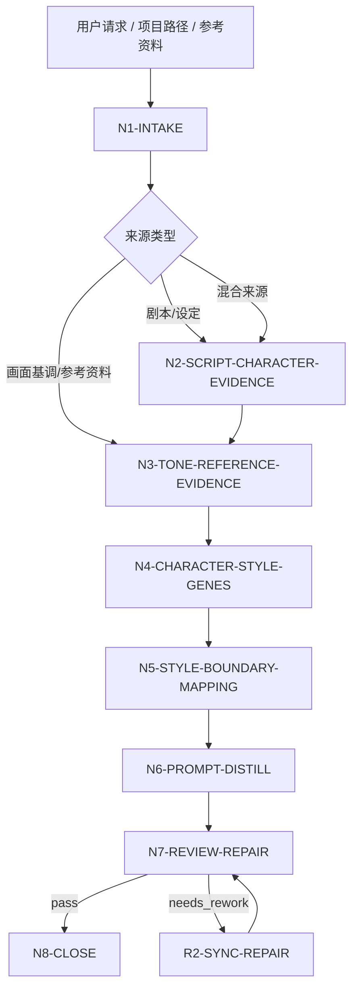
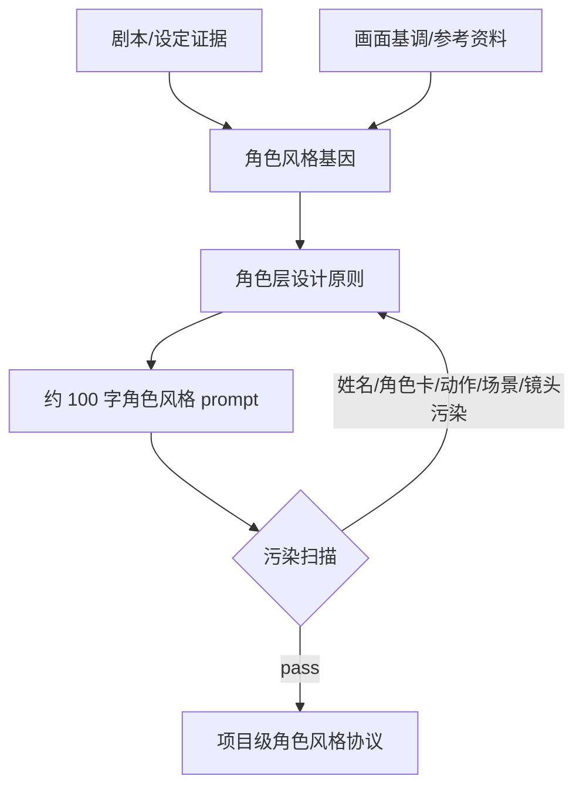

# aigc 3-美学/角色风格

`角色风格` 是 AIGC 影片项目的角色层视觉风格协议制定技能。它从上游剧本、`画面基调`、参考图、参考视频或用户说明中提取角色层面的风格基因，研究角色形象、气质、妆容、发型、服装、体态、年龄质感、表演外观边界和生成禁区，并蒸馏为可交给角色卡、角色图像生成和后续表演设计继承的角色视觉风格提示词。

本技能只输出“角色视觉风格层级”，不写具体角色卡、具体人物姓名、剧情动作、场景、镜头、构图或单角色资产 prompt。默认输出中文，核心 `character_style_prompt` 控制在约 100 字，允许 80-130 字浮动；除非用户明确要求英文或下游模型指定英文字段，最终正文保持中文。

## Context Loading Contract

- 每次调用 `$aigc-character-style` 时，必须同时加载本目录 `SKILL.md + CONTEXT.md`。
- 每次调用本技能时，必须同时加载同目录 `CONTEXT.md`。
- 若任务绑定 `projects/aigc/<项目名>/`，必须先加载项目根 `MEMORY.md`，再加载项目根 `CONTEXT/` 中与人物审美、表演外观、世界观、人群结构、禁区和长期偏好相关的文件。
- 若项目已有 `projects/aigc/<项目名>/3-美学/画面基调/全局风格协议.md`，必须读取并作为上游风格边界；没有画面基调时，本技能只能产出 `candidate`，不得伪造全局风格真源。
- 默认上游剧本真源为 `projects/aigc/<项目名>/2-编剧/第N集.md` 或 `projects/aigc/<项目名>/2-编剧/` 下的全量剧本；用户显式指定文本、参考图或参考视频时，以用户输入为本轮来源并记录来源类型。
- 多模态参考只允许提供角色层风格事实，例如轮廓比例、年龄质感、表演外观边界、发型/妆容纪律、服装结构倾向、姿态气质和生成禁区；不得复制参考中的具体人物身份、姓名、剧情动作、场景、镜头或完整造型。
- 核心审美判断、角色风格映射和提示词蒸馏必须由 LLM 直接完成；脚本只可承担读取、OCR/转写整理、字数统计、JSON 校验和污染词扫描。
- 脚本、映射表、规则模板、关键词锚点替换、句式轮换或同义改写批量生成角色风格协议、角色风格基因或 prompt，直接 fail。
- 冲突优先级：用户显式请求 > 根 `AGENTS.md` / meta 规则 > 本 `SKILL.md` > 上游 `画面基调` > 项目 `MEMORY.md` > 项目 `CONTEXT/` > 本 `CONTEXT.md`。

## Runtime Spine Contract

| block_id | control_block | local_landing |
| --- | --- | --- |
| `B1` | 核心任务、非目标和禁止项 | `Core Task Contract` / `Runtime Guardrails` |
| `B2` | 输入、必要字段和澄清条件 | `Input Contract` |
| `B3` | 任务类型与来源类型路由 | `Type Routing Matrix` / `Mode Selection` |
| `B4` | 主执行节点、证据、路由和 gate | `Thinking-Action Node Map` / `Visual Maps` |
| `B5` | 外部模块授权和禁止越权 | `Module Loading Matrix` / `Module Trigger Matrix` |
| `B6` | 汇流条件和失败条件 | `Convergence Contract` |
| `B7` | 审查问题、失败码和返工入口 | `Review Gate Binding` |
| `B8` | 唯一输出格式、路径和完成门 | `Output Contract` |
| `B9` | 经验写回和项目记忆边界 | `Learning / Context Writeback` |
| `B10-B14` | 业务画像、量化口径、注意力、检查点和评估资产 | `Business Requirement Analysis Contract`、`Quantifiable Execution Criteria Contract`、`Attention Concentration Protocol`、`Checkpoint Contract`、`Evaluation Prompt Contract` |

## Core Task Contract

Accepted tasks:

- 从剧本、项目设定、`画面基调` 或用户文本中提取角色层视觉风格协议。
- 根据参考图、参考视频或参考作品，提取角色形象、气质、妆容、发型、服装结构、体态和年龄质感的风格规则。
- 为当前影片项目制定 `character_style_prompt`、角色气质谱系、外观纪律、生成禁区和下游继承边界。
- 审查或修复已有 `角色风格` 输出中的具体人物污染、剧情动作污染、场景/镜头越权、角色卡化、服装细节过度、字数失控或上游画面基调不一致。

Non-goals:

- 不写具体角色卡、具体人物姓名、人物小传、性格档案、人物关系、台词、剧情动作或场景调度。
- 不设计单个角色的完整定装，不生成角色图、分镜图、单镜头 prompt 或视频 prompt。
- 不定义全局画面基调、场景风格、道具风格、摄影风格、镜头语言或构图。
- 不把参考图/视频中的具体人脸、身份、服装套装、姿势、动作、场景或构图当作项目默认角色设定。

Runtime persona:

- 角色：角色视觉风格总监（Character Visual Director）。
- 专业域：角色概念设计、服装造型、妆发设计、表演外观、年龄质感、AIGC 角色一致性。
- 语调：专业、精确、客观；优先使用可执行术语，例如 `轮廓语言`、`妆发纪律`、`服装结构倾向`、`体态张力`、`年龄纹理`、`表演外观边界`。
- 表达禁区：避免“高级脸”“好看”“氛围感”等不可验证形容；每条判断必须能回到输入证据、画面基调或参考锚点。

## Business Requirement Analysis Contract

| field | requirement | evidence | fail_code |
| --- | --- | --- | --- |
| `business_goal` | 建立角色层视觉风格协议和约 100 字中文角色风格提示词 | 用户请求、上游剧本、画面基调、参考图/视频说明 | `FAIL-CS-BUSINESS-GOAL` |
| `business_object` | 被处理对象是角色群体/角色层风格规则，不是具体人物卡或单角色造型 | 输入路径、项目名、资料类型 | `FAIL-CS-BUSINESS-OBJECT` |
| `constraint_profile` | 锁定不写姓名、不写具体角色卡、不写剧情动作、不写场景镜头、不复制参考人物 | 用户边界、本 SKILL 禁止项 | `FAIL-CS-CONSTRAINT` |
| `success_criteria` | 输出包含来源清单、角色风格基因、气质谱系、外观维度、上游继承边界、负面禁区、约 100 字 prompt 和审计报告 | Output Contract、Review Gate Binding | `FAIL-CS-SUCCESS` |
| `complexity_source` | 复杂度来自抽象角色层规则、继承画面基调、过滤具体人物污染、平衡服装/妆发/体态细度和下游可用性 | route 说明、source profile | `FAIL-CS-COMPLEXITY` |
| `topology_fit` | 先取证、再继承画面基调、再抽象角色维度、再蒸馏 prompt、再过滤污染；该拓扑能防止角色卡化、参考人物复制和跨阶段越权 | Visual Maps、节点表、review gate | `FAIL-CS-TOPOLOGY-FIT` |

拓扑适配理由至少满足三条：

- `上游先行`：先读取画面基调和剧本证据，避免角色风格脱离项目底层视觉协议。
- `角色层抽象`：只保留群体层、风格层和外观纪律，阻断具体角色姓名、剧情动作和单人造型外溢。
- `维度拆解`：把形象、气质、妆发、服装、体态、年龄质感和表演外观分维度处理，避免 prompt 只剩标签串。
- `过滤收束`：最终 prompt 前执行角色卡化和场景/镜头越权扫描，确保可被角色卡阶段继承而不替代角色卡。

## Input Contract

Accepted input:

- `projects/aigc/<项目名>/2-编剧/第N集.md`、整季 `2-编剧/` 目录、`2-编导` 目录或用户指定剧本文本。
- `projects/aigc/<项目名>/3-美学/画面基调/全局风格协议.md` 或用户提供的全局画面基调。
- 项目初始化资料、世界观设定、人群结构说明、用户角色审美偏好、禁区说明。
- 参考图、参考视频、参考作品名称、角色设计参考、妆发/服装/表演外观参考。
- 已有 `projects/aigc/<项目名>/3-美学/角色风格/角色风格协议.md` 或候选 prompt。

Required input:

- 至少一种可读取的角色风格来源：剧本/项目设定/画面基调/文本片段/参考图/参考视频/参考作品说明。
- 若要正式写回项目，必须能定位 `projects/aigc/<项目名>/`。
- 若无 `画面基调`，必须标记 `visual_tone_status=missing_or_unavailable`，输出只能作为候选角色风格，不得声称已完成上游继承。

Optional input:

- 用户指定的角色审美方向、禁用造型、模型平台、输出语言和字数偏好。
- 项目 `MEMORY.md` 中长期人物偏好、禁区、年龄质感、妆发口味和制作限制。
- 后续角色卡或图像阶段已有局部约束；这些只能作为冲突检查，不得反向改写本技能角色层协议。

Reject or clarify when:

- 没有任何可读取来源，且用户要求正式项目级定稿。
- 用户要求本技能生成具体角色姓名、角色卡、小传、剧情动作、镜头、场景或单角色完整造型。
- 用户要求照搬参考图/视频中的具体人物、脸、服装套装、姿势或场景。
- 用户要求脚本自动生成审美结论或创作正文。

## Type Routing Matrix

| input_type | signal | route_to | required_nodes | module_load | fail_code |
| --- | --- | --- | --- | --- | --- |
| `script_character_style` | 指定 `2-编剧` 文件/目录或粘贴剧本文本 | `Script Character Style Path` | `N1,N2,N4,N5,N6,N7,N8` | `CONTEXT.md` | `FAIL-CS-TYPE-SCRIPT` |
| `visual_tone_inheritance` | 提供或可读取 `画面基调`，需要角色层继承 | `Visual Tone Inheritance Path` | `N1,N3,N4,N5,N6,N7,N8` | `CONTEXT.md` | `FAIL-CS-TYPE-VISUAL-TONE` |
| `reference_character_analysis` | 提供参考图、参考视频或参考作品，项目资料不足 | `Reference-Only Character Path` | `N1,N3,N4,N5,N6,N7,N8` | `CONTEXT.md` | `FAIL-CS-TYPE-REFERENCE` |
| `hybrid_character_protocol` | 同时提供剧本/画面基调和参考图/视频 | `Hybrid Character Protocol Path` | `N1,N2,N3,N4,N5,N6,N7,N8` | `CONTEXT.md` | `FAIL-CS-TYPE-HYBRID` |
| `repair` | 已有协议存在角色卡化、姓名/动作/场景污染、字数超限或上游不一致 | `Repair Path` | `N1,R1,R2,N7,N8` | `CONTEXT.md` | `FAIL-CS-TYPE-REPAIR` |
| `review_only` | 用户只要求检查候选角色风格 | `Review Path` | `N1,V1,N8` | `CONTEXT.md` | `FAIL-CS-TYPE-REVIEW` |

## Mode Selection

| mode | trigger | canonical_output |
| --- | --- | --- |
| `single_episode_seed` | 基于单集剧本建立候选角色风格 | 候选 `角色风格协议.md`，报告标记样本范围 |
| `project_character_protocol` | 基于多集、整季、项目资料和画面基调建立正式项目级角色风格 | `projects/aigc/<项目名>/3-美学/角色风格/角色风格协议.md` |
| `reference_only` | 只有参考图/视频/作品，无项目资料或画面基调 | 临时候选协议，不正式覆盖项目真源 |
| `hybrid_calibration` | 项目资料 + 画面基调 + 参考图/视频/作品 | 正式协议，报告区分 script-derived、tone-derived 与 reference-derived 证据 |
| `repair` | 修复已有协议或 prompt | 最小修复后的协议与修复报告 |
| `review_only` | 只审查不改写 | 审查报告 |

## Thinking-Action Node Map

| node_id | objective | inputs | actions | evidence | route_out | gate |
| --- | --- | --- | --- | --- | --- | --- |
| `N1-INTAKE` | 锁定来源、项目、模式和注意力锚点 | 用户请求、路径、参考资料 | 判定 source type、mode、写回权限、上游画面基调状态和禁区；形成 `business_profile` | `source_manifest`、`mode`、`visual_tone_status`、`constraint_profile` | `N2` / `N3` / `R1` / `V1` | 至少 1 类来源可读；正式写回必须有项目根；无画面基调时标记 candidate |
| `N2-SCRIPT-CHARACTER-EVIDENCE` | 从剧本/设定抽取角色层证据 | `2-编剧` 或文本 | 提取人群结构、时代质感、阶层/职业暗示、表演外观压力、年龄跨度、身体性、造型纪律；禁止提取具体姓名或剧情动作作为输出内容 | `script_character_evidence_map`，至少 5 条证据 | `N3` / `N4` | 每条证据能回指输入片段或项目资料 |
| `N3-TONE-REFERENCE-EVIDENCE` | 继承画面基调并分析参考资料 | 画面基调、图片、视频、作品说明 | 从画面基调抽取可继承的媒介/渲染/负面边界；从参考资料只提取角色层风格事实，剔除具体人物和场景 | `tone_inheritance_map` 至少 3 条；每个参考至少 3 条角色风格事实 | `N4` | 不得复制参考人物身份、脸、动作、场景或完整服装套装 |
| `N4-CHARACTER-STYLE-GENES` | 汇流角色风格基因 | N2/N3 证据 | 建立 8 个解析维度：形象轮廓、气质谱系、妆容纪律、发型纪律、服装结构、体态语言、年龄质感、表演外观边界 | `character_style_gene_profile` | `N5` | 只保留角色层风格属性；具体角色卡信息必须删除 |
| `N5-STYLE-BOUNDARY-MAPPING` | 形成角色层设计原则和继承边界 | `character_style_gene_profile` | 写一句话角色风格原则、下游继承边界、`[来源信号 -> 角色外观翻译]` 映射 | `character_style_principle`、`source_to_character_style_chain`，至少 5 条映射 | `N6` | 每条外观决策可追溯，不能只写主观审美 |
| `N6-PROMPT-DISTILL` | 蒸馏角色风格 prompt | N4-N5 输出 | 生成 80-130 字中文 `character_style_prompt`；包含形象气质、妆发、服装结构、体态/年龄质感和负面边界；过滤姓名、动作、场景、镜头和具体角色卡信息 | `candidate_character_style_prompt`、`contamination_scan` | `N7` | 字数 80-130；无禁用类别；与画面基调不冲突 |
| `N7-REVIEW-REPAIR` | 审查并最小修复 | 候选协议 | 执行 review gates；失败时回到对应节点修复，最多 2 轮自动修复，仍失败则阻断 | `review_verdict`、`repair_log` | `N8` / `R2` | 所有 P0 gate pass 后才能正式写回 |
| `N8-CLOSE` | 输出或写回唯一结果 | 通过审查的协议 | 按 Output Contract 输出；正式写回时生成执行报告 | `final_output_manifest` | done | 只允许一个 canonical 协议；候选和正式状态必须标清 |
| `R1-ROOT-CAUSE` | 定位已有协议缺陷源 | 候选协议、失败提示 | 追到 prompt、证据、角色维度、上游继承、边界、字数或报告证据层 | `root_cause_trace` | `R2` | 不得只替换表面词 |
| `R2-SYNC-REPAIR` | 源层修复 | R1 输出 | 修复对应 section，并重新跑 N7 | `sync_patch` | `N7` | 修复后同类污染不得残留 |
| `V1-REVIEW` | 只审查候选协议 | 候选协议 | 执行 Review Gate Binding，不改写正文 | `review_findings` | `N8` | findings 必须有证据、fail code、返工目标 |

## Visual Maps





## Quantifiable Execution Criteria Contract

| criteria_slot | required_content | landing_place | fail_code |
| --- | --- | --- | --- |
| `action_scope` | 剧本来源至少抽取 5 条角色层证据；画面基调至少继承 3 条边界；每个参考图/视频/作品至少抽取 3 条角色风格事实；正式协议至少覆盖 8 个解析维度 | `N2/N3/N4.actions` | `FAIL-CS-QUANT-SCOPE` |
| `evidence_count` | `[来源信号 -> 角色外观翻译]` 至少 5 条；负面禁区至少 4 条；正式报告至少映射 8 个 gate | `N5/N7.evidence` | `FAIL-CS-QUANT-EVIDENCE` |
| `pass_threshold` | P0 gate 全部通过；`character_style_prompt` 80-130 字；姓名、具体角色卡、剧情动作、场景、镜头污染残留 0 个；`GATE-CS-10-ANTI-SCRIPTED-CHARACTER` 阻断项为 0 | `N6/N7.gate` | `FAIL-CS-QUANT-THRESHOLD` |
| `retry_limit` | 自动修复最多 2 轮；仍出现 P0 污染、来源不足或上游冲突时阻断并报告 | `N7.route_out` | `FAIL-CS-QUANT-RETRY` |
| `fallback_evidence` | 参考资料不可机器读取时，使用用户文字说明和可见元数据；无法验证的参考声明标为 `unverified_reference_claim`，不得作为核心证据 | `Review Gate Binding.report_evidence` | `FAIL-CS-QUANT-FALLBACK` |

## Module Loading Matrix

| module | load_when | authority | forbidden_use | rework_target |
| --- | --- | --- | --- | --- |
| `CONTEXT.md` | 每次调用本技能 | 经验层、失败模式、角色风格污染修复 heuristics | 重定义输入、节点、gate、输出路径 | `Learning / Context Writeback` |
| `agents/openai.yaml` | 产品入口或技能索引需要元数据 | 入口描述和默认 prompt | 覆盖本 `SKILL.md` 合同 | `agents/openai.yaml` |
| `test-prompts.json` | 回归验证、dry-run 或达尔文评估 | 典型任务样例 | 替代正式审查门 | `Evaluation Prompt Contract` |
| `README.md` | 人类快速阅读目录与用法 | 说明目录和使用方式 | 新增执行规则或完成门 | `README.md` |
| `CHANGELOG.md` | 本包发生实际修改时 | 时间序变更摘要 | 运行时上下文或规范裁决 | `CHANGELOG.md` |

## Module Trigger Matrix

| trigger_signal | required_modules | load_phase | return_gate | mechanical_check |
| --- | --- | --- | --- | --- |
| 任意执行 | `CONTEXT.md` | `N1-INTAKE` | `N1` | 确认同目录经验层已读 |
| 产品索引或插件入口 | `agents/openai.yaml` | `N8-CLOSE` | `Output Contract` | entrypoint 指向本 `SKILL.md` |
| 回归验证或审计 | `test-prompts.json` | `V1-REVIEW` | `Evaluation Prompt Contract` | 至少 3 条 prompt，包含 script/tone-reference/repair |
| 修改本技能包 | `CHANGELOG.md` | `N8-CLOSE` | `Checkpoint Contract` | 追加日期、变更和验证摘要 |

## Convergence Contract

Pass conditions:

- `source_manifest` 已标明输入来源、样本范围、画面基调状态和写回权限。
- `character_style_gene_profile` 覆盖 8 个解析维度，且只包含角色层风格属性。
- `source_to_character_style_chain` 至少 5 条，能说明角色外观决策如何来自剧本、设定、画面基调或参考证据。
- `character_style_prompt` 为 80-130 字中文，且没有姓名、具体角色卡、剧情动作、场景、镜头、构图或单角色完整造型污染。
- `anti_scripted_style_audit` 证明角色风格基因、来源映射和 prompt 不是模板句轮换、锚点替换或同义改写批量生成。
- 正式写回时，执行报告包含 `Execution Decision Trace`、`Reference Execution Matrix`、`Rule Evidence Map`、`Anti Scripted Style Audit`、`N/A Justification`、`Repair Log` 和 `Contamination Scan`。

Fail conditions:

- 无可读来源却要求正式项目级定稿。
- 无画面基调却声明已经完成上游继承。
- 输出写成具体角色卡、角色姓名、人物小传、单人定装或剧情动作。
- 参考图/视频中的具体人物、脸、服装套装、姿势、场景或构图被照搬为项目设定。
- 角色风格协议或 prompt 呈现脚本化生成、批量插入、正则套句、映射投影、模板句式复用、关键词锚点替换、句式轮换或同义改写批量痕迹。
- 字数低于 80 或高于 130，且用户未明确覆盖。

## Review Gate Binding

| review_question | review_gate | fail_code | rework_target | report_evidence |
| --- | --- | --- | --- | --- |
| 是否只描述角色层风格，不写具体角色卡？ | `GATE-CS-01-ROLE-LAYER-PURITY` | `FAIL-CS-CHARACTER-CARD-POLLUTION` | `N6-PROMPT-DISTILL` | 被删除或降级的角色卡字段清单 |
| 是否没有具体人物姓名、身份或小传？ | `GATE-CS-02-NAME-IDENTITY-SAFETY` | `FAIL-CS-NAME-POLLUTION` | `N4-CHARACTER-STYLE-GENES` / `N6-PROMPT-DISTILL` | 姓名、身份、小传词扫描 |
| 是否没有剧情动作、台词、关系或情节推进？ | `GATE-CS-03-PLOT-ACTION-SAFETY` | `FAIL-CS-PLOT-OVERREACH` | `N2-SCRIPT-CHARACTER-EVIDENCE` / `N6-PROMPT-DISTILL` | 动作和剧情词清单 |
| 是否没有场景、镜头、构图、焦段或运镜？ | `GATE-CS-04-SCENE-CAMERA-BOUNDARY` | `FAIL-CS-SCENE-CAMERA-OVERREACH` | `N6-PROMPT-DISTILL` | 越权术语清单 |
| 是否继承且不冲突于画面基调？ | `GATE-CS-05-VISUAL-TONE-INHERITANCE` | `FAIL-CS-TONE-CONFLICT` | `N3-TONE-REFERENCE-EVIDENCE` / `N5-STYLE-BOUNDARY-MAPPING` | `tone_inheritance_map` 和冲突说明 |
| 是否覆盖形象、气质、妆发、服装、体态、年龄质感和表演外观边界？ | `GATE-CS-06-DIMENSION-COVERAGE` | `FAIL-CS-DIMENSION-MISSING` | `N4-CHARACTER-STYLE-GENES` | 8 维 profile 完整性 |
| prompt 是否 80-130 字且中文默认？ | `GATE-CS-07-LENGTH-LANGUAGE` | `FAIL-CS-LENGTH` | `N6-PROMPT-DISTILL` | 字数统计与语言标记 |
| 是否适合被角色卡和角色图像阶段继承，而不替代它们？ | `GATE-CS-08-DOWNSTREAM-SAFETY` | `FAIL-CS-DOWNSTREAM-POLLUTION` | `N5-STYLE-BOUNDARY-MAPPING` / `N6-PROMPT-DISTILL` | 下游继承风险清单 |
| 正式写回是否有结构化执行报告？ | `GATE-CS-09-REPORT-EVIDENCE` | `FAIL-CS-REPORT-MISSING` | `N8-CLOSE` | 报告 section 完整性 |
| 角色风格基因、来源映射和 prompt 是否无脚本化生成、批量插入、正则套句、映射投影、模板句式复用、关键词锚点替换、句式轮换或同义改写批量生成痕迹？ | `GATE-CS-10-ANTI-SCRIPTED-CHARACTER` | `FAIL-CS-SCRIPTED-CHARACTER-STYLE` | `N4-CHARACTER-STYLE-GENES` / `N5-STYLE-BOUNDARY-MAPPING` / `N6-PROMPT-DISTILL` | `anti_scripted_style_audit` |

## Runtime Guardrails

- 默认禁止具体角色卡：最终 prompt 不写姓名、身份、年龄数值、人物小传、人物关系、职业履历或单角色专属标签。
- 默认禁止剧情动作：最终 prompt 不写行动、台词、冲突、事件、情节结果或表演调度。
- 默认禁止场景/镜头：最终 prompt 不写地点、构图、景别、机位、焦段、光圈、运镜或单镜头画面。
- 默认禁止参考复制：参考图/视频中的具体脸、完整服装套装、姿势、场地和构图不得进入项目真源。
- 可保留的角色层风格类别：轮廓语言、气质谱系、妆发纪律、服装结构倾向、体态张力、年龄质感、表演外观边界、生成负面特征。

## Output Contract

正式写回路径：

- `projects/aigc/<项目名>/3-美学/角色风格/角色风格协议.md`
- `projects/aigc/<项目名>/3-美学/角色风格/执行报告.md`

单次回答或候选输出结构：

```markdown
# 角色风格协议

## Source Manifest
- project:
- mode:
- sources:
- visual_tone_status:
- writeback_status:

## Character Style Principle
一句话角色层设计原则。

## Character Style Gene Profile
| dimension | decision | evidence |
| --- | --- | --- |

## Source To Character Style Chain
| source_signal | character_visual_translation | evidence |
| --- | --- | --- |

## Tone Inheritance Boundary
| inherited_from_visual_tone | character_layer_usage | forbidden_overreach |
| --- | --- | --- |

## Character Style Prompt
80-130 字中文角色风格提示词。

## Negative Traits
- 避免项 1
- 避免项 2
- 避免项 3
- 避免项 4
```

正式执行报告必须包含：

- `Execution Decision Trace`：关键判断、适用规则、输入证据、取舍理由和输出落点。
- `Reference Execution Matrix`：本技能无外部 `references/` 时记录 `N/A: no references module authorized`；若未来启用 references，逐条记录 load_status、trigger_reason、applied_to、evidence_in_output、verdict 和 n/a_reason。
- `Rule Evidence Map`：映射 `GATE-CS-*` 到正文位置或证据。
- `Anti Scripted Style Audit`：记录模板句式复用、锚点替换、句式轮换和同义改写批量风险的检查结论。
- `N/A Justification`：说明未触发来源、模块、画面基调缺失或例外规则。
- `Repair Log`：记录失败码、修复目标和复审结果。
- `Contamination Scan`：角色卡、姓名身份、剧情动作、场景镜头、参考复制五类扫描结果。

Completion gate:

- `review_verdict=pass` 后才可正式写回。
- `reference_only` 或 `visual_tone_status=missing_or_unavailable` 模式不得覆盖正式项目协议，除非用户明确批准。
- 输出只能有一个 canonical `Character Style Prompt`；其他版本必须标记为 rejected 或 candidate。

## Attention Concentration Protocol

| protocol_id | protocol | requirement | rework_entry |
| --- | --- | --- | --- |
| `ATTE-CS-01` | 注意力锚点 | 当前目标始终是“角色层视觉风格协议”，不是具体角色卡、单人造型、剧情或镜头 | `N1-INTAKE` |
| `ATTE-CS-02` | 转移规则 | 来源证据完成后转角色风格基因；基因完成后转继承边界；边界完成后转 prompt 蒸馏 | `Thinking-Action Node Map` |
| `ATTE-CS-03` | 漂移检测 | 出现姓名、具体角色卡、剧情动作、场景镜头、参考复制、画面基调冲突或字数失控即判定漂移 | `Review Gate Binding` |
| `ATTE-CS-04` | 再集中机制 | 发现漂移时回到最近证据节点，不继续润色当前污染句 | `R1-ROOT-CAUSE` / `R2-SYNC-REPAIR` |

## Checkpoint Contract

| checkpoint_id | checkpoint_trigger | required_action | pass_evidence | fail_code |
| --- | --- | --- | --- | --- |
| `CHK-CS-SCOPE` | 正式覆盖已有项目协议、删除用户指定参考、无画面基调仍要写回正式协议 | 确认用户授权或写入报告说明 | 影响路径、替换范围、例外理由 | `FAIL-CS-CHECKPOINT-SCOPE` |
| `CHK-CS-SEMANTIC` | 定稿角色风格原则、8 维 profile 和 prompt | 确认来源链、上游继承和下游安全均可回指 | `source_to_character_style_chain`、`contamination_scan` | `FAIL-CS-CHECKPOINT-SEMANTIC` |
| `CHK-CS-VALIDATION` | 审查失败或字数/污染扫描失败 | 回到对应节点最小修复 | fail code、修复点、复审结果 | `FAIL-CS-CHECKPOINT-VALIDATION` |
| `CHK-CS-EVAL` | 用户要求回归验证或达尔文评分 | 使用 `test-prompts.json` dry-run 或真实评估 | prompt ids、eval_mode、预期摘要 | `FAIL-CS-CHECKPOINT-EVAL` |

## Evaluation Prompt Contract

`test-prompts.json` 至少包含 3 条典型任务，覆盖剧本解析、画面基调/参考图视频继承和污染修复。每条必须包含 `id`、`prompt`、`expected`。无法真实读取图像或视频时，评估模式标记为 `dry_run`，并说明预期多模态证据结构。

## Root-Cause Execution Contract (Mandatory)

污染或失败处理必须上溯：

`Symptom -> Direct Output Defect -> Source Node -> Gate/Rule -> Repair Target`

常见追因：

- 具体角色卡残留：`candidate_character_style_prompt -> GATE-CS-01 -> N6-PROMPT-DISTILL`
- 姓名或身份残留：`character_style_gene_profile / prompt -> GATE-CS-02 -> N4 或 N6`
- 剧情动作残留：`script_character_evidence_map -> GATE-CS-03 -> N2-SCRIPT-CHARACTER-EVIDENCE`
- 场景镜头越权：`candidate_character_style_prompt -> GATE-CS-04 -> N6-PROMPT-DISTILL`
- 画面基调冲突：`tone_inheritance_map -> GATE-CS-05 -> N3-TONE-REFERENCE-EVIDENCE`
- 维度缺失：`character_style_gene_profile -> GATE-CS-06 -> N4-CHARACTER-STYLE-GENES`

## Field Master

| field_id | owner | canonical_landing | must_contain | fail_code |
| --- | --- | --- | --- | --- |
| `FIELD-CS-01` | source evidence | `Source Manifest` / `script_character_evidence_map` / `tone_inheritance_map` | 来源、样本范围、画面基调状态和写回状态 | `FAIL-CS-SOURCE` |
| `FIELD-CS-02` | character style genes | `Character Style Gene Profile` | 8 个角色风格解析维度，且只含角色层属性 | `FAIL-CS-GENE` |
| `FIELD-CS-03` | causal mapping | `Source To Character Style Chain` | 至少 5 条 `[来源信号 -> 角色外观翻译]` 映射 | `FAIL-CS-CAUSALITY-MISSING` |
| `FIELD-CS-04` | tone inheritance | `Tone Inheritance Boundary` | 至少 3 条上游继承边界和禁止越权说明 | `FAIL-CS-TONE-CONFLICT` |
| `FIELD-CS-05` | character prompt | `Character Style Prompt` | 80-130 字中文角色风格提示词，无五类污染 | `FAIL-CS-PROMPT` |
| `FIELD-CS-06` | audit evidence | `执行报告.md` | decision trace、rule evidence、N/A、repair log、contamination scan | `FAIL-CS-REPORT-MISSING` |

## Thought Pass Map

| pass_id | focus_field | core_question | action | evidence |
| --- | --- | --- | --- | --- |
| `PASS-CS-01` | `FIELD-CS-01` | 输入来源是否足以支撑正式角色风格？ | 锁定 source_manifest、mode 和 visual_tone_status | 来源清单、样本范围 |
| `PASS-CS-02` | `FIELD-CS-02` | 抽取结果是否只剩角色层风格属性？ | 过滤具体姓名、角色卡、动作和场景 | `character_style_gene_profile` |
| `PASS-CS-03` | `FIELD-CS-03` | 角色外观决策是否可追溯？ | 建立并审查来源映射 | `source_to_character_style_chain` |
| `PASS-CS-04` | `FIELD-CS-04` | 是否继承画面基调且不越权？ | 补继承边界和禁用范围 | `tone_inheritance_map` |
| `PASS-CS-05` | `FIELD-CS-05` | prompt 是否能被角色卡阶段继承？ | 执行字数和五类污染扫描 | `contamination_scan` |
| `PASS-CS-06` | `FIELD-CS-06` | 正式写回是否有可审计证据？ | 生成报告并映射 gate | `Rule Evidence Map` |

## Pass Table

| pass_id | pass_standard | fail_code | rework_entry |
| --- | --- | --- | --- |
| `PASS-CS-01` | 至少 1 类来源可读；正式写回有项目根；画面基调状态已标明 | `FAIL-CS-SOURCE` | `N1-INTAKE` |
| `PASS-CS-02` | 8 个解析维度齐全，且无具体角色卡信息 | `FAIL-CS-GENE` | `N4-CHARACTER-STYLE-GENES` |
| `PASS-CS-03` | 至少 5 条来源映射且能回指输入证据 | `FAIL-CS-CAUSALITY-MISSING` | `N5-STYLE-BOUNDARY-MAPPING` |
| `PASS-CS-04` | 至少 3 条画面基调继承边界，无上游冲突 | `FAIL-CS-TONE-CONFLICT` | `N3-TONE-REFERENCE-EVIDENCE` |
| `PASS-CS-05` | Character Style Prompt 为中文 80-130 字，五类污染为 0 | `FAIL-CS-PROMPT` | `N6-PROMPT-DISTILL` |
| `PASS-CS-06` | 正式写回报告包含必需审计 section | `FAIL-CS-REPORT-MISSING` | `N8-CLOSE` |
| `PASS-CS-07` | 角色风格协议无模板句轮换、锚点替换或同义改写批量痕迹 | `FAIL-CS-SCRIPTED-CHARACTER-STYLE` | `N4-CHARACTER-STYLE-GENES` / `N5-STYLE-BOUNDARY-MAPPING` / `N6-PROMPT-DISTILL` |

## Field Mapping

| source_field | internal_field | output_field |
| --- | --- | --- |
| 剧本人群结构、时代质感、阶层/职业暗示、身体性 | `script_character_evidence_map` | `Character Style Gene Profile.evidence` |
| 画面基调的媒介、渲染、审美范式、负面特征 | `tone_inheritance_map` | `Tone Inheritance Boundary` |
| 参考图/视频的轮廓、妆发、服装结构、体态、年龄质感 | `reference_character_style_evidence_map` | `Character Style Gene Profile.evidence` |
| 用户偏好与项目 MEMORY | `constraint_profile` | `Negative Traits` / `N/A Justification` |
| 角色风格基因 | `character_style_gene_profile` | `Character Style Gene Profile` |
| 来源到角色外观翻译 | `source_to_character_style_chain` | `Source To Character Style Chain` |
| 提示词候选 | `candidate_character_style_prompt` | `Character Style Prompt` |
| 审查和修复 | `review_verdict` / `repair_log` | `执行报告.md` |

## Multi-Subskill Continuous Workflow

当 `3-美学` 父级调度多个同级风格子技能时，`角色风格` 默认继承 `画面基调`，并向后提供角色层视觉协议给角色卡、角色图像生成、分镜和视频阶段。它不拥有具体角色卡、单个角色姓名、剧情动作、场景、道具、摄影或镜头真源。若 `画面基调` 缺失，本技能只产出候选角色风格，并在报告中要求上游补齐或用户明确授权。

## Learning / Context Writeback

- 本技能执行中发现可复用的角色卡化污染、参考人物复制、妆发/服装过度具体化、prompt 字数修复策略，应写入本目录 `CONTEXT.md`。
- 用户明确要求“以后这个项目的角色都按某种气质/妆发/年龄质感/禁区执行”时，且任务绑定具体 `projects/aigc/<项目名>/`，应同步更新项目根 `MEMORY.md`，不要写入本技能经验层。
- 详细执行时间线、迁移流水和正式修改摘要写入 `CHANGELOG.md` 或项目执行报告，不写入 `CONTEXT.md`。
