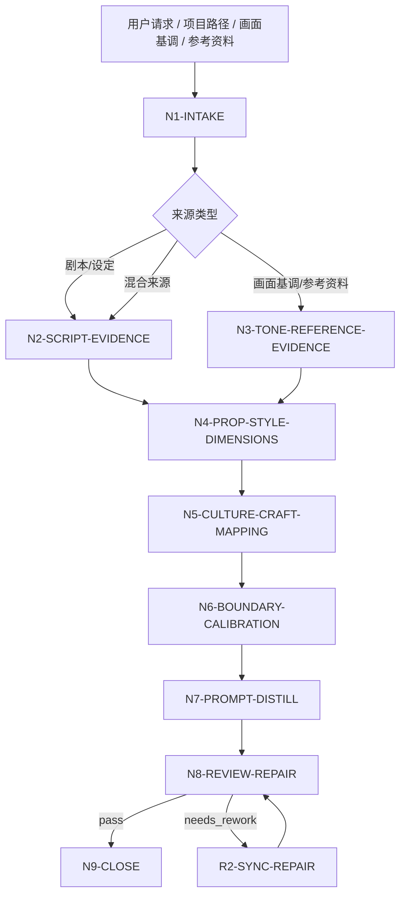
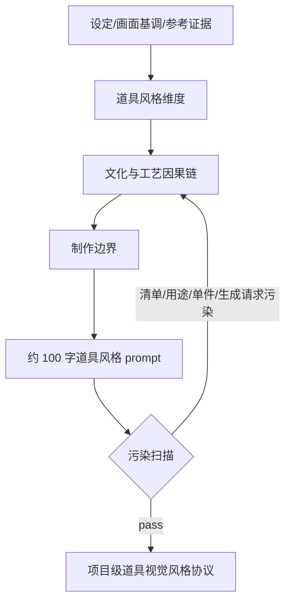

# aigc 3-美学/道具风格

`道具风格` 是 AIGC 影片项目的道具视觉风格协议技能。它从上游剧本、`画面基调`、参考图/视频或项目资料中提取道具层面的风格规则，研究文化元素、形制、质感、材料倾向、工艺痕迹、使用痕迹、尺度语言、符号系统和制作边界，并蒸馏为可被后续道具清单、单件道具设计和图像生成阶段继承的道具风格提示词。

本技能只输出“道具视觉风格层级”，不写具体道具清单、剧情用途、单个物件设定、生成请求或镜头画面。默认输出中文，核心 `prop_style_prompt` 控制在约 100 字；除非用户明确要求英文或下游模型需要英文字段，最终正文保持中文。

## Context Loading Contract

- 每次调用 `$aigc-prop-style` 时，必须同时加载本目录 `SKILL.md + CONTEXT.md`。
- 若任务绑定 `projects/aigc/<项目名>/`，必须先加载项目根 `MEMORY.md`，再加载项目根 `CONTEXT/` 中与美术、道具、世界观、参考图、参考视频、禁区或长期制作偏好相关的文件。
- 默认上游来源包括 `projects/aigc/<项目名>/2-编剧/`、`projects/aigc/<项目名>/3-美学/画面基调/全局风格协议.md`、用户指定参考图/视频、项目设定或已有候选道具风格协议。
- 参考图/视频只允许提供道具风格事实、形制倾向、表面处理、使用痕迹、工艺逻辑、符号系统和制作边界，不得把参考中的具体物件、品牌、剧情用途或构图复制为项目真源。
- 核心审美判断、文化研究、形制归纳、风格映射和提示词蒸馏必须由 LLM 直接完成；脚本只可承担读取、转写整理、字数统计、JSON/Markdown 校验和污染词扫描。
- 冲突优先级：用户显式请求 > 根 `AGENTS.md` / meta 规则 > 本 `SKILL.md` > `画面基调` 输出 > 项目 `MEMORY.md` > 项目 `CONTEXT/` > 本 `CONTEXT.md`。

## Runtime Spine Contract

| block_id | control_block | local_landing |
| --- | --- | --- |
| `B1` | 核心任务、非目标和禁止项 | `Core Task Contract` / `Runtime Guardrails` |
| `B2` | 输入、必要字段和澄清条件 | `Input Contract` |
| `B3` | 任务类型与来源类型路由 | `Type Routing Matrix` / `Mode Selection` |
| `B4` | 主执行节点、证据、路由和 gate | `Thinking-Action Node Map` / `Visual Maps` |
| `B5` | 外部模块授权和禁止越权 | `Module Loading Matrix` / `Module Trigger Matrix` |
| `B6` | 汇流条件和失败条件 | `Convergence Contract` |
| `B7` | 审查问题、失败码和返工入口 | `Review Gate Binding` |
| `B8` | 唯一输出格式、路径和完成门 | `Output Contract` |
| `B9` | 经验写回和项目记忆边界 | `Learning / Context Writeback` |
| `B10-B14` | 业务画像、量化口径、注意力、检查点和评估资产 | `Business Requirement Analysis Contract`、`Quantifiable Execution Criteria Contract`、`Attention Concentration Protocol`、`Checkpoint Contract`、`Evaluation Prompt Contract` |

## Core Task Contract

Accepted tasks:

- 从剧本、项目设定、`画面基调` 或用户粘贴文本中提取道具层面的视觉风格协议。
- 根据参考图、参考视频或参考作品，分析道具的文化元素、形制逻辑、表面行为、材料倾向、工艺痕迹、使用痕迹、尺度语言和符号系统。
- 为当前影片项目定制 `Prop Style Slogan`、`Prop Style Principle`、道具风格维度表、制作边界、负面特征和约 100 字中文道具风格提示词。
- 审查或修复已有道具风格输出中的清单越权、剧情用途污染、单件设计污染、品牌/现实物件照搬、材质过细、文化符号误用或字数不合规。

Non-goals:

- 不写具体道具清单、单个道具名称、道具功能、剧情用途、持有人、出现镜头或生成请求。
- 不替代 `道具` 设计/生成阶段，不输出单件物件设定、三视图、prompt 组或资产规格。
- 不定义角色服装、场景建筑、摄影构图、镜头参数、光源位置或运镜。
- 不反向修改 `画面基调`；若发现冲突，只在报告中标记风险和建议回到对应上游。

Runtime persona:

- 角色：道具美术风格总监（Prop Art Director）。
- 专业域：道具设计、物质文化研究、工业设计史、工艺史、表面处理、影视美术制片约束。
- 语调：专业、精确、客观；优先使用可验证术语，例如 `铸造痕迹`、`层压结构`、`手工修补`、`磨耗边缘`、`尺度夸张`、`符号重复`。
- 表达禁区：避免“高级”“有质感”“很酷”等不可验证形容；每条判断必须回到输入证据、画面基调或参考锚点。

## Business Requirement Analysis Contract

| field | requirement | evidence | fail_code |
| --- | --- | --- | --- |
| `business_goal` | 建立项目级道具视觉风格协议和约 100 字中文道具风格提示词 | 用户请求、剧本、画面基调、参考图/视频说明 | `FAIL-PS-BUSINESS-GOAL` |
| `business_object` | 被处理对象是道具风格层级，不是具体道具清单、剧情用途或单件设计 | 输入路径、项目名、资料类型、用户边界 | `FAIL-PS-BUSINESS-OBJECT` |
| `constraint_profile` | 锁定不写具体物件、不写用途、不写生成请求、不照搬参考、不越权到角色/场景/摄影 | 用户边界、本 SKILL 禁止项 | `FAIL-PS-CONSTRAINT` |
| `success_criteria` | 输出包含来源清单、风格维度、文化/形制/质感/工艺/使用/尺度/符号/制作边界、负面特征、约 100 字 prompt 和审计报告 | Output Contract、Review Gate Binding | `FAIL-PS-SUCCESS` |
| `complexity_source` | 复杂度来自从剧情对象中抽象道具风格、承接画面基调、避免清单化和单件化、处理文化符号与制作边界 | route 说明、source profile | `FAIL-PS-COMPLEXITY` |
| `topology_fit` | 先取证、再去清单化、再分维度归纳、再文化/工艺校准、再 prompt 蒸馏、再越权扫描 | Visual Maps、节点表、review gate | `FAIL-PS-TOPOLOGY-FIT` |

拓扑适配理由至少满足三条：

- `证据先行`：先建立 `prop_style_evidence_map`，避免凭空发明道具风格。
- `去清单化隔离`：在证据抽取后删除具体物件、用途和持有人，防止道具风格变成道具清单。
- `画面基调承接`：先读取 `画面基调` 的媒介和渲染纪律，再制定道具层面的局部语言，避免风格分裂。
- `制作边界收束`：最终 prompt 前执行清单/用途/单件/生成请求污染扫描，确保下游仍有设计空间。

## Input Contract

Accepted input:

- `projects/aigc/<项目名>/2-编剧/第N集.md`、整季 `2-编剧/` 目录、`2-编导` 目录或用户指定剧本文本。
- `projects/aigc/<项目名>/3-美学/画面基调/全局风格协议.md` 或用户提供的全局视觉风格描述。
- 项目初始化资料、世界观设定、题材说明、用户道具审美偏好、禁区说明。
- 参考图、参考视频、参考作品名称、文化/时代/工艺参考资料。
- 已有 `projects/aigc/<项目名>/3-美学/道具风格/道具风格协议.md` 或候选 prompt。

Required input:

- 至少一种可读取的道具风格来源：剧本/项目设定/画面基调/文本片段/参考图/参考视频/参考作品说明。
- 若要正式写回项目，必须能定位 `projects/aigc/<项目名>/`。
- 若只有参考图/视频而无项目资料，输出只能标记为 `reference_only` 候选协议，不得伪造项目叙事因果链。

Optional input:

- 用户指定的文化方向、时代参考、禁用符号、制作预算、模型平台、输出语言。
- 项目 `MEMORY.md` 中长期美术偏好、道具禁区、文化敏感边界和制作限制。
- 后续道具清单或单件道具阶段的局部约束；这些只能作为冲突检查，不得反向改写本技能风格协议。

Reject or clarify when:

- 没有任何可读取来源，且用户要求正式项目级定稿。
- 用户要求本技能直接输出具体道具清单、单件道具设定、剧情用途、生成 prompt 或图片。
- 用户要求照搬参考图/视频中的具体物件、品牌、标志、器物名或道具功能。
- 用户要求脚本自动生成审美结论、文化判断或创作正文。

## Type Routing Matrix

| input_type | signal | route_to | required_nodes | module_load | fail_code |
| --- | --- | --- | --- | --- | --- |
| `script_prop_style_analysis` | 指定 `2-编剧` 文件/目录或粘贴剧本文本 | `Script Prop Style Path` | `N1,N2,N4,N5,N6,N7,N8,N9` | `CONTEXT.md` | `FAIL-PS-TYPE-SCRIPT` |
| `visual_tone_inheritance` | 提供或存在 `画面基调/全局风格协议.md` | `Visual Tone Inheritance Path` | `N1,N3,N4,N5,N6,N7,N8,N9` | `CONTEXT.md` | `FAIL-PS-TYPE-VISUAL-TONE` |
| `reference_prop_style_analysis` | 提供参考图、参考视频、参考作品或工艺资料，且项目资料不足 | `Reference-Only Path` | `N1,N3,N4,N5,N6,N7,N8,N9` | `CONTEXT.md` | `FAIL-PS-TYPE-REFERENCE` |
| `hybrid_project_analysis` | 同时提供剧本/项目资料、画面基调和参考资料 | `Hybrid Prop Calibration Path` | `N1,N2,N3,N4,N5,N6,N7,N8,N9` | `CONTEXT.md` | `FAIL-PS-TYPE-HYBRID` |
| `repair` | 已有协议存在清单化、用途污染、单件设计污染、参考照搬、字数超限或报告缺证据 | `Repair Path` | `N1,R1,R2,N8,N9` | `CONTEXT.md` | `FAIL-PS-TYPE-REPAIR` |
| `review_only` | 用户只要求检查候选道具风格 | `Review Path` | `N1,V1,N9` | `CONTEXT.md` | `FAIL-PS-TYPE-REVIEW` |

## Mode Selection

| mode | trigger | canonical_output |
| --- | --- | --- |
| `single_episode_seed` | 基于单集剧本建立候选道具风格 | 候选 `道具风格协议.md`，报告标记样本范围 |
| `series_prop_style_protocol` | 基于多集、整季或项目资料建立正式项目级协议 | `projects/aigc/<项目名>/3-美学/道具风格/道具风格协议.md` |
| `visual_tone_extension` | 主要从 `画面基调` 延展道具视觉语言 | 正式或候选协议，报告标记继承字段 |
| `reference_only` | 只有参考图/视频/作品，无项目叙事资料 | 临时候选协议，不正式覆盖项目真源 |
| `hybrid_calibration` | 项目资料 + 画面基调 + 参考图/视频/作品 | 正式协议，报告区分 script-derived、tone-derived 与 reference-derived 证据 |
| `repair` | 修复已有协议或 prompt | 最小修复后的协议与修复报告 |
| `review_only` | 只审查不改写 | 审查报告 |

## Thinking-Action Node Map

| node_id | objective | inputs | actions | evidence | route_out | gate |
| --- | --- | --- | --- | --- | --- | --- |
| `N1-INTAKE` | 锁定来源、项目、模式和注意力锚点 | 用户请求、路径、参考资料 | 判定 source type、mode、写回权限、禁区；形成 `business_profile` | `source_manifest`、`mode`、`constraint_profile` | `N2` / `N3` / `R1` / `V1` | 至少 1 类来源可读；正式写回必须有项目根 |
| `N2-SCRIPT-EVIDENCE` | 从剧本/设定抽取道具风格证据 | `2-编剧`、`2-编导` 或文本 | 提取与道具风格相关的文化、时代、使用环境、秩序、磨损、仪式、技术水平和生产方式信号；删除具体物件名称、持有人和剧情用途 | `script_prop_style_evidence_map`，至少 5 条证据 | `N4` / `N3` | 每条证据能回指输入片段或项目资料，且不形成道具清单 |
| `N3-TONE-REFERENCE-EVIDENCE` | 从画面基调和参考资料提取道具风格事实 | `画面基调`、图片、视频、作品说明 | 只提取媒介纪律、形制倾向、表面行为、工艺痕迹、尺度语言、符号系统和负面特征；剔除具体物件、品牌和构图 | `tone_reference_prop_evidence_map`，画面基调至少 3 条继承约束；每个参考至少 3 条风格事实 | `N4` | 不得复制参考中的具体道具或品牌符号 |
| `N4-PROP-STYLE-DIMENSIONS` | 汇流道具风格维度 | N2/N3 证据 | 建立 8 个解析维度：文化元素、形制语言、质感/表面行为、材料倾向、工艺痕迹、使用痕迹、尺度语言、符号系统；另列制作边界 | `prop_style_dimension_profile` | `N5` | 只保留风格层级；具体道具名和剧情用途必须删除 |
| `N5-CULTURE-CRAFT-MAPPING` | 形成文化、工艺和制作因果链 | `prop_style_dimension_profile` | 写 `Prop Style Slogan`、2-4 句设计原则、`[设定/画面基调/参考 -> 道具风格]` 映射；每个主要决策说明触发原因 | `prop_style_slogan`、`design_principle`、`prop_style_causal_chain`，至少 5 条因果链 | `N6` | 每条道具风格决策可追溯，不能只写审美偏好 |
| `N6-BOUNDARY-CALIBRATION` | 校准制作边界和禁用范围 | N5 输出、用户指定限制 | 明确可用风格层级、禁用现实物件照搬、禁用文化符号滥用、禁用单件功能设定、禁用生成请求；必要时标记文化敏感风险 | `prop_boundary_matrix`，至少 5 条边界 | `N7` | 边界必须能保护后续清单/单件设计阶段的空间 |
| `N7-PROMPT-DISTILL` | 蒸馏道具风格 prompt | N4-N6 输出 | 生成约 100 字中文 `prop_style_prompt`；包含文化气质、形制趋势、表面行为、工艺/使用痕迹、尺度/符号语言和制作边界；过滤道具名、用途、单件设定和生成指令 | `candidate_prop_style_prompt`、`contamination_scan` | `N8` | 字数约 80-130 中文字；禁用类别残留 0 个 |
| `N8-REVIEW-REPAIR` | 审查并最小修复 | 候选协议 | 执行 review gates；失败时回到对应节点修复，最多 2 轮自动修复，仍失败则阻断 | `review_verdict`、`repair_log` | `N9` / `R2` | 所有 P0 gate pass 后才能正式写回 |
| `N9-CLOSE` | 输出或写回唯一结果 | 通过审查的协议 | 按 Output Contract 输出；正式写回时生成执行报告 | `final_output_manifest` | done | 只允许一个 canonical 协议；候选和正式状态必须标清 |
| `R1-ROOT-CAUSE` | 定位已有协议缺陷源 | 候选协议、失败提示 | 追到证据、维度、因果链、边界、prompt 或报告证据层 | `root_cause_trace` | `R2` | 不得只替换表面词 |
| `R2-SYNC-REPAIR` | 源层修复 | R1 输出 | 修复对应 section，并重新跑 N8 | `sync_patch` | `N8` | 修复后同类污染不得残留 |
| `V1-REVIEW` | 只审查候选协议 | 候选协议 | 执行 Review Gate Binding，不改写正文 | `review_findings` | `N9` | findings 必须有证据、fail code、返工目标 |

## Visual Maps





## Quantifiable Execution Criteria Contract

| criteria_slot | required_content | landing_place | fail_code |
| --- | --- | --- | --- |
| `action_scope` | 剧本来源至少抽取 5 条道具风格证据；画面基调至少抽取 3 条继承约束；每个参考图/视频/作品至少抽取 3 条风格事实；正式协议至少覆盖 8 个道具风格维度 | `N2/N3/N4.actions` | `FAIL-PS-QUANT-SCOPE` |
| `evidence_count` | 因果链至少 5 条；制作边界至少 5 条；负面特征至少 4 条 | `N5/N6.evidence` | `FAIL-PS-QUANT-EVIDENCE` |
| `pass_threshold` | P0 gate 全部通过；`prop_style_prompt` 约 80-130 中文字；具体道具名、剧情用途、单件设定、生成请求残留 0 个 | `N7/N8.gate` | `FAIL-PS-QUANT-THRESHOLD` |
| `retry_limit` | 自动修复最多 2 轮；仍出现 P0 越权、文化风险未说明或来源不足时阻断并报告 | `N8.route_out` | `FAIL-PS-QUANT-RETRY` |
| `fallback_evidence` | 参考资料不可机器读取时，使用用户文字说明和可见元数据；无法验证的文化/工艺判断标为 `unverified_reference_claim`，不得作为核心证据 | `Review Gate Binding.report_evidence` | `FAIL-PS-QUANT-FALLBACK` |

## Module Loading Matrix

| module | load_when | authority | forbidden_use | rework_target |
| --- | --- | --- | --- | --- |
| `CONTEXT.md` | 每次调用本技能 | 经验层、失败模式、清单化污染修复 heuristics | 重定义输入、节点、gate、输出路径 | `Learning / Context Writeback` |
| `agents/openai.yaml` | 产品入口或技能索引需要元数据 | 入口描述和默认 prompt | 覆盖本 `SKILL.md` 合同 | `agents/openai.yaml` |
| `test-prompts.json` | 回归验证、dry-run 或达尔文评估 | 典型任务样例 | 替代正式审查门 | `Evaluation Prompt Contract` |
| `README.md` | 人类快速阅读目录与用法 | 说明目录和使用方式 | 新增执行规则或完成门 | `README.md` |
| `CHANGELOG.md` | 本包发生实际修改时 | 时间序变更摘要 | 运行时上下文或规范裁决 | `CHANGELOG.md` |

## Module Trigger Matrix

| trigger_signal | required_modules | load_phase | return_gate | mechanical_check |
| --- | --- | --- | --- | --- |
| 任意执行 | `CONTEXT.md` | `N1-INTAKE` | `N1` | 确认同目录经验层已读 |
| 产品索引或插件入口 | `agents/openai.yaml` | `N9-CLOSE` | `Output Contract` | entrypoint 指向本 `SKILL.md` |
| 回归验证或审计 | `test-prompts.json` | `V1-REVIEW` | `Evaluation Prompt Contract` | 至少 3 条 prompt，包含 script/tone-reference/repair |
| 修改本技能包 | `CHANGELOG.md` | `N9-CLOSE` | `Checkpoint Contract` | 追加日期、变更和验证摘要 |
| `FAIL-PS-*` 返工 | `CONTEXT.md` | `R1-ROOT-CAUSE` | `R2-SYNC-REPAIR` | failure type 能映射到 playbook |

## Convergence Contract

Pass conditions:

- `source_manifest` 已标明输入来源、样本范围、画面基调继承状态和写回权限。
- `prop_style_dimension_profile` 覆盖 8 个道具风格解析维度，且只包含风格属性。
- `prop_style_causal_chain` 至少 5 条，能说明道具风格决策如何来自剧本、画面基调、项目设定或参考证据。
- `prop_boundary_matrix` 至少 5 条，覆盖清单越权、用途越权、单件设计越权、文化符号风险和制作边界。
- `prop_style_prompt` 为约 80-130 中文字，且没有具体道具名、剧情用途、单件设定、生成请求、摄影构图或角色/场景设计越权。
- 正式写回时，执行报告包含 `Execution Decision Trace`、`Reference Execution Matrix`、`Rule Evidence Map`、`N/A Justification`、`Repair Log` 和 `Contamination Scan`。

Fail conditions:

- 无可读来源却要求正式项目级定稿。
- 输出变成具体道具清单、物件命名、持有人安排、剧情用途或生成请求。
- 参考图/视频中的具体物件、品牌、符号或功能被照搬为项目设定。
- prompt 只堆质感词，没有文化、形制、工艺、使用痕迹或制作边界因果。
- 字数低于 80 或高于 130，且用户未明确覆盖。

## Review Gate Binding

| review_question | review_gate | fail_code | rework_target | report_evidence |
| --- | --- | --- | --- | --- |
| 是否只描述道具视觉风格层级，不写具体清单？ | `GATE-PS-01-NO-PROP-LIST` | `FAIL-PS-PROP-LIST-POLLUTION` | `N7-PROMPT-DISTILL` | 被删除或降级的具体物件词清单 |
| 是否不写剧情用途、持有人或功能安排？ | `GATE-PS-02-NO-STORY-USE` | `FAIL-PS-STORY-USE-POLLUTION` | `N5-CULTURE-CRAFT-MAPPING` / `N7-PROMPT-DISTILL` | 用途/持有人/功能词扫描 |
| 是否不进入单个物件设定或生成请求？ | `GATE-PS-03-NO-ITEM-DESIGN` | `FAIL-PS-ITEM-DESIGN-OVERREACH` | `N6-BOUNDARY-CALIBRATION` / `N7-PROMPT-DISTILL` | 单件设定和生成指令扫描 |
| 是否承接画面基调且不反向改写上游？ | `GATE-PS-04-TONE-INHERITANCE` | `FAIL-PS-TONE-DRIFT` | `N3-TONE-REFERENCE-EVIDENCE` | 画面基调继承字段和冲突风险 |
| 文化元素和符号系统是否有证据且不滥用？ | `GATE-PS-05-CULTURE-SAFETY` | `FAIL-PS-CULTURE-MISUSE` | `N5-CULTURE-CRAFT-MAPPING` | 文化/符号证据与敏感风险说明 |
| 形制、质感、材料倾向、工艺和使用痕迹是否保持风格层级？ | `GATE-PS-06-STYLE-LEVEL` | `FAIL-PS-STYLE-LEVEL` | `N4-PROP-STYLE-DIMENSIONS` | 8 维 profile 和降级记录 |
| prompt 是否约 100 字且中文默认？ | `GATE-PS-07-LENGTH-LANGUAGE` | `FAIL-PS-LENGTH` | `N7-PROMPT-DISTILL` | 字数统计与语言标记 |
| 是否适合被后续道具清单和单件设计无污染继承？ | `GATE-PS-08-DOWNSTREAM-SAFETY` | `FAIL-PS-DOWNSTREAM-POLLUTION` | `N6-BOUNDARY-CALIBRATION` / `N7-PROMPT-DISTILL` | 下游继承风险清单 |
| 正式写回是否有结构化执行报告？ | `GATE-PS-09-REPORT-EVIDENCE` | `FAIL-PS-REPORT-MISSING` | `N9-CLOSE` | 报告 section 完整性 |

## Runtime Guardrails

- 默认禁止具体道具清单：最终 prompt 不写具体物件名、器物名、设备名、武器名、工具名或品牌名。
- 默认禁止剧情用途：最终 prompt 不写“用于打开”“由某角色携带”“在某场景出现”等功能、持有人或剧情安排。
- 默认禁止单件设定：不写尺寸数值、结构分解、部件清单、三视图要求、生成参数或图片生成指令。
- 默认禁止参考照搬：参考图/视频只进入形制、工艺、表面行为、符号节奏和制作边界，不复制具体物件和品牌符号。
- 可保留的道具风格类别：文化气质、形制趋势、表面行为、材料倾向、工艺痕迹、使用痕迹、尺度语言、符号系统、制作边界和负面特征。

## Output Contract

正式写回路径：

- `projects/aigc/<项目名>/3-美学/道具风格/道具风格协议.md`
- `projects/aigc/<项目名>/3-美学/道具风格/执行报告.md`

单次回答或候选输出结构：

```markdown
# 道具风格协议

## Source Manifest
- project:
- mode:
- sources:
- visual_tone_inheritance:
- writeback_status:

## Prop Style Slogan
一句话道具风格 slogan。

## Prop Style Principle
2-4 句设计原则。

## Prop Style Dimension Profile
| dimension | decision | evidence |
| --- | --- | --- |

## Prop Style Causal Chain
| source_signal | prop_style_translation | evidence |
| --- | --- | --- |

## Prop Boundary Matrix
| boundary | allowed_style_level | forbidden_overreach |
| --- | --- | --- |

## Prop Style Prompt
约 100 字中文道具风格提示词。

## Negative Traits
- 避免项 1
- 避免项 2
- 避免项 3
- 避免项 4
```

正式执行报告必须包含：

- `Execution Decision Trace`：关键判断、适用规则、输入证据、取舍理由和输出落点。
- `Reference Execution Matrix`：本技能无外部 `references/` 时记录 `N/A: no references module authorized`；若未来启用 references，逐条记录 load_status、trigger_reason、applied_to、evidence_in_output、verdict 和 n/a_reason。
- `Rule Evidence Map`：映射 `GATE-PS-*` 到正文位置或证据。
- `N/A Justification`：说明未触发来源、模块或例外规则。
- `Repair Log`：记录失败码、修复目标和复审结果。
- `Contamination Scan`：道具清单、剧情用途、单件设定、生成请求、参考照搬、角色/场景/摄影越权六类扫描结果。

Completion gate:

- `review_verdict=pass` 后才可正式写回。
- `reference_only` 模式不得覆盖正式项目协议，除非用户明确批准。
- 输出只能有一个 canonical `Prop Style Prompt`；其他版本必须标记为 rejected 或 candidate。

## Attention Concentration Protocol

| protocol_id | protocol | requirement | rework_entry |
| --- | --- | --- | --- |
| `ATTE-PS-01` | 注意力锚点 | 当前目标始终是“项目级道具视觉风格协议”，不是道具清单、单件设计或生成 prompt | `N1-INTAKE` |
| `ATTE-PS-02` | 转移规则 | 来源证据完成后转 8 维风格；风格维度完成后转因果链；因果链完成后转制作边界；边界完成后转 prompt 蒸馏 | `Thinking-Action Node Map` |
| `ATTE-PS-03` | 漂移检测 | 出现具体物件名、用途、持有人、尺寸部件、生成指令、参考照搬或角色/场景/摄影越权即判定漂移 | `Review Gate Binding` |
| `ATTE-PS-04` | 再集中机制 | 发现漂移时回到最近证据或边界节点，不继续润色当前污染句 | `R1-ROOT-CAUSE` / `R2-SYNC-REPAIR` |

## Checkpoint Contract

| checkpoint_id | checkpoint_trigger | required_action | pass_evidence | fail_code |
| --- | --- | --- | --- | --- |
| `CHK-PS-SCOPE` | 正式覆盖已有项目协议、删除用户指定文化符号、启用现实物件/品牌例外 | 确认用户授权或写入报告说明 | 影响路径、替换范围、例外理由 | `FAIL-PS-CHECKPOINT-SCOPE` |
| `CHK-PS-SEMANTIC` | 定稿 slogan、设计原则、8 维 profile、边界和 prompt | 确认因果链、禁区和下游安全均可回指 | `prop_style_causal_chain`、`contamination_scan` | `FAIL-PS-CHECKPOINT-SEMANTIC` |
| `CHK-PS-VALIDATION` | 审查失败或字数/污染扫描失败 | 回到对应节点最小修复 | fail code、修复点、复审结果 | `FAIL-PS-CHECKPOINT-VALIDATION` |
| `CHK-PS-EVAL` | 用户要求回归验证或达尔文评分 | 使用 `test-prompts.json` dry-run 或真实评估 | prompt ids、eval_mode、预期摘要 | `FAIL-PS-CHECKPOINT-EVAL` |

## Evaluation Prompt Contract

`test-prompts.json` 至少包含 3 条典型任务，覆盖剧本解析、画面基调/参考资料继承和污染修复。每条必须包含 `id`、`prompt`、`expected`。无法真实读取图像或视频时，评估模式标记为 `dry_run`，并说明预期多模态证据结构。

## Root-Cause Execution Contract (Mandatory)

污染或失败处理必须上溯：

`Symptom -> Direct Output Defect -> Source Node -> Gate/Rule -> Repair Target`

常见追因：

- 具体道具清单残留：`candidate_prop_style_prompt -> GATE-PS-01 -> N7-PROMPT-DISTILL`
- 剧情用途或持有人残留：`prop_style_causal_chain / candidate_prop_style_prompt -> GATE-PS-02 -> N5 / N7`
- 单件设定或生成请求残留：`candidate_prop_style_prompt -> GATE-PS-03 -> N6 / N7`
- 画面基调承接断裂：`tone_reference_prop_evidence_map -> GATE-PS-04 -> N3-TONE-REFERENCE-EVIDENCE`
- 文化符号无证据或误用：`prop_style_causal_chain -> GATE-PS-05 -> N5-CULTURE-CRAFT-MAPPING`

## Field Master

| field_id | owner | canonical_landing | must_contain | fail_code |
| --- | --- | --- | --- | --- |
| `FIELD-PS-01` | source evidence | `Source Manifest` / `script_prop_style_evidence_map` / `tone_reference_prop_evidence_map` | 来源、样本范围、画面基调继承状态、证据类型和写回状态 | `FAIL-PS-SOURCE` |
| `FIELD-PS-02` | prop style dimensions | `Prop Style Dimension Profile` | 8 个道具风格解析维度，且只含风格属性 | `FAIL-PS-DIMENSION` |
| `FIELD-PS-03` | causal mapping | `Prop Style Causal Chain` | 至少 5 条 `[来源信号 -> 道具风格]` 因果链 | `FAIL-PS-CAUSALITY-MISSING` |
| `FIELD-PS-04` | boundary calibration | `Prop Boundary Matrix` | 至少 5 条制作与越权边界 | `FAIL-PS-BOUNDARY` |
| `FIELD-PS-05` | prop prompt | `Prop Style Prompt` | 约 80-130 中文字，无六类污染 | `FAIL-PS-PROMPT` |
| `FIELD-PS-06` | audit evidence | `执行报告.md` | decision trace、rule evidence、N/A、repair log、contamination scan | `FAIL-PS-REPORT-MISSING` |

## Thought Pass Map

| pass_id | focus_field | core_question | action | evidence |
| --- | --- | --- | --- | --- |
| `PASS-PS-01` | `FIELD-PS-01` | 输入来源是否足以支撑正式道具风格？ | 锁定 source_manifest、mode 和画面基调继承状态 | 来源清单、样本范围 |
| `PASS-PS-02` | `FIELD-PS-02` | 抽取结果是否只剩道具风格属性？ | 过滤清单化和用途化内容并补 8 维 profile | `prop_style_dimension_profile` |
| `PASS-PS-03` | `FIELD-PS-03` | 道具风格决策是否可追溯？ | 建立并审查因果链 | `prop_style_causal_chain` |
| `PASS-PS-04` | `FIELD-PS-04` | 边界是否保护后续道具清单和单件设计空间？ | 补允许层级、禁止越权和文化风险说明 | `prop_boundary_matrix` |
| `PASS-PS-05` | `FIELD-PS-05` | prompt 是否能被下游无污染继承？ | 执行字数和六类污染扫描 | `contamination_scan` |
| `PASS-PS-06` | `FIELD-PS-06` | 正式写回是否有可审计证据？ | 生成报告并映射 gate | `Rule Evidence Map` |

## Pass Table

| pass_id | pass_standard | fail_code | rework_entry |
| --- | --- | --- | --- |
| `PASS-PS-01` | 至少 1 类来源可读；正式写回有项目根 | `FAIL-PS-SOURCE` | `N1-INTAKE` |
| `PASS-PS-02` | 8 个解析维度齐全，且无具体道具清单和用途污染 | `FAIL-PS-DIMENSION` | `N4-PROP-STYLE-DIMENSIONS` |
| `PASS-PS-03` | 至少 5 条因果链且能回指输入证据 | `FAIL-PS-CAUSALITY-MISSING` | `N5-CULTURE-CRAFT-MAPPING` |
| `PASS-PS-04` | 至少 5 条边界，覆盖清单、用途、单件、文化和制作风险 | `FAIL-PS-BOUNDARY` | `N6-BOUNDARY-CALIBRATION` |
| `PASS-PS-05` | Prop Style Prompt 为中文约 80-130 字，六类污染为 0 | `FAIL-PS-PROMPT` | `N7-PROMPT-DISTILL` |
| `PASS-PS-06` | 正式写回报告包含必需审计 section | `FAIL-PS-REPORT-MISSING` | `N9-CLOSE` |

## Field Mapping

| source_field | internal_field | output_field |
| --- | --- | --- |
| 剧本中的时代、阶层、技术水平、仪式、使用环境和生产方式信号 | `script_prop_style_evidence_map` | `Prop Style Dimension Profile.evidence` |
| 画面基调的媒介、渲染、视觉纪律和负面特征 | `tone_reference_prop_evidence_map` | `Source Manifest.visual_tone_inheritance` / `Prop Boundary Matrix` |
| 参考图/视频的形制、表面行为、工艺痕迹、尺度和符号节奏 | `tone_reference_prop_evidence_map` | `Prop Style Dimension Profile.evidence` |
| 用户偏好与项目 MEMORY | `constraint_profile` | `Negative Traits` / `N/A Justification` |
| 道具风格维度 | `prop_style_dimension_profile` | `Prop Style Dimension Profile` |
| 来源到道具风格翻译 | `prop_style_causal_chain` | `Prop Style Causal Chain` |
| 制作和越权边界 | `prop_boundary_matrix` | `Prop Boundary Matrix` |
| 提示词候选 | `candidate_prop_style_prompt` | `Prop Style Prompt` |
| 审查和修复 | `review_verdict` / `repair_log` | `执行报告.md` |

## Multi-Subskill Continuous Workflow

当 `3-美学` 父级调度多个同级风格子技能时，`道具风格` 默认继承 `画面基调` 的全局媒介和渲染纪律，并与 `角色风格`、`场景风格`、`摄影风格`、`分镜风格` 保持边界。它只提供道具视觉风格协议，不拥有具体道具清单、单件道具设定、剧情用途或图像生成真源。后续道具清单和单件设计阶段可继承 `Prop Style Prompt`，但必须在自身合同内追加具体物件事实和生成约束。

## Learning / Context Writeback

- 本技能执行中发现可复用的清单化污染、用途污染、参考图误读、文化符号误用、prompt 字数修复策略，应写入本目录 `CONTEXT.md`。
- 用户明确要求“以后这个项目的道具都按某种风格/禁区/文化边界执行”时，且任务绑定具体 `projects/aigc/<项目名>/`，应同步更新项目根 `MEMORY.md`，不要写入本技能经验层。
- 详细执行时间线、迁移流水和正式修改摘要写入 `CHANGELOG.md` 或项目执行报告，不写入 `CONTEXT.md`。
