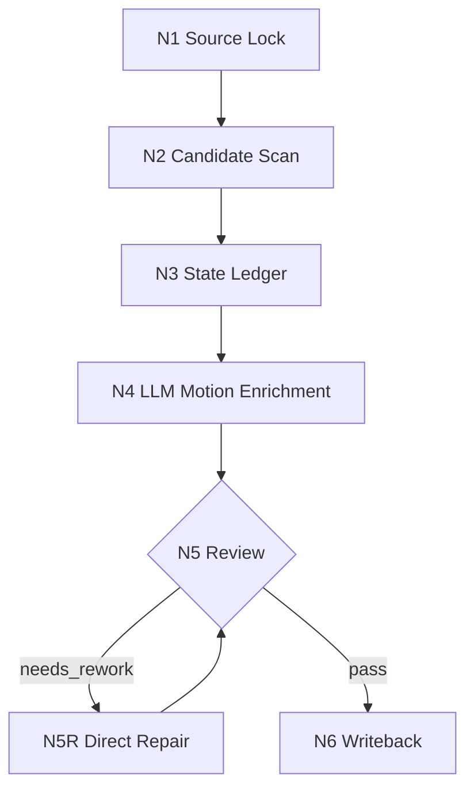

# Motion Workflow

本文件定义 `3-运动` 的思维与执行一体化节点。

## Business Requirement Analysis

| slot | answer |
| --- | --- |
| `business_goal` | 将上游编导稿或任意剧本文本中的角色动作补成可连续、可定位、可被下游摄影消费的运动描写 |
| `business_object` | Markdown 编导稿、小说/剧本来源、motion unit、运动状态 ledger |
| `constraint_profile` | source 保真、运动五要素、上一画面状态回顾、不得越权到摄影 |
| `success_criteria` | 每个 motion unit 有五要素和连续性证据，输出写入 `3-运动` 并可交给 `4-摄影` |
| `non_goals` | 不改剧情、对白、场景顺序，不写分镜、机位、景别、运镜或 prompt |
| `complexity_source` | 运动候选识别、前后状态推导、组内参照系统一、多角色动作主次和任意来源路径 |
| `topology_fit` | 串行主干 + review repair 回路 |

## Node Network

| node_id | objective | inputs | actions | evidence | route_out | gate |
| --- | --- | --- | --- | --- | --- | --- |
| `N1-MOTION-SOURCE-LOCK` | 锁定 source、输出路径和不可改字段 | 用户请求、项目根、source 文件 | 读取 source，记录 source kind、目标集、输出路径、保真边界 | `source_context_profile` | `N2-MOTION-CANDIDATE-SCAN` | `GATE-MOTION-01` |
| `N2-MOTION-CANDIDATE-SCAN` | 找出角色运动和状态迁移单位 | source 正文、类型包 | 标注 motion units，跳过纯环境静态描写 | `motion_unit_index` | `N3-MOTION-STATE-LEDGER` | `GATE-MOTION-02` |
| `N3-MOTION-STATE-LEDGER` | 建立上一终点到当前起点的时间轴和组级参照画像 | motion units、上一 unit final_state、source 组边界 | 识别显式分镜组或临时连续动作段，选出 `primary_reference_frame`，为每个 unit 填写 previous/current/final 状态、参照依据和连续性 verdict | `motion_state_ledger`、`group_reference_profile` | `N4-MOTION-ENRICHMENT` 或阻断 | `GATE-MOTION-05`、`GATE-MOTION-04A` |
| `N4-MOTION-ENRICHMENT` | LLM 直接扩写运动强化句 | source、ledger、五要素合同、group reference profile | 优先沿用组内 `primary_reference_frame`，按最佳参照系识别机制处理局部参照，在命中画面就近新增或修订 `运动强化：` | `candidate_motion_enrichment`、`reference_frame_basis` | `N5-MOTION-REVIEW` | `GATE-MOTION-03`、`GATE-MOTION-04B` |
| `N5-MOTION-REVIEW` | 审查保真、五要素、连续性和边界 | candidate、review contract | 生成 verdict 和 findings | `review_report` | `N5R-MOTION-REPAIR` 或 `N6-MOTION-WRITEBACK` | `GATE-MOTION-09` |
| `N5R-MOTION-REPAIR` | 最小修复阻断项 | findings、candidate、source | 只修运动句、ledger、报告，不改 source 事实 | `repair_actions` | `N5-MOTION-REVIEW` | `GATE-MOTION-09` |
| `N6-MOTION-WRITEBACK` | 写回 canonical 输出和报告 | final candidate、report evidence | 落盘 `3-运动/第N集.md` 与 `执行报告.md` | `writeback_result` | done | `GATE-MOTION-10` |

## Mermaid

## Failure Loops

- `FAIL-MOTION-INPUT` 回到 `N1-MOTION-SOURCE-LOCK`。
- `FAIL-MOTION-CANDIDATE` 回到 `N2-MOTION-CANDIDATE-SCAN`。
- `FAIL-MOTION-CONTINUITY` 回到 `N3-MOTION-STATE-LEDGER`。
- `FAIL-MOTION-ELEMENTS` 回到 `N4-MOTION-ENRICHMENT`。
- `FAIL-MOTION-REFERENCE-GROUP` 回到 `N3-MOTION-STATE-LEDGER` 建立或修正 `group_reference_profile`。
- `FAIL-MOTION-REFERENCE-SELECTION` 回到 `N4-MOTION-ENRICHMENT` 重选最佳参照系并补证据。
- `FAIL-MOTION-SOURCE`、`FAIL-MOTION-HANDOFF` 回到 `N5R-MOTION-REPAIR`。
