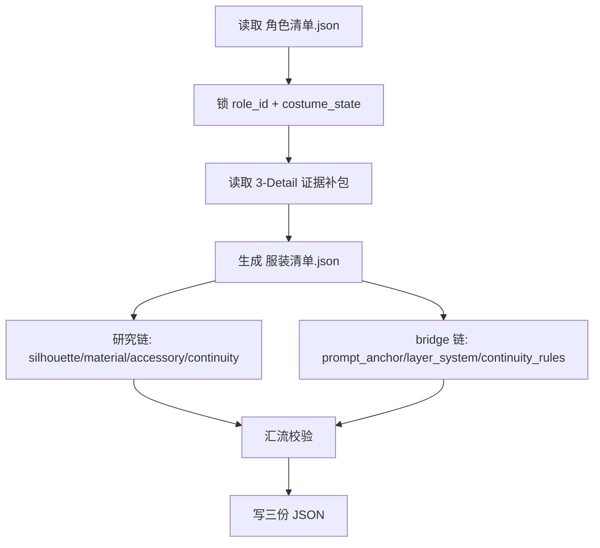
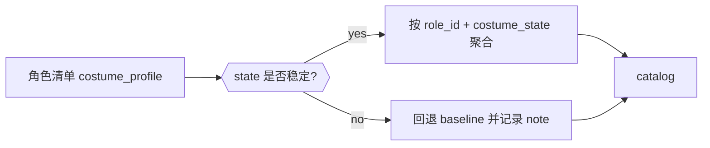
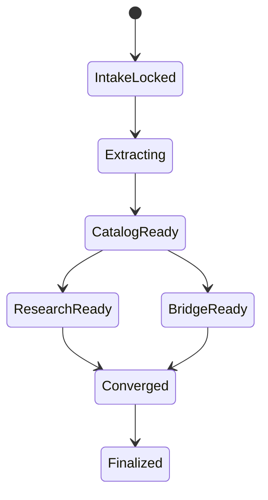
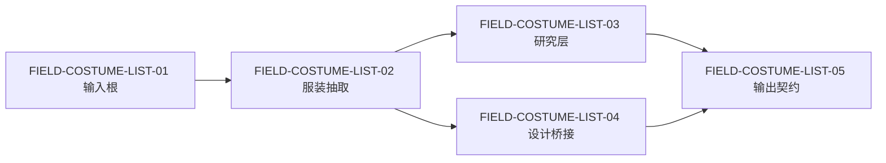

# aigc 4-Design / 3-服装 / 1-清单

## 概述

`1-清单` 是 `3-服装` 链路的首个 direct leaf skill，负责把上游已经 canonicalized 的 `角色清单.json`，结合当前集导演证据，收束为三份默认主产物：

1. `服装清单.json`
2. `服装研究.json`
3. `costume_design_bridge.json`
4. `_manifest.json`

本轮重编排只改合同形态，不改业务机制：

- 第一输入根仍固定为 `4-Design/角色/1-清单/角色清单.json`
- 证据补包仍优先读取 `3-Detail/第N集.json`，必要时才 fallback 到 legacy `编导/第N集.json`
- 输出根仍固定为 `projects/aigc/<项目名>/4-Design/服装/1-清单/第N集/`
- 三份 JSON 的路径、命名和字段角色仍保持现有配置

## Skill Execution Rule (Mandatory)

`1-清单` 由本 leaf skill 直接完成执行闭环，不额外分拆 team 或子 agent 真源。

- skill 自身负责输入读取、角色服装线索抽取、状态归一、研究层生成、bridge 生成与三份 JSON 写回
- `references/` 和脚本只辅助执行，不反向定义主链
- 不得为 `1-清单` 再生成第二份 costume extract team 或 reasoning sidecar

## When to Use

- 需要从 `角色清单.json` 提取当前集的服装对象池。
- 需要把 `role_id + costume_state + evidence` 收束成稳定 costume 主键。
- 需要为 `2-设计` 提供 machine-first 的 `costume_design_bridge.json`。

## When Not to Use

- 角色 canonical identity 还没稳定，应回 `4-Design/角色/1-清单`。
- 已有 `costume_design_bridge.json` 且目标是设计 synthesis，应进入 `2-设计`。
- 当前任务是面板、出图或视频请求，而不是对象池抽取。

## Mode Selection

`1-清单` 有两种执行模式：

1. `full-build`
   - 当前 episode 还没有三份 JSON，需要完整抽取、研究和 bridge
2. `incremental-repair`
   - 已有部分输出，但需要补主键、研究层或 bridge 字段

## Business Requirement Analysis Contract (Mandatory)

| analysis_slot | 当前结论 |
| --- | --- |
| `business_goal` | 把角色链已锁定的穿搭事实收束为可供服装设计继续消费的对象池、研究层和 bridge |
| `business_object` | `角色清单.json.roles[]` 中的 `costume_profile / costume_state / evidence`，以及 `3-Detail/第N集.json` 中可补证的镜头穿搭线索 |
| `constraint_profile` | 不得重写角色 identity；不得发明上游没有的新服装事实；导演 JSON 只作证据补包；三份 JSON 都必须回链角色与状态 |
| `success_criteria` | 输入根稳定、服装主键稳定、研究层可直接支撑设计、bridge 可被 `2-设计` 机读消费、三份输出全部落盘 |
| `non_goals` | 不生成服装设计稿；不写 prompt sidecar；不直接生图；不替角色链重新抽人物 |
| `complexity_source` | 角色服装线索分散在角色清单和 episode 证据中；同一角色多套状态容易混淆；研究层与 bridge 需要同时 machine-first |
| `topology_fit` | 采用“串行锁输入 -> 抽取聚合 -> 并行补研究/bridge -> 汇流写回”的叶子技能思行网络 |
| `step_strategy` | 先锁输入与状态主键，再生成 `服装清单`，随后分两条细链补 `服装研究` 与 `bridge`，最后统一校验并写回 |

## Context Preload (Mandatory)

加载顺序固定为：

1. 根 `AGENTS.md`
2. `.agents/skills/aigc/SKILL.md + CONTEXT.md`
3. `.agents/skills/aigc/4-Design/SKILL.md + CONTEXT.md`
4. `.agents/skills/aigc/4-Design/1-主体清单/SKILL.md + CONTEXT.md`
5. `.agents/skills/aigc/4-Design/1-主体清单/_shared/detail-output-consumption-contract.md`
6. `.agents/skills/aigc/4-Design/1-主体清单/_shared/object-normalization-contract.md`
7. 本 `SKILL.md + CONTEXT.md`
8. `projects/aigc/<项目名>/4-Design/角色/1-清单/第N集/角色清单.json`
9. `projects/aigc/<项目名>/3-Detail/第N集.json`
10. legacy `projects/aigc/<项目名>/编导/第N集.json`（仅在 direct detail fallback 时）
11. `references/output-template.md`
12. `references/type-strategies.md`
13. `references/execution-flow.md`

## Shared Canonical Sources (Mandatory)

- 强制读取：`.agents/skills/aigc/4-Design/1-主体清单/_shared/detail-output-consumption-contract.md`
- 强制读取：`.agents/skills/aigc/4-Design/1-主体清单/_shared/object-normalization-contract.md`
- 强制读取：`.agents/skills/aigc/4-Design/1-主体清单/_shared/list-output-contract.md`
- 强制读取：`references/output-template.md`
- 按需读取：`references/type-strategies.md`
- runner：`scripts/extract_costume_catalog.py`

硬规则：

1. 第一输入根固定为 `角色清单.json`。
2. `3-Detail/第N集.json` 只补 costume evidence，不夺角色真源。
3. `costume_id` 的稳定主键优先围绕 `role_id + costume_state`。
4. `服装研究.json` 与 `costume_design_bridge.json` 都必须回链 `服装清单.json` 中的 costume 条目。
5. 不允许从导演句子残片反向发明 `role_id` 或新的 costume identity。

## Total Input Contract (Mandatory)

### 必需输入

- `projects/aigc/<项目名>/4-Design/角色/1-清单/第N集/角色清单.json`
- `projects/aigc/<项目名>/3-Detail/第N集.json`

### 可选输入

- `projects/aigc/<项目名>/编导/第N集.json`
  - 仅当 direct detail 证据需要 legacy fallback 时消费
- 已存在的 `projects/aigc/<项目名>/4-Design/服装/1-清单/第N集/*.json`
  - 仅用于增量修补或覆盖比对

### 禁止输入

- 与当前 episode 无关的其他集导演 JSON
- 任何要求本阶段直接生成 `服装设计.json` 的额外指令
- 未经角色链 canonicalize 的自由文本人物描述

### 输入处理原则

1. 没有 `角色清单.json` 时立刻停止。
2. `costume_state` 缺失时允许保守回退为 `baseline`，但必须留痕。
3. 只从角色清单和导演证据已经出现的线索中归纳 costume，不做凭空补设。

## Detail Placement Rule (Mandatory)

本技能采用：

- `复杂链路的骨架 / 细则分层 = false`

因此抽取、归一、研究、bridge 的关键细则全部直接留在本 `SKILL.md`；`references/` 继续保留，但不替代主链节点说明。

## Mermaid Visual Contract

- Mermaid 必须同时承担抽取主干、状态归一、研究/bridge 双链和字段关系的可视真源。
- 图中的分支与汇流必须能直接映射到 `catalog -> research -> bridge` 的执行顺序。
- 不允许只保留一张总流程图而把状态归一和双链补强藏进 prose。

## Visual Maps (Mermaid)

## Topology Contract (Mandatory)

### Topology Fit

本技能采用 `串行主干 + 双链补强 + 汇流写回`：

1. 串行主干：
   - 锁输入
   - 锁 `role_id + costume_state`
   - 读取导演证据补包
   - 生成 `服装清单.json`
2. 双链补强：
   - 研究链
   - bridge 链
3. 汇流写回：
   - 校验两链都回链同一 costume 主键
   - 写三份 JSON

### Ordered / Unordered Rules

- `N1 -> N2 -> N3 -> N4` 固定串行。
- `N5A` 和 `N5B` 默认并行思考，但写回前必须经过 `N6` 汇流。
- 汇流失败时优先回到研究链或 bridge 链，而不是重跑角色抽取。

## Thinking-Action Node Contract (Mandatory)

| slot | 要求 |
| --- | --- |
| `node_id` | 稳定节点标识 |
| `objective` | 当前节点要完成的判断或动作 |
| `inputs` | 进入节点的输入 |
| `actions` | 当前节点真正执行的动作 |
| `evidence` | 当前节点留下的证据或产物 |
| `route_out` | 成功、失败、分支流向 |
| `gate` | 是否允许进入汇流 |

## Thinking-Action Node Network

| node_id | 对应 Step | 聚焦字段 | objective | actions | evidence | route_out | gate |
| --- | --- | --- | --- | --- | --- | --- | --- |
| `N1-INPUT-LOCK` | `S1` | `FIELD-COSTUME-LIST-01` | 锁定唯一第一输入根 | 读取 `角色清单.json` 和 `3-Detail/第N集.json`，确认当前轮是清单任务 | `input_lock_note` | pass -> `N2`；fail -> 结束 | 输入根齐备才可继续 |
| `N2-STATE-NORMALIZE` | `S2` | `FIELD-COSTUME-LIST-02` | 锁定 costume 主键与状态归一 | 为每条服装线索确定 `role_id + costume_state`，缺失时回退 `baseline` | `state_normalize_note` | pass -> `N3`；fail -> 回 `S1-S2` | 状态主键稳定后才可抽取 |
| `N3-EVIDENCE-PACK` | `S3` | `FIELD-COSTUME-LIST-02` | 只在角色链之外补必要的导演证据 | 从 `3-Detail` 提取镜头/动作/连续性证据，绑定到已有 costume 主键 | `evidence_packet` | pass -> `N4`；fail -> 回 `S2-S3` | 证据必须附着已有主键 |
| `N4-CATALOG-WRITE` | `S4` | `FIELD-COSTUME-LIST-02` | 生成 canonical `服装清单.json` | 输出 `costumes[]`、`group_costume_map[]`、meta 路径 | `服装清单.json` 草稿 | pass -> `N5A/N5B`；fail -> 回 `S2-S4` | catalog 结构合法 |
| `N5A-RESEARCH-CHAIN` | `S5` | `FIELD-COSTUME-LIST-03` | 为每个 costume 生成可设计消费的研究层 | 补 `silhouette/material/accessory/continuity/display/chronicle` | `服装研究.json` 草稿 | pass -> `N6`；fail -> 回 `S5` | 研究层不能只有审美空词 |
| `N5B-BRIDGE-CHAIN` | `S6` | `FIELD-COSTUME-LIST-04` | 为每个 costume 生成 machine-first bridge | 补 `prompt_anchor / silhouette_system / layer_system / material_palette / continuity_rules / negative_constraints` | `costume_design_bridge.json` 草稿 | pass -> `N6`；fail -> 回 `S6` | bridge 必须可机读 |
| `N6-CONVERGENCE` | `S7` | `FIELD-COSTUME-LIST-05` | 校验三份输出是否对齐同一 costume 主键 | 交叉校验 meta、costume_id、路径、数量、命名和 evidence 回链 | `validation_note`、三份最终 JSON | Final；fail -> 回 `N4/N5A/N5B` | 三份 JSON 同步后才可结案 |

## Capability Detail (Mandatory)

### `S1` 输入锁定

| node_step | 要从哪些方面着手 | 具体动作 | 输出要求 |
| --- | --- | --- | --- |
| `I1` | 当前轮是否真是清单任务 | 区分对象池抽取与设计/面板请求 | 若不是清单任务，应退出到父级重新路由 |
| `I2` | 第一输入根是否存在 | 检查 `角色清单.json` 是否存在、是否属于当前 episode | 缺失时直接阻塞 |
| `I3` | 证据补包是否可读 | 检查 `3-Detail/第N集.json` 是否存在 | 缺失时允许保守版，但必须记缺口 |

### `S2` 状态归一

| node_step | 要从哪些方面着手 | 具体动作 | 输出要求 |
| --- | --- | --- | --- |
| `SN1` | 角色 ID 是否稳定 | 逐条读取 `role_id`，不重新发明角色名 | costume 条目必须回链已有角色 |
| `SN2` | `costume_state` 是否明确 | 优先用上游状态；缺失时回退 `baseline` | 所有回退都要进 note |
| `SN3` | 同一角色多套服装如何拆分 | 按状态、场景用途、连续性证据拆分，不按修辞名词乱拆 | 同一状态不得重复造多条 |

### `S3` 证据补包

| node_step | 要从哪些方面着手 | 具体动作 | 输出要求 |
| --- | --- | --- | --- |
| `EP1` | 哪些证据值得补 | 只补动作适配、层次暴露、配饰出现、连续性约束 | 不做剧情改写 |
| `EP2` | 证据如何绑定 | 将镜头证据绑定到已存在 `costume_id` | 不允许无主证据漂浮 |
| `EP3` | 证据可信度如何控制 | 证据不足时保守记录，不补新设定 | 研究和 bridge 都能看到证据来源 |

### `S4` 服装清单生成

| node_step | 要从哪些方面着手 | 具体动作 | 输出要求 |
| --- | --- | --- | --- |
| `CW1` | meta 路径是否正确 | 写 `source_role_list`、`source_episode_detail`、`skill_id` | meta 必须可回链 |
| `CW2` | costume 条目是否稳定 | 输出 `costume_id / role_id / canonical_label / costume_state / evidence` | 每条可唯一追踪 |
| `CW3` | group map 是否需要 | 根据镜头组或分组证据写 `group_costume_map` | 没有证据时允许为空，但结构要保留 |

### `S5` 研究链

| node_step | 要从哪些方面着手 | 具体动作 | 输出要求 |
| --- | --- | --- | --- |
| `RS1` | 廓形与层次 | 提炼 silhouette、体量、层次、动作适配 | 不能只写“优雅”“帅气” |
| `RS2` | 材质与纹理 | 提炼材料、纹理、色温和表面 finish | 必须服务后续设计 |
| `RS3` | 配饰与连续性 | 提炼配饰系统、携带方式、连续性要求 | 要可被 `2-设计` 直接吸收 |
| `RS4` | display 与 chronicle | 补展示重点和时间线备注 | 不得写成松散随笔 |

### `S6` bridge 链

| node_step | 要从哪些方面着手 | 具体动作 | 输出要求 |
| --- | --- | --- | --- |
| `BR1` | prompt anchor | 压缩该 costume 最核心的设计锚点 | 要能直接喂给 `2-设计` |
| `BR2` | 结构系统 | 写 `silhouette_system / layer_system / material_palette` | machine-first，避免纯 prose |
| `BR3` | 连续性与禁区 | 写 `continuity_rules / negative_constraints` | 下游无需重扫研究层 |
| `BR4` | accessory system | 写可穿戴、可替换、不可缺省的配饰位 | 与 research 同源不冲突 |

### `S7` 汇流校验

| node_step | 要从哪些方面着手 | 具体动作 | 输出要求 |
| --- | --- | --- | --- |
| `CV1` | 数量与主键是否对齐 | 检查三份 JSON 的 `costume_id` 数量与集合 | 不允许一份多一份少 |
| `CV2` | 路径与命名是否对齐 | 检查三份输出路径、命名、episode 根 | 根目录统一 |
| `CV3` | 下游可消费性是否达标 | 检查 `2-设计` 所需字段是否齐 | bridge 缺字段则回到 `S6` |

## Convergence Contract (Mandatory)

只有同时满足以下条件，`1-清单` 才允许宣布完成：

1. `FIELD-COSTUME-LIST-01` 到 `FIELD-COSTUME-LIST-05` 全部落位。
2. 每个 `costume_id` 都能回链 `role_id + costume_state + evidence`。
3. `服装研究.json` 具备 `silhouette/material/accessory/continuity` 四类核心信息。
4. `costume_design_bridge.json` 具备 `prompt_anchor / layer_system / continuity_rules` 等机读字段。
5. 三份 JSON 全部落到 `projects/aigc/<项目名>/4-Design/服装/1-清单/第N集/`。

若未满足：

- 输入问题 -> 回 `N1`
- 状态归一问题 -> 回 `N2`
- catalog 主键问题 -> 回 `N4`
- 研究层问题 -> 回 `N5A`
- bridge 问题 -> 回 `N5B`

## One-Shot Output Contract (Mandatory)

`1-清单` 的一次性输出是同一 bundle 内的四类结果：

1. `projects/aigc/<项目名>/4-Design/服装/1-清单/第N集/服装清单.json`
2. `projects/aigc/<项目名>/4-Design/服装/1-清单/第N集/服装研究.json`
3. `projects/aigc/<项目名>/4-Design/服装/1-清单/第N集/costume_design_bridge.json`
4. `projects/aigc/<项目名>/4-Design/服装/1-清单/第N集/_manifest.json`

## Canonical Output Governance (Mandatory)

1. `服装清单.json` 是对象池真源。
2. `服装研究.json` 是研究层派生 sidecar，不冒充设计主稿。
3. `costume_design_bridge.json` 是 `2-设计` 的第一输入根。
4. `_manifest.json` 只记录输入、输出、统计与告警，不承载服装事实。

## Quality And Audit Contract

### 评分矩阵

| 维度 | 指标 | 分值 |
| --- | --- | --- |
| 维度0: 契约遵循 | 是否坚持 `角色清单 first`、导演证据只补包 | __/10 |
| 维度1 | `costume_id` 主键稳定性 | __/10 |
| 维度2 | 研究层可设计消费性 | __/10 |
| 维度3 | bridge 机读可执行性 | __/10 |
| 维度4 | 三份 JSON 对齐度 | __/10 |

## Field Master

| field_id | 输出位置/字段 | 内容要求 | 默认责任 Step | 质量维度 | 失败码 |
| --- | --- | --- | --- | --- | --- |
| `FIELD-COSTUME-LIST-01` | 输入根 | 第一输入根固定为 `角色清单.json` | `S1` | 真源稳定性 | `FAIL-COSTUME-LIST-01` |
| `FIELD-COSTUME-LIST-02` | 服装抽取 | 每个服装条目都能回链 `role_id + costume_state + evidence` | `S2-S4` | 抽取准确度 | `FAIL-COSTUME-LIST-02` |
| `FIELD-COSTUME-LIST-03` | 研究层 | `服装研究.json` 保留 silhouette / material / accessory / continuity 结论 | `S5` | 研究完整性 | `FAIL-COSTUME-LIST-03` |
| `FIELD-COSTUME-LIST-04` | 设计桥接 | `costume_design_bridge.json` 产出可供 `2-设计` 继续消费的机读字段 | `S6` | 桥接可执行性 | `FAIL-COSTUME-LIST-04` |
| `FIELD-COSTUME-LIST-05` | 输出契约 | 三份输出命名、路径与汇流结论稳定 | `S7` | 落盘完整性 | `FAIL-COSTUME-LIST-05` |

## Thought Pass Map

| step_id | 聚焦字段 | 核心问题 | 生成动作 | 未达标信号 |
| --- | --- | --- | --- | --- |
| `S1` | `FIELD-COSTUME-LIST-01` | 第一输入根是否锁定到角色清单 | 读取角色清单与导演证据 | 回头重扫角色 identity |
| `S2` | `FIELD-COSTUME-LIST-02` | `costume_state` 如何稳定归一 | 生成主键与回退 note | 同一状态被拆成多套 |
| `S3` | `FIELD-COSTUME-LIST-02` | 哪些导演证据值得补 | 写 evidence packet | 证据脱离主键漂浮 |
| `S4` | `FIELD-COSTUME-LIST-02` | catalog 是否可独立成立 | 写 `服装清单.json` | catalog 主键不稳 |
| `S5` | `FIELD-COSTUME-LIST-03` | 研究层是否足够支撑设计 | 写 `服装研究.json` | 研究层只有空泛形容词 |
| `S6` | `FIELD-COSTUME-LIST-04` | bridge 是否能直接进入 `2-设计` | 写 `costume_design_bridge.json` | bridge 只有 prose 没机读槽位 |
| `S7` | `FIELD-COSTUME-LIST-05` | 三份输出是否对齐 | 做汇流校验并写回 | 文件名、路径或数量漂移 |

## Pass Table

| field_id | Pass Standard | Fail Code | Rework Entry |
| --- | --- | --- | --- |
| `FIELD-COSTUME-LIST-01` | 第一输入根固定为 `角色清单.json` | `FAIL-COSTUME-LIST-01` | `S1` |
| `FIELD-COSTUME-LIST-02` | 所有服装条目都能回链角色、状态与证据 | `FAIL-COSTUME-LIST-02` | `S2-S4` |
| `FIELD-COSTUME-LIST-03` | 研究层含 silhouette/material/accessory/continuity | `FAIL-COSTUME-LIST-03` | `S5` |
| `FIELD-COSTUME-LIST-04` | bridge 可直接进入 `2-设计` | `FAIL-COSTUME-LIST-04` | `S6` |
| `FIELD-COSTUME-LIST-05` | 路径、命名与数量稳定 | `FAIL-COSTUME-LIST-05` | `S7` |

## Root-Cause Execution Contract (Mandatory)

当出现以下症状时，必须先修本子技能合同或脚本：

- `角色清单.json` 已有信息，但服装链仍按导演 JSON 重新抢角色提取权。
- `costume_state` 漂移，导致同一角色同一状态被拆成多个 costume。
- 研究层只有抽象词，没有 `layer_system / continuity_rules / accessory_system` 的上游依据。
- 输出目录或文件名和 `4-Design/服装/1-清单` 不一致。

必经链路：

`Symptom -> Direct Technical Cause -> Rule Source -> Meta Rule Source -> Fix Landing Points`

优先检查：

- `Rule Source`
  - `.agents/skills/aigc/4-Design/1-主体清单/服装/SKILL.md`
  - `.agents/skills/aigc/4-Design/1-主体清单/服装/CONTEXT.md`
  - `.agents/skills/aigc/4-Design/1-主体清单/服装/scripts/extract_costume_catalog.py`
- `Meta Rule Source`
  - `.agents/skills/aigc/4-Design/1-主体清单/角色/SKILL.md`
  - `.agents/skills/aigc/4-Design/1-主体清单/_shared/detail-output-consumption-contract.md`
  - 根 `AGENTS.md`
