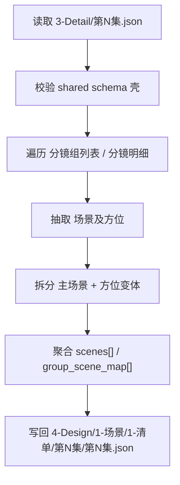
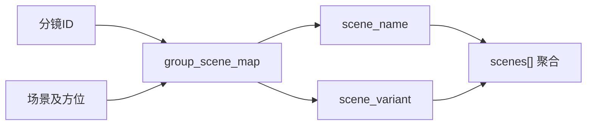

# 4-Design / 1-场景 / 1-清单

## 概述

`1-清单` 负责把上游导演 episode JSON 中已经存在的 `场景及方位` 信息，收束为 **当前集场景清单**。

当前子技能直接消费 `.agents/skills/aigc/_shared/director_episode_output.schema.json` 约束下的 episode 根文件，并把镜级场景串整理成：

1. 逐场景聚合后的 `scenes[]`
2. 逐镜头可回链的 `group_scene_map[]`
3. 便于下游 `4-Design/1-场景/2-设计` 继续消费的 episode 级 JSON carrier

交付类型：`内容输出型`

本轮合同只做 **场景清单**，不并入参照仓里的网络研究、场景研究稿和 scene bridge。

## When to Use

- 需要从 `projects/<项目名>/3-Detail/第N集.json` 抽取当前集出现过的场景主表。
- 需要把 `分镜明细[].场景及方位` 收敛成“主场景 + 方位/变体”的可消费清单。
- 需要给 `4-Design/1-场景/2-设计` 提供稳定的场景去重结果与镜头映射。

## When Not to Use

- 任务还在补导演分镜事实，应回到 `3-Detail`。
- 目标是生成场景设计稿、场景圣经、画面 prompt 或参考图，应进入 `2-设计` 或后续阶段。
- 上游 episode 文件不符合 shared director schema，或缺少 `分镜组列表[] / 分镜明细[]`。

## 子技能边界

### `1-清单` 拥有

- 镜级 `场景及方位` 的抽取、保守归一与场景去重合同
- `scene_name / scene_variant / group_scene_map` 的输出壳
- 当前集 `第N集.json` 场景清单 carrier 的写出

### `1-清单` 不拥有

- 场景研究、历史考据、网络检索
- 场景设计稿、材质色板、视觉方案
- 改写上游 `3-Detail` 镜头事实

## Visual Maps

## Canonical Module References

| 模块 | 作用 | 真源文件 |
| --- | --- | --- |
| 思维链 | 承载字段主表、thought pass 与 gate | `references/chain-of-thought.md` |
| 执行流程 | 承载输入、落点、工作流与 handoff | `references/execution-flow.md` |
| 类型策略 | 承载变量、情况、保守回退策略 | `references/type-strategies.md` |
| 输出契约 | 承载 episode JSON 与 manifest 骨架 | `references/output-template.md` |

## Execution Summary

- 上游主输入固定为 `projects/<项目名>/3-Detail/第N集.json`。
- 同 schema 的 `projects/<项目名>/3-Detail/第N集.json` 允许兼容读取，但不作为本技能主描述口径。
- 每个 `分镜明细` 最多贡献 1 条 `group_scene_map` 记录。
- 默认把 `场景及方位` 拆成 `scene_name + scene_variant`，拆不稳时保守收口到主场景或 `unknown`，不得虚构研究字段。
- 当前 canonical 主产物是 `projects/<项目名>/4-Design/1-场景/1-清单/第N集/第N集.json`。
- 仅在显式要求追溯清单时附带 `_manifest.json`。

## Output Summary

- canonical 主产物：`projects/<项目名>/4-Design/1-场景/1-清单/第N集/第N集.json`
- 可选追溯文件：`projects/<项目名>/4-Design/1-场景/1-清单/第N集/_manifest.json`
- shared source schema：`.agents/skills/aigc/_shared/director_episode_output.schema.json`
- 当前不输出 Markdown，不输出研究稿。

## Strategy Summary

- 判定顺序：`上游 schema 壳是否成立 -> 场景串是否可拆 -> scene_name 是否可稳定聚合 -> 是否需要 manifest`
- 变量登记、情况判定与 fallback 见 `references/type-strategies.md`

## Field System Summary

- 字段体系保持 `FIELD-SCENE-LIST-01` 到 `FIELD-SCENE-LIST-05`
- 详细 thought pass 与 pass table 见 `references/chain-of-thought.md`

## Root-Cause Execution Contract (Mandatory)

当出现以下症状时，必须先修本子技能合同：

- 把 `场景清单` 做成了场景研究或场景设计稿
- `scene_name` 与 `scene_variant` 拆分漂移，导致同一场景反复分裂
- `group_scene_map` 无法回链 `分镜组ID / 分镜ID`
- 输出落回旧的 `output/影片/.../3-设定` 路径，而不是当前任务指定的 `projects/<项目名>/4-Design/...`

必经链路：

`Symptom -> Direct Technical Cause -> Rule Source -> Meta Rule Source -> Fix Landing Points`

优先检查：

- `Rule Source`
  - `.agents/skills/aigc/4-Design/1-场景/1-清单/SKILL.md`
  - `.agents/skills/aigc/4-Design/1-场景/1-清单/CONTEXT.md`
  - `.agents/skills/aigc/4-Design/1-场景/1-清单/scripts/extract_scene_catalog.py`
- `Meta Rule Source`
  - `.agents/skills/aigc/SKILL.md`
  - 根 `AGENTS.md`

## Context Preload (Mandatory)

- 执行前先加载 `.agents/skills/aigc/SKILL.md + CONTEXT.md`。
- 再加载本 `SKILL.md + CONTEXT.md`。
- 按需读取 `references/*.md` 与 `.agents/skills/aigc/_shared/director_episode_output.schema.json`。
- 优先级遵循：用户显式请求 > 根 `AGENTS.md` > `.agents/skills/aigc/SKILL.md` > 本 `SKILL.md` > 各级 `CONTEXT.md`。
