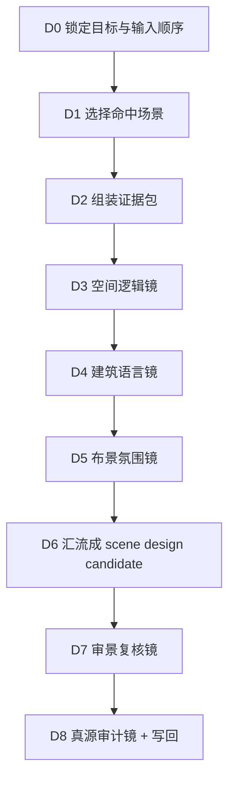
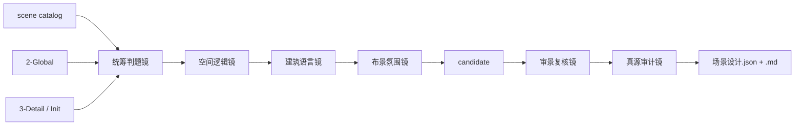
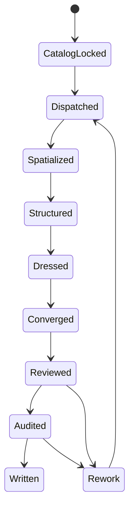

# 4-Design / 1-场景 / 2-设计

## Mode Selection

- 本次重构采用 `$skill-知行合一` 的单技能真源口径，并显式退役原 `.codex/agents/aigc/设计组/场景设计` 外挂 agent 组。
- `复杂链路的骨架 / 细则分层`：`false`
- canonical source：仅本 `SKILL.md`
- 角色能力不再外放为 subagents，而是内收为本技能的六组能力镜面。
- `templates/scene-design-card.md` 保留为输出结构载体，不再承担第二规则真源。

## 概述

`2-设计` 负责把 `1-清单` 已锁定的场景对象池，继续收束为当前集的场景设计卡与 episode 级 `场景设计.json`。

交付类型：`内容输出型`

## When To Use

- 已有 `1-清单` 的 scene catalog，需要进一步产出场景设计稿。
- 需要把 `2-Global` 的全局风格、类型指导与导演意图压回具体空间设计字段。
- 需要形成可被 `3-面板 / 5-Image / 6-Video` 继续消费的 `scene_designs[]` 与 per-scene 卡片。

## When Not To Use

- 还没有 `1-清单` 的 scene catalog，应先回退到 `1-清单`。
- 当前诉求是图片生成、视频请求或镜头 prompt，不在本阶段执行。
- 任务只是补导演事实，不应在本技能改写 `3-Detail` 真源。

## 单一真源边界

### `2-设计` 拥有

- `scene catalog -> scene design` 的唯一收束合同。
- 场景设计六组能力镜面的调度、汇流、复核与审计。
- `projects/<项目名>/4-Design/1-场景/2-设计/第N集/` 下 canonical 设计产物写回。

### `2-设计` 不拥有

- 重写 `1-清单` 的场景对象池定义。
- 越权修改 `2-Global` 或 `3-Detail` 真源。
- 让任何中间能力面直接写最终文件。

## Internal Capability Recomposition

以下能力已从外部 agent 合同收编回本技能内部，不再作为独立 agent 真源存在：

| 能力镜面 | 责任 | 典型输出位 |
| --- | --- | --- |
| `统筹判题镜` | 锁定本轮命中场景、优先级、证据缺口 | `scene_dispatch_plan` |
| `空间逻辑镜` | 锁定功能区、动线、视线、镜头锚点 | `space_prototype / circulation_and_blocking / camera_anchor` |
| `建筑语言镜` | 锁定作品/现实参照锚点、时代结构、材料与文化约束 | `architectural_reference / structural_language / material_palette / cultural_constraints` |
| `布景氛围镜` | 锁定陈设层次、标志性元素、生活痕迹、灯光与氛围 | `set_dressing / lighting_atmosphere` |
| `审景复核镜` | 检查设计一致性、反漂移和下游可消费性 | `review_status / review_note` |
| `真源审计镜` | 检查路径、schema、trace、writeback 边界 | `audit_trace / acceptance_notes` |

## Business Requirement Analysis Contract

### 业务目标

- 把场景对象池继续压成可复用、可审阅、可下游消费的场景设计真源。

### 业务对象

- `1-清单` 的 `第N集.json`
- `2-Global` 的风格、类型与导演意图
- `3-Detail` 的镜头级证据
- `0-Init` 的 north star 与初始化预设

### 复杂度来源

- 同一场景需要同时满足剧情用途、空间逻辑、时代风格、陈设氛围和镜头阅读。
- 场景设计必须是单一真源，不能再由多个角色各写平行主稿。
- 下游需要的是结构化 handoff，而不是抒情长文。

### 非目标

- 不重新建立场景对象池。
- 不直接生成图像或视频请求。
- 不输出平行版本的场景主稿。

### 成功标准

- 每个命中场景都有稳定的 `scene design card` 与 `scene_designs[]` 条目。
- 设计卡既能解释空间怎么搭，也能被下游直接转成展示、画面或视频输入。
- 最终只由本技能写出 `场景设计.json` 与 `<scene_key>.md`。

## Total Input Contract

### Canonical Inputs

- `projects/<项目名>/4-Design/1-场景/1-清单/第N集/第N集.json`
- `projects/<项目名>/2-Global/全局风格.md`
- `projects/<项目名>/2-Global/类型指导.md`
- `projects/<项目名>/2-Global/导演意图.md`
- `projects/<项目名>/3-Detail/第N集.json`
- `projects/<项目名>/0-Init/north_star.yaml`
- `projects/<项目名>/0-Init/init_handoff.yaml`
- `templates/scene-design-card.md`

### 输入顺序硬规则

1. 先读 `1-清单`，锁定对象池。
2. 再读 `2-Global`，锁定风格和类型约束。
3. 再回看 `3-Detail`，补镜头用途和动作证据。
4. 最后读 `0-Init`，只作为初始方向和约束补充。

### 输出落点

- `projects/<项目名>/4-Design/1-场景/2-设计/第N集/场景设计.json`
- `projects/<项目名>/4-Design/1-场景/2-设计/第N集/<scene_key>.md`
- 可选 `projects/<项目名>/4-Design/1-场景/2-设计/第N集/_manifest.json`

## Mermaid Visual Contract

- Mermaid 是本技能的关键治理真源，而不是装饰图。
- 当前至少保留 3 张图，分别承担：
  - 主工作流
  - 能力镜面与汇流关系
  - 状态推进与返工闭环
- 图里的节点名必须与下文 `D0-D8` 的思行节点保持一致。
- 若图与 prose 冲突，以更严格的节点、字段和 gate 说明为准，并立即修正图。

## Visual Maps (Mermaid)

## Thinking-Action Node Contract

### D0. 锁定目标与输入顺序

- `objective`
  - 确认本轮只做场景设计，不重建对象池，也不越权做下游生成。
- `inputs`
  - 用户目标、`1-场景` 父级合同、本技能 `CONTEXT.md`。
- `from_angles`
  - 本轮是否已有 `scene catalog`。
  - 最终只写哪些文件。
  - 哪些输入是首选真源，哪些只是补证据。
- `actions`
  1. 锁定本轮 canonical 输出为 `场景设计.json + <scene_key>.md`。
  2. 确认 `1-清单` 是第一真源，不允许跳过。
  3. 明确 `_manifest.json` 仅在追溯或批量调试时输出。
- `evidence`
  - 任务边界与输出模式判定。
- `route_out`
  - 成功：进入 `D1`。
  - 失败：停止并上抛边界冲突。
- `gate`
  - 若输入真源顺序不清，不得进入设计节点。

### D1. 选择命中场景

- `objective`
  - 用 `统筹判题镜` 锁定本轮实际需要设计的场景集合与优先级。
- `inputs`
  - `scene catalog`
  - 用户约束
  - 时间窗口
- `from_angles`
  - 哪些场景必须本轮完成。
  - 哪些场景证据不足，应保守延后。
  - scene dispatch 顺序是否合理。
- `actions`
  1. 读取 `scene catalog` 的 `scenes[] / group_scene_map[] / summary`。
  2. 生成 `scene_dispatch_plan`，列出命中场景、优先级、证据缺口。
  3. 排除未命中场景，避免补空设计稿。
  4. 为每个场景登记后续节点需要吸收的重点证据。
- `evidence`
  - `scene_dispatch_plan`
  - `selected_scene_keys`
- `route_out`
  - 成功：进入 `D2`。
  - scene catalog 缺失：回退 `1-清单`。
- `gate`
  - 不允许为未命中场景生成任何占位设计结果。

### D2. 组装证据包

- `objective`
  - 为每个命中场景建立同一口径的 `evidence_packet`。
- `inputs`
  - `scene_dispatch_plan`
  - `2-Global`
  - `3-Detail`
  - `0-Init`
- `from_angles`
  - 剧情功能是什么。
  - 风格和类型底座是什么。
  - 哪些镜头动作必须支撑空间设计。
  - 这个场景是否存在可直接借鉴的作品场景、现实场所或历史母题。
  - 若没有直接参照，允许在哪些题材边界内大胆外扩，而不是无约束发明。
  - 历史文化框架属于硬约束、软约束还是仅提供气质边界。
  - 哪些标志性元素已经被上游证据预埋，后续必须转成可见设计。
- `actions`
  1. 提取命中场景相关的 `group_scene_map` 和镜头证据。
  2. 汇总 `全局风格 / 类型指导 / 导演意图`。
  3. 识别 `reference_anchor`，优先记录“可借鉴的作品场景 / 现实场所 / 历史母题”，并注明借鉴重点是空间、结构、气质还是叙事功能。
  4. 判定 `reference_mode`：是 `direct_reference`、`bounded_extrapolation` 还是 `culture_bounded_invention`，明确后续是贴近参照还是在边界内大胆畅想。
  5. 只补必要的 `north_star / init_handoff` 约束，不让初始化设定盖过 scene catalog。
  6. 提前记录 `iconic_elements_seed`，收束为后续必须落地的标志性元素种子。
  7. 形成每个场景的 `evidence_packet`。
- `evidence`
  - 可复用的 `evidence_packet`。
- `route_out`
  - 成功：进入 `D3`。
  - 证据严重缺失：返回 `D1` 重新缩范围。
- `gate`
  - 没有 scene-specific 证据包，不得进入具体设计。

### D3. 空间逻辑镜

- `objective`
  - 锁定场景的空间主锚点、功能分区、动线与镜头阅读顺序。
- `inputs`
  - `evidence_packet`
- `from_angles`
  - 角色如何进入、停留、转向。
  - 镜头最依赖的观看关系是什么。
  - 哪些空间分区是剧情必须的。
  - 标志性元素应该落在主锚点、次锚点还是动线终点，才能被镜头读到。
- `actions`
  1. 定义 `space_prototype`。
  2. 梳理 `circulation_and_blocking`。
  3. 提炼 `camera_anchor`。
  4. 标记需要后续结构或陈设落实的空间锚点。
  5. 为 `iconic_elements_seed` 预留空间落位，避免后续标志物只能漂浮成装饰词。
- `evidence`
  - 空间逻辑结论。
  - 镜头支撑依据。
- `route_out`
  - 成功：进入 `D4`。
  - 空间逻辑与镜头冲突：回到 `D2` 补证据。
- `gate`
  - 不允许只写氛围词而没有空间可执行结构。

### D4. 建筑语言镜

- `objective`
  - 将时代、类型和风格约束压成结构语言、材料与文化边界。
- `inputs`
  - `evidence_packet`
  - `space_prototype`
- `from_angles`
  - 这个场景最适合参照哪部作品的哪个场景，或哪类现实/历史空间母题。
  - 若要大胆畅想，应该在什么结构层做外扩，哪些部分必须继续服从题材与时代底座。
  - 建筑骨架是什么。
  - 材料和色彩如何服务剧情。
  - 哪些文化/时代误读必须禁止。
- `actions`
  1. 写出 `architectural_reference`，明确“参照对象 + 可借鉴点 + 不应照搬点”；若无直接参照，也要写清采用的题材母题与想象方向。
  2. 写出 `structural_language`，说明哪些结构逻辑必须服从历史文化框架，哪些局部允许风格化变形或大胆外扩。
  3. 写出 `material_palette`，让材料、工艺和色彩与时代、地域、阶层或世界观保持同一口径。
  4. 写出 `cultural_constraints` 与 `reverse_taboos` 的结构部分，明确宗教、历史、民俗、礼制、地域等不可越界点。
- `evidence`
  - 参照锚点、结构与材料结论。
- `route_out`
  - 成功：进入 `D5`。
  - 与空间逻辑冲突：回到 `D3` 对齐。
- `gate`
  - 不允许把抽象风格词堆叠成空泛建筑描述。

### D5. 布景氛围镜

- `objective`
  - 将场景使用痕迹、陈设层次、灯光氛围和可拍摄感落实到具体字段。
- `inputs`
  - `evidence_packet`
  - `space_prototype`
  - `structural_language`
- `from_angles`
  - 场景里具体有什么。
  - 哪些物件和痕迹支撑剧情功能。
  - 灯光与气氛如何服务而不是替代设计。
  - 观众进入画面后，第一眼应该记住什么标志性元素。
  - 大胆畅想应落实成哪些具体可见物，而不是停在抽象概念层。
- `actions`
  1. 写出 `set_dressing`，把 `iconic_elements_seed` 落成具体物件、组合、纹样、陈列或使用痕迹。
  2. 写出 `lighting_atmosphere`。
  3. 补齐 `design_direction` 与 `reverse_taboos` 的氛围部分，说明哪些视觉夸张是允许的，哪些会破坏历史文化或作品锚点。
  4. 为下游 prompt 汇总提炼具体短语，至少覆盖“参照锚点 + 标志性元素 + 想象增量”。
- `evidence`
  - 陈设与氛围结论。
- `route_out`
  - 成功：进入 `D6`。
  - 若只有抽象情绪词：返回本节点重做。
- `gate`
  - 不允许用“压抑、冷、空灵”之类空泛词替代具体设计物。

### D6. 汇流成 scene design candidate

- `objective`
  - 把前面各能力镜面的结论收束为单一场景设计候选。
- `inputs`
  - `space_prototype`
  - `architectural_reference`
  - `structural_language`
  - `material_palette`
  - `set_dressing`
  - `circulation_and_blocking`
  - `camera_anchor`
  - `lighting_atmosphere`
- `from_angles`
  - 字段是否齐全。
  - 是否能直接写进模板。
  - 是否已经具备下游 prompt handoff。
  - 是否同时说清“参照什么、外扩到什么程度、受什么文化边界约束、靠什么元素被记住”。
- `actions`
  1. 生成 `scene_design_candidate`。
  2. 合成 `final_scene_prompt`。
  3. 写出 `panel_handoff` 与 `source_scene_ids`。
  4. 为 Markdown 卡和 JSON 条目准备同一份字段主稿。
  5. 交叉检查 candidate 是否形成一条完整链：`reference_anchor -> structural/cultural boundary -> iconic element cluster -> downstream prompt`。
- `evidence`
  - 单一候选设计对象。
- `route_out`
  - 成功：进入 `D7`。
  - 字段缺失：返回对应能力节点。
- `gate`
  - 不允许出现多个相互竞争的 scene design candidate。

### D7. 审景复核镜

- `objective`
  - 检查候选设计是否与 scene catalog、全局约束和剧情用途一致。
- `inputs`
  - `scene_design_candidate`
  - `evidence_packet`
- `from_angles`
  - 是否反漂移。
  - 是否把局部镜头感觉误写成场景总设。
  - 是否可被下游直接消费。
- `actions`
  1. 检查字段完整性。
  2. 检查 scene catalog 回链。
  3. 检查 `final_scene_prompt / panel_handoff` 是否足够具体。
  4. 写出 `review_status` 与 `review_note`。
- `evidence`
  - review 结论。
- `route_out`
  - `pass`：进入 `D8`。
  - `rework`：回到对应节点重做。
- `gate`
  - 没有复核通过，不得进入最终写回。

### D8. 真源审计镜 + 写回

- `objective`
  - 审计路径、schema、trace，并完成唯一 canonical 写回。
- `inputs`
  - review 通过的 `scene_design_candidate`
  - 输出模板
  - 输出路径
- `from_angles`
  - 写回边界是否正确。
  - 文件结构是否完整。
  - trace 是否足够支持后续追因。
- `actions`
  1. 生成 `audit_trace`。
  2. 写 `<scene_key>.md`。
  3. 聚合并写 `场景设计.json`。
  4. 按需写 `_manifest.json`。
  5. 写 `acceptance_notes`，声明是否可交给 `3-面板 / 5-Image / 6-Video`。
- `evidence`
  - canonical 文件落盘。
  - audit 结论。
- `route_out`
  - 通过：任务完成。
  - 失败：回到对应节点返工。
- `gate`
  - 只有本节点允许写最终文件。

## Convergence Contract

- 汇流点固定为 `D6 -> D7 -> D8`。
- `FAIL-SCN-DES-01`：绕过 `1-清单` 或输入顺序漂移，回到 `D0-D1`。
- `FAIL-SCN-DES-02`：对象命中或证据包不成立，回到 `D1-D2`。
- `FAIL-SCN-DES-03`：空间、建筑、布景字段缺口或冲突，回到 `D3-D5`。
- `FAIL-SCN-DES-04`：candidate 无法收束为单一主稿，回到 `D6`。
- `FAIL-SCN-DES-05`：复核或审计未通过，回到指定返工节点。

## One-Shot Output Contract

### Canonical Outputs

- `projects/<项目名>/4-Design/1-场景/2-设计/第N集/场景设计.json`
- `projects/<项目名>/4-Design/1-场景/2-设计/第N集/<scene_key>.md`
- 可选 `projects/<项目名>/4-Design/1-场景/2-设计/第N集/_manifest.json`

### `场景设计.json` 最低结构

1. `episode_id`
2. `source_scene_catalog`
3. `scene_designs`
4. `summary`
5. `acceptance_notes`

### `scene_designs[]` 最低字段

1. `scene_key`
2. `scene_name`
3. `scene_variant`
4. `source_scene_ids`
5. `design_direction`
6. `reverse_taboos`
7. `space_prototype`
8. `architectural_reference`
9. `structural_language`
10. `material_palette`
11. `set_dressing`
12. `circulation_and_blocking`
13. `camera_anchor`
14. `lighting_atmosphere`
15. `cultural_constraints`
16. `final_scene_prompt`
17. `panel_handoff`
18. `design_markdown_path`
19. `review_status`
20. `audit_trace`

### 硬规则

1. 中间节点可以形成局部结论，但只有本技能最终写出 canonical 文件。
2. 不允许为未命中场景补空设计稿。
3. `prompt整合` 只保留可供下游消费的汇总，不堆叠中间推理长文。
4. 若字段证据不足，允许显式写 `待补定`，不得静默省略。

## Field Master

| field_id | 输出位置/字段 | 内容要求 | 证据来源 | 默认责任 Step | 质量维度 | 失败码 |
| --- | --- | --- | --- | --- | --- | --- |
| FIELD-SCN-DES-01 | 输入真源合同 | 锁定 `1-清单 -> 2-Global -> 3-Detail -> Init` 的读取顺序 | scene catalog、全局风格、导演证据、初始化预设 | D0-D2 | 真源一致性 | FAIL-SCN-DES-01 |
| FIELD-SCN-DES-02 | `scene_dispatch_plan` | 明确命中场景、优先级、证据缺口 | scene catalog、用户范围 | D1 | 对象裁决稳定性 | FAIL-SCN-DES-02 |
| FIELD-SCN-DES-03 | `space_prototype / circulation_and_blocking / camera_anchor` | 具备可执行空间逻辑 | 镜头证据、剧情用途 | D3 | 空间可拍摄性 | FAIL-SCN-DES-03 |
| FIELD-SCN-DES-04 | `architectural_reference / structural_language / material_palette / cultural_constraints` | 参照锚点、建筑与时代约束明确 | 2-Global、Init、空间逻辑 | D4 | 结构可信度 | FAIL-SCN-DES-04 |
| FIELD-SCN-DES-05 | `set_dressing / lighting_atmosphere / design_direction / reverse_taboos` | 布景、标志性元素、氛围、禁忌与设计方向明确 | 剧情线索、风格线索、结构语言 | D5 | 设计具体度 | FAIL-SCN-DES-05 |
| FIELD-SCN-DES-06 | `scene_design_candidate / final_scene_prompt / panel_handoff` | 单一候选可直接交给下游 | 前述字段汇流 | D6 | 汇流完整性 | FAIL-SCN-DES-06 |
| FIELD-SCN-DES-07 | `review_status / audit_trace / acceptance_notes` | 复核与审计闭环完整 | review 与 audit 结论 | D7-D8 | 闭环可追溯性 | FAIL-SCN-DES-07 |

## Thought Pass Map

| step_id | 聚焦字段(field_id) | 核心问题 | 生成动作 | 未达标信号 |
| --- | --- | --- | --- | --- |
| D0-D2 | FIELD-SCN-DES-01 / FIELD-SCN-DES-02 | 是否按正确顺序读取真源并锁定命中场景 | 锁定输入顺序、生成 dispatch plan 与 evidence packet | 绕过 `1-清单` 或为未命中场景建稿 |
| D3 | FIELD-SCN-DES-03 | 空间结构是否足以支撑剧情和镜头 | 生成空间原型、动线、镜头锚点 | 只有氛围词，没有空间结构 |
| D4 | FIELD-SCN-DES-04 | 参照锚点、时代、材料与建筑边界是否可信 | 生成建筑与结构字段 | 风格词堆叠，缺少参照与结构约束 |
| D5 | FIELD-SCN-DES-05 | 布景、标志性元素与氛围是否具体、可拍 | 生成陈设、灯光、方向与禁忌 | 只有抽象情绪词，没有可见标志物 |
| D6 | FIELD-SCN-DES-06 | 是否已收束为单一候选并具备下游 handoff | 合成 candidate、prompt 与 panel_handoff | 出现多个候选、字段缺口或缺少参照/边界/标志元素闭环 |
| D7-D8 | FIELD-SCN-DES-07 | 结果是否通过复核、审计并可安全写回 | 输出 review、audit、acceptance 并写文件 | 无 trace、越权写回、路径漂移 |

## Pass Table

| field_id | 质量维度 | Pass Standard | Fail Code | Rework Entry |
| --- | --- | --- | --- | --- |
| FIELD-SCN-DES-01 | 真源一致性 | 输入顺序明确，`1-清单` 是第一真源 | FAIL-SCN-DES-01 | D0 |
| FIELD-SCN-DES-02 | 对象裁决稳定性 | `scene_dispatch_plan` 只命中本轮实际需要场景 | FAIL-SCN-DES-02 | D1 |
| FIELD-SCN-DES-03 | 空间可拍摄性 | 空间原型、动线、镜头锚点齐全 | FAIL-SCN-DES-03 | D3 |
| FIELD-SCN-DES-04 | 结构可信度 | 参照锚点、建筑、材料、文化约束明确且不冲突 | FAIL-SCN-DES-04 | D4 |
| FIELD-SCN-DES-05 | 设计具体度 | 布景、标志性元素、氛围、方向、禁忌具体可消费 | FAIL-SCN-DES-05 | D5 |
| FIELD-SCN-DES-06 | 汇流完整性 | 只存在一个可写回的 candidate，并具备下游 handoff | FAIL-SCN-DES-06 | D6 |
| FIELD-SCN-DES-07 | 闭环可追溯性 | review / audit / acceptance 完整，且仅本技能写最终文件 | FAIL-SCN-DES-07 | D7 |

## Root-Cause Execution Contract

当出现以下症状时，必须先修本子技能合同：

- `2-设计` 直接重扫 `3-Detail`，不复用 `1-清单`。
- 场景设计仍依赖外挂 agent docs，主合同与外部角色合同形成双重真源。
- 设计稿只剩风格词堆，没有空间结构、建筑边界或布景细节。
- 中间能力面各自产出平行主稿，无法汇成单一设计文件。
- 输出回到旧 runtime，或 review / audit 缺位。

必经链路：

`Symptom -> Direct Technical Cause -> Rule Source -> Meta Rule Source -> Fix Landing Points`

优先检查：

- `Rule Source`
  - `.agents/skills/aigc/4-Design/1-场景/2-设计/SKILL.md`
  - `.agents/skills/aigc/4-Design/1-场景/2-设计/CONTEXT.md`
  - `.agents/skills/aigc/4-Design/1-场景/2-设计/templates/scene-design-card.md`
- `Meta Rule Source`
  - `.agents/skills/aigc/4-Design/1-场景/SKILL.md`
  - `.agents/skills/aigc/4-Design/SKILL.md`
  - 根 `AGENTS.md`
  - `/Users/vincentlee/.codex/skills/meta/构建/技能/skill-知行合一/SKILL.md`

用户闭环固定返回：

1. 根因位置
2. 立即修复
3. 系统预防修复

## Context Preload

- 执行前先加载 `.agents/skills/aigc/SKILL.md + CONTEXT.md`。
- 再加载 `.agents/skills/aigc/4-Design/SKILL.md + CONTEXT.md`。
- 再加载 `.agents/skills/aigc/4-Design/1-场景/SKILL.md + CONTEXT.md`。
- 最后加载本 `SKILL.md + CONTEXT.md` 与 `templates/scene-design-card.md`。
- 优先级遵循：用户显式请求 > 根 `AGENTS.md` > `aigc` 根技能 > `4-Design` 父级 > `1-场景` 父级 > 本 `SKILL.md` > 各级 `CONTEXT.md`。
