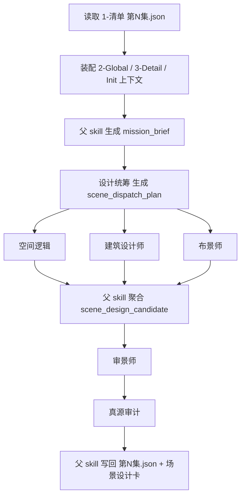
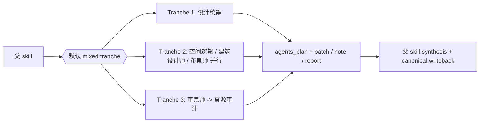

# 4-Design / 1-场景 / 2-设计

## 概述

`2-设计` 负责把 `1-清单` 已锁定的场景对象池，继续收束成 **场景设计稿 + episode 级 scene design carrier**。

本子技能不是再造第二份场景事实源，而是以父 skill 为唯一真源写回者，调用 `.codex/agents/aigc/设计组/场景设计/` 下的 subagents，对每个命中场景生成：

1. 可审阅的场景设计卡
2. 可聚合的 `scene_designs[]` 结构化字段
3. 可被未来 `3-面板 / 5-Image / 6-Video` 继续消费的 prompt handoff

交付类型：`内容输出型 + subagent-governed`

## Skill / Subagent Execution Rule (Mandatory)

在 `1-场景/2-设计` 中，分工固定为：

- subagents 负责思考、`agents plan`、局部证据整理、字段候选与 `patch / note / report`
- skill 本身负责命中对象裁决、上下文装配、patch 收束、canonical 写回、review/audit 闭环与下游 handoff

subagents 可以决定“本轮怎么想、先补哪块、哪些冲突该上抛”，但不能替代 skill 完成阶段执行闭环。

## When to Use

- 已有 `1-清单` 的场景对象池，需要进一步产出场景设计稿。
- 需要把 `2-Global` 的全局风格、类型指导与导演意图压回具体空间设计字段。
- 需要用场景设计组 subagents 分工思考，但仍由父 skill 统一收束和落盘。

## When Not to Use

- 还没有 `1-清单` 的 scene catalog，应先回退到 `1-清单`。
- 目标已经是场景面板布局、图片生成或视频请求，应等待后续阶段消费本设计稿。
- 任务只是补 `3-Detail` 事实，不应在本子技能改写导演事实。

## 子技能边界

### `2-设计` 拥有

- `scene catalog -> scene design` 的父层收束合同。
- 场景设计组的 topology、handoff、context packet 与 audit gate。
- `projects/<项目名>/4-Design/1-场景/2-设计/` 下的 canonical 设计产物写回。

### `2-设计` 不拥有

- 重写 `1-清单` 的场景对象池定义。
- 越权修改 `2-Global` 或 `3-Detail` 真源。
- 跳过父 skill 让任一 subagent 直接写最终设计文件。

## Visual Maps

## Canonical Module References

| 模块 | 作用 | 真源文件 |
| --- | --- | --- |
| 思维链 | 承载字段主表、thought pass 与 gate | `references/chain-of-thought.md` |
| 执行流程 | 承载输入、拓扑、handoff 与落点 | `references/execution-flow.md` |
| 类型策略 | 承载输入缺口、冲突和回退策略 | `references/type-strategies.md` |
| 输出契约 | 承载 episode JSON 与 per-scene card 结构 | `references/output-template.md` |
| 设计模板 | 承载场景设计卡字段顺序 | `templates/scene-design-card.md` |
| agent team | 承载 subagents 角色与调用细则 | `.codex/agents/aigc/设计组/场景设计/team.md` |

## Execution Summary

- 首选输入固定为 `projects/<项目名>/4-Design/1-场景/1-清单/第N集/第N集.json`。
- 证据补充固定来自：
  - `projects/<项目名>/2-Global/全局风格.md`
  - `projects/<项目名>/2-Global/类型指导.md`
  - `projects/<项目名>/2-Global/导演意图.md`
  - `projects/<项目名>/3-Detail/第N集.json`
  - `projects/<项目名>/3-Detail/第N集.json`（兼容读取，仅作证据回看）
  - `projects/<项目名>/0-Init/north_star.yaml`
  - `projects/<项目名>/0-Init/init_handoff.yaml`
- 当前 canonical 主产物是 `projects/<项目名>/4-Design/1-场景/2-设计/第N集/场景设计.json`。
- 当前 canonical 人读稿是 `projects/<项目名>/4-Design/1-场景/2-设计/第N集/<scene_key>.md`。
- 默认采用后台 subagents 模式；只有证据缺口、场景冲突或人工拍板节点才前台阻塞。
- subagents 只允许返回 `agents_plan + patch / note / report`，最终写回仅由父 skill 完成。

## Output Summary

- canonical 主产物：`projects/<项目名>/4-Design/1-场景/2-设计/第N集/场景设计.json`
- canonical 人读稿：`projects/<项目名>/4-Design/1-场景/2-设计/第N集/<scene_key>.md`
- 可选追溯文件：`projects/<项目名>/4-Design/1-场景/2-设计/第N集/_manifest.json`
- 当前不直接生图，不直接生成视频请求。

## Strategy Summary

- 判定顺序：`scene catalog 是否存在 -> 设计统筹是否锁定本轮命中场景 -> 并行 specialist patch 是否可聚合 -> review / audit 是否通过 -> 是否允许写回`
- 变量登记、情况判定、field_id 与 pass table 见 `references/chain-of-thought.md`

## Subagent Team Summary

- team 真源：`.codex/agents/aigc/设计组/场景设计/team.md`
- 默认角色：
  - `设计统筹`
  - `空间逻辑`
  - `建筑设计师`
  - `布景师`
  - `审景师`
  - `真源审计`
- 父 skill 必须先生成 `mission_brief` 与 `context_packet_<role>`，再进入 team 分发。

## Root-Cause Execution Contract (Mandatory)

当出现以下症状时，必须先修本子技能合同：

- `2-设计` 直接重扫 `3-Detail`，不复用 `1-清单`。
- subagents 产出了平行主稿，父 skill 无法收束。
- 场景设计卡字段漂移，无法继续给 `3-面板 / 5-Image / 6-Video` 消费。
- 审景和审计缺位，导致场景设计与导演意图、全局风格或场景清单断链。
- 输出回到旧仓 `output/影片/.../3-设定/2-设计` 路径，而不是当前 `projects/<项目名>/4-Design/...`。

必经链路：

`Symptom -> Direct Technical Cause -> Rule Source -> Meta Rule Source -> Fix Landing Points`

优先检查：

- `Rule Source`
  - `.agents/skills/aigc/4-Design/1-场景/2-设计/SKILL.md`
  - `.agents/skills/aigc/4-Design/1-场景/2-设计/CONTEXT.md`
  - `.agents/skills/aigc/4-Design/1-场景/2-设计/references/*.md`
  - `.codex/agents/aigc/设计组/场景设计/team.md`
  - `.codex/agents/aigc/设计组/场景设计/*.md`
- `Meta Rule Source`
  - `.agents/skills/aigc/4-Design/1-场景/SKILL.md`
  - `.agents/skills/aigc/4-Design/SKILL.md`
  - 根 `AGENTS.md`
  - `/Users/vincentlee/.codex/skills/meta/构建/技能/skill-subagents/SKILL.md`

## Context Preload (Mandatory)

- 执行前先加载 `.agents/skills/aigc/SKILL.md + CONTEXT.md`。
- 再加载 `.agents/skills/aigc/4-Design/SKILL.md + CONTEXT.md`。
- 再加载 `.agents/skills/aigc/4-Design/1-场景/SKILL.md + CONTEXT.md`。
- 再加载本 `SKILL.md + CONTEXT.md`。
- 按需读取 `references/*.md`、`templates/scene-design-card.md` 与 `.codex/agents/aigc/设计组/场景设计/*.md`。
- 优先级遵循：用户显式请求 > 根 `AGENTS.md` > `aigc` 根技能 > `4-Design` 父级 > `1-场景` 父级 > 本 `SKILL.md` > 各级 `CONTEXT.md`。
