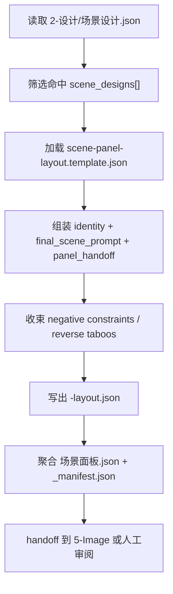
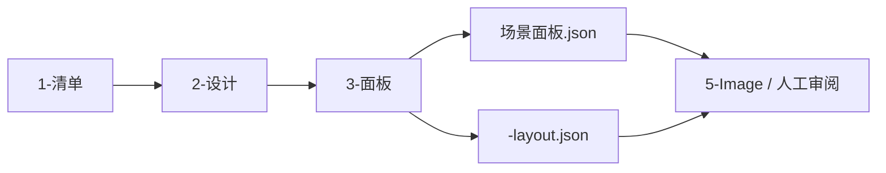

# 4-Design / 1-场景 / 3-面板

## 概述

`3-面板` 负责把 `2-设计` 已经收束好的场景设计 carrier，继续转成 **可展示、可审阅、可下游 handoff 的场景面板 layout package**。

它不是再造第二份场景设计稿，也不是直接进入图片生成。它的职责是：

1. 消费 `场景设计.json + 逐场景设计卡`
2. 把 `final_scene_prompt + panel_handoff + reverse_taboos` 收束为 16:9 九宫格场景面板 prompt
3. 输出 episode 级 `场景面板.json` 与逐场景 `*-layout.json`
4. 为后续 `5-Image` 或人工审阅保留稳定的 machine-first panel carrier

交付类型：`内容输出型`

## When to Use

- 已有 `projects/<项目名>/4-Design/1-场景/2-设计/第N集/场景设计.json`，需要继续生成场景面板 carrier。
- 需要把场景设计稿整理成 16:9 九宫格场景展示/审阅布局，而不是直接出图。
- 需要为后续 `5-Image` 或人工复核提供稳定的 scene-panel prompt package。

## When Not to Use

- 当前还没有 `1-清单` 或 `2-设计` 的合法输入，应先回退到上游。
- 当前任务是继续补场景设计字段，而不是做面板展示，应停在 `2-设计`。
- 当前任务已经明确要图片生成、分镜图或视频请求，应进入 `5-Image` 或 `6-Video`。

## Canonical Anchors

| 载体 | 位置 | 作用 |
| --- | --- | --- |
| 场景设计真源 | `projects/<项目名>/4-Design/1-场景/2-设计/第N集/场景设计.json` | 本阶段第一输入根 |
| 逐场景设计卡 | `projects/<项目名>/4-Design/1-场景/2-设计/第N集/<scene_key>.md` | 人读审阅与字段回看 |
| 场景面板输出根 | `projects/<项目名>/4-Design/1-场景/3-面板/第N集/` | 本阶段 canonical 输出根 |
| 面板模板 | `templates/scene-panel-layout.template.json` | 固定 16:9 九宫格布局合同 |
| 执行脚本 | `scripts/generate_scene_panels.py` | 把设计 carrier 转成 panel carrier |

## 子技能边界

### `3-面板` 拥有

- `scene design -> scene panel` 的 prompt 收束合同
- episode 级 `场景面板.json` 与逐场景 `*-layout.json` 的写回权
- 九宫格布局门禁、identity badge 与 negative prompt 汇总
- 面向 `5-Image` 的 panel-level handoff

### `3-面板` 不拥有

- 重写 `场景设计.json` 或逐场景设计卡
- 直接生成图片、视频或模型请求执行结果
- 跳过 `2-设计` 直接从导演 JSON 发明场景面板

## Visual Maps

## Canonical Module References

| 模块 | 作用 | 真源文件 |
| --- | --- | --- |
| 思维链 | 承载字段主表、thought pass 与 gate | `references/chain-of-thought.md` |
| 执行流程 | 承载输入、命名、workflow 与 handoff | `references/execution-flow.md` |
| 类型策略 | 承载输入缺口、设计完整度与回退策略 | `references/type-strategies.md` |
| 输出契约 | 承载 episode / per-scene panel carrier 骨架 | `references/output-template.md` |

## Execution Summary

- 第一输入根固定为 `projects/<项目名>/4-Design/1-场景/2-设计/第N集/场景设计.json`。
- 默认输出根固定为 `projects/<项目名>/4-Design/1-场景/3-面板/第N集/`。
- 本阶段 machine-first canonical carrier 是 `场景面板.json`；逐场景 `*-layout.json` 是与其同源的局部面板载体。
- 本阶段默认停在 panel carrier，不直接生图。
- 允许通过 `scripts/generate_scene_panels.py` 做批量生成；脚本只承接模板装配与落盘，不替代场景设计思考层。

## Output Summary

- canonical 主产物：`projects/<项目名>/4-Design/1-场景/3-面板/第N集/场景面板.json`
- canonical 逐场景载体：`projects/<项目名>/4-Design/1-场景/3-面板/第N集/<scene_key>-layout.json`
- 可选追溯文件：`projects/<项目名>/4-Design/1-场景/3-面板/第N集/_manifest.json`
- 当前不直接输出图片，不直接生成视频请求。

## Field System Summary

- 字段体系保持 `FIELD-SCN-PANEL-01` 到 `FIELD-SCN-PANEL-06`
- 详细 thought pass 与 pass table 见 `references/chain-of-thought.md`

## Root-Cause Execution Contract (Mandatory)

当出现以下症状时，必须先修本子技能合同：

- `3-面板` 直接跳过 `2-设计`，从导演 JSON 或灵感文本发明场景面板。
- 面板 carrier 只有文案，没有 machine-first JSON。
- 逐场景 layout 与 episode 级 panel carrier 不同源，出现第二真源。
- `3-面板` 越权调用图片生成，把 `4-Design` 与 `5-Image` 边界打穿。
- 输出仍沿用旧仓 `output/影片/.../3-设定/4-面板` 路径，而不是当前 `projects/<项目名>/4-Design/...`。

必经链路：

`Symptom -> Direct Technical Cause -> Rule Source -> Meta Rule Source -> Fix Landing Points`

优先检查：

- `Rule Source`
  - `.agents/skills/aigc/4-Design/1-场景/3-面板/SKILL.md`
  - `.agents/skills/aigc/4-Design/1-场景/3-面板/CONTEXT.md`
  - `.agents/skills/aigc/4-Design/1-场景/3-面板/references/*.md`
  - `.agents/skills/aigc/4-Design/1-场景/3-面板/templates/scene-panel-layout.template.json`
  - `.agents/skills/aigc/4-Design/1-场景/3-面板/scripts/generate_scene_panels.py`
- `Meta Rule Source`
  - `.agents/skills/aigc/4-Design/1-场景/SKILL.md`
  - `.agents/skills/aigc/4-Design/SKILL.md`
  - `.agents/skills/aigc/SKILL.md`
  - 根 `AGENTS.md`

## Context Preload (Mandatory)

- 执行前先加载 `.agents/skills/aigc/SKILL.md + CONTEXT.md`。
- 再加载 `.agents/skills/aigc/4-Design/SKILL.md + CONTEXT.md`。
- 再加载 `.agents/skills/aigc/4-Design/1-场景/SKILL.md + CONTEXT.md`。
- 再加载本 `SKILL.md + CONTEXT.md`。
- 按需读取 `references/*.md`、`templates/scene-panel-layout.template.json` 与上游 `2-设计` 产物。
- 优先级遵循：用户显式请求 > 根 `AGENTS.md` > `aigc` 根技能 > `4-Design` 父级 > `1-场景` 父级 > 本 `SKILL.md` > 各级 `CONTEXT.md`。
