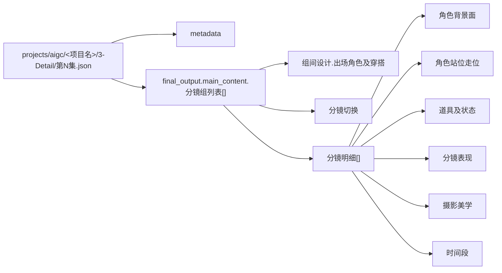

# 4-Design / 1-清单 Detail Output Consumption Contract

## Purpose

- 本文件是 `4-Design/1-清单/*` 消费 `3-Detail` canonical 输出的共享真源。
- 上游唯一业务真源固定为 `projects/aigc/<项目名>/3-Detail/第N集.json`。
- 下游 leaf 不得各自重新发明“角色/场景/道具/服装应该怎么读 `3-Detail`”的第二套解释。

## Canonical Upstream Shape

## Shared Rules

1. 只消费 `metadata / final_output.main_content.分镜组列表[]`，不读旧式 markdown 分镜长文作为默认主输入。
2. `组间设计.出场角色及穿搭` 是主体识别与服装归档的高精锚点，但不是唯一证据。
3. `分镜明细[]` 是镜级事实层；凡涉及主体出镜、走位、道具占有、镜头表现，优先在镜级字段取证。
4. `剧本正文` 仅作回退与歧义解消，不得盖过已经存在的结构化镜级事实。
5. `场景` leaf 允许把 `分镜表现 / 摄影美学 / 时间段` 作为 evidence augmentation，收束进 `场景清单.json.scenes[].design_context`，但不得脱离镜级证据臆造第二份研究真源。
6. 任何 leaf 若需要额外 heuristic，必须写回自己的 `references/` 或 `CONTEXT.md`，不得篡改本共享合同的 canonical 字段解释。

## Domain Consumption Matrix

| domain | primary_slots | support_slots | forbidden_shortcuts | default_runtime_outputs |
| --- | --- | --- | --- | --- |
| `角色` | `组间设计.出场角色及穿搭`、`分镜明细[].角色站位走位` | `分镜明细[].角色背景面`、`分镜明细[].分镜表现`、`分镜明细[].道具及状态`、`剧本正文` | 只凭代词、无锚亲属称谓、纯背景描写臆造角色 | `4-Design/角色/1-清单/第N集/{角色清单.json,角色研究.json,role_design_bridge.json}` |
| `场景` | `分镜明细[].角色背景面` | `分镜明细[].分镜表现`、`分镜明细[].摄影美学`、`分镜明细[].时间段`、`组间设计.导演意图`、`剧本正文` | 把角色动作误写成场景描述；把无证据的研究设定升格成场景真相 | `4-Design/场景/1-清单/第N集/...` |
| `道具` | `分镜明细[].道具及状态` | `分镜明细[].角色站位走位`、`分镜明细[].分镜表现` | 把服装部件误当成独立道具 | `4-Design/道具/1-清单/第N集/...` |
| `服装` | `组间设计.出场角色及穿搭` | `分镜明细[].角色站位走位`、`分镜明细[].分镜表现` | 把环境色光或道具材质误写进服装字段 | pending-migration；暂不声明 active runtime，不作为初始化预建目录 |

## Role-Specific Consumption Priority

| priority | source_slot | role use | note |
| --- | --- | --- | --- |
| P0 | `组间设计.出场角色及穿搭` | canonical 角色名、服装主锚、群组级出场摘要 | 优先抽取 `角色名-穿搭` 配对 |
| P1 | `分镜明细[].角色站位走位` | 镜级出场、走位、同镜角色关系、服装变体线索 | 角色 presence 的首选镜级证据 |
| P2 | `分镜明细[].分镜表现` | 动作、表演机制、情绪和镜头消费提示 | 不可单独用来造新角色 |
| P3 | `分镜明细[].道具及状态` | 角色-道具绑定、身份感、连续性 | 先有角色锚，再绑道具 |
| P4 | `分镜明细[].角色背景面` | 角色所处背景、空间压迫、氛围与材质支持 | 只在显式提及角色时回收为人物证据 |
| P5 | `剧本正文` | unresolved alias、亲属关系、群像补充 | 仅用于回退，不反向覆盖结构化镜级事实 |

## Output Normalization Rules

1. 角色 leaf 必须同时产出：
   - `角色清单.json`
   - `角色研究.json`
   - `role_design_bridge.json`
2. 角色清单中的 `role_id` 必须稳定，并保持 `group_id[] / shot_id[]` 可追溯。
3. 当同一角色出现多套服装线索时，保留 `costume_variants[]`，不得被单一 canonical 名称压扁。
4. 群像主体允许 canonical 收束，但 `role_level` 必须保留 `群像角色` 语义，不得误当单人角色。
5. 若证据不足，允许输出 `unknown` 或 `needs_manual_review`，但不得臆造。

## Handoff Rule

- `4-Design/1-清单/角色` 是首个强依赖本合同的 leaf。
- 其他 leaf 若后续扩建，应显式回链本文件，而不是平行复写字段消费规则。
