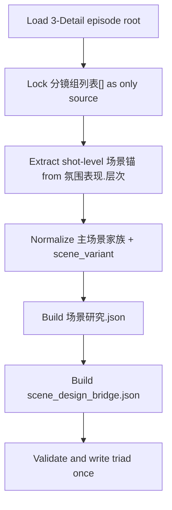
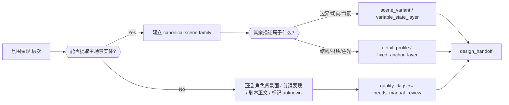
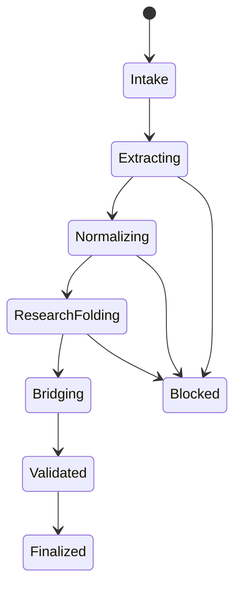

# aigc 4-Design / 1-清单 / 场景

## Context Loading Contract

- 每次调用本技能时，必须同时加载同目录 `CONTEXT.md` 作为预加载上下文。
- 若同目录 `CONTEXT.md` 缺失，应先补齐最小知识库骨架，或向用户明确报告阻塞；不得在未检查该上下文的情况下执行技能。
- 冲突优先级：用户显式请求 > 仓库/全局 `AGENTS.md` > 本 `SKILL.md` > 同目录 `CONTEXT.md`。

## 概述

`4-Design/1-清单/场景` 是 `4-Design` 阶段承接 `3-Detail` 的场景清单 leaf。

本技能的迁移目标是把旧仓 `场景清单.json + 场景研究.json + scene_design_bridge.json` 三文件结构迁回当前仓，但重定字段边界：

1. 完整继承旧仓 `场景清单` 的证据密度、研究字段、quality gate 与 design bridge 语义。
2. 服从当前仓 `4-Design/1-清单/_shared/list-output-contract.md` 的单真源治理。
3. 基于当前仓 `3-Detail` 的 canonical 输出结构重写输入判定与提取路径。

因此，本技能的三业务真源固定为：

- `projects/aigc/<项目名>/4-Design/场景/1-清单/第N集/场景清单.json`
- `projects/aigc/<项目名>/4-Design/场景/1-清单/第N集/场景研究.json`
- `projects/aigc/<项目名>/4-Design/场景/1-清单/第N集/scene_design_bridge.json`

## Parent Positioning

- 当前 skill 是 `4-Design/1-清单` 下的场景 leaf。
- 上游事实真源属于 `3-Detail`；本技能只负责消费、归一、研究折叠与下游直参化。
- 本技能不拥有：
  - 重写 `3-Detail/第N集.json`
  - 重新定义 `分镜切换`
  - 让 `场景研究.json` 或 `scene_design_bridge.json` 反向改写对象池 identity
  - 把三份文件写成互相复制的平行总稿

## Shared Canonical Sources (Mandatory)

- `.agents/skills/aigc/_shared/project-runtime-layout.md`
- `.agents/skills/aigc/_shared/director_episode_output.schema.json`
- `.agents/skills/aigc/3-Detail/SKILL.md`
- `.agents/skills/aigc/4-Design/1-清单/_shared/detail-output-consumption-contract.md`
- `.agents/skills/aigc/4-Design/1-清单/_shared/list-output-contract.md`
- `.agents/skills/aigc/4-Design/1-清单/_shared/object-normalization-contract.md`
- `references/detail-scene-normalization.md`

真源分工：

- 本 `SKILL.md`
  - 场景 leaf 的输入合同、思行网络、字段门与输出契约
- `_shared/detail-output-consumption-contract.md`
  - `3-Detail -> 场景清单` 的共享字段消费规则
- `_shared/list-output-contract.md`
  - 场景链单 catalog 输出治理真源
- `references/detail-scene-normalization.md`
  - 旧仓三文件内容向当前单 catalog 折叠时的归一、映射与失败闭环细则
- `director_episode_output.schema.json`
  - `3-Detail` 输入结构唯一 schema 真源

## Reference Loading Guide

读取顺序固定为：

1. 根 `AGENTS.md`
2. `.agents/skills/aigc/SKILL.md + CONTEXT.md`
3. `.agents/skills/aigc/3-Detail/SKILL.md + CONTEXT.md`
4. `.agents/skills/aigc/4-Design/1-清单/_shared/detail-output-consumption-contract.md`
5. `.agents/skills/aigc/4-Design/1-清单/_shared/list-output-contract.md`
6. `.agents/skills/aigc/4-Design/1-清单/_shared/object-normalization-contract.md`
7. 本 `SKILL.md + CONTEXT.md`
8. `references/detail-scene-normalization.md`
9. `projects/aigc/<项目名>/3-Detail/第N集.json`
10. `projects/aigc/<项目名>/3-Detail/validation-report.md`（若存在）
11. 已存在的 `projects/aigc/<项目名>/4-Design/场景/1-清单/第N集/场景清单.json`（若存在）

## Business Requirement Analysis Contract (Mandatory)

| analysis_slot | 当前结论 |
| --- | --- |
| `business_goal` | 把 `3-Detail` 的 `氛围表现 + 分镜构图 + 摄影美学` 收束成可追溯、可研究、可桥接的场景三真源，并仅在必要时回退 `角色背景面 + 分镜表现 + 时间段 + 导演意图`，供 `4-Design/2-设计/场景` 直接消费。 |
| `business_object` | `projects/aigc/<项目名>/3-Detail/第N集.json`、`projects/aigc/<项目名>/4-Design/场景/1-清单/第N集/{场景清单.json,_manifest.json}`。 |
| `constraint_profile` | 上游 `3-Detail` JSON 是唯一事实真源；`氛围表现.层次` 是主场景锚点，`分镜构图 / 摄影美学` 提供 framing 与光感补强；`角色背景面 / 分镜表现 / 时间段 / 导演意图 / 剧本正文` 只做 fallback 补证；`清单/研究/bridge` 各管自己的字段边界，不得互相复制抢真源。 |
| `success_criteria` | 每个场景都具备 canonical 名称、group/shot 回链、证据账本、具像化 detail profile、scene bible card、design handoff 与 quality flags；下游无需再从长文或 sidecar 反向抽取。 |
| `non_goals` | 不重写 `3-Detail`；不直接生成场景设计图 prompt 成品；不恢复旧仓 web-research 三文件主链；不处理角色/道具/服装业务真源。 |
| `complexity_source` | 当前仓主输入已经从旧仓分镜 markdown 转成 `3-Detail` branch-owned shot fields；难点在于既要沿用旧仓高密度场景研究配置，又要避免让 `角色背景面` 这种 legacy projection 继续抢走 branch-owned 主锚。 |
| `topology_fit` | 固定为“锁输入 -> shot-level 场景锚提取 -> 主场景/变体归一 -> 研究生成 -> design bridge 生成 -> 单次写回三真源 + manifest”。 |
| `step_strategy` | 主合同保留骨架、门禁、字段映射与输出契约；复杂归一与旧仓映射细则下沉 `references/detail-scene-normalization.md`。 |

## Total Input Contract (Mandatory)

### 必需输入

- `projects/aigc/<项目名>/3-Detail/第N集.json`

### 强烈建议输入

- `projects/aigc/<项目名>/3-Detail/validation-report.md`

### 可选输入

- 已存在的 `projects/aigc/<项目名>/4-Design/场景/1-清单/第N集/场景清单.json`
- 用户显式指定的 `selected_groups[] / selected_shots[] / selected_scenes[]`
- legacy `projects/aigc/<项目名>/编导/第N集.json`（只允许 fallback）

### 硬规则

1. 只消费 `final_output.main_content.分镜组列表[]`。
2. `分镜明细[].氛围表现.层次` 是主场景实体的一号锚点。
3. `分镜明细[].分镜构图 / 摄影美学` 负责补足场景的 framing、光感与材质判断。
4. `角色背景面 / 分镜表现 / 摄影美学 / 时间段 / 组间设计.导演意图 / 剧本正文` 只做 evidence augmentation。
5. 方位、门禁、边界、气氛、时间状态默认归入 `scene_variant / design_context.variable_state_layer`，不能直接扩张 canonical scene family。
6. 若无法稳定提取主场景实体，允许保守输出 `unknown` 或 `needs_manual_review`，不得把整句背景描述直接升格成稳定主键。

## Output Contract (Mandatory)

默认输出目录：

- `projects/aigc/<项目名>/4-Design/场景/1-清单/第N集/`

默认交付物：

1. `场景清单.json`
2. `场景研究.json`
3. `scene_design_bridge.json`
4. `_manifest.json`

输出硬约束：

1. `场景清单.json` 必须同时包含 `scenes[]`、`group_scene_map[]` 与基础 statistics。
2. `场景研究.json` 必须拥有 `evidence_ledger / detail_profile / scene_blueprint / scene_bible_card / compendium / quality_profile`。
3. `scene_design_bridge.json` 必须拥有 `design_bridge_profile / prompt_anchor / negative_constraints / quality_flags`。
4. `_manifest.json` 只能承载审计、输入、输出和统计，不得承载场景研究主事实。

## Visual Maps (Mermaid)

## Field Master

| field_id | output_position | requirement | source_slots | owner_step | quality_dimension | fail_code |
| --- | --- | --- | --- | --- | --- | --- |
| `FIELD-SCENE-01` | `场景清单.json.scenes[]` | canonical 场景家族稳定，`scene_id` 与 `scene_name` 不被背景整句污染 | `氛围表现.层次`、`剧本正文` | `S2-S4` | identity stability | `FAIL-SCENE-CATALOG` |
| `FIELD-SCENE-02` | `场景清单.json.group_scene_map[]` | 每条场景-组/镜映射可回链到 `group_id / shot_id / role_background_face` | `分镜组列表[]` 全量 | `S2-S4` | traceability | `FAIL-SCENE-MAP` |
| `FIELD-SCENE-03` | `场景研究.json.scenes[].evidence_ledger` | 旧仓证据账本能力保留，且 evidence 只来自 `3-Detail` 结构化字段 | `角色背景面`、`分镜表现`、`摄影美学`、`时间段`、`导演意图` | `S5` | evidence density | `FAIL-SCENE-EVIDENCE` |
| `FIELD-SCENE-04` | `场景研究.json.scenes[]` | 必须输出 `detail_profile / scene_blueprint / scene_bible_card / display_profile / compendium` | `FIELD-SCENE-01~03` 汇流 | `S5-S6` | research quality | `FAIL-SCENE-RESEARCH` |
| `FIELD-SCENE-05` | `scene_design_bridge.json.scenes[].design_bridge_profile` | 必须输出 `fixed_anchor_bridge / variable_state_bridge / prompt_anchor / negative_constraints / quality_flags` | `FIELD-SCENE-04` | `S6` | downstream usability | `FAIL-SCENE-BRIDGE` |
| `FIELD-SCENE-06` | `场景清单.json.statistics.quality_overview` + `_manifest.json` | 输出平均具像化分、weak 场景、待补动作与本轮输入输出审计 | 全链证据 | `S7` | governance closure | `FAIL-SCENE-VALIDATION` |

## Thought Pass Map

| step_id | focus | actions | evidence | route_out | rework_entry |
| --- | --- | --- | --- | --- | --- |
| `S1` | 锁定 episode root 与 output root | 读取 `3-Detail/第N集.json`，锁定 `分镜组列表[]` 与输出目录 | `intake_note` | `S2` | `S1` |
| `S2` | 扫描镜级场景锚 | 从 `氛围表现.层次` 提取主场景家族候选，并保留 `角色背景面` 作为 fallback variant 证据 | `scene_anchor_scan` | `S3` | `S2` |
| `S3` | 主场景/变体归一 | 合并 canonical scene、剥离方位/状态、建立 `group_scene_map[]` | `normalized_scene_map` | `S4` | `S2-S3` |
| `S4` | 聚合 scene catalog | 汇总 occurrence、aliases、first_appearance 与 display card 基础壳 | `scene_catalog_packet` | `S5` | `S3-S4` |
| `S5` | 研究生成 | 生成 `场景研究.json` 的 `detail_profile / blueprint / bible card / compendium` | `research_packet` | `S6` | `S4-S5` |
| `S6` | bridge 生成 | 生成 `scene_design_bridge.json` 的 `design_bridge_profile` 与 `quality_flags` | `bridge_packet` | `S7` | `S5-S6` |
| `S7` | 单次校验与落盘 | 输出三份业务 JSON + `_manifest.json` | `validation_verdict` | `done` | `S2-S7` |

## Thinking-Action Node Contract (Mandatory)

| node_id | objective | inputs | actions | evidence | route_out | gate |
| --- | --- | --- | --- | --- | --- | --- |
| `N1-INTAKE` | 锁输入真源与 scope | `3-Detail/第N集.json` | 校验 schema 槽位、episode 与组镜数量 | `intake_note` | `N2` | 缺 `分镜组列表[]` 不得继续 |
| `N2-SCENE-ANCHOR` | 建立 shot-level 场景锚 | `分镜明细[].氛围表现.层次` | 抽取主场景候选，保留 `角色背景面` 作为 fallback 背景句与 shot evidence | `scene_anchor_scan` | `N3` | `atmosphere_layer` 不得丢失 |
| `N3-NORMALIZE` | 主场景/变体裁决 | `N2` + `分镜构图 / 摄影美学 / 分镜表现 / 时间段 / 导演意图` | 把主场景、方位、状态、气氛拆层，建立 `scene_id` | `normalized_scene_map` | `N4` | 不得把整句背景句直接变成 canonical name |
| `N4-CATALOG` | 形成场景对象池 | `normalized_scene_map` | 聚合 occurrence、aliases、first appearance 与 base display | `scene_catalog_packet` | `N5` | `scene_id / group_id / shot_id` 追溯必须成立 |
| `N5-RESEARCH-FOLD` | 折叠旧仓 research 密度 | `scene_catalog_packet` | 生成 `detail_profile / scene_blueprint / scene_bible_card / compendium / display_profile` | `research_fold_packet` | `N6` | research 只能折叠入 `design_context` |
| `N6-BRIDGE-FOLD` | 折叠 design bridge 与 quality | `research_fold_packet` | 生成 `design_handoff + quality_profile + quality_overview` | `bridge_packet` | `N7` | 不得恢复独立 scene bridge 真源 |
| `N7-VALIDATE` | 一次性收束与落盘 | 全链证据 | 校验字段、写出 catalog 与 manifest | `validation_verdict` | `done` | 只允许在本节点结案 |

## Pass Table

| field_id | pass_condition | fail_code | rework_entry |
| --- | --- | --- | --- |
| `FIELD-SCENE-01` | `scenes[]` 非空，且每个 scene 都有稳定 `scene_id / scene_name` | `FAIL-SCENE-CATALOG` | `S2-S4` |
| `FIELD-SCENE-02` | `group_scene_map[]` 对每条记录都能回链到 `group_id / shot_id / space_scaffold` | `FAIL-SCENE-MAP` | `S3-S4` |
| `FIELD-SCENE-03` | `design_context.evidence_ledger` 不为空，且 evidence 只来源于 `3-Detail` 结构化字段 | `FAIL-SCENE-EVIDENCE` | `S5` |
| `FIELD-SCENE-04` | `design_context` 已折叠 `detail_profile / scene_blueprint / scene_bible_card / compendium / display_profile` | `FAIL-SCENE-RESEARCH` | `S5-S6` |
| `FIELD-SCENE-05` | `design_handoff` 含 `prompt_anchor + fixed_anchor_bridge + variable_state_bridge + quality_flags` | `FAIL-SCENE-BRIDGE` | `S6` |
| `FIELD-SCENE-06` | `statistics.quality_overview` 与 `_manifest.json` 完整记录 scope、统计与待补动作 | `FAIL-SCENE-VALIDATION` | `S7` |

## Extraction & Folding Rules

详细细则下沉到 `references/detail-scene-normalization.md`。本处只保留硬门：

1. 先 `氛围表现.层次`，再 `分镜构图 / 摄影美学 / 角色背景面 / 分镜表现 / 时间段 / 导演意图`，最后才回退 `剧本正文`。
2. 主场景实体优先归一为 `scene_name`；朝向、门禁、边界、状态、气氛优先归入 `scene_variant` 或 `variable_state_layer`。
3. 旧仓 `scene_bible_card / display_profile / compendium / design_bridge_profile / quality_overview` 必须折叠进单 catalog，不再恢复第二输出真源。
4. 若 evidence 稀薄，只能在 `quality_flags / missing_fields / enrichment_actions` 留痕，不得臆造建筑形制或材质。
5. 下游 `2-设计/场景` 首选消费 `场景清单.json.scenes[].design_context`，而不是重新解释 `group_scene_map[]`。

## One-Shot Output Contract (Mandatory)

本技能最终只允许一次性收束为一套场景三真源：

1. `场景清单.json`
2. `场景研究.json`
3. `scene_design_bridge.json`
4. `_manifest.json`

中间扫描结果、research 草稿或 legacy bridge projection 只能留在本轮思行过程中，不得冒充 canonical 交付。

## Root-Cause Execution Contract (Mandatory)

当场景 leaf 出现主场景误判、背景整句污染主键、研究密度丢失、下游仍需手工重组 scene bridge 等问题时，固定按以下链路上溯：

`Symptom/Failure -> Direct Technical Cause -> Rule Source -> Meta Rule Source -> Fix Landing Points`

优先检查：

1. `3-Detail` 输入是否满足共享消费合同。
2. `_shared/detail-output-consumption-contract.md` 是否被误读为“只抄背景句”。
3. `_shared/list-output-contract.md` 是否被绕过而恢复多文件真源。
4. `references/detail-scene-normalization.md` 的归一/折叠规则是否缺口。
5. 本 `SKILL.md` 的 `Field Master / Pass Table` 是否与当前产物漂移。

对用户的闭环输出固定为：

1. 根因位置
2. 立即修复
3. 系统预防修复

## Completion Criteria

1. 场景 leaf 已明确锁定 `3-Detail` JSON 为唯一主输入。
2. `场景清单.json` 已成为唯一场景对象池真源，research 与 bridge 密度折叠进 `design_context`。
3. `group_id / shot_id / role_background_face` 追溯链成立。
4. 主场景家族、scene variant、fixed anchor、variable state、design handoff 的分层已经显式化。
5. `_manifest.json` 只承担审计与批处理，不再承载业务事实。
