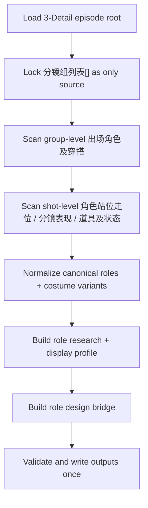
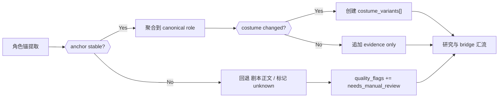
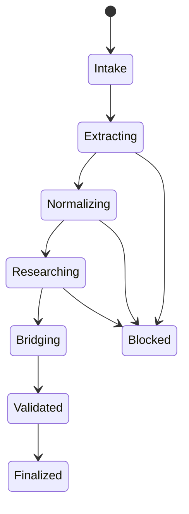

# aigc 4-Design / 1-清单 / 角色

## Context Loading Contract

- 每次调用本技能时，必须同时加载同目录 `CONTEXT.md` 作为预加载上下文。
- 若同目录 `CONTEXT.md` 缺失，应先补齐最小知识库骨架，或向用户明确报告阻塞；不得在未检查该上下文的情况下执行技能。
- 冲突优先级：用户显式请求 > 仓库/全局 `AGENTS.md` > 本 `SKILL.md` > 同目录 `CONTEXT.md`。

## 概述

`4-Design/1-清单/角色` 是 `4-Design` 阶段承接 `3-Detail` 的角色清单 leaf。

本技能不再沿用旧链路对 markdown 分镜长文做“第二行角色锚点”扫描。当前 canonical 输入已经切到 `3-Detail` 的结构化 JSON：

- `projects/aigc/<项目名>/3-Detail/第N集.json`
- 真源槽位：`metadata / final_output.main_content.分镜组列表[]`

本技能的目标是把 `3-Detail` 已经稳定落下的 `出场角色及穿搭 + 分镜明细[]`，收束为下游角色设计可以直接消费的三份产物：

1. `角色清单.json`
2. `角色研究.json`
3. `role_design_bridge.json`

## Parent Positioning

- 当前 skill 是 `4-Design/1-清单` 下的角色 leaf。
- 上游事实真源属于 `3-Detail`；本技能只负责消费、归一、桥接与下游可读化。
- 本技能不拥有：
  - 重写 `3-Detail/第N集.json`
  - 重新决定 `分镜切换`
  - 把镜级事实改写回上游

## Shared Canonical Sources (Mandatory)

- `.agents/skills/aigc/_shared/project-runtime-layout.md`
- `.agents/skills/aigc/_shared/director_episode_output.schema.json`
- `.agents/skills/aigc/3-Detail/SKILL.md`
- `.agents/skills/aigc/4-Design/1-清单/_shared/detail-output-consumption-contract.md`
- `.agents/skills/aigc/4-Design/1-清单/_shared/list-output-contract.md`
- `references/detail-role-normalization.md`

真源分工：

- 本 `SKILL.md`
  - 角色清单 leaf 的输入合同、思行网络、字段通过门与输出契约
- `_shared/detail-output-consumption-contract.md`
  - `3-Detail -> 4-Design/1-清单` 的共享字段消费规则
- `references/detail-role-normalization.md`
  - 角色归一化、证据映射与降级细则
- `director_episode_output.schema.json`
  - `3-Detail` 输入结构的唯一 schema 真源

## Reference Loading Guide

读取顺序固定为：

1. 根 `AGENTS.md`
2. `.agents/skills/aigc/SKILL.md + CONTEXT.md`
3. `.agents/skills/aigc/3-Detail/SKILL.md + CONTEXT.md`
4. `.agents/skills/aigc/4-Design/1-清单/_shared/detail-output-consumption-contract.md`
5. 本 `SKILL.md + CONTEXT.md`
6. `references/detail-role-normalization.md`
7. `projects/aigc/<项目名>/3-Detail/第N集.json`
8. `projects/aigc/<项目名>/3-Detail/validation-report.md`（若存在）
9. `projects/aigc/<项目名>/2-Global/全局风格.md`（若存在）
10. `projects/aigc/<项目名>/2-Global/全集类型元素.md`（若存在）

## Business Requirement Analysis Contract (Mandatory)

| analysis_slot | 当前结论 |
| --- | --- |
| `business_goal` | 把 `3-Detail` 的 `出场角色及穿搭 + 分镜明细[]` 收束成可追溯、可研究、可桥接的角色清单产物，供 `4-Design/2-设计/角色` 直接消费。 |
| `business_object` | `projects/aigc/<项目名>/3-Detail/第N集.json`、`projects/aigc/<项目名>/4-Design/角色/1-清单/第N集/{角色清单.json,角色研究.json,role_design_bridge.json}`。 |
| `constraint_profile` | 上游 `3-Detail` JSON 是唯一事实真源；不得回退成旧式 markdown 扫描主链；角色名、服装、出镜镜头与表演证据必须可回链到 `group_id / shot_id`。 |
| `success_criteria` | 每个角色都具备 canonical 名称、镜级证据、服装锚点、句子级研究结论与设计桥接字段；歧义主体则被保守降级而非臆造。 |
| `non_goals` | 不重写 `3-Detail`；不直接生成角色设计图 prompt；不处理场景/道具/服装 leaf 的业务真源。 |
| `complexity_source` | `3-Detail` 的角色信息分散在组级穿搭摘要与镜级事实字段中，需要归一名词、保留服装变体，并将表演/连续性桥接给下游。 |
| `topology_fit` | 固定为“锁输入 -> 扫组/扫镜 -> 提取角色锚 -> 角色归一与变体拆分 -> 研究与 bridge 汇流 -> 输出校验”。 |
| `step_strategy` | 主合同保留骨架、门禁、字段映射与输出契约；归一化细则下沉 `references/detail-role-normalization.md`。 |

## Total Input Contract (Mandatory)

### 必需输入

- `projects/aigc/<项目名>/3-Detail/第N集.json`

### 强烈建议输入

- `projects/aigc/<项目名>/3-Detail/validation-report.md`

### 可选输入

- `projects/aigc/<项目名>/2-Global/全局风格.md`
- `projects/aigc/<项目名>/2-Global/全集类型元素.md`
- 用户显式指定的 `selected_groups[] / selected_roles[]`

### 硬规则

1. 只消费 `final_output.main_content.分镜组列表[]`。
2. `组间设计.出场角色及穿搭` 是角色名与服装的高精锚点。
3. `分镜明细[].角色站位走位` 是镜级出场与走位的首选证据。
4. `分镜明细[].分镜表现 / 道具及状态 / 角色背景面` 只作为辅助证据，不得单独臆造角色。
5. `剧本正文` 只在角色命名或关系解歧时回退使用。

## Output Contract (Mandatory)

默认输出目录：

- `projects/aigc/<项目名>/4-Design/角色/1-清单/第N集/`

默认交付物：

1. `角色清单.json`
2. `角色研究.json`
3. `role_design_bridge.json`
4. `validation-report.md`

输出硬约束：

1. `角色清单.json` 是对象池、identity、coverage、group/shot 回链真源，必须包含 `roles[]` 与 `group_role_map[]`。
2. `角色研究.json` 是证据账本、结构化研究字段与 `display_profile` 真源。
3. `role_design_bridge.json` 是下游设计 handoff、`design_bridge_profile` 与 `costume_variants[]` 真源。
4. 若存在歧义角色、群像角色或穿搭未定型，必须通过 `role_level / unknown_flags / quality_flags` 显式留痕。

## Visual Maps (Mermaid)

## Field Master

| field_id | output_position | requirement | source_slots | owner_step | quality_dimension | fail_code |
| --- | --- | --- | --- | --- | --- | --- |
| `FIELD-ROLE-01` | `角色清单.json.roles[]` | canonical 角色名稳定、`role_id` 可追溯、群像与 unknown 语义不丢失 | `组间设计.出场角色及穿搭`、`角色站位走位`、`剧本正文` | `S2-S4` | roster accuracy | `FAIL-ROLE-ROSTER` |
| `FIELD-ROLE-02` | `角色清单.json.group_role_map[]` | 每条角色-组/镜映射都可回链到 `group_id / shot_id` 与 evidence excerpt | `分镜组列表[]` 全量 | `S2-S4` | traceability | `FAIL-ROLE-MAP` |
| `FIELD-ROLE-03` | `角色研究.json.roles[]` | 结构化研究字段与句子级结论完整，证据不足时保守降级 | `角色站位走位`、`分镜表现`、`道具及状态`、`角色背景面` | `S5` | sentence research | `FAIL-ROLE-RESEARCH` |
| `FIELD-ROLE-04` | `角色研究.json.roles[].display_profile` | 面向创作用户可读，含 `tagline / short_bio / visual_bible / costume_story / performance_hook` | `FIELD-ROLE-03` 汇流结果 | `S5` | human readability | `FAIL-ROLE-DISPLAY` |
| `FIELD-ROLE-05` | `role_design_bridge.json.roles[]` | 默认输出 `design_bridge_profile`、`prompt_ready`、`quality_flags`、`costume_variants[]` | `FIELD-ROLE-01~04` | `S6` | downstream usability | `FAIL-ROLE-BRIDGE` |
| `FIELD-ROLE-06` | `validation-report.md` | 记录输入范围、unknown/群像处理、桥接缺口与通过结论 | 全链证据 | `S7` | governance closure | `FAIL-ROLE-VALIDATION` |

## Thought Pass Map

| step_id | focus | actions | evidence | route_out | rework_entry |
| --- | --- | --- | --- | --- | --- |
| `S1` | 锁定 episode root 与 scope | 读取 `3-Detail/第N集.json`，锁 `分镜组列表[]` | `intake_note` | `S2` | `S1` |
| `S2` | 扫描组级角色锚 | 提取 `出场角色及穿搭` 的角色名与服装摘要 | `group_anchor_scan` | `S3` | `S2` |
| `S3` | 扫描镜级出场事实 | 从 `角色站位走位 / 分镜表现 / 道具及状态 / 角色背景面` 追加 shot evidence | `shot_evidence_scan` | `S4` | `S2-S3` |
| `S4` | 角色归一与变体拆分 | 合并 alias、识别群像、拆 `costume_variants[]` | `normalized_role_map` | `S5` | `S3-S4` |
| `S5` | 角色研究与用户可读化 | 生成结构化研究字段、句子结论与 `display_profile` | `research_packet` | `S6` | `S4-S5` |
| `S6` | 设计桥接收口 | 写 `design_bridge_profile`、`prompt_ready`、`quality_flags` | `bridge_packet` | `S7` | `S5-S6` |
| `S7` | 一次性校验与落盘 | 输出三份 JSON + `validation-report.md` | `validation_verdict` | `done` | `S2-S7` |

## Thinking-Action Node Contract (Mandatory)

| node_id | objective | inputs | actions | evidence | route_out | gate |
| --- | --- | --- | --- | --- | --- | --- |
| `N1-INTAKE` | 锁输入真源与 scope | `3-Detail/第N集.json` | 校验 schema 槽位、episode 与 group 数量 | `intake_note` | `N2` | 缺 `分镜组列表[]` 不得继续 |
| `N2-GROUP-ANCHOR` | 建立角色主锚 | `组间设计.出场角色及穿搭` | 解析角色名、服装主锚、群像摘要 | `group_anchor_scan` | `N3` | 允许空，但必须显式记录 |
| `N3-SHOT-EVIDENCE` | 追加镜级事实 | `分镜明细[]` | 抽取出场、走位、动作、道具与背景关系 | `shot_evidence_scan` | `N4` | shot evidence 不得脱离 `shot_id` |
| `N4-NORMALIZE` | 角色归一与变体裁决 | `N2 + N3` | 合并 alias、保留群像、拆服装变体 | `normalized_role_map` | `N5` | 不得把变体压扁为单一服装 |
| `N5-RESEARCH` | 形成角色研究结论 | `normalized_role_map` | 生成结构化研究字段与句子结论 | `research_packet` | `N6` | 不得输出纯词项清单 |
| `N6-BRIDGE` | 形成设计直参 | `research_packet` | 输出 `design_bridge_profile + prompt_ready + quality_flags` | `bridge_packet` | `N7` | `quality_flags` 不得缺失 |
| `N7-VALIDATE` | 一次性收束与落盘 | 全链证据 | 校验字段、写出三份 JSON 与报告 | `validation_verdict` | `done` | 只允许在本节点结案 |

## Pass Table

| field_id | pass_condition | fail_code | rework_entry |
| --- | --- | --- | --- |
| `FIELD-ROLE-01` | `roles[]` 非空，且每个角色有稳定 `role_id / canonical_name` | `FAIL-ROLE-ROSTER` | `S2-S4` |
| `FIELD-ROLE-02` | `group_role_map[]` 对每条记录都能回链到 `group_id`，镜级命中时能回链到 `shot_id` | `FAIL-ROLE-MAP` | `S3-S4` |
| `FIELD-ROLE-03` | 研究字段是句子级结论，证据不足时保守降级 | `FAIL-ROLE-RESEARCH` | `S5` |
| `FIELD-ROLE-04` | `display_profile` 可供人读，不是字段生硬拼接 | `FAIL-ROLE-DISPLAY` | `S5` |
| `FIELD-ROLE-05` | `role_design_bridge.json` 含 `design_bridge_profile + costume_variants[] + quality_flags` | `FAIL-ROLE-BRIDGE` | `S6` |
| `FIELD-ROLE-06` | `validation-report.md` 明确记录 scope、unknown/群像策略与桥接缺口 | `FAIL-ROLE-VALIDATION` | `S7` |

## Extraction & Normalization Rules

详细细则下沉到 `references/detail-role-normalization.md`。本处只保留硬门：

1. 先组级，后镜级，再回退正文。
2. `出场角色及穿搭` 优先提供 canonical 名称与服装主锚。
3. `角色站位走位` 优先提供镜级 presence、站位和 motion vector。
4. `分镜表现` 只负责动作/表演/情绪证据，不单独造角色。
5. 同一角色跨镜多套造型必须保留为 `costume_variants[]`。
6. 群像主体不强拆；关系称谓只有在显式锚定时才升级成新角色。

## One-Shot Output Contract (Mandatory)

本技能最终只允许一次性收束为一套角色清单结果：

1. `角色清单.json`
2. `角色研究.json`
3. `role_design_bridge.json`
4. `validation-report.md`

中间扫描结果、归一化草稿或临时 heuristics 只能留在本轮思行过程中，不得冒充 canonical 交付。

## Root-Cause Execution Contract (Mandatory)

当角色 leaf 出现漏角、误并角、服装变体丢失、研究稿无法直供设计等问题时，固定按以下链路上溯：

`Symptom/Failure -> Direct Technical Cause -> Rule Source -> Meta Rule Source -> Fix Landing Points`

优先检查：

1. `3-Detail` 输入是否满足共享消费合同。
2. `_shared/detail-output-consumption-contract.md` 的字段解释是否被 leaf 误读。
3. `references/detail-role-normalization.md` 的归一化/降级规则是否缺口。
4. 本 `SKILL.md` 的 `Field Master / Pass Table` 是否与当前产物漂移。

对用户的闭环输出固定为：

1. 根因位置
2. 立即修复
3. 系统预防修复

## Completion Criteria

1. 角色 leaf 已明确锁定 `3-Detail` JSON 为唯一主输入。
2. 三份 JSON 默认交付口径稳定，且桥接字段不再埋在长文里。
3. `group_id / shot_id` 可追溯链成立。
4. `costume_variants[]`、群像语义与 unknown 降级规则已显式化。
5. 共享消费合同与 leaf 本地合同已互相回链，不再依赖隐性解释。
